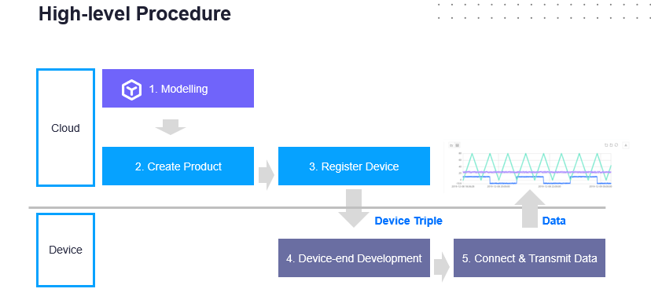
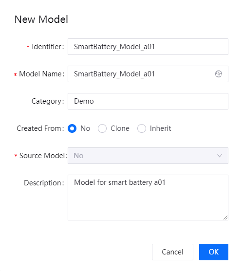
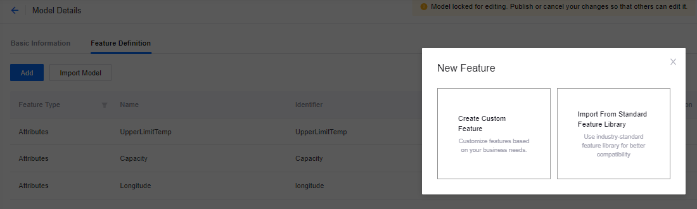
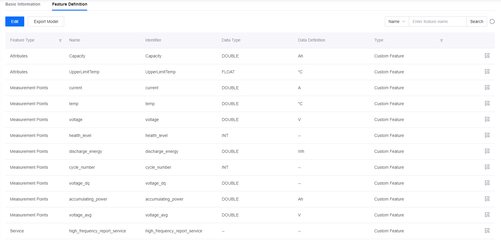
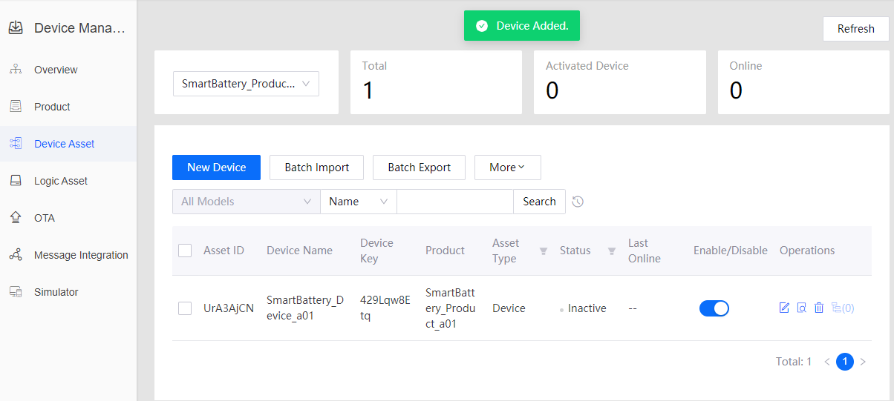
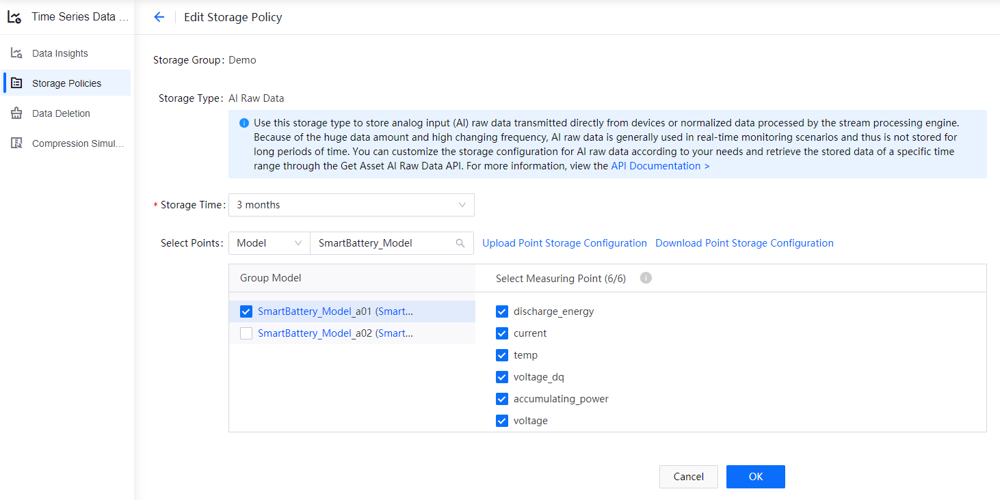
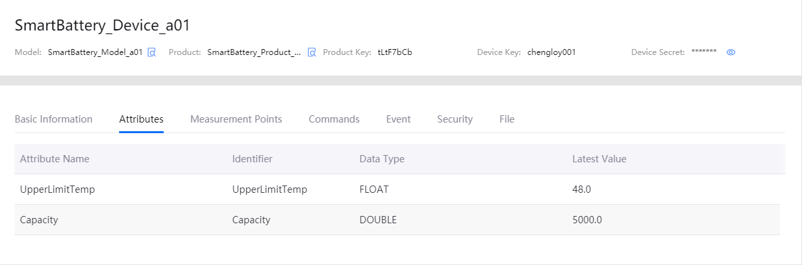

# Lab 1. Connecting a Smart Battery to EnOS (Java)

Before connecting devices to EnOS IoT Hub, you need to register the devices in the EnOS Management Console.

This tutorial will use a smart battery device as an example, and focus on how to register a smart device that connects
directly to the EnOS Cloud.

> **Note**: You will need to replace the configuration name with your own by following the naming pattern: `xxx_studentId`.

## Procedure Overview



## Step 1: Defining a Model

A model is the abstraction of the features of an object that is connected to the IoT Hub. The device model defines the features of a device, including its attributes, measurement points, services, and events.

1. In the EnOS Management Console, click **Models** from the left navigation menu.

2. Click **New Model**, enter the following in the **New Model** window, and click **OK**.

    - Identifier: SmartBattery_Model_a01
    - Model Name: SmartBattery_Model_a01
    - Category: NA
    - Created From: No
    - Source Model: No
    - Description: Model for smart battery a01

    

3. From the list of created models, click the **Edit** icon, and then click the **Feature Definition** tab on the **Model Details** page.

4. There are two ways to create custom features: manually adding each custom feature, or importing from a file. 
    - Manually adding: Click **Edit > Add > Create Custom Feature**, and create the following custom features in the **Add Feature** window.
      
       

       Use the following **Point Types** for the corresponding **Measurement Points**.

        | Measurement Point  | Point Type   |
        | ----------------   | ------------ |
        | accumulating_power | AI           |
        | voltage_dq         | AI           |
        | cycle_number       | Generic      |    
        | discharge_energy   | AI           |
        | health_level       | DI           |
        | voltage            | AI           |
        | temp               | AI           |
        | current            | AI           |
        | voltage_avg        | AI           |

    - Importing from a file: Click **Edit > Import Model** and upload an Excel or JSON file. You can use [this file](media/model_SmartBattery.json) for this tutorial.

## Step 2: Creating a Product

A smart battery product is a collection of battery devices that have the same features. With the model as a base, a product further defines the communication specifications for the device.

In this step, create a product called **SmartBattery_Product_a01**. We shall assume that a device of this product model sends data in JSON format and that the CA certificate is not used (only secret-based authentication is enforced).

1. In the EnOS Management Console, select **Device Management > Products**.

2. Click **New Product**, enter the following in the **New Product** window, and click **OK**.

    - Product Name: SmartBattery_Product_a01
    - Asset Type: Device
    - Model: SmartBattery_Model_a01
    - Data Type: EnOS IoT
    - Certificate-Based Authentication: Disabled
    - Description: Computer Battery


For details about the configuration of a product, see [Creating a Device Collection (Product)](https://support.envisioniot.com/docs/device-connection/en/latest/howto/device/manage/creating_product.html).

## Step 3: Registering a Device

A device is the instance of a model and belongs to a certain product. It inherits not only the basic features of the product, but also its communication features (the device key-secret pair, and if enabled, device certificate used for secure communication).

In this step, create a device named **SmartBattery_Device_a01**, which belongs to the **SmartBattery_Product_a01** created in
the previous step.

1. In the EnOS Management Console, select **Device Management > Device Assets**.

2. Click **New Device**, enter the following in the **New Device** window, and click **OK**.

    - Product: SmartBattery_Product_a01
    - Device Name: SmartBattery_Device_a01
    - Device Key: Enter the device key
    - Timezone/City: UTC+08:00
    - Use DST: No



## Step 4: Configuring the TSDB Storage Policy

The EnOS Time Series Database (TSDB) provides a variety of storage options for you to store important and frequently-accessed business data. Through configuring storage policies, time-series data can be routed to different datastores based on data types and storage time, thus reducing data storage costs and enhancing data access efficiency.

**Note**:
 - By default, the uploaded data is not stored in TSDB. You must configure data storage policy before the data is uploaded to EnOS Cloud.
 - Each model can be associated to only one storage policy group.

In this step, configure a storage policy for the measurement points that are defined in the **SmartBattery_Model_a01** model.

1. Select **Time Series Data Management > Storage Policies** from the left navigation menu.
   
2. Click the **+** icon and **Create Group** to create a storage policy group.

   - **Group Name**: Enter a name for the storage policy group.
   - **Group Model**: Search and select the **SmartBattery_Model_a01** model to be associated with the storage policy group.

3. Click **OK** to save the storage policy group configuration.

After the storage group is created, you can see all the TSDB storage policy options listed under the storage group tab. Configure storage policies separately for the above listed measurement points.

Using the **AI Raw Data** storage type as example:

1. Move the cursor on the **AI Raw Data** storage type and click the **Edit** icon to open the **Edit Storage Policy** page.

2. From the **Storage Time** drop down list, select the storage time for the data. For this example, we shall save the data in TSDB for 3 months.

3. Select the **SmartBattery_Model_a01** model and the listed measurement points.

4. Click **OK** to save the storage policy.



## Step 5: Setting Up the Development Environment

After the device modeling, device registration, and data storage policy configuration of the Smart Battery are completed in the EnOS Management Console, you can now use the EnOS Java SDK for MQTT to connect the Smart Battery to EnOS and start transmitting data.

For detailed information about the EnOS Java SDK for MQTT, refer to the readme file on [GitHub](https://github.com/EnvisionIot/enos-mqtt-sdk-java).

EnOS Java SDK for MQTT requires Java SE 8 and Maven 3. Follow the steps below to set up your development environment.

1. Install JDK, which can be downloaded at https://www.oracle.com/technetwork/java/javase/downloads/jdk8-downloads-2133151.html.

2. Install Maven, which can be downloaded at http://maven.apache.org/download.cgi.

3. Install a development environment, such as IntelliJ IDEA, which can be downloaded at https://www.jetbrains.com/idea/download/.

4. In the main **pom.xml** file of your development project, add the EnOS Java SDK for MQTT as a dependency as per the following.

    ```java
    <dependencies>
        <dependency>
            <groupId>com.envisioniot</groupId>
            <artifactId>enos-mqtt</artifactId>
            <version>2.2.13</version>
        </dependency>

        <dependency>
            <groupId>org.slf4j</groupId>
            <artifactId>slf4j-api</artifactId>
            <version>1.7.26</version>
        </dependency>

        <dependency>
            <groupId>org.apache.logging.log4j</groupId>
            <artifactId>log4j-core</artifactId>
            <version>2.7</version>
        </dependency>

        <dependency>
            <groupId>org.apache.logging.log4j</groupId>
            <artifactId>log4j-slf4j-impl</artifactId>
            <version>2.7</version>
        </dependency>
    </dependencies>
    ```

## Step 6. Programming the Device Connection

After the development environment is set up, follow the steps below to connect the Smart Battery to EnOS Cloud.

1. Declare the variables that will be used in the program. Example:

    ```java
    private final static String PLAIN_SERVER_URL = "tcp://mqtt-ppe1.envisioniot.com:11883"; // Obtain the MQTT Broker address from EnOS Console > Help > Environment Information
    private final static String PRODUCT_KEY = "yourprodutkey";
    private final static String DEVICE_KEY = "yourdevicekey";
    private final static String DEVICE_SECRET = "yourdevicesecret";

    ```
    The productKey, deviceKey, and deviceSecret are the device properties generated when you register the Smart Battery.

2. Declare the main function **connect()** for initializing device connection. Example:
    ```java
    public static void main(String[] args) {
        LoginInput input = new NormalDeviceLoginInput(PLAIN_SERVER_URL, PRODUCT_KEY, DEVICE_KEY, DEVICE_SECRET);
        final MqttClient client = new MqttClient(new DefaultProfile(input));

        client.connect();
    }
    ```
3. Use the **connect()** function to connect the Smart Battery to EnOS Cloud. Example:

    ```java
    public static void main(String[] args) {
        LoginInput input = new NormalDeviceLoginInput(PLAIN_SERVER_URL, PRODUCT_KEY, DEVICE_KEY, DEVICE_SECRET);
        final MqttClient client = new MqttClient(new DefaultProfile(input));

        client.connect(new IConnectCallback() {

            // On connect
            public void onConnectSuccess() {
                LOG.info("Connect Success.");

                // Set service handler to handle service command from cloud
                client.setArrivedMsgHandler(ServiceInvocationCommand.class, createServiceCommandHandler(client));

                // Set atrributes handler to handle atrributes set command from cloud
                client.setArrivedMsgHandler(MeasurepointSetCommand.class, createMeasurePointSetHandler(client));

                try {
                    // Just a simulator to post the measurepoints of devices
                    monitor(client);
                } catch (Exception e) {
                    e.printStackTrace();
                }
                LOG.info("Waiting commands from cloud.");
            }

            // On connection lost
            public void onConnectLost() {
                LOG.info("Connect Lost.");
                client.close();
            }

            // On connect falied
            public void onConnectFailed(int reason) {
                LOG.info("Connect Failed.");
                client.close();
            }
        });
    }
    ```
## Step 7. Uploading Data to EnOS Cloud

After the Smart Battery is connected to EnOS, follow the steps below to simulate the voltage, temperature and currents of the Smart Battery and upload the data to EnOS Cloud.

1. Use the **simulateMeasurePoints()** function to simulate the voltage, temperature, and current of the Smart Battery. Define all the thresholds at the beginning:
    ```java
    private static final double VOL_MAX = 26;
    private static final double VOL_MIN = 22;
    private static final double CUR_MAX = 11;
    private static final double CUR_MIN = 9;
    private static final double TEMP_MIN = 0;
    private static final double TEMP_MAX = 80;
    private static final double CUR_D_MAX = -9;
    private static final double CUR_D_MIN = -11;
    private static final int CUR_PERIOD = 60*60;
    private static final int TEMP_PERIOD = 20*60;
    ```
2. Code snippet:

    ```java
    // Simulate the measure points of devices
    public static Map<String, Object> simulateMeasurePoints() {
        Map<String, Object> data=new HashMap<String, Object>();
        Random random = new Random();
        data.put("temp", temp_count*(TEMP_MAX/TEMP_PERIOD));
        data.put("voltage", random.nextDouble()*(VOL_MAX - VOL_MIN) + VOL_MIN);
        data.put("current", random.nextDouble()*(CUR_MAX - CUR_MIN) + CUR_MIN);
        data.put("current_d", random.nextDouble()*(CUR_D_MAX - CUR_D_MIN) + CUR_MIN);

        return data;
    }
    ```
3. Use the **monitor()** function to upload the measurement points of the Smart Battery to EnOS Cloud. The following code
snippet is implemented in the multi-thread mode to post the voltage, temperature, and current respectively.

```java
    // Monitoring the voltage, temperature and current of device
    public static void monitor(final MqttClient client) throws Exception {
        System.out.println("post measure points start ...");
        Thread t1 = new Thread() {
            public void run() {
                while (true) {
                    postVoltage(client);
                    try {
                        Thread.sleep(interval * 1000);
                    } catch (InterruptedException e) {
                        System.out.println("post voltage thread end.");
                    }

                }
            }
        };
        t1.start();

        Thread t2 = new Thread() {
            public void run() {
                while (true) {
                    postTemp(client);
                    try {
                        Thread.sleep(interval * 1000);
                    } catch (InterruptedException e) {
                        System.out.println("post temperature thread end.");
                    }

                }
            }
        };
        t2.start();

        Thread t3 = new Thread() {
            public void run() {
                while (true) {
                    postCurrent(client);
                    try {
                        Thread.sleep(interval * 1000);
                    } catch (InterruptedException e) {
                        System.out.println("post current thread end.");
                    }

                }
            }
        };
        t3.start();
    }

```
## Step 8. Running the Program and Checking the Results

1. Compile and run the program for device connection and data ingestion. Program code example:

    ```java
    package com.example;

    import com.envisioniot.enos.iot_mqtt_sdk.core.IConnectCallback;
    import com.envisioniot.enos.iot_mqtt_sdk.core.MqttClient;
    import com.envisioniot.enos.iot_mqtt_sdk.core.login.LoginInput;
    import com.envisioniot.enos.iot_mqtt_sdk.core.login.NormalDeviceLoginInput;
    import com.envisioniot.enos.iot_mqtt_sdk.core.msg.IMessageHandler;
    import com.envisioniot.enos.iot_mqtt_sdk.core.profile.DefaultProfile;
    import com.envisioniot.enos.iot_mqtt_sdk.message.downstream.tsl.*;
    import com.envisioniot.enos.iot_mqtt_sdk.message.upstream.tsl.*;
    import org.slf4j.Logger;
    import org.slf4j.LoggerFactory;
    import java.util.Random;

    import java.util.*;

    public class SmartBatterySamples {
        private final static Logger LOG = LoggerFactory.getLogger(SmartBatterySamples.class);

        private final static String PLAIN_SERVER_URL = "tcp://mqtt-ppe1.envisioniot.com:21883";

        private final static String PRODUCT_KEY = "yourproductkey";
        private final static String DEVICE_KEY = "yourdevicekey";
        private final static String DEVICE_SECRET = "yourdevicesecret";
        private static int interval = 5; //data uploading frequeny, 5 seconds
        private static final double VOL_MAX = 26;
        private static final double VOL_MIN = 22;
        private static final double CUR_MAX = 11;
        private static final double CUR_MIN = 9;
        private static final double TEMP_MIN = 0;
        private static final double TEMP_MAX = 80;
        private static final double CUR_D_MAX = -9;
        private static final double CUR_D_MIN = -11;
        private static final int CUR_PERIOD = 60*60;
        private static final int TEMP_PERIOD = 20*60;
        private static int cur_count = 0;
        private static double temp_count = 0;
        private static String change = "current";
        private static boolean flag = true;
        private static boolean temp_flag = true;

        public static void main(String[] args) {
            LoginInput input = new NormalDeviceLoginInput(PLAIN_SERVER_URL, PRODUCT_KEY, DEVICE_KEY, DEVICE_SECRET);
            final MqttClient client = new MqttClient(new DefaultProfile(input));

            client.connect(new IConnectCallback() {
                public void onConnectSuccess() {
                    LOG.info(" Connect Success.");

                    // Set service handler to handle service command from cloud
                    client.setArrivedMsgHandler(ServiceInvocationCommand.class, createServiceCommandHandler(client));
                    client.setArrivedMsgHandler(MeasurepointSetCommand.class, createMeasurePointSetHandler(client));
                    try {
                        monitor(client);
                    } catch (Exception e) {
                        e.printStackTrace();
                    }
                    LOG.info("Waiting commands from cloud");
                }

                public void onConnectLost() {
                    LOG.info("Connect Lost.");
                    client.close();
                }

                public void onConnectFailed(int reason) {
                    LOG.info("Connect Failed.");
                    client.close();
                }
            });
        }

        private static IMessageHandler<MeasurepointSetCommand, MeasurepointSetReply> createMeasurePointSetHandler(final MqttClient client) {
            return (MeasurepointSetCommand arrivedMessage, List<String> argList) -> {
                byte[] bytes = arrivedMessage.encode();
                LOG.info("arrivedMessage: {}", new String(bytes));
                LOG.info("len: {}", bytes.length);
                LOG.info("argList: {}", argList);

                // argList: productKey, deviceKey, serviceName
                // If the request is for sub-device, the productKey and deviceKey
                // are used to identify the target sub-device.
                String productKey = argList.get(0);
                String deviceKey = argList.get(1);
                //String serviceName = argList.get(2);
                LOG.info("productKey: {}, deviceKey: {}",
                        productKey, deviceKey);

                return MeasurepointSetReply.builder().build();
            };
        }

        private static IMessageHandler<ServiceInvocationCommand, ServiceInvocationReply> createServiceCommandHandler(final MqttClient client) {
            return (ServiceInvocationCommand request, List<String> argList) -> {
                LOG.info("receive command: {}", request);

                // argList: productKey, deviceKey, serviceName
                // If the request is for sub-device, the productKey and deviceKey
                // are used to identify the target sub-device.
                String productKey = argList.get(0);
                String deviceKey = argList.get(1);
                String serviceName = argList.get(2);
                LOG.info("productKey: {}, deviceKey: {}, serviceName: {}, params: {}",
                        productKey, deviceKey, serviceName, request.getParams());

                LOG.info("<<<<< [service command] rcvn async serevice invocation command: " + request + " topic: " + argList);

                if (serviceName.equals("high_frequency_report_service")) {
                    Map<String, Object> params = request.getParams();
                    int n = (Integer) params.get("interval");
                    LOG.info("arg interval: {}", n);
                    interval = n;

                    // Set the reply result
                    return ServiceInvocationReply.builder().build();
                } else if (serviceName.equals("disconnect")) {
                    Map<String, Object> params = request.getParams();
                    int delayMS = (Integer) params.get("delayMS");
                    LOG.info("arg delay: {}", delayMS);

                    final Timer timer = new Timer();
                    timer.schedule(new TimerTask() {
                        @Override
                        public void run() {
                            LOG.info("now close connection ...");
                            client.close();
                            timer.cancel();
                        }
                    }, delayMS);
                    return ServiceInvocationReply.builder().build();
                }

                return ServiceInvocationReply.builder().setMessage("unknown service: " + serviceName).setCode(220).build();
            };
        }

        // Simulate the measuring points of devices
        public static Map<String, Object> simulateMeasurePoints() {
            Map<String, Object> data=new HashMap<String, Object>();
            Random random = new Random();
            data.put("temp", temp_count*(TEMP_MAX/TEMP_PERIOD));
            data.put("voltage", random.nextDouble()*(VOL_MAX - VOL_MIN) + VOL_MIN);
            data.put("current", random.nextDouble()*(CUR_MAX - CUR_MIN) + CUR_MIN);
            data.put("current_d", random.nextDouble()*(CUR_D_MAX - CUR_D_MIN) + CUR_D_MIN);

            return data;
        }

        // Post measuring point of voltage
        private static void postVoltage(final MqttClient client) {
            Map<String, Object> measurePoints = simulateMeasurePoints();
            try {
                MeasurepointPostRequest request = MeasurepointPostRequest.builder()
                        .setQos(0)
                        .addMeasurePoint("voltage", measurePoints.get("voltage"))
                        .build();

                MeasurepointPostResponse response = client.publish(request);
                if (response.isSuccess()) {
                    LOG.info("measure points(voltage) are published successfully");
                } else {
                    LOG.error("failed to publish measure points, error: {}", response.getMessage());
                }
            } catch (Exception e) {
                LOG.error("failed to publish measure point(voltage)", e);
            }
        }

        // Post measuring point of current
        private static void postCurrent(final MqttClient client) {
            Map<String, Object> measurePoints = simulateMeasurePoints();
            try {

                // Simulate the measuring points according to battery
                cur_count += interval;
                if(cur_count >= CUR_PERIOD) {
                    flag = !flag;
                    cur_count = 0;
                    if (flag) change = "current";
                    else change = "current_d";
                }

                MeasurepointPostRequest request = MeasurepointPostRequest.builder()
                        .setQos(0)
                        .addMeasurePoint("current", measurePoints.get(change))
                        .build();

                MeasurepointPostResponse response = client.publish(request);
                if (response.isSuccess()) {
                    LOG.info("measure points(current) are published successfully");
                } else {
                    LOG.error("failed to publish measure points, error: {}", response.getMessage());
                }
            } catch (Exception e) {
                LOG.error("failed to publish measure point(voltage)", e);
            }
        }

        // Post measuring point of temperature
        private static void postTemp(final MqttClient client) {
            Map<String, Object> measurePoints = simulateMeasurePoints();
            try {
                // Simulating the measuring points according to battery
                if (temp_flag) {
                    if (temp_count >= 0 && temp_count < TEMP_PERIOD) {
                        temp_count += interval;
                    } else if (temp_count >= TEMP_PERIOD) {
                        temp_flag = !temp_flag;
                        temp_count = TEMP_PERIOD - interval;
                    }
                } else {
                    if(temp_count > 0) {
                        temp_count -= interval;
                    } else if (temp_count <= 0) {
                        temp_flag = !temp_flag;
                        temp_count = interval;
                    }
                }

                MeasurepointPostRequest request = MeasurepointPostRequest.builder()
                        .setQos(0)
                        .addMeasurePoint("temp", measurePoints.get("temp"))
                        .build();

                MeasurepointPostResponse response = client.publish(request);
                if (response.isSuccess()) {
                    LOG.info("measure points(Temp) are published successfully");
                } else {
                    LOG.error("failed to publish measure points, error: {}", response.getMessage());
                }
            } catch (Exception e) {
                LOG.error("failed to publish measure points", e);
            }
        }

        // Monitoring the voltage, temperature and current of device
        public static void monitor(final MqttClient client) throws Exception {
            System.out.println("post measure points start ...");
            Thread t1 = new Thread() {
                public void run() {
                    while (true) {
                        postVoltage(client);
                        try {
                            Thread.sleep(interval * 1000);
                        } catch (InterruptedException e) {
                            System.out.println("post thread end.");
                        }

                    }
                }
            };
            t1.start();

            Thread t2 = new Thread() {
                public void run() {
                    while (true) {
                        postTemp(client);
                        try {
                            Thread.sleep(interval * 1000);
                        } catch (InterruptedException e) {
                            System.out.println("post thread end.");
                        }

                    }
                }
            };
            t2.start();

            Thread t3 = new Thread() {
                public void run() {
                    while (true) {
                        postCurrent(client);
                        try {
                            Thread.sleep(interval * 1000);
                        } catch (InterruptedException e) {
                            System.out.println("post thread end.");
                        }

                    }
                }
            };
            t3.start();
        }

    }

    ```
2. Check the running results of the program. The program will return the following sample results.

    ```
    onConnectSuccess
    waiting commands from cloud
    ```
    ```java
    "C:\Program Files\Java\jdk1.8.0_191\bin\java.exe"

    2019-12-08 13:00:40 DEBUG DefaultProcessor:245 - connect complete , reconnect false , serverUri tcp://mqtt-ppe1.envisioniot.com:21883
    2019-12-08 13:00:40 INFO  SmartBatterySample:46 - Connect Success.
    post measure points start ...
    2019-12-08 13:00:40 INFO  SmartBatterySample:57 - Waiting commands from cloud
    ```

3. Check the running results of program when it posts the measurement points to the cloud:
    ```$xslt
    2019-12-08 13:00:40 INFO  SmartBatterySample:209 - measure points(current) are published successfully
    2019-12-08 13:00:40 INFO  SmartBatterySample:236 - measure points(Temp) are published successfully
    2019-12-08 13:00:45 DEBUG DefaultProcessor:238 - delivery complete
    2019-12-08 13:00:45 DEBUG DefaultProcessor:238 - delivery complete
    2019-12-08 13:00:45 DEBUG DefaultProcessor:238 - delivery complete
    2019-12-08 13:00:46 DEBUG DefaultProcessor:75 - /sys/tLtF7bCb/chengloy001/thing/measurepoint/post_reply , {"code":200,"data":"","id":"4"}
    2019-12-08 13:00:46 INFO  SmartBatterySample:181 - measure points(voltage) are published successfully
    2019-12-08 13:00:46 DEBUG DefaultProcessor:75 - /sys/tLtF7bCb/chengloy001/thing/measurepoint/post_reply , {"code":200,"data":"","id":"5"}
    2019-12-08 13:00:46 DEBUG DefaultProcessor:75 - /sys/tLtF7bCb/chengloy001/thing/measurepoint/post_reply , {"code":200,"data":"","id":"6"}
    ```
4. Check the status change of the Smart Battery device in the Device List on the EnOS Management Console. The status of the device will change from Inactive to Online.

    

5. Check the attributes of the Smart Battery device that have been updated under the **Attributes** tab on the **Device Details** page.

    

6. Check the measurement points which are posted to the cloud under the **Measurement Points** tab on the **Device Details** page.

    


## Step 9: Checking the Data Insight of the Device

Go to **Time Series Data Management > Data Insights** and select the **SmartBattery_Device_a01** device to view the real-time current data report in minutes.


## Next Lab

[Simulating Measurement Points](302-2_simulating_measure_points.md)
