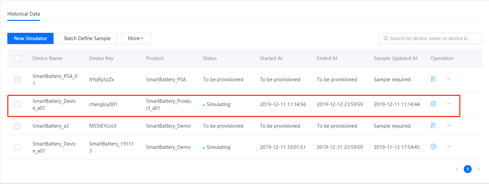
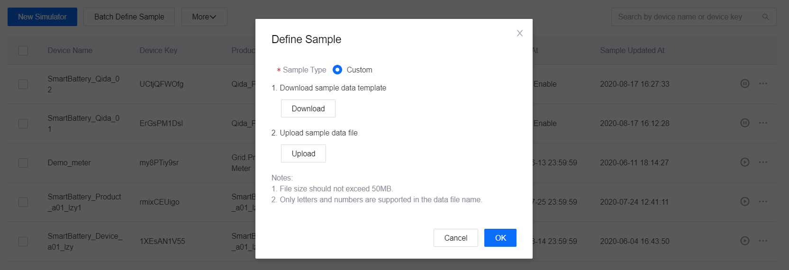

# Lab 2. Simulating Measurement Points

##  Using the Device Simulator
To get started without any programing (device-end development) to verify features that require data ingestion as the prerequisite, or to troubleshoot issues, you can use the device simulator that EnOS provides. The device simulator also helps with the below.

- Getting started with EnOS: You can use this function to simulate a device to transmit data to understand how to use the capabilities of EnOS.
- Testing and debugging: During application development, you might sometimes need to simulate a device to send a specific value to verify a device function. Real devices rarely sends that specific value. In this case you can use the device simulator to facilitate application development.

In this tutorial, we will simulate a smart battery that sends data to EnOS. We will insert some abnormal data into the data sample so that we can leverage the data to trigger alerts, and configure a storage policy to store the data sample in the TSDB and view the data in line chart in **Time Series Data Management > Data Insights**.

## Before You Start

- You have registered the device to simulate. 
- You have access to device management. If not, contact your OU administrator to grant you the following permissions:
    - Model
    - Device Management
    - Alert
    - Times Series Data

## Step 1: Add a Device Simulator

In the EnOS Management Console, click **Asset Management > Simulator** from the left navigation menu.

1. Click **New Simulator**, and select the device that you have registered for the simulation.

2. The device list shows all the devices that have been created in the current OU. 

> **Note**: You can only simulate a device with an **inactive** status. You cannot simulate a device that is already activated and is online or offline.

3. Click **OK** to create a simulator for the selected device.

In the list of simulators, you can see the simulator you just created. 

Next, you need to define the simulation data sample for it.

## Step 2. Define and Upload the Simulation Data Sample

1. In the list of simulators, click **... > Define Sample** for the simulator you just created.

2. Click **Download** in the pop-up window.

3. Input the simulation data sample in the downloaded template.
    
    - The first column **timeOfDay** refers to the _relative time stamp_: you can enter the relative timestamp within one day (24 hours) using the format H:MM:SS.    
    - The rest of the column headers are for the names of model points. You only need to enter the identifier of the model point to be simulated rather than entering all model points.     
    - The content under the header are point values. If the data type is array, the format is [value1, value2, value3, ...]. Leave the cell empty if there is no value at the current time point.

4. In the pop-up window, click **Upload** to upload the simulation data.

5. Click **OK**.

See [AESC_DEMO_Easy.csv](media/AESC_DEMO_Easy.csv) for a sample data upload template.

When we create the alert rule later, we will be setting the alert threshold to 60 milliampere. So in this sample, we need to modify the value in the `current` column so that at least one value is above 60 to trigger the alert "Current is above threshold".

The best practice is setting some values above 60 at earlier moments so that you do not have to wait long to see an alert triggered. In this tutorial, the time zone where the author is is UTC+08:00. The time is 10:00 when the author is writing this tutorial. Setting abnormal values at 0:02:00, 0:07:00, and 0:10:00, will therefore trigger alerts at 10:02:00, 10:07:00, and 10:10:00 of the author’s local time.

## Step 3: Start the Device Simulator

You can start simulators one by one or in batch. For this tutorial, we shall set the end time for 24 hours later.

You can actually set your preferred end time, but setting it to a later time leaves enough time for TSDB to ingest enough data to generate a report.

## Step 4: Configure TSDB Storage Policy

EnOS Time Series Database (TSDB) provides a variety of storage options for you to store important and frequently-accessed business data. Through configuring storage policies, time-series data can be routed to different datastores based on data types and storage time, thus reducing data storage costs and enhancing data access efficiency.

**Note**: 
 - By default, the uploaded data will is not stored in TSDB. You must configure data storage policy before the data is uploaded to EnOS Cloud.
 - Each model can be associated to only one storage policy group.

In this step, configure a storage policy for the measurement points that are defined in the `SmartBattery_Model_a01` model.

1. Select **Time Series Data Management > Storage Policy** from the left navigation menu.

2. Click **+** icon and **Create Group** to create a storage policy group.

   - **Group Name**: Enter a name for the storage policy group.
   - **Group Model**: Search and select the `SmartBattery_Model_a01` model to be associated with the storage policy group.

3. Click **OK** to save the storage policy group configuration.

After the storage group is created, you can see all the TSDB storage policy options listed under the storage group tab. Configure storage policies separately for the above listed measurement points.

Using the **AI Raw Data** storage type as example:

1. Move the cursor on the **AI Raw Data** storage type and click the **Edit** icon to open the **Edit Storage Policy** page.

2. From the **Storage Time** drop down list, select the storage time for the data. For this example, we shall save the data in TSDB for 1 month.

3. Select the `SmartBattery_Model_a01` model and the listed measurement points.

4. Click **OK** to save the storage policy.

## Step 5: Check the Data Insight of the Device

Go to **Time Series Data Management > Data Insights** and select the `SmartBattery_Device_a01` device to view the real-time current data report in minutes.

## Next Lab

[Monitoring Alerts of Smart Battery](302-3_monitoring_alerts_of_device.md)
