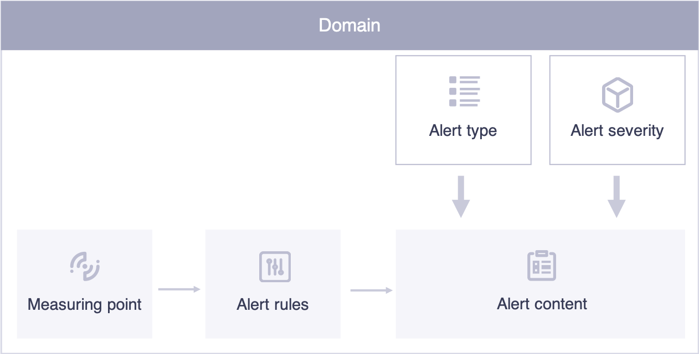
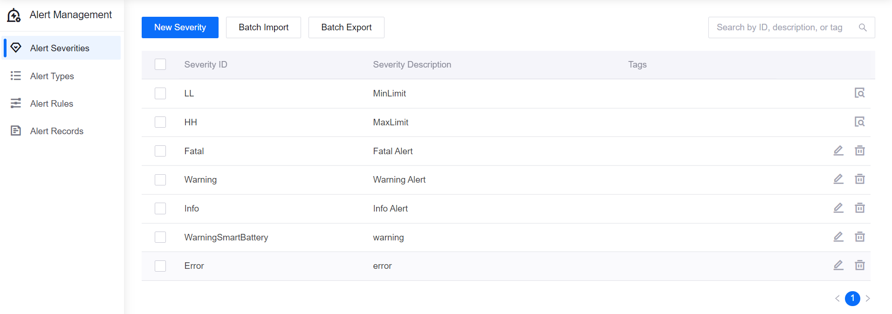
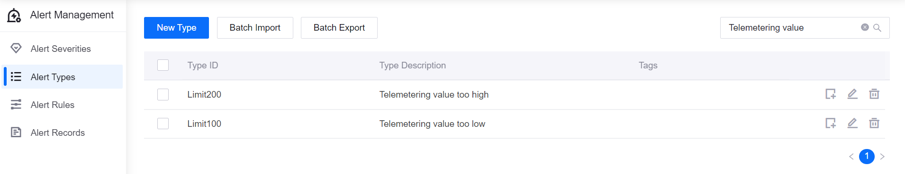
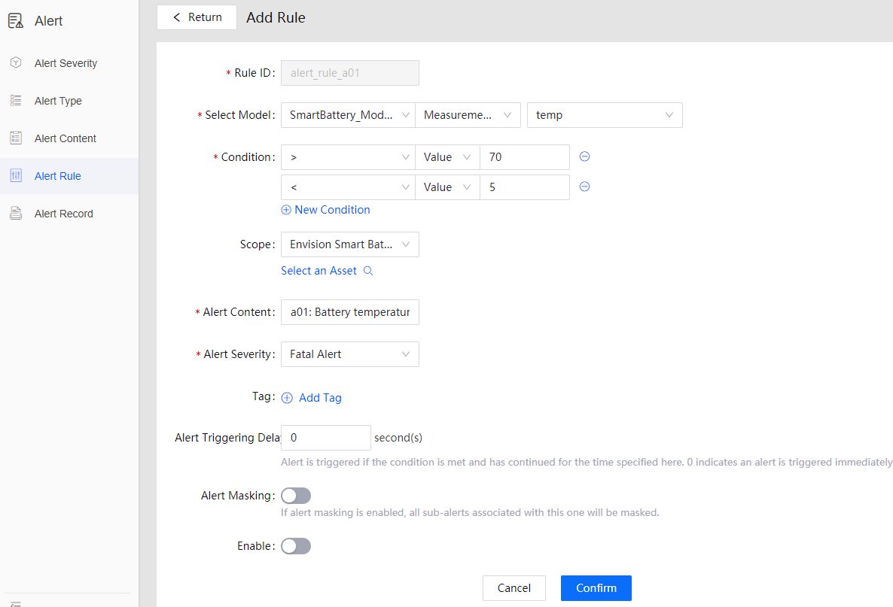

# Lab 3. Monitoring the Alerts of a Smart Battery

An alert is a record generated by the system when the value of a measurement point in a certain domain reaches a specific condition.

The condition that triggers the alert is defined by the alert rules. What is generated by the system is the alert content. As measurement points or alerts may vary, to distinguish and manage the alerts more effectively, alerts on EnOS are typically classified based on the severity (such as danger, critical, error, warning, and information) and type (such as over-limit).

The alert management message flow and the key concepts are illustrated in the following figure.

To monitor the health and performance of your smart battery, you can use the alert severities and alert types which we have defined, so that you will just need to define new alert content and alert rules for any device anomaly. You can use the alert rules below.

- Fatal alert: Temp > 70°C
- Warning alert: 60 °C <Temp<70 °C

## Step 1: Defining the Alert Configuration and Triggering Rules

 In this lab, we will use alerts to monitor the temperature of the smart battery.

1. In the EnOS Management Console, Click the **Alert Management** service in the left navigation menu.

    

2.  Click **Alert Types**. The two alert types we will be using are "Telemetering value too high" and "Telemetering value too low".

    

3. Click **Alert Content** to define the alert content, which can contain the cause of the alert and actions needed from the device owner. Then, associate the battery model and the defined alert type. Repeat the process to create other alert content.

    

4. Click **Alert Rules > New Rule** to define the alert rule for monitoring the battery temperature.

   - In the **Basic Information** section, enter the alert rule ID, description, and enable the rule.

   - In the **Trigger Settings** and **Condition** sections, define the alert rule triggering conditions.

    

   - In the **Alert Details** section, enter the alert content, select the alrt rule, and alert type.

    

5. When the alert rule is saved, it will start running to monitor the temperature of the battery device. You can view
active alerts and history alerts that are reported for the device on the **Alert Records** page.

    

## Step 2: Monitoring Alerts from the EnOS Management Console

In **Alert Management > Alert Records**, select your smart battery model and view the historical alerts. You can see that several alerts have been triggered by the anormal data.

For how to define data sample to trigger alerts, see [Lab 2. Simulating Measurement Points](302-2_simulating_measure_points.md)

## Step 3: Obtaining Alert Data for Application Use

You can also use the event service APIs to query alert records. For example, you can use the _Search Active Alerts_ API to query active alerts by organization ID and other filtering conditions. For more information about EnOS APIs, go to **EnOS APIs > API Reference** in the EnOS Management Console.

We will walk you through the usage of EnOS APIs in the application development workshop.
