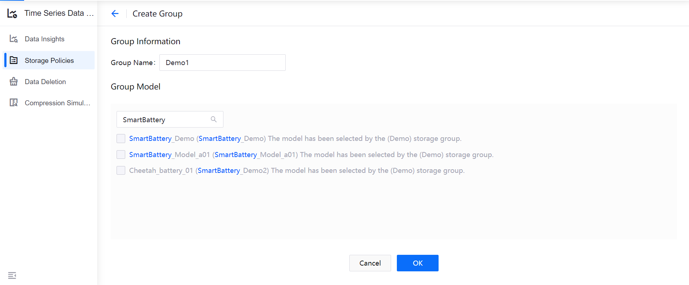
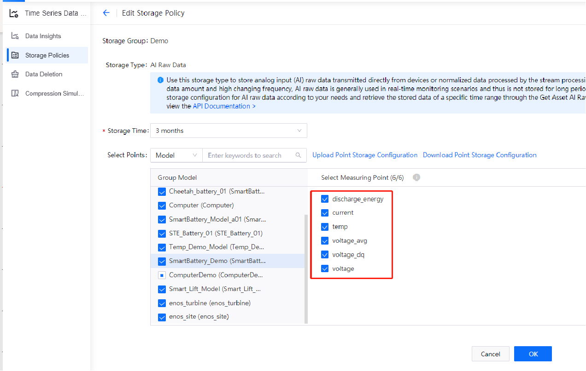

# Lab 1: Configuring Storage Policy for Battery Data

The EnOS Time Series Database (TSDB) provides a variety of storage options for you to store important and frequently-accessed business data. Through configuring storage policies, time-series data can be routed to different datastores based on data types and storage time, thus reducing data storage costs and enhancing data access efficiency.

**Note**: By default, the uploaded data is not stored in TSDB. You must configure data storage policy before the data is uploaded to EnOS Cloud.

In this lab, we will configure storage policies for the following measurement points that are defined in the **SmartBattery_Demo** model.

| Measurement Point  | Storage Type | Description                                                  |
| ---------------- | ------------ | ------------------------------------------------------------ |
| current          | AI Raw Data  | Real-time discharge current of the battery                   |
| voltage          | AI Raw Data  | Real-time voltage of the battery                             |
| temp             | AI Raw Data  | Real-time temperature of the battery                         |
| voltage_dq       | AI Raw Data  | Output point of the stream processing job for measuring the data quality of the battery voltage |
| discharge_energy | AI Raw Data  | Output point of the stream processing job for calculating the discharge energy of the battery |
| health_level     | DI Data      | Output point of the stream processing job for analyzing the health level of the battery |
| cycle_number     | Generic Data | Number of charge-discharge cycles that has happened on the battery                                 |

For detailed description of the supported storage types, see [Configuring TSDB Storage](https://support.envisioniot.com/docs/time-series-data/en/latest/configuring_tsdb_storage.html).

## Step 1: Creating a Storage Policy Group

Storage policy groups enable you to store the time-series data for different projects separately. Before configuring storage policies for the measurement points, you must create a storage policy group.

However, note that each model can be associated to only one storage policy group.

1. Log in to the EnOS Management Console and select **Time Series Data Management > Storage Policies** from the left navigation menu.

2. Click **+ > Create Group** in the upper right corner of the page to create a storage policy group and complete its configuration.

   - **Group Name**: Enter a name for the storage policy group.
   - **Group Model**: Search and select the **SmartBattery_Demo** model (or the model you created yourself) to be associated with the storage policy group.

3. Click **OK** to save the storage policy group configuration.

   

## Step 2: Configuring Storage Policies

After the storage group is created, you can see all the TSDB storage policy options listed under the storage group tab. Configure storage policies separately for the above listed measurement points.

Using the **AI Raw Data** storage type as example:

1. Move the cursor on the **AI Raw Data** storage type and click the **Edit** icon to open the **Edit Storage Policy** page.

2. From the **Storage Time** drop down list, select the storage time for the data. In this lab, we'll save the data in TSDB for 3 months.

3. Select the **SmartBattery_Demo** model and the listed measurement points.

4. Click **OK** to save the storage policy.

   

Follow the same steps to configure the storage policies for the other storage types.

**AI Normalized Data** storage policy:

**DI Data** storage policy:

**Generic Data** storage policy:

## Next Lab

[Calculating the Running-Average of the Battery Voltage](303-2_calculating_average_voltage.md)
