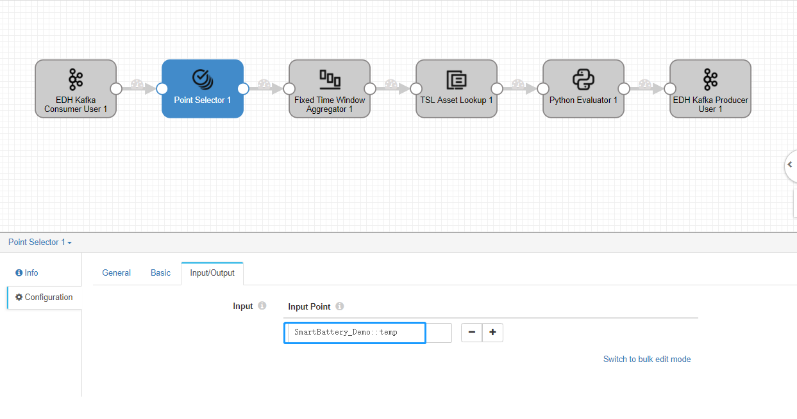
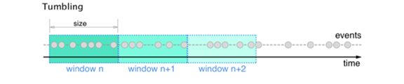
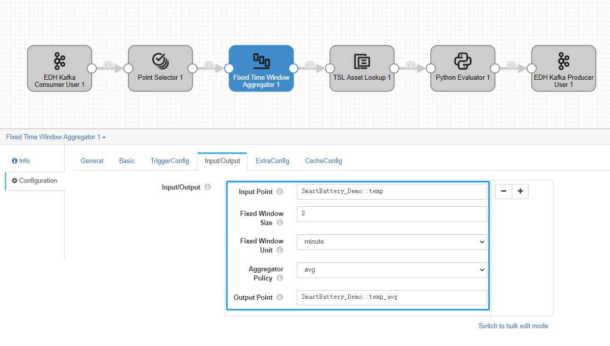
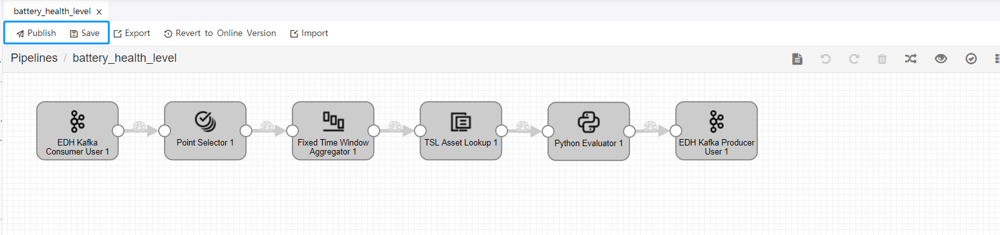

# Lab 3. Calculating the Health Level of the Battery

EnOS Stream Analytics service also provides a user-friendly UI for designing stream data processing jobs (pipelines) with StreamSets operators. You can quickly configure a pipeline by adding operators (stages) to the pipeline, thus completing data ingestion, filtering, processing, and storage tasks without programming.

In this lab, we will develop a stream data processing job with StreamSets operators to calculate the health level of the battery based on its real-time temperature. Detailed scenario of this lab is as follows:

1. Ingest and store the real-time temperature data of the battery.
2. Calculate the average temperature of the battery in every 2 minutes.
3. Compare the average temperature with the maximum temperature that the battery can work with (defined by the `UpperLimitTemp` attribute of the **SmartBattery_Demo** model).  
4. Based on the result of the comparison, output the following health levels of the battery:
  - **Level code 90**: Health (the average temperature is lower than the `UpperLimitTemp`)
  - **Level code 60**: Unhealthy (the average temperature is higher than the `UpperLimitTemp`, but not higher than 3%)
  - **Level code 30**: Extremely Unhealthy (the average temperature is higher than the `UpperLimitTemp`, and exceeding 3%)

To meet the requirement of the above business scenario, we need to use the following StreamSets operators:

| Operator                       | Description                                                  |
| ------------------------------ | ------------------------------------------------------------ |
| EDH Kafka Consumer             | Getting complete data records from Kafka                     |
| Point Selector                 | Specifying data records of the `SmartBattery_Demo::temp` measuring point as the input data |
| Sliding Time Window Aggregator | Aggregating the temperature data in every 2 minutes to calculate the average temperature |
| TSL Asset Lookup               | Getting the `UpperLimitTemp` attribute information of the battery model |
| Python Evaluator               | Calculating the health level of the battery by customized Python script |
| EDH Kafka Producer             | Sending the output results to Kafka                          |

The business scenario is as depicted in the following figure:


## Installing StreamSets Libraries

Before developing stream processing jobs, you need to install the corresponding StreamSets calculator library.

1. Log in the **EnOS Management Console** and click **Stream Processing > Streamsets Libs**.
2. Under the **Calculator Library** tab, view the StreamSets calculator libraries that can be installed.
3. Find the library to be installed and click **Install**. The system will start the installation immediately.


## Creating a StreamSets pipeline

Take the following steps to create a StreamSets pipeline:

1. Log in to the **EnOS Management Console**, select **Stream Processing > Stream Development**, and click the **+** icon above the list of stream processing jobs.

2. On the **New Stream** window, select **New** to create the stream processing job. You can also choose to import a configuration file to create the job quickly.

3. Enter the name and description of the stream processing job.

4. From the **Template** drop-down list, select **Origin Pipeline**.

5. From the **Operator Version** drop-down list, select the installed StreamSets calculator library version.

6. For **Message Channel**, select *Real-Time*.

7. Click **OK** to create the stream processing job with the basic settings above.

   


## Adding operators to the pipeline

Now we can add the needed operators to the pipeline and connect the operators with arrows to form the pipeline.

1. Select the arrow between the **Kafka Data Source** and **Kafka Data Producer** operators and click the **Delete** icon to remove the connection.

   

2. Click the **Stage Library** icon in the upper right corner of the page and select **EDH Streaming Calculator Library 0.1.0**.

   

3. From the list of operators, click the **Point Selector** operator to add it to the pipeline canvas.

4. Connect the output point of the **EDH Kafka Consumer** operator to the input point of the **Point Selector** operator.

   

5. Repeat steps 3 and 4 to add the remaining operators to the pipeline and connect them by the order shown in the following figure:

   

6. Click the **Auto Arrange** icon  to align the display of operators in the pipeline.


## Configuring operator parameter

After the pipeline is created, we can now configure the parameters for the added operators. Select one of the operators and complete the configuration of each tab.

### Point Selector

Complete the configuration of **Input/Output** with the following settings:

| Field       | Value                   | Description                                           |
| ----------- | ----------------------- | ----------------------------------------------------- |
| Input Point | SmartBattery_Demo::temp | Getting the `temp` point data from Kafka as the input |

See the following example:



### Sliding Time Window Aggregator

The **Sliding Time Window Aggregator** uses a sliding window for data aggregation. Opposed to a tumbling window, the sliding window slides over the incoming stream of data. Because of this, a sliding window can be overlapping and it gives a smoother aggregation over the incoming stream of data. The following figure illustrates the difference between a tumbling window and a sliding window:



Complete the configuration of **Input/Output** with the following settings:

| Field               | Value                       | Description                                           |
| ------------------- | --------------------------- | ----------------------------------------------------- |
| Input Point         | SmartBattery_Demo::temp     | Specifying the `temp` point data as the input         |
| Fixed Window Size   | 2                           | Specifying the duration of the time window            |
| Fixed Window Unit   | minute                      | Unit of the time window                               |
| Sliding Window Size | 1                           | Specifying the step length of the time window         |
| Sliding Window Unit | minute                      | Unit of the time window                               |
| Aggregator Policy   | avg                         | Calculating average temperature value                 |
| Output Point        | SmartBattery_Demo::temp_avg | Specifying the point that receives the output results |

See the following example:



### TSL Asset Lookup

Complete the configuration of **Input/Output** with the following settings:

| Field        | Value                           | Description                                     |
| ------------ | ------------------------------- | ----------------------------------------------- |
| Input Point  | SmartBattery_Demo::temp_avg     | Receiving the average temperature data as input |
| Output Point | SmartBattery_Demo::temp_avg_out | Keeping the average temperature data as output  |

See the following example:


Complete the configuration of **Criteria** with the following settings:

| Field     | Value | Description                                                  |
| --------- | ----- | ------------------------------------------------------------ |
| Attribute | All   | Getting the `UpperLimitTemp` attribute information of the battery model and including it in the output results |

See the following example:


### Python Evaluator

Complete the configuration of **Input/Output** with the following settings:

| Field        | Value                           | Description                                                  |
| ------------ | ------------------------------- | ------------------------------------------------------------ |
| Input Point  | SmartBattery_Demo::temp_avg_out | Specifying the average temperature data as input             |
| Output Point | SmartBattery_Demo::health_level | Specifying the point that receives output results of the battery health level |

See the following example:


Under the **Script** tab, enter the following script in the **Python Script** field:

```
# Comparing the average temperature with the specified temperature limit
def get_health_level(temp_avg, temp_limit):
    if temp_avg > temp_limit * 1.03:
        return 30
    elif temp_avg > temp_limit:
        return 60
    else:
        return 90

# Getting the temperature data from the input data records       
for record in records:
  try:
    attrs = record.value['attr']['tslAssetLookup']['attributes']
    temp_limit = float(attrs['UpperLimitTemp'])
    temp_avg = record.value['value']
    health_level = get_health_level(temp_avg, temp_limit)

# Sending results to the specified output point    
    record.value['pointId'] = 'health_level'
    record.value['value'] = health_level
    output.write(record)

  except Exception as e:
    # Send record to error
    error.write(record, str(e))
```


## Validating and Publish the pipeline

When the configuration of the operators is completed, we can now validate the configuration and publish the pipeline.

1. Click the **Validate** icon  in the tool bar to verify the configuration of all the operators.

   

2. If the validation fails, update the configuration of the operators accordingly.

3. Click Save to save the configuration of the stream data processing job.

4. Click Release to publish the job online.

   

   

## Starting the StreamSets pipeline

Before starting the stream processing job, make sure that the corresponding system pipelines are started and running. The real-time and offline message channels have 2 system pipelines (data writer and data reader) separately.

Follow the steps below to start the stream processing job.

1. Open the **Stream Operation** page, and check the status of the system pipelines under the **System Pipeline** tab.

2. In the list of system pipelines, click the **Start** icon  to start the required system pipeline. 

   

3. Now you can start your stream processing job. On the **Stream Operation** page, find the StreamSets pipelin you have published under **User Pipeline** tab, and then click the **Start** icon  to start the job.  It may take about 5 minutes for the pipeline to start up.

   


## Viewing the job running results

On the **Stream Operation** page, find the running stream data processing job under the **User Pipeline** tab, and click the job name to open the **Stream Details** page. You can view the following information about the job:

- **Summary**: View the summary of the running stream, such as the count of processed data records and the record throughput.

  

- **Log**: Click the **View Logs** icon on the upper right corner to check the running log of the job.

- **Results**: The processed data will be stored in TSDB according to the configured storage policy.


After the stream data processing pipeline keeps running for a while, you can go to the **Data Insights** page to view the calculated health level results of the battery.

1. Select **Time Series Data > Data Insights** from the left navigation panel of EnOS Console to open the Data Insights page.
2. In the **Select Time Range** section, select **1H**.
3. Click the **Select Devices** input box, search for your battery device, and select it from the drop-down list. The selected device will be dynamically presented in the **Selected Measuring Points** column for selecting corresponding measuring points.  
4. In the **Selected Measuring Points** column, click on the selected device name, expand the list of measuring points, and select the **health_level** point. The queried battery health level data will be displayed in the chart on the right.

See the following example of the queried data:


## Next Lab

[Monitoring Health Level Alerts](303-4_monitoring_alerts.md)

