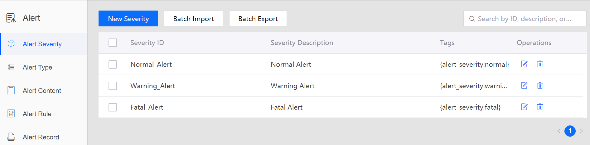

# Lab 4. Monitoring Health Level Alerts

The EnOS Alert Management service enables you to define, receive, and process alerts for the assets of your organization.

In this lab, we will enable the alert service to monitor the real-time health level of the battery. To get started, we need to define the alert severity, alert type, alert content, and alert triggering rule in the EnOS Management Console based on requirements of the business scenario.

## Step 1: Creating the Alert Severity

In [Lab 3](303-3 calculating_health_level.md), we defined 3 battery health levels. Create the following alert severity levels for the 3 health levels.

| Health Level Code | Alert Severity ID | Description                        |
| ----------------- | ----------------- | ---------------------------------- |
| 90                | Normal_Alert      | The battery is healthy             |
| 60                | Warning_Alert     | The battery is unhealthy           |
| 30                | Fatal_Alert       | The battery is extremely unhealthy |

1. Log in to the EnOS Management Console and select **Alert > Alert Severity** from the left navigation menu.

2. Click **New Severity** and type the ID, description, and tag (optional) for the corresponding severity level.

   

3. Click **Confirm** to save the alert severity.

See the following example of the created alert severity levels:

## Step 2: Creating the Alert Type

Alert types are defined to distinguish status of assets and possible causes of alerts, so that we can better monitor the status of assets.

1. Select **Alert > Alert Type** from the left navigation menu.

2. Click **New Type** and provide an ID, description, and tag (optional) for the alert type.

   

3. Click **Confirm** to save the alert type.

## Step 3: Creating the Alert Content

Alert content describes the status of assets and possible causes of alerts.

1. Select **Alert > Alert Content** from the left navigation menu.

2. Click **New Content** and provide the following in the **Add Alert Content** window.

   - **Content ID**: Enter an ID for the alert content.

   - **Content Description**: Enter a description of the alert content. In this lab, use the statement `Health level code:${health_level}` as the alert content. In this way, we can include the real-time health level of the battery in the alert content.

   - **Model Name**: Select the **SmartBattery_Demo** model from the drop-down list.

   - **Type**: Select the **Health Level** alert type from the list of defined alert types.

   

3. Click **Confirm** to save the alert content.

## Step 4: Creating the Alert Rule

Alert rules define the triggering conditions of alerts. In this lab, create alert rules for the **Warning_Alert** and **Fatal_Alert** severity levels separately.

Follow the steps below to create alert triggering rule for the **Warning_Alert** severity level.

1. Select **Alert > Alert Rule** from the left navigation menu.

2. Click **New Rule** and provide the following in the **Add Alert Rule** window.

   - **Rule ID**: Enter an ID for the alert rule, for example, `SMH-60`.

   - **Select Model**: Select the **SmartBattery_Demo** model and the **health_level** measurement point from the drop-down list. The alert rule applies to the battery health level only.

   - **Condition**: Specify the triggering condition for the alert and enter the corresponding value or value scope for the condition. Based on the business scenario, for the **Warning_Alert** severity level, the conditions are `health_level>30` and `health_level<=60`.

   - **Scope**: Select **All Devices** to apply the alert rule to all devices under the model.

   - **Alert Content**: Select the **HealthLevelAlert** content from the pop-up window.

   - **Alert Severity**: Select the **Warning Alert** severity level from the drop-down list.

   - **Alert Triggering Delay**: Enter **0** to trigger the alert immediately when the condition is met.

   - **Enable**: Select to enable the alert rule.

   

3. Click **Confirm** to save the alert rule setting for the **Warning_Alert** severity level.

Follow the steps below to create alert triggering rule for the **Fatal_Alert** severity level.

1. Select **Alert > Alert Rule** from the left navigation menu.

2. Click **New Rule** and provide the following in the **Add Alert Rule** window.

   - **Rule ID**: Enter an ID for the alert rule, for example, `SMH-30`.

   - **Select Model**: Select the **SmartBattery_Demo** model and the **health_level** measurement point from the drop-down list. The alert rule applies to the battery health level only.

   - **Condition**: Specify the triggering condition for the alert and enter the corresponding value or value scope for the condition. Based on the business scenario, for the **Fatal_Alert** severity level, the condition is `health_level<=30`.

   - **Scope**: Select **All Devices** to apply the alert rule to all devices under the model.

   - **Alert Content**: Select the **HealthLevelAlert** content from the pop-up window.

   - **Alert Severity**: Select the **Fatal Alert** severity level from the drop-down list.

   - **Alert Triggering Delay**: Enter **0** to trigger the alert immediately when the condition is met.

   - **Enable**: Select to enable the alert rule.

   

3. Click **Confirm** to save the alert rule setting for the **Fatal_Alert** severity level.

Verify the created alert rules. See the following example:

## Step 5: Viewing the Alert Records

After the alert rules are enabled, the alert service will start monitoring the health level of the battery and report alerts if the health level meets the triggering conditions.

1. Select **Alert > Alert Record** from the left navigation menu.

2. Under the **Active Alerts** tab, set filtering conditions to query active alert records of your battery device as per the below.

   - **Model**: Select the **SmartBattery_Demo** model from the drop-down list to query alert records of all devices under the model.

   - **Asset ID**: To query alert records of a specific asset, enter the asset ID in this field.

3. Click the **Search** button to query alert records. See the following example:

   

4. Click the **History Alerts** tab and use the same steps to query history alert records of your battery device.

## Next Lab

[Archiving Uploaded Data of the Battery](303-5_archiving_data.md)