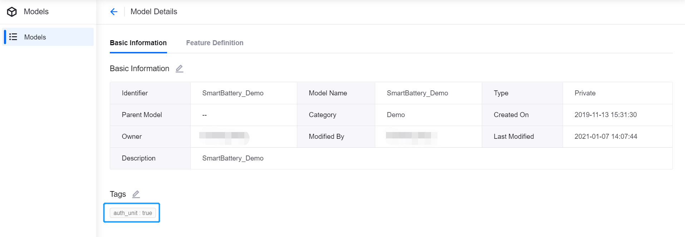
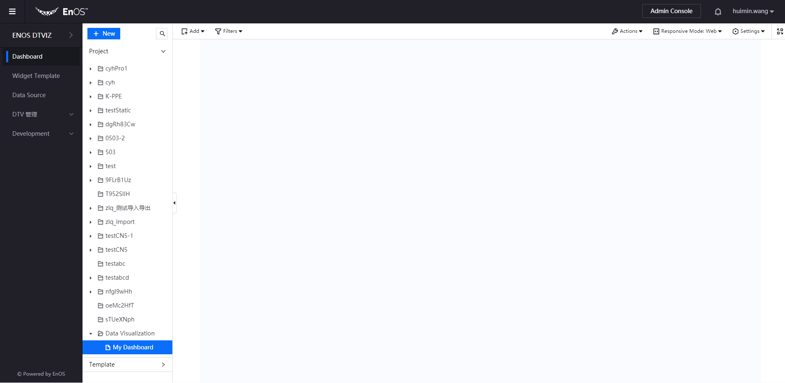
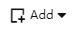

# Visualizing your Data

To see a visualization of your data, you can use the **EnOS Digital Twin Visualization (DTV)** service. DTV (link to DTV doc) is a simple yet powerful application that enables users to build data visualization pages through a low-code/no-code drag-and-drop experience.

In this tutorial, we will learn how to navigate around the DTV Dashboard Editor, and create a widget that displays how the battery current changes over time.

## Before You Start

- Ensure that you have signed up for an individual account or an enterprise account to access the EnOS Management Console.

- Ensure that your account have been assigned full access to the model service, device connectivity & management service, and asset tree service.

- Ensure that your account has authorized access to the DTV application (in the training, this is already done by the trainer)

  

## The Dashboard Editor

Let's have a tour around the Dashboard Editor, so that later you can easily navigate through the user interface.

## Step 1

Specific tags are required for the DTV to identify the asset data to be synchronized. Before using the DTV to access the historical asset data, it is required to ensure the TSDB storage policies has been configured for the asset measurement points.

1. Log in to the EnOS Management Console, select **Models** or **Asset Trees**, and find out the target model or asset.

2. Tag the model that the asset belongs to or the asset with `auth_unit:true`, and the DTV can identify the asset data to be synchronized through this tag.

   

3. In the **Time Series Data Management > Data Insights** page, enter the query conditions and check whether the asset measurement point data is stored in TSDB.

Now, you are ready to create your widget.

## Step 2

You need to create a project, and then a page to hold widgets.

1. Log in to the EnOS App Portal, and select the organization assigned to you.

2. Click **Dashboard** on the Navigation Pane.

3. Click **New** on the sidebar. A dialog window is displayed.

   - For **Type**, select **Project**.

   - For **Project**, select **For Page**.

   - For **Name**, specify a preferred name for your project.

   

4. Click **OK**. Your project is created and you can see it on the sidebar, under the **Project** category.

5. To create the page, click **New** on the sidebar again. The same dialog window is displayed.

   - For **Type**, select **Page**.

   - For **Name**, specify a preferred name for your page.

   - For **Project**, select the name of the project that you just created.

   - Leave the **Template** box blank.

   

6. Click **OK**. Your page is created.

 1. On the sidebar, expand your project, click on the page that you just created. The **Page Editor** appears on the right pane.

   

You have successfully created a new project, and a new page that you will use for displaying your data.

## Step 3

Finally, you will create a DTV widget that plots and displays the data measured.

There are many widgets for you to choose, and they have different purposes. For instance:

- **Liquid Fill**, **Donut Gauge** are suitable for measuring progress.
- **Mix Chart** is good for visualizing and comparing trends.
- **Table** is good for displaying complex data in an organized tabulated form.

There are many other widgets on DTV which you can explore, or you can read about them at **Widget Reference**.

Since we want to see how the battery current changes over time, we will use the **Mix Chart** widget.

1. In the **Page Editor**, hover over  on the toolbar and select **Widget (New)**. The **Chart Editor** appears on the same pane.

2. In the **Chart Selection** section, select **Mix Chart** .

3. In the **Basic Information** > **Basic Options** panel, you can specify a title and a basic description for your widget.

4.  Configure the **Data Fields** section as follows:
   - From the **Data Source** list, select **AI Raw Data**.
   - From the **Category** list, select **SmartBattery_Model_a01**, which is the model you created earlier.
   - Leave the **Aggregation** field as **Raw Data**.
   - Leave the **Start Time** and **End Time** fields blank.
   - For **Dimension**, add the **timeOfDay** data field. This is the horizontal axis of the chart.
   - For **Measurement**, add the **current** data field. This is the vertical axis of the chart.

5. You can choose to style how your chart looks like in **Chart Style**. For information on styling options, you can go to the **Mix Chart** reference.

6. After you have finished, click **Save**, which is located below the chart.

7. To view your new widget on the dashboard, click the return arrow  located on the toolbar.

## Step 4

Now, you can create a page for monitoring the performance of your batteries with the following charts:

1. A Table that contains performance data of your batteries
2. A Donut Gauge that displays the health level of your batteries
3. A Pie Chart that displays the capacity of your batteries

See the following example:

**Table Chart**

**Donut Gauge Chart**

**Pie Chart**

