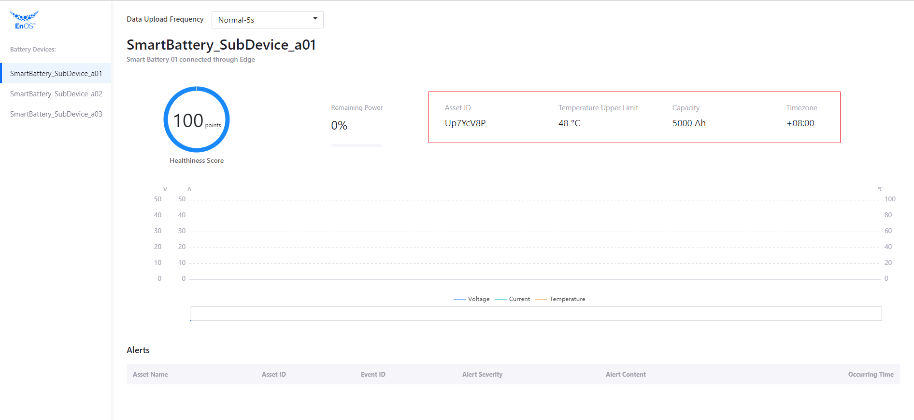
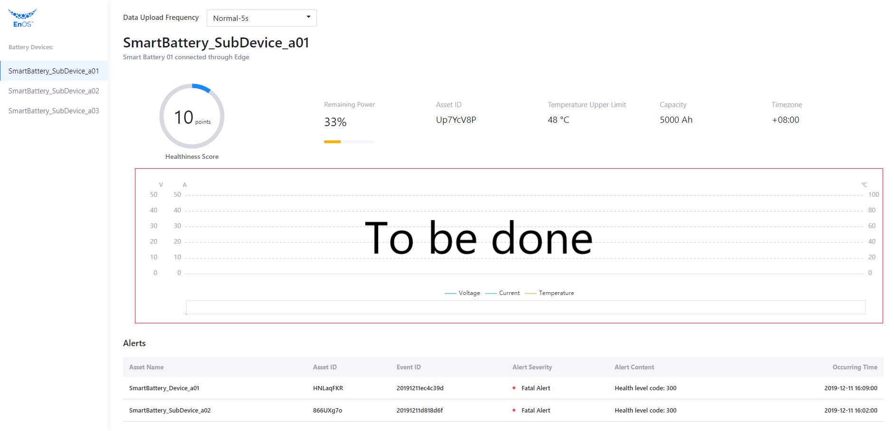

# Invoking EnOS APIs

In this unit, we can start to invoke EnOS APIs to get the asset information of batteries and the ingested history data of batteries stored in TSDB.

## Getting battery asset list

> In this step, we will invoke the EnOS API *Search Related Asset Node*. The request format is:
>
> *https://{apigw-address}/asset-tree-service/v2.1/asset-nodes?action=searchRelatedAsset*

Take the following steps to invoke the EnOS API to get the battery asset list from the asset tree:

1. In the `services.py` file, find the `get_child_asset_list` stub function, and enter the following code for getting the list of battery assets under the specified asset tree node:

   

   ```
   def get_child_asset_list(parentId):
       url = api_gateway + '/asset-tree-service/v2.1/asset-nodes?'
   
       query_data = {
           'action': 'searchRelatedAsset',
           'treeId': battery_provider_treeId,
           'orgId': training_orgId}
   
       query_string = parser.urlencode(query_data)
       url += query_string
   
       data = {
           "filter": {
               "isChildOfAssetId": parentId  # Specify the parent node Id for this query
           },
           "projection": ["assetId", "name.defaultValue"]
       }
   
       # poseidon.urlopen is the function defined in our SDK to send an API request.
       req = poseidon.urlopen(app_access_key, app_secret_key, url, data)
       return req
   ```

2. With the programming work completed, we can now test running the code. Click **Run > Run** to start the application.

   

3. Open a browser and enter `http://127.0.0.1:5000` in the address field. We can see the retrieved battery list. See the following example:


## Getting asset information of a specific battery

> In this step, we will invoke the EnOS API *Get Asset*. The request format is:
>
> *https://{apigw-address}/asset-service/v2.1/assets?action=get*

Take the following step to invoke the EnOS API to get the specified battery asset information:

1. In the `services.py` file, find the `get_asset_info` stub function, and enter the following code for getting the battery asset information:

   ```
   def get_asset_info(assetId):
       url = api_gateway + '/asset-service/v2.1/assets?'
   
       query_data = {
           'action': 'get',
           'orgId': training_orgId,
           'assetId': assetId}
   
       query_string = parser.urlencode(query_data)
       url += query_string
   
       req = poseidon.urlopen(app_access_key, app_secret_key, url)
   
       return req
   ```

2. Click **Run > Run** to start the application.

3. Open a browser and enter `http://127.0.0.1:5000` in the address field. We can see the retrieved battery asset information. See the following example:



## Getting the status of a specific battery

> In this step, we will invoke the EnOS API *Get Asset Latest Data*. The request format is:
>
> https://{apigw-address}/tsdb-service/v2.0/latest?orgId={}&assetIds={}&measurepoints={}&timeWindow={}&accessKey={}

Take the following steps to invoke the EnOS API to get the status of a specific battery, including health level and remaining power:

1. In the `services.py` file, find the `get_asset_latest_data` stub function, and enter the following code for getting the battery latest status information:

   ```
   def get_asset_latest_data(assetIds, measurepoints):
       url = api_gateway + '/tsdb-service/v2.0/latest?'
   
       query_data = {
           'orgId': training_orgId,
           'assetIds': assetIds,
           'measurepoints': measurepoints,
           'timeWindow': '',
           'accessKey': app_access_key}
   
       query_string = parser.urlencode(query_data)
       url += query_string
   
       req = poseidon.urlopen(app_access_key, app_secret_key, url)
       return req
   ```

2. Click **Run > Run** to start the application.

3. Open a browser and enter `http://127.0.0.1:5000` in the address field. We can see the retrieved battery health level and remaining power information. See the following example:


## Getting the active alerts of a specific asset tree

> In this step, we will invoke the EnOS API *Search Active Alerts*. The request format is:
>
> https://{apigw-address}/event-service/v2.1/active-alerts?action=search

Take the following steps to invoke the EnOS API to get the active alerts of a specific asset tree:

1. In the `services.py` file, find the `get_active_alerts` stub function, and enter the following code for getting the asset tree active alerts:

   ```
   def get_active_alerts():
       url = api_gateway + '/event-service/v2.1/active-alerts?'
   
       query_data = {
           'action': 'search',
           'orgId': training_orgId}
   
       query_string = parser.urlencode(query_data)
       url += query_string
   
       data = {
           "scope": {
               "treeId": battery_provider_treeId  # Specify the asset tree from which to search active alerts
           },
           "pagination": {
               "pageNo": 1,
               "pageSize": 10
           }
       }
   
       req = poseidon.urlopen(app_access_key, app_secret_key, url, data)
       return req
   ```

2. Click **Run > Run** to start the application.

3. Open a browser and enter `http://127.0.0.1:5000` in the address field. We can see the retrieved active alert records. See the following example:


## Setting data uploading frequency

> In this step, we will invoke the EnOS API *Invoke Service*. The request format is:
>
> *https://{apigw-address}/connect-service/v2.1/commands?action=invokeService*

Take the following steps to invoke the EnOS API to set the battery data upload frequency:

1. In the `services.py` file, find the `set_battery_frequency` stub function, and enter the following code for setting the battery data uploading frequency:

   ```
   def set_battery_frequency(assetId, frequency):
       url = api_gateway + '/connect-service/v2.1/commands?'
   
       query_data = {
           'action': 'invokeService',
           'orgId': training_orgId,
           'assetId': assetId,
           'serviceId': 'high_frequency_report_service',
           'pendingTtl': 1000}
   
       query_string = parser.urlencode(query_data)
       url += query_string
   
       print(url)
   
       data = {
           "inputData": {
               "interval": frequency
           }
       }
   
       req = poseidon.urlopen(app_access_key, app_secret_key, url, data)
       return req
   ```

2. Click **Run > Run** to start the application. In this step, we still cannot see the direct result of the changed data uploading frequency because we have not retrieved the dynamic battery data, including the voltage, current, and temperature.

3. In the next unit, you will need to complete the remaining development work.


## Getting the battery history data




## Reference

For more information of EnOS APIs, go to **EnOS Console > EnOS API**.


## Next Lab

[Developing by Yourself](developing_by_yourself_python.md)