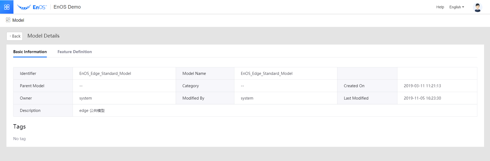
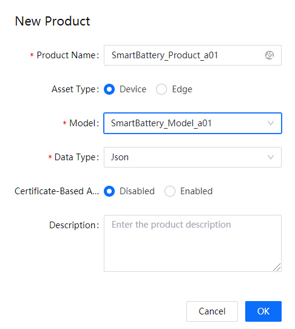
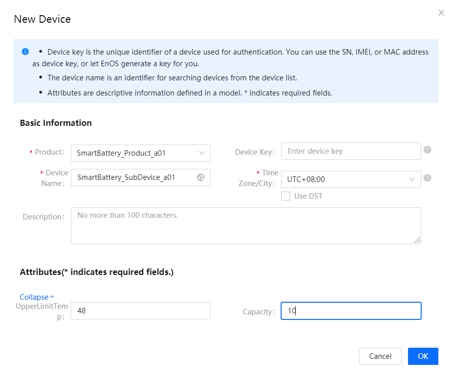
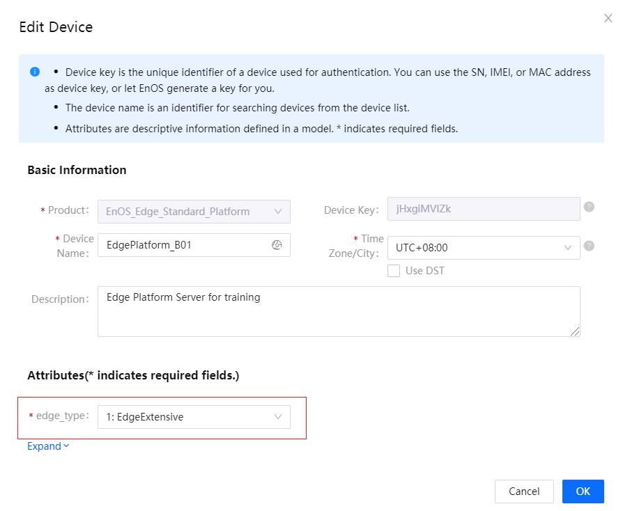
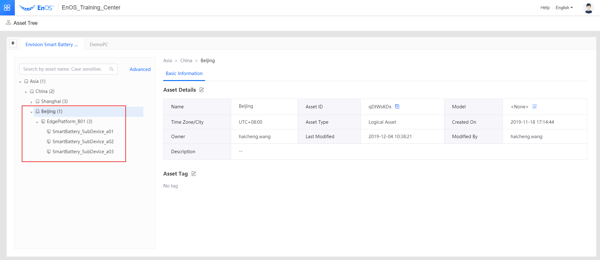
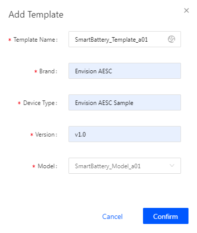
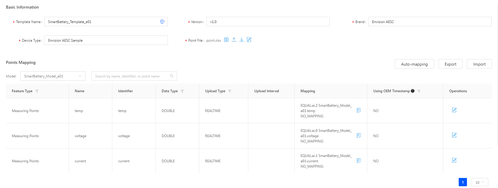
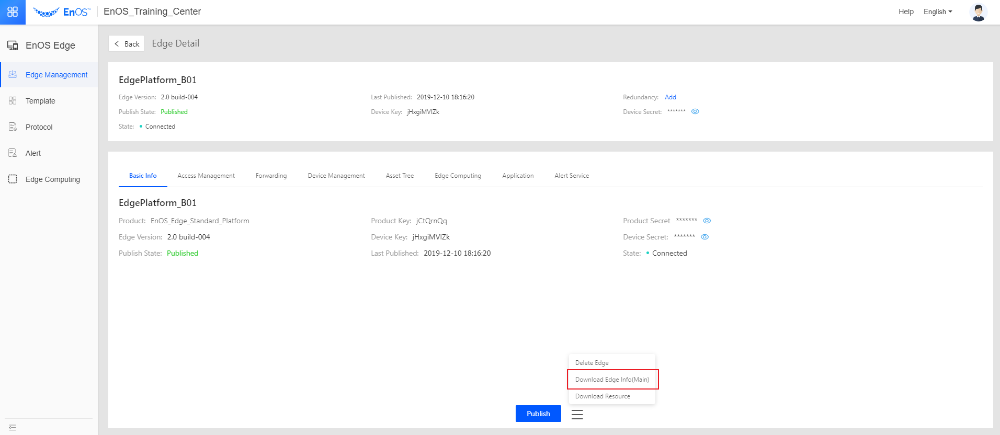
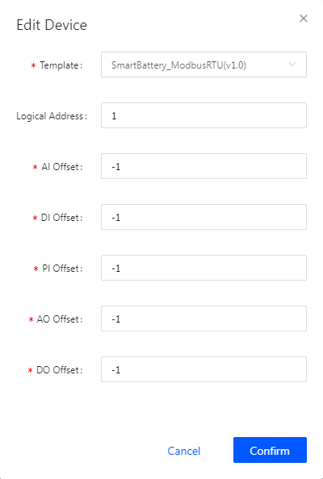

# Lab: Connecting EnOS Edge to EnOS Cloud

In this session, we will complete the following tasks:
- Use Modbus RTU protocol simulator to simulate 3 smart batteries.
- Connect the EnOS Edge to EnOS cloud. 
- Connect the simulated devices to EnOS Cloud through EnOS Edge.

To connect the simulated devices and EnOS Edge to EnOS Cloud, we need to register them to EnOS Cloud in advance. To register them, we need to create corresponding models and products. So the overall procedure of this lab goes as follows:

## Step 1：Defining Models

EnOS Edge has already been defined as a public model on EnOS Cloud,  i.e., EnOS_Standard_Model.

So for this step, we only need to define a model for the smart batteries. We will name this model *SmartBattery_Model_TraineeId* that has the following measurement points:

| Name | Identifier  | Data Type | Unit |
| ---- | ------- | -------- | -------- |
| voltage | voltage | double   | V        |
| current | current | double   | A        |
| temperature | temp    | double   | °C       |

## Step 2: Creating Products

In this step, we will create the battery product if you have not done this before: 

- Product *SmartBattery_Product_TraineeId* from model *SmartBattery_Model_TraineeId*.

<u>For the Edge product, you don't need to create it, just use the one already created on the platform:</u>

- Product *EnOS_Edge_Standard_Platform* from public model *EnOS_Edge_Standard_Model*.

<!--Put a screenshot of a created smart battery product here-->

## Step 3: Registering Devices

In this step, we need to register smart battery to be connected through EnOS Edge to the Cloud.

For the Edge device, we just use the one that has already been created:

This Edge type is an "Edge Extensive":

**Note**: For **edge_type**, we select **EdgeExtensive** so that we will have enough capacity for later edge computing and alert labs.

## Step 4: Creating an Asset Tree and Binding Edge And Devices

Creating an asset tree facilitates asset management. In this step, we will reuse the asset tree named *Envision Smart Battery Provider*.

This tree has a root node **Asia** . The smart battery we created will be under path **China > Beijing > EdgePlatform_B01** as shown in the following screenshot:

<!--End-->

## Step 5: Configuring Edge Template

Before initiating the communication between EnOS Edge and its sub-devices, we must define the template for their communication.

A template prescribes the following things:

- The protocol an EnOS Edge uses to communicate with its sub-devices.
- How the EnOS Edge deals with the data transferred from sub-devices, i.e., which data from a device is related to a measurement point defined by the model and whether the device data need processing by formulae.

1. Go to **EnOS Edge > Template** . Click **New Template** . Fill in the fields as follows to create a template:

 

2. Click **Edit** in the **Operations** column to enter **Edit Template** page.

3. Click **Download Template** and select v2.0_debug of **ModbusRTU-Client-MODBUS_RTU**.

 

4. Open the downloaded protocol configuration file *point.xlsx* . Configure the device data to be collected as follows in *point.xlsx* and upload this configuration file.

   | Point Name | Point Number | Value Type | Point Type | Coefficient | Default Value | Alias                |
   | ------------------------- | ---- | ------ | ------ | ---- | :--- | ------------------- |
   | SmartBattery_Model_TraineeId.voltage | 0    | float  | AI     | 0.01 | 0    | Battery voltage     |
   | SmartBattery_Model_TraineeId.current | 1    | float  | AI     | 0.01 | 0    | Battery current     |
   | SmartBattery_Model_TraineeId.temp | 2    | float  | AI     | 0.01 | 0    | Battery temperature |

5. In **Points Mapping** , configure the data mapping for the measurement points as follows:

   

## Step 6: Configuring EnOS Edge

Now we can perform the following tasks:

- Initiating the communication between EnOS Edge and EnOS Cloud by importing the configuration to a physical edge server.
- Creating a connection for EnOS Edge and its sub-devices, which are the smart batteries we created in our case, so that they can communicate as prescribed in the template we configured in the previous step.

1. Go to **EnOS Edge > Edge Management** . Click **New Edge** . Select the EnOS Edge we just created, **EdgePlatform_B01** and click **Confirm** to import this EnOS Edge into **Edge Management** . 

2. Click **View** in the **Operations** column ot enter the **Edge Detail** page of **EdgePlatform_B01** . Click the button to the right of **Publish** at the bottom of the page and select **Download Edge Info(Main)** to download the *box.conf* file. Forward *box.conf* to a deployment engineer to have an edge server configured. Then the edge server can communicate with EnOS Cloud as prescribed by you in the previous steps.

 

**Note**: The above two steps are not necessary in this lab, please just use Edge that has already been imported.

3. Go to **Edge Detail > Access Management**. On **Ethernet** tab page, select **Add Connection** . In the **Edit Connection** pop-up, fill in the fields as follows:

   | Field | Value | Note |
   | ----- | ----- | ------ |
   | Name | Battery_Connection_Traineed | |
   | Mode | TCP/IP Client | Value of this field depends on the protocol you use. |
   | Primary Interface | IP address and port of the computer we use to simulate smart batteries. | Port number can be a random integer from 1 to 65535 and is not already used for other purposes (system, common services, etc). In our case we use 2233. |
   | Protocol Type | ModbusRTU |  |
   | Protocol | v2.0_debug |  |
   | Configuration File | *protocol.sys* | We will use the default configuration so you don't need to change this file. |

   

4. Under Connection **Battery_Connection_TraineeId** , click **Add Device** . In **Add Device** , select **SmartBattery_Product_TraineeId** and then the smart battery **SmartBattery_SubDevice_TraineeId**. Click **Save** to add the battery to this connection. 

5. For the battery, click **Edit** to enter **Edit Device** pop-up, select **SmartBattery_Template_TraineeId** for **Template** . Set **Logical Address** of  **SmartBattery_SubDevice_TraineeId** to **1**.

 

## Step 7: Simulating Smart Battery

To simulate smart batteries sending out telemetries using our own laptop, we need the following softwares:

- A Modbus simulator to simulate the smart batteries 
- A virtual serial port driver to convert data received at our laptop into serial data that can be processed by the Modbus simulator

### Installing Virtual Serial Port Driver USR-VCOM

USR-VCOM, a virtual serial port driver, can convert TCP/IP and UDP data into communications (COMM) port data so that data from the Modbus simulator can reach EnOS through Modbus RTU protocol.

Download the installation program. Follow the wizard to finish installation.

### Create a Visual Serial Port

1. Open USR-VCOM.exe

2. Click **Add COM** . In the pop-up window, fill in the fields as follows:

| Field | Value | Note |
| --- | --- | --- |
| Virtual COM | Any COMM port available | Used COMM port will be removed from the drop-down to be non-selectable. |
| Net Protocol | TCP Server | As we have set EnOS Edge as an TCP/IP client, the COMM port we simulate here has to be a server. |
| Local Port | 2233 | Fill in this field with the port number we specified when creating a connection on EnOS Cloud console. |

3. Click **OK** to finish creating this new serial port.

### Installing Modbus Simulator Modsim

Download and unzip the software package. *ModSim32.exe* is the simulator, which can be used directly without installation.

In *configfile\battery*, we have prepared three configuration files for you, each file for simulating one smart battery, you can choose anyone you want:

- ModSim_modbus_rtu_100_1 for SmartBattery_01
- ModSim_modbus_rtu_100_2 for SmartBattery_02
- ModSim_modbus_rtu_100_3 for SmartBattery_03

### Simulating Smart Batteries

1. Open *ModSim32.exe*

2. Select **File > Open** . Go to *Your_Simulator_Path/configfile* and open one of the three configuration files.

3. Select **Connection > Connect** and switch to the port you created with USR-VCOM.

You can now see that the simulated smart batteries are sending telemetric data to EnOS Edge through the simulated serial port we just created in the previous step.

## Step 8: Viewing Battery Data on EnOS Cloud Console

1. In the console, go to **EnOS Edge > Edge Management** .

2. Click **View** in **Operations** for the EnOS Edge we just created.

3. Go to **Access Management** . Click to expand the connection **Battery_Training**.

 You can see that the **Comm Status** of this connection is **Connected**

 Click **View Data** in **Operation** for any smart battery to view the detailed data of each smart battery.

