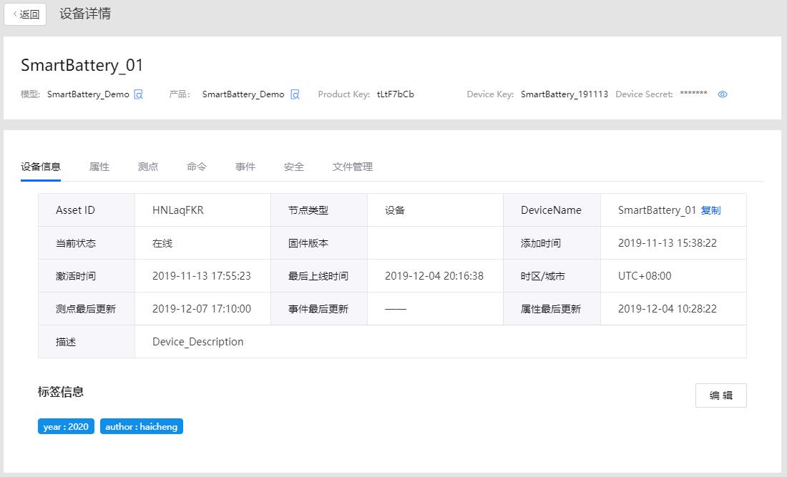
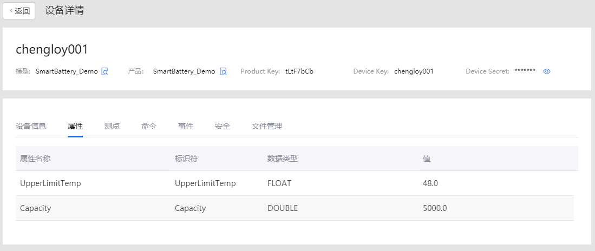

# Lab 1: Connecting the Smart Battery into EnOS

Before connecting devices to EnOS IoT hub, you need to register the devices on the EnOS Console, which includes defining the device model, creating a product, registering the devices, and creating an asset tree for the devices.

This tutorial takes a smart battery device as an example, focusing on how to register a smart device that connects 
directly to the EnOS Cloud.

##Step 1: Defining a Model
A model is the abstraction of the features of an object that is connected to IoT hub. The device model defines the features of a device, including attributes, measuring points, services, and events. 

This step assumes that there is a smart battery demo model to be reused on EnOS. 


##Step 2: Creating a Product
A smart battery product is a collection of devices with the same features. On the basis of the device model, a product 
further defines the communication specifications for the device.

In this step, create a product called Battery_Product. Assume that a device of this product model sends data in JSON format and that the data transmission is not encrypted using CA certificate.

In the EnOS Console, select Device Management > Product.

Click New Product, and provide the following settings in the New Product window:

Product Name: Battery_Product
Asset Type: Device
Model: battery
Data Type: JSON
Certificate-Based Authentication: Disabled
Description: Computer Battery
Click OK to save the configuration.


For details about the configuration of a product, see Creating a Device Collection (Product).
After the device modeling, device registration, and data storage policy configuration of the Smart Battery are 
completed on EnOS Console, you can now program with the EnOS Java SDK for MQTT to connect the Smart Battery into EnOS and start ingesting data.

For detailed information about the EnOS Java SDK for MQTT, refer to the readme file on [GitHub](https://github.com/EnvisionIot/enos-mqtt-sdk-java).

##Step 3: Setting up Development Environment
EnOS Java SDK for MQTT requires Java SE 8 and Maven 3. Take the following steps to set up your development environment:

1. Install JDK, which can be downloaded at https://www.oracle
.com/technetwork/java/javase/downloads/jdk8-downloads-2133151.html.

2. Install Maven, which can be downloaded at http://maven.apache.org/download.cgi.

3. Install a development environment, such as IntelliJ IDEA, which can be downloaded at https://www.jetbrains
.com/idea/download/.

4. In the main pom.xml file of your development project, add the EnOS Java SDK for MQTT as a dependency as follows:

    ```
    <dependency>
        <groupId>com.envisioniot</groupId>
        <artifactId>enos-mqtt</artifactId>
        <version>2.1.2</version>
    </dependency>
    ```
##Step 4. Programming for Device Connection
After the development environment is set up, take the following steps to connect the Smart Battery into EnOS Cloud:

1. Declare the variables that will be used in the program, see the following example:

    ```java
    private final static String PLAIN_SERVER_URL = "tcp://mqtt-ppe1.envisioniot.com:21883";
    private final static String PRODUCT_KEY = "tLtF7bCb";
    private final static String DEVICE_KEY = "chengloy001";
    private final static String DEVICE_SECRET = "TszHLOIBSYcrHCxNXfUU";

    ```
    - The host and port of the server vary with the cloud region and instance. For private cloud instances, contact your 
Envision project manager or support representative to get the host and port information.
    - The productKey, deviceKey, and deviceSecret are the device properties generated when you register the Smart Battery 
in Unit 1.
2. Declare the main function connect() for initializing device connection. See the following example:
    ```java
    public static void main(String[] args) {
        LoginInput input = new NormalDeviceLoginInput(PLAIN_SERVER_URL, PRODUCT_KEY, DEVICE_KEY, DEVICE_SECRET);
        final MqttClient client = new MqttClient(new DefaultProfile(input));

        client.connect();
    }
    ```
3. Use the connect function to connect the Smart Battery into EnOS Cloud. See the following code snippet:

    ```java
    public static void main(String[] args) {
        LoginInput input = new NormalDeviceLoginInput(PLAIN_SERVER_URL, PRODUCT_KEY, DEVICE_KEY, DEVICE_SECRET);
        final MqttClient client = new MqttClient(new DefaultProfile(input));

        client.connect(new IConnectCallback() {
            
            // On connect 
            public void onConnectSuccess() {
                LOG.info("onConnectSuccess");

                // Set service handler to handle service command from cloud
                client.setArrivedMsgHandler(ServiceInvocationCommand.class, createServiceCommandHandler(client));
                
                // Set atrributes handler to handle atrributes set command from cloud
                client.setArrivedMsgHandler(MeasurepointSetCommand.class, createMeasurePointSetHandler(client));
                
                try {
                    // Just a simulator to polling the measurepoints of devices
                    monitor(client);
                } catch (Exception e) {
                    e.printStackTrace();
                }
                LOG.info("waiting commands from cloud");
            }

            // On connection lost
            public void onConnectLost() {
                LOG.info("onConnectLost");
                client.close();
            }

            // On connect falied
            public void onConnectFailed(int reason) {
                LOG.info("onConnectFailed");
                client.close();
            }
        });
    }
    ```
##Step 5. Programming for Ingesting Data and Uploading Data into EnOS Cloud
After the Smart Battery is connected into EnOS, take the following steps to simulate the voltage, temperature and 
currents of the Smart Battery and upload the data into EnOS Cloud:

1. Use the simulateMeasurePoints() function to simulate the voltage, temperature and current of the Smart Battery. all 
the thresholds have been defined at the beginning as below:
    ```java
    private static final double VOL_MAX = 26;
    private static final double VOL_MIN = 22;
    private static final double CUR_MAX = 11;
    private static final double CUR_MIN = 9;
    private static final double TEMP_MIN = 0;
    private static final double TEMP_MAX = 80;
    private static final double CUR_D_MAX = -9;
    private static final double CUR_D_MIN = -11;
    private static final int CUR_PERIOD = 60*60;
    private static final int TEMP_PERIOD = 20*60;
    ```
2. See the following code snippet:

    ```java
    // Simulate the measure points of devices
    public static Map<String, Object> simulateMeasurePoints() {
        Map<String, Object> data=new HashMap<String, Object>();
        Random random = new Random();
        data.put("temp", temp_count*(TEMP_MAX/TEMP_PERIOD));
        data.put("voltage", random.nextDouble()*(VOL_MAX - VOL_MIN) + VOL_MIN);
        data.put("current", random.nextDouble()*(CUR_MAX - CUR_MIN) + CUR_MIN);
        data.put("current_d", random.nextDouble()*(CUR_D_MAX - CUR_D_MIN) + CUR_MIN);

        return data;
    }
    ```
3. Use the monitor() function to upload the measure points of smart battery to EnOS Cloud. See the following code 
snippet, and it's implemented by multi thread which is in charge of polling voltage, temperature and current respectively:

```java
    // Monitoring the voltage, temperature and current of device
    public static void monitor(final MqttClient client) throws Exception {
        System.out.println("Polling measure points start ...");
        Thread t1 = new Thread() {
            public void run() {
                while (true) {
                    pollingVoltage(client);
                    try {
                        Thread.sleep(interval * 1000);
                    } catch (InterruptedException e) {
                        System.out.println("Polling voltage thread end.");
                    }

                }
            }
        };
        t1.start();

        Thread t2 = new Thread() {
            public void run() {
                while (true) {
                    pollingTemp(client);
                    try {
                        Thread.sleep(interval * 1000);
                    } catch (InterruptedException e) {
                        System.out.println("Polling temperature thread end.");
                    }

                }
            }
        };
        t2.start();

        Thread t3 = new Thread() {
            public void run() {
                while (true) {
                    pollingCurrent(client);
                    try {
                        Thread.sleep(interval * 1000);
                    } catch (InterruptedException e) {
                        System.out.println("Polling current thread end.");
                    }

                }
            }
        };
        t3.start();
    }

```
##Step 6. Running the Program and Checking the Results
1. Compile and run the program for device connection and data ingestion. See the follow example of the program code:

    ```java
    package com.envision.energy.enos_mqtt_sample;

    import com.envisioniot.enos.iot_mqtt_sdk.core.IConnectCallback;
    import com.envisioniot.enos.iot_mqtt_sdk.core.MqttClient;
    import com.envisioniot.enos.iot_mqtt_sdk.core.login.LoginInput;
    import com.envisioniot.enos.iot_mqtt_sdk.core.login.NormalDeviceLoginInput;
    import com.envisioniot.enos.iot_mqtt_sdk.core.msg.IMessageHandler;
    import com.envisioniot.enos.iot_mqtt_sdk.core.profile.DefaultProfile;
    import com.envisioniot.enos.iot_mqtt_sdk.message.downstream.tsl.*;
    import com.envisioniot.enos.iot_mqtt_sdk.message.upstream.tsl.*;
    import org.slf4j.Logger;
    import org.slf4j.LoggerFactory;
    import java.util.Random;
    
    import java.util.*;
    
    public class SmartBatterySample {
        private final static Logger LOG = LoggerFactory.getLogger(SmartBatterySample.class);

    private final static String PLAIN_SERVER_URL = "tcp://mqtt-ppe1.envisioniot.com:21883";

    private final static String PRODUCT_KEY = "tLtF7bCb";
    private final static String DEVICE_KEY = "chengloy001";
    private final static String DEVICE_SECRET = "TszHLOIBSYcrHCxNXfUU";
    private static int interval = 5; //5秒
    private static final double VOL_MAX = 26;
    private static final double VOL_MIN = 22;
    private static final double CUR_MAX = 11;
    private static final double CUR_MIN = 9;
    private static final double TEMP_MIN = 0;
    private static final double TEMP_MAX = 80;
    private static final double CUR_D_MAX = -9;
    private static final double CUR_D_MIN = -11;
    private static final int CUR_PERIOD = 60*60;
    private static final int TEMP_PERIOD = 20*60;
    private static int cur_count = 0;
    private static double temp_count = 0;
    public static String change = "current";
    private static boolean flag = true;
    private static boolean temp_flag = true;

    public static void main(String[] args) {
        LoginInput input = new NormalDeviceLoginInput(PLAIN_SERVER_URL, PRODUCT_KEY, DEVICE_KEY, DEVICE_SECRET);
        final MqttClient client = new MqttClient(new DefaultProfile(input));

        client.connect(new IConnectCallback() {
            public void onConnectSuccess() {
                LOG.info("onConnectSuccess");

                // Set service handler to handle service command from cloud
                client.setArrivedMsgHandler(ServiceInvocationCommand.class, createServiceCommandHandler(client));
                client.setArrivedMsgHandler(MeasurepointSetCommand.class, createMeasurePointSetHandler(client));
                try {
                    monitor(client);
                } catch (Exception e) {
                    e.printStackTrace();
                }
                LOG.info("waiting commands from cloud");
            }

            public void onConnectLost() {
                LOG.info("onConnectLost");
                client.close();
            }

            public void onConnectFailed(int reason) {
                LOG.info("onConnectFailed");
                client.close();
            }
        });
    }

    private static IMessageHandler<MeasurepointSetCommand, MeasurepointSetReply> createMeasurePointSetHandler(final MqttClient client) {
        return (MeasurepointSetCommand arrivedMessage, List<String> argList) -> {
            byte[] bytes = arrivedMessage.encode();
            LOG.info("arrivedMessage: {}", new String(bytes));
            LOG.info("len: {}", bytes.length);
            LOG.info("argList: {}", argList);

            // argList: productKey, deviceKey, serviceName
            // If the request is for sub-device, the productKey and deviceKey
            // are used to identify the target sub-device.
            String productKey = argList.get(0);
            String deviceKey = argList.get(1);
            //String serviceName = argList.get(2);
            LOG.info("productKey: {}, deviceKey: {}",
                    productKey, deviceKey);

            return MeasurepointSetReply.builder().build();
        };
    }

    private static IMessageHandler<ServiceInvocationCommand, ServiceInvocationReply> createServiceCommandHandler(final MqttClient client) {
        return (ServiceInvocationCommand request, List<String> argList) -> {
            LOG.info("receive command: {}", request);

            // argList: productKey, deviceKey, serviceName
            // If the request is for sub-device, the productKey and deviceKey
            // are used to identify the target sub-device.
            String productKey = argList.get(0);
            String deviceKey = argList.get(1);
            String serviceName = argList.get(2);
            LOG.info("productKey: {}, deviceKey: {}, serviceName: {}, params: {}",
                    productKey, deviceKey, serviceName, request.getParams());

            LOG.info("<<<<< [service command] rcvn async serevice invocation command: " + request + " topic: " + argList);

            if (serviceName.equals("high_frequency_report_service")) {
                Map<String, Object> params = request.getParams();
                int n = (Integer) params.get("interval");
                LOG.info("arg interval: {}", n);
                interval = n;

                // Set the reply result
                return ServiceInvocationReply.builder().build();
            } else if (serviceName.equals("disconnect")) {
                Map<String, Object> params = request.getParams();
                int delayMS = (Integer) params.get("delayMS");
                LOG.info("arg delay: {}", delayMS);

                final Timer timer = new Timer();
                timer.schedule(new TimerTask() {
                    @Override
                    public void run() {
                        LOG.info("now close connection ...");
                        client.close();
                        timer.cancel();
                    }
                }, delayMS);
                return ServiceInvocationReply.builder().build();
            }

            return ServiceInvocationReply.builder().setMessage("unknown service: " + serviceName).setCode(220).build();
        };
    }

    // Simulate the measure points of devices
    public static Map<String, Object> simulateMeasurePoints() {
        Map<String, Object> data=new HashMap<String, Object>();
        Random random = new Random();
        data.put("temp", temp_count*(TEMP_MAX/TEMP_PERIOD));
        data.put("voltage", random.nextDouble()*(VOL_MAX - VOL_MIN) + VOL_MIN);
        data.put("current", random.nextDouble()*(CUR_MAX - CUR_MIN) + CUR_MIN);
        data.put("current_d", random.nextDouble()*(CUR_D_MAX - CUR_D_MIN) + CUR_D_MIN);

        return data;
    }

    // Polling measure point of voltage
    private static void pollingVoltage(final MqttClient client) {
        Map<String, Object> measurePoints = simulateMeasurePoints();
        try {
            MeasurepointPostRequest request = MeasurepointPostRequest.builder()
                    .setQos(0)
                    //.addMeasurePoint("temp", measurePoints.get("temp"))
                    //.addMeasurePoint("current", measurePoints.get("current"))
                    .addMeasurePoint("voltage", measurePoints.get("voltage"))
                    .build();

            MeasurepointPostResponse response = client.publish(request);
            if (response.isSuccess()) {
                LOG.info("measure points(voltage) are published successfully");
            } else {
                LOG.error("failed to publish measure points, error: {}", response.getMessage());
            }
        } catch (Exception e) {
            LOG.error("failed to publish measure point(voltage)", e);
        }
    }

    // Polling measure point of current
    private static void pollingCurrent(final MqttClient client) {
        Map<String, Object> measurePoints = simulateMeasurePoints();
        try {
            cur_count += interval;
            if(cur_count >= CUR_PERIOD) {
                flag = !flag;
                cur_count = 0;
                if (flag) change = "current";
                else change = "current_d";
            }

            MeasurepointPostRequest request = MeasurepointPostRequest.builder()
                    .setQos(0)
                    .addMeasurePoint("current", measurePoints.get(change))
                    .build();

            MeasurepointPostResponse response = client.publish(request);
            if (response.isSuccess()) {
                LOG.info("measure points(current) are published successfully");
            } else {
                LOG.error("failed to publish measure points, error: {}", response.getMessage());
            }
        } catch (Exception e) {
            LOG.error("failed to publish measure point(voltage)", e);
        }
    }

    // Polling measure point of temperature
    private static void pollingTemp(final MqttClient client) {
        Map<String, Object> measurePoints = simulateMeasurePoints();
        try {
            if (temp_flag) {
                if (temp_count >= 0 && temp_count < TEMP_PERIOD) {
                    temp_count += interval;
                } else if (temp_count >= TEMP_PERIOD) {
                    temp_flag = !temp_flag;
                    temp_count = TEMP_PERIOD - interval;
                }
            } else {
                if(temp_count > 0) {
                    temp_count -= interval;
                } else if (temp_count <= 0) {
                    temp_flag = !temp_flag;
                    temp_count = interval;
                }
            }

            MeasurepointPostRequest request = MeasurepointPostRequest.builder()
                    .setQos(0)
                    .addMeasurePoint("temp", measurePoints.get("temp"))
                    .build();

            MeasurepointPostResponse response = client.publish(request);
            if (response.isSuccess()) {
                LOG.info("measure points(Temp) are published successfully");
            } else {
                LOG.error("failed to publish measure points, error: {}", response.getMessage());
            }
        } catch (Exception e) {
            LOG.error("failed to publish measure points", e);
        }
    }

    // Monitoring the voltage, temperature and current of device
    public static void monitor(final MqttClient client) throws Exception {
        System.out.println("Polling measure points start ...");
        Thread t1 = new Thread() {
            public void run() {
                while (true) {
                    pollingVoltage(client);
                    try {
                        Thread.sleep(interval * 1000);
                    } catch (InterruptedException e) {
                        System.out.println("Polling thread end.");
                    }

                }
            }
        };
        t1.start();

        Thread t2 = new Thread() {
            public void run() {
                while (true) {
                    pollingTemp(client);
                    try {
                        Thread.sleep(interval * 1000);
                    } catch (InterruptedException e) {
                        System.out.println("Polling thread end.");
                    }

                }
            }
        };
        t2.start();

        Thread t3 = new Thread() {
            public void run() {
                while (true) {
                    pollingCurrent(client);
                    try {
                        Thread.sleep(interval * 1000);
                    } catch (InterruptedException e) {
                        System.out.println("Polling thread end.");
                    }

                }
            }
        };
        t3.start();
    }

    }


    ```
2. Check the running result of the program. The program will return the following sample result if the device 
    ```
    onConnectSuccess
    waiting commands from cloud
    ```
    ```java
    "C:\Program Files\Java\jdk1.8.0_191\bin\java.exe" 
    
    2019-12-08 13:00:40 DEBUG DefaultProcessor:245 - connect complete , reconnect false , serverUri tcp://mqtt-ppe1.envisioniot.com:21883 
    2019-12-08 13:00:40 INFO  SmartBatterySample:46 - onConnectSuccess
    Polling measure points start ...
    2019-12-08 13:00:40 INFO  SmartBatterySample:57 - waiting commands from cloud
    ```

3. Check the ruuning results of program when it polling measure points to cloud:
    ```$xslt
    2019-12-08 13:00:40 INFO  SmartBatterySample:209 - measure points(current) are published successfully
    2019-12-08 13:00:40 INFO  SmartBatterySample:236 - measure points(Temp) are published successfully
    2019-12-08 13:00:45 DEBUG DefaultProcessor:238 - delivery complete
    2019-12-08 13:00:45 DEBUG DefaultProcessor:238 - delivery complete
    2019-12-08 13:00:45 DEBUG DefaultProcessor:238 - delivery complete
    2019-12-08 13:00:46 DEBUG DefaultProcessor:75 - /sys/tLtF7bCb/chengloy001/thing/measurepoint/post_reply , {"code":200,"data":"","id":"4"}
    2019-12-08 13:00:46 INFO  SmartBatterySample:181 - measure points(voltage) are published successfully
    2019-12-08 13:00:46 DEBUG DefaultProcessor:75 - /sys/tLtF7bCb/chengloy001/thing/measurepoint/post_reply , {"code":200,"data":"","id":"5"}
    2019-12-08 13:00:46 DEBUG DefaultProcessor:75 - /sys/tLtF7bCb/chengloy001/thing/measurepoint/post_reply , {"code":200,"data":"","id":"6"}
    ```
4. Check the status change of the Smart Battery device in the Device List on the EnOS Console. The status of the 
device will change from Inactive to Online.

    

5. Check the attributes of the Smart Battery device that have been updated under the Attributes tab on the Device 
    Details page.

    

6. Check the data of the cpu_used and mem_used measuring points that are posted to the Cloud under the Measuring 
Points tab on the Device Details page.

    

## Next Lab

[Monitoring Smart Battery Alerts](302-3 monitoring_alerts_of_device.md)

