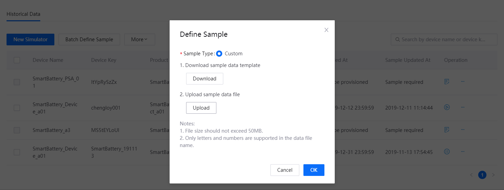
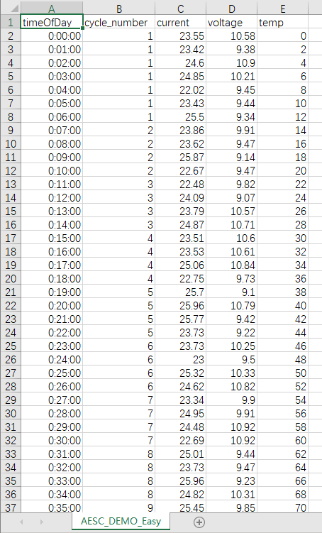
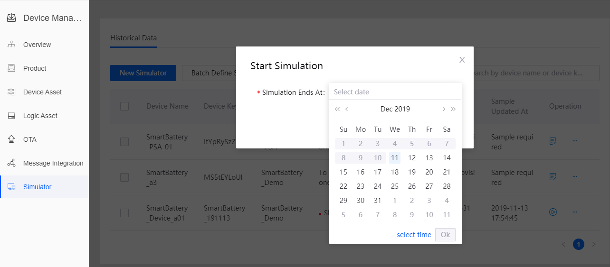
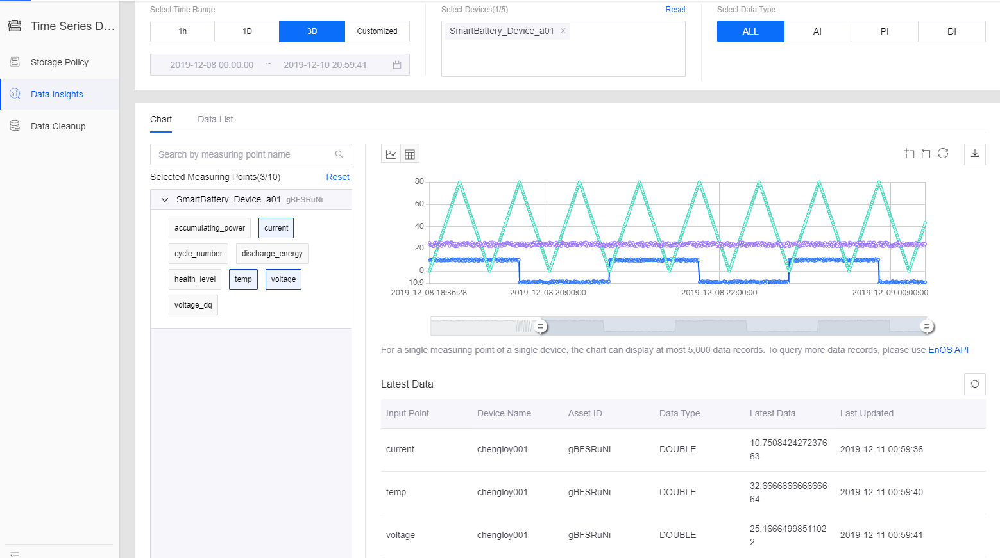

# Lab 2. Simulating Measuring Points

##  Using device simulator
you can simulate a device that connects to and sends data to EnOS without using the EnOS Java SDK for getting started or troubleshooting. For connecting device by using EnOS Java SDK.

- Getting started with EnOS: Users can leverage this function to simulate a device to receive data to understand how 
to use the capabilities of EnOS.
- Testing and debugging: In application development, sometimes you need to simulate a device to send a specific value 
to verify device function. Real devices rarely sends that specific value. In this case you can use the device simulator to facilitate application development.

In this tutorial, we simulate a smart battery that sends data to EnOS. We insert some abnormal data into the 
data sample to trigger an alert. Meanwhile, we configure a storage policy to store the data sample in the TSDB and view the data in line chart in Time Series Data > Data Insights .

## Before You Start
- You have registered the device to be simulated. For information about how to create a device, see Registering Devices.
- You have access to device management. If not, contact your OU administrator to grant you such permissions. See 
Policies, Roles and Permissions.
    - Model
    - Device Management
    - Alert
    - Times Series Data

## Step 1: Add a Device Simulator

In Device Management > Simulator , create a simulator for Simulated smart battery Device . For information on how to create a simulator, see Using Device Simulator.
Select Device Management > Simulator.

1. Click Add Simulator, and select the device to be simulated in this page.

2. The device list shows all the devices that have been created in the current OU. For simulation purpose, users can 
only select an inactive device. It is impossible to simulate any online or offline device.

3. Click Confirm to create a simulator for the selected device.

In the list of simulators, you can see the simulator just created. 

Next, you need to define the simulation data sample for it.

## Step 2. Define and upload the simulation data sample. 

1. Find out the simulator just created in the list of simulators, click edit in the operation column.

2. Click Download in the pop-up window.

3. Input the simulation data sample in the downloaded template.
    
    The first column timeOfDay refers to the relative time stamp: you can enter the relative time stamp within one day (24 hours) in the format of H:MM:SS.
    
    The header from the second column are for the names of model points. You just need enter the name of the model point to be simulated in the header rather than that of all the model points. The content under the header are point values. If the data type is array, the format is [value1, value2, value3, …]. Leave the cell empty if there is no value at the current time point.

4. In the pop-up window, click Upload to upload the simulation data.

5. Click Confirm.

For sample data template using to upload, see [ 
AESC_DEMO_Easy.csv](media/AESC_DEMO_Easy.csv).

In this sample, there are two columns of data. Column timeOfDay indicates the relative time in a day from 0:00:00 to 23:59:00 in minute. Column current , the identifier for Real-time Current, indicates the measurement point value reported by the device.

When we created the alert rule, we set the alert threshold to 60 milliampere. So in this sample, we need to modify value in column current so that at least one piece of value is above 60 to trigger the alert Current is above threshold .

The best practice is setting some values above 60 at earlier moments so that you don’t have to wait long to see an alert triggered. In this tutorial, the time zone where the author is is UTC+08:00. The time is 10:00 when the author is writing this tutorial. We set abnormal values at 0:02:00, 0:07:00, and 0:10:00, therefore alerts will be triggered at 10:02:00, 10:07:00, and 10:10:00 of the author’s local time.

## Step 3: Start the Device Simulator
You can start simulators one by one or in batch. setting the end time at 24 hours later.

You can actually set the end time whenever you’d like to, but setting it much later leaves enough time for TSDB to absorb enough data to generate a report.

## Step 4: Configure TSDB Storage Policy
In Time Series Data > Storage Policy , configure storage policy for the simulated smart battery.

1. Select an existing group or create a new group. Click Edit Group . Select test.smart battery and click OK to include the 
smart battery model into the policy group.

2. Select edit besides AI Raw Data . Select test.smart battery to include all its measurement points into this policy.

As we defined Real-time Current as AI data when creating a model and this tutorial doesn’t require normalized data, so we put Real-time Current into AI Raw Data .

## Step 5: Check out the Data Insights
Wait until enough time later and go to Time Series Data > Data Insights . Select device Simulated smart battery Device . View the Real-time Current data report in minute.

## Step 6: Alert Record
In Alert > Alert Record, select model Simulated smart battery Model and view the historical alerts. You can see that several alerts have been triggered by the anormal data.

The alert of this tutorial you should define please see [monitoring_alert_of_device](302-3%20monitoring_alerts_of_device.md)

## Next Lab

[Monitoring Alerts of Smart Battery](302-3_monitoring_alerts_of_device.md)
