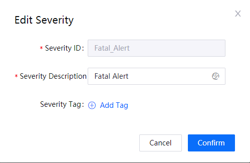
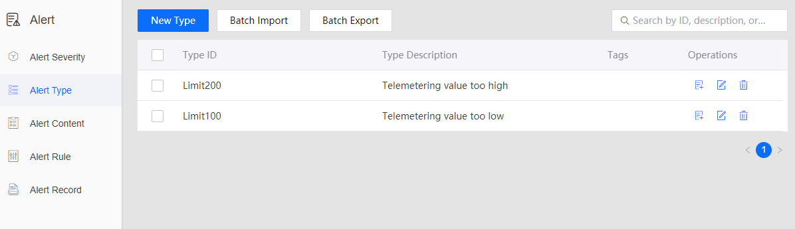
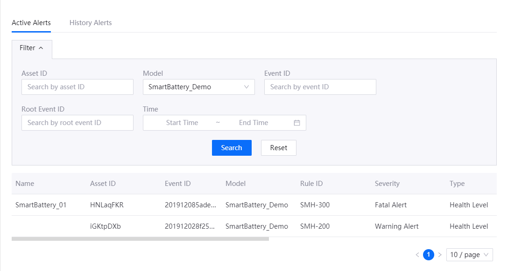

# Lab 3. Monitoring Alerts of Smart Battery
An alert is a record generated by the system when the value of a measuring point in a certain domain reaches a specific condition.

The condition that triggers the alert is the alert rule. What’s generated by the system is the alert content. As measuring points or alerts may vary, to distinguish and manage the alerts more effectively, alerts on EnOS are typically classified based on the severity (such as danger, critical, error, warning, and information) and type (such as over-limit).

The alert management message flow and the key concepts are illustrated in the following figure:

To monitor the health and performance of your smart battery, you can use the alert severities, alert types which we have defined, so that you'll just need to define a new alert content, and alert rules against any anomaly of the device. The alert rules are as follows:

- Fatal alert: Temp<5 °C or Temp > 70°C
- Warning alert: 5 °C <Temp<10 °C, or 60 °C <Temp<70 °C

## Step 1: Defining alert configuration and triggering rules
 
 In this tutorial, we will enable a alerts to monitor the temperature of the smart battery. Detailed steps are as follows:

1. In the EnOS Console, locate the **Alert** service in the left navigation panel.

    

2.  Click **Alert > Alert type** in the left navigation panel, and check the defined "Telemetering value too high" and 
"Telemetering value too low" alert type.

    

3. In this tutorial, we will define 4 alert content as follows:
    
    
    Click **Alert Content > New Content** to define the alert content, which can contain the cause of the alert and actions 
    needed from the device owner. Then, associate the battery model and the defined alert type, for example: Temperature 
    lower than 5°C. Repeat the process to create other alert content.

    

4. Click **Alert Rule > New Rule** to define the alert rule for monitoring the battery temperature. 

    
    
5. When the alert rule is saved, it will start running to monitor the temperature of the battery device. You can view 
active alerts and history alerts that reported against the device on the Alert Record page.

    
    

 ## Step 2: Monitoring Alerts from EnOS Console

In **Alert > Alert Records**, select model **Simulated smart battery Model** and view the historical alerts. You can see that several alerts have been triggered by the anormal data.

For how to define data sample to trigger alerts, see [302-3_monitoring_alert_of_device](302-3_monitoring_alerts_of_device.md)

   
## Step 3: Obtaining alert data to be used in application

You can also use the event service APIs to query alert records. For example, using the Search Active Alerts API to 
query active alerts by organization ID and other filtering conditions. For more information about EnOS API, go to EnOS Console > EnOS API.

We'll walk you throught the usage of EnOS API in the application development workshop.
