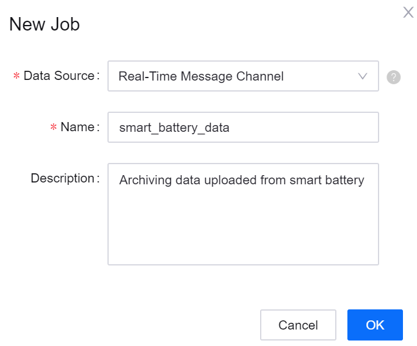

# Lab 5: Archiving Uploaded Data of the Battery

EnOS Data Asset Management service supports archiving data of huge size and with lower access frequency to the target database, thus achieving data backup.

In this lab, configure a data archiving job to store all the uploaded data of the battery for further processing and analysis in the upcoming labs.

## Creating a data archiving job

Take the following steps to create a data archiving job:

1. Log in the EnOS Console, and select **Data Archiving** under the **Common Resource** section.

2. Click **New Job** and provide the following information on the pop-up window:

   - **Data Source**: Select **Real-Time Message Channel** from the drop-down list for archiving real-time data uploaded from the battery.
   - **Name**: Enter a name for the data archiving job.
   - **Description**: Enter short description of the data archiving job.

   

3. Click **OK** to create the data archiving job and open the detailed configuration page.

## Configuring the data archiving job

Follow the instructions in the sections below to complete the configuration of the data archiving job.

### Storage Configuration

Complete the data storage configuration, including configuration of the storage resource, properties of the archived file, etc.

1. **Resource Type**: Select **HDFS** as the target storage system for storing the archived files.

2. **Storage Resource**: Select the corresponding HDFS storage resource that has been requested through Resource Management for the organization.

3. **Storage Path**: Specify the path where the archived files are located in the storage system and select the time partition format for the storage path root directory. The path must start and end with "/". For detailed information about time partition format, see [Storage Path Partition Parameters](https://support.envisioniot.com/docs/data-asset/en/latest/reference/archive_storage#storage-path-partition-parameters).

4. Specify generating the storage path by event time.

5. **File Name**: Enter a name for the archived file. Once a data archiving file is generated, the system will append a time stamp suffix after the file name.

6. Use the default values for the remaining fields. See the following example:

   

### Archive Configuration

Currently, data archiving by every 1 hour is supported. If the archived data falls in the same archiving cycle, the data will be saved in 1 file and sliced by the specified file size.

### Data Configuration

In the **Model** field, search and select the **SmartBattry_Demo** model, so that the uploaded data of all assets belonging to the model will be archived.

## Starting the data archiving Job

After completing the above configuration, click **OK** to submit the data archiving job. The job configuration will take effect immediately once it is submitted, and the system starts reading and archiving data from the specified message channel.

## Next Lab

[Generating Data Quality Report](303-6_generating_data_quality_report.md)