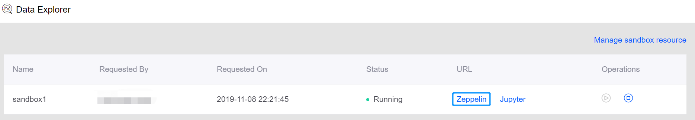
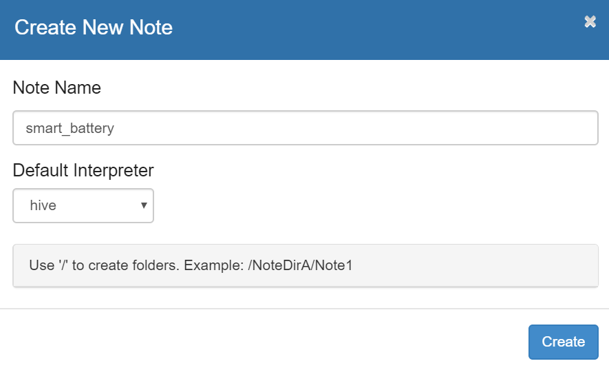
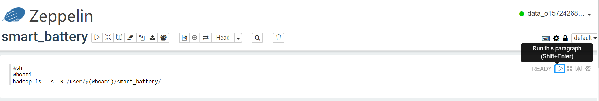
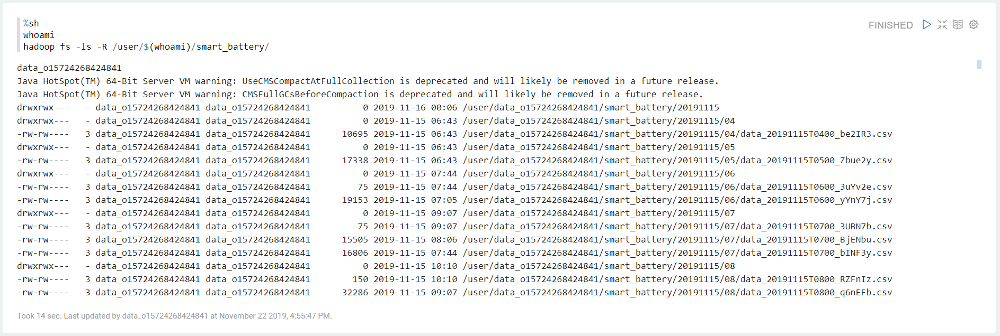
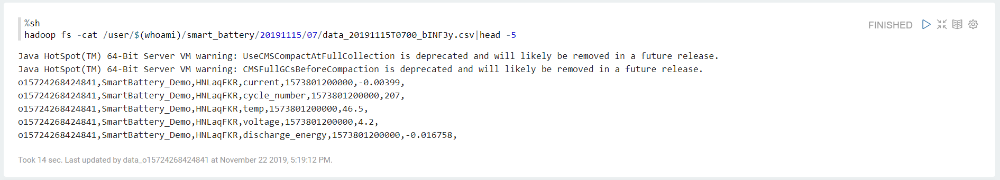
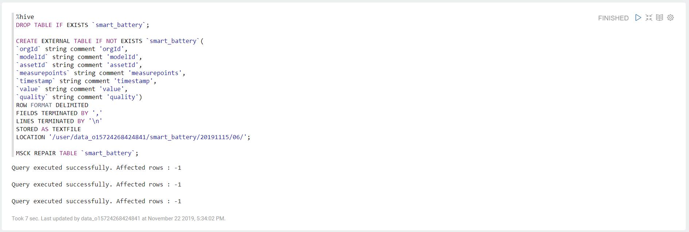
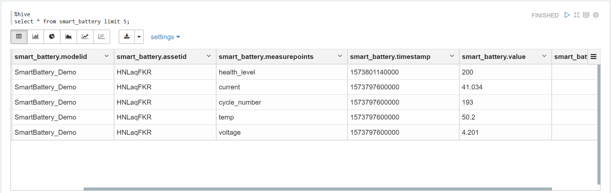

# Lab 1: Extracting Data from HDFS to Hive

EnOS Data Explorer provides a browser-based interactive data exploration and analytics environment by integrating with the mainstream data exploring tools Zeppelin Notebook and Jupyter Notebook.

In this lab, we will use the Zeppelin Notebook to extract the archived data of the battery from HDFS to Hive with shell and hive scripts.

## Creating a Zeppelin note

Take the following steps to create a Zeppelin note:

1. Log in EnOS Console and select **Data Explorer** from the left navigation panel.

2. Find a sandbox with *Running* status, or click the **Start** icon in the Operations column to start a sandbox. 

3. Click **Zeppelin** from the **URL** column to open the Zeppelin notebook.

   

4. Click the **Create new note** button, enter a name for the note (or a name with path), select **hive** as the default interpreter, and click **Create**. The Zeppelin note will be opened directly.

   


## Viewing archived files in HDFS

Take the following steps to view the archived data of the battery in HDFS:

1. In the Zeppelin note, type the following scripts for viewing all the archived files in the specified path:

   ```
   %sh
   whoami
   hadoop fs -ls -R /user/$(whoami)/smart_battery/
   ```

   **Note**: In the above example, the path `smart_battery` is specified in the data archiving job that is created in the [Archiving Uploaded Data of the Battery](../../../D3_Data_Management/Labs/stream_data_processing_tutorial/archiving_data.md) lab. You may need to replace it with the path you specified.

2. Click the **Run this paragraph** icon to run the scripts. See the following example:

   

3. View the running results of the scripts. See the following example:

   

4. In the note, type the following script for viewing the content of a specific file:

   ```
   %sh
   hadoop fs -cat /user/$(whoami)/smart_battery/20191115/07/data_20191115T0700_bINF3y.csv|head -5
   ```

5. Run the scripts and view the running results. See the following example:

   


## Creating a Hive table

Take the following steps to create a Hive table with columns defined to receive the archived battery data:

1. In the Zeppelin note, type the following scripts:

   ```
   %hive
   DROP TABLE IF EXISTS `smart_battery`;
   
   CREATE EXTERNAL TABLE IF NOT EXISTS `smart_battery`(
   `orgId` string comment 'orgId',
   `modelId` string comment 'modelId',
   `assetId` string comment 'assetId',
   `measurepoints` string comment 'measurepoints',
   `timestamp` string comment 'timestamp',
   `value` string comment 'value',
   `quality` string comment 'quality')
   ROW FORMAT DELIMITED
   FIELDS TERMINATED BY ','
   LINES TERMINATED BY '\n'
   STORED AS TEXTFILE
   LOCATION '/user/data_o15724268424841/smart_battery/20191115/06/';
   
   MSCK REPAIR TABLE `smart_battery`;
   ```

2. Run the scripts and view the running results. See the following example:

   

3. In the note, type the following scripts for viewing data in the created Hive table:

   ```
   %hive
   select * from smart_battery limit 5;
   ```

4. Run the scripts and view the running results. See the following example:

   


## Next Lab

[Converting Time Series Data to Relational Data Table](converting_data.md)