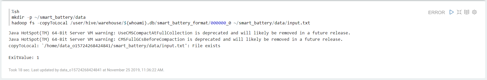
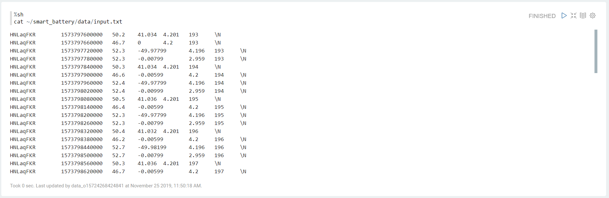
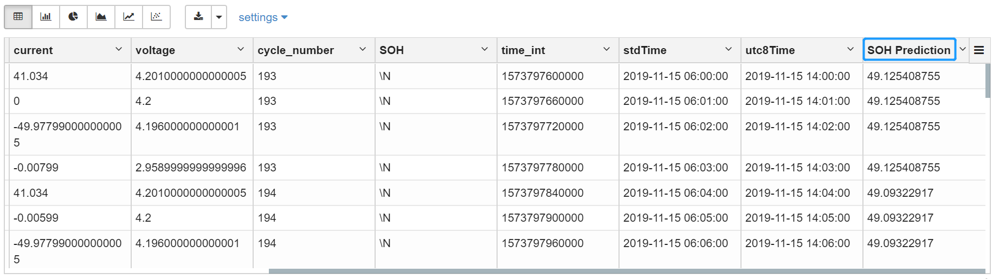
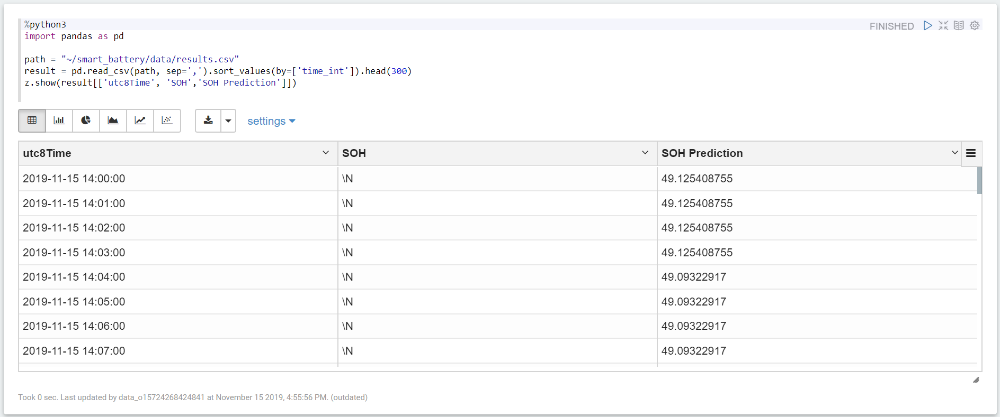
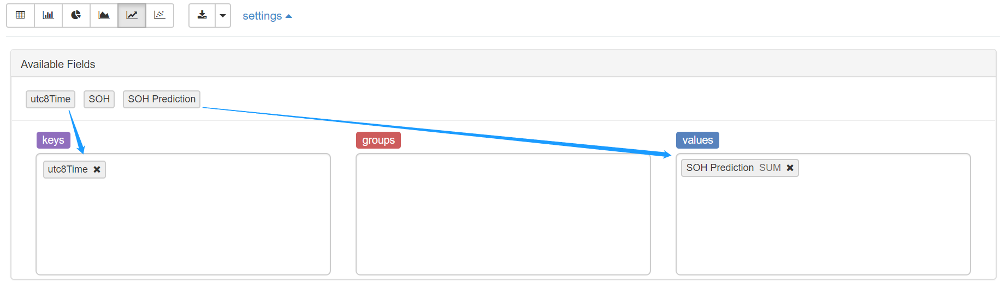
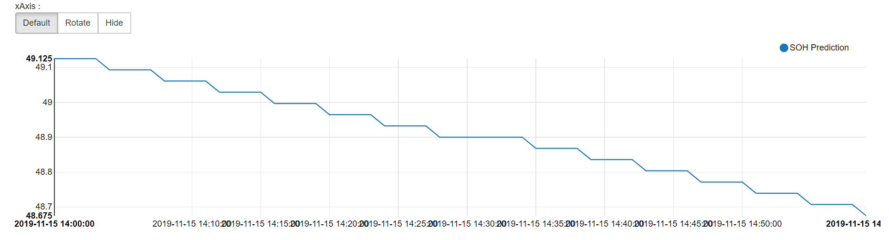

# Lab 3: Predicting Battery Service Life

Based on the accumulated domain knowledge, EnOS provides a machine learning algorithm for predicting the battery service life based on the `cycle_number` data.

In this lab, we will develop a Python script using the machine learning algorithm to calculate the battery service life data and view the results in a curve chart with EnOS Data Explorer.

## Copying battery data files

In [Lab 2](converting_data.md), we have stored the battery data as a text file in HDFS. Before analyzing the battery data, copy the battery data file to the local directory of the data explorer user.

1. Open the Zeppelin note and type the following scripts:

   ```
   %sh

   # Creating a path for storing battery data files
   mkdir -p ~/smart_battery/data

   # Copying battery data files from HDFS to the created path
   hadoop fs -copyToLocal /user/hive/warehouse/$(whoami).db/smart_battery_format/000000_0 ~/smart_battery/data/input.txt
   ```

2. Run the scripts and view the running results. See the following example:

   

3. When the battery data file is copied to the created path, type the following scripts for viewing data in the copied file:

   ```
   %sh
   cat ~/smart_battery/data/input.txt
   ```

4. Run the scripts and view the running results. See the following example:

   


## Developing Python script

After the battery data file is copied to the local directory, we can develop Python script to predict the service life of the battery using the data in the file.

1. In the note, type the following Python scripts for calculating the battery service life prediction data (`SOH Prediction`):

   ```
   %python3
   #!/usr/bin/env python
   # coding: utf-8

   import pandas as pd
   from datetime import datetime, timedelta

   # ### Reading data from the battery data file
   column_name_list = ['asset_id', 'time', 'temp', 'current', 'voltage', 'cycle_number', 'SOH']
   path = '~/smart_battery/data/input.txt'
   rawD = pd.read_csv(path, sep='\t', names=column_name_list)
   rawD.head()

   rawD['time_int'] = pd.to_numeric(rawD["time"],errors='coerce')
   rawD['stdTime'] = pd.to_datetime(rawD['time_int']/1000, unit='s')
   rawD['utc8Time'] = rawD['time_int'].apply(lambda x: (datetime.utcfromtimestamp(float(x/1000)) + timedelta(hours=8)).strftime('%Y-%m-%d %H:%M:%S'))

   rawD.shape

   # ### Defining the SOH prediction algorithm (based on the cycle number of the battery)
   def aesc_SOH_pred(rawD_singleRow):
     try:
       x1 = int(rawD_singleRow['cycle_number'])
       y = 55.33606866-0.032179585*x1
       return y
     except:
       return

   rawD['SOH Prediction'] = 'NaN'
   for i in range(0, rawD.shape[0]):
       rawD_singleRow = rawD.iloc[i]
       y_pred = aesc_SOH_pred(rawD_singleRow)
       rawD.loc[i:i,'SOH Prediction'] = y_pred

   # ### Saving results to local directory
   rawD.to_csv('~/smart_battery/data/results.csv', header=True, index=False)
   z.show(rawD.head(50))
   ```

2. Run the scripts and view the running results. See the following example:

   


## Visualizing battery service life data

Take the following steps to view the calculated battery service life data in a curve chart:

1. In the note, type the following scripts for :

   ```
   %python3
   import pandas as pd

   path = "~/smart_battery/data/results.csv"
   result = pd.read_csv(path, sep=',').sort_values(by=['time_int']).head(300)
   z.show(result[['utc8Time', 'SOH','SOH Prediction']])
   ```
   
2. Run the scripts and view the running results. See the following example:

   

3. Select the **Line Chart** icon and click **settings**.

4. Drag **utc8Time** to the **keys** field, and drag **SOH Prediction** to the **values** field.

   

5. Viewing the battery service life prediction in the generated curve chart. See the following example:

   


