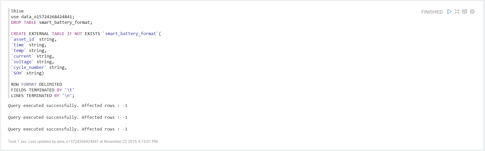
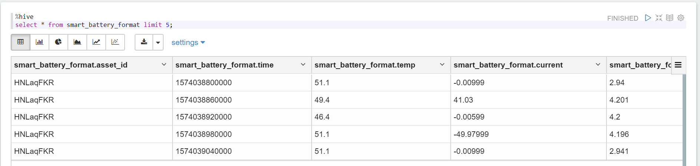
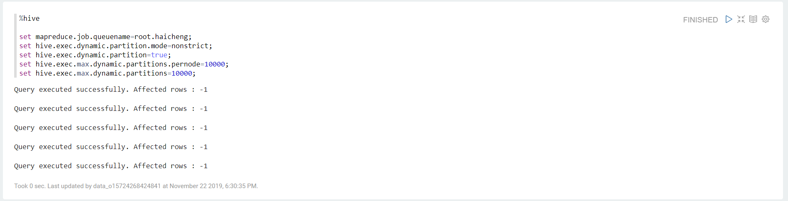
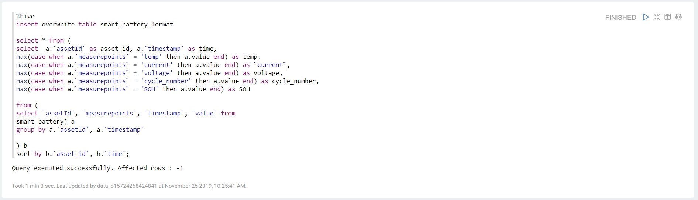
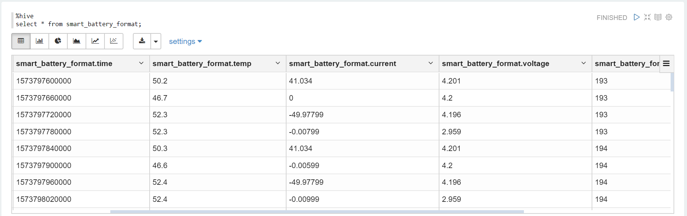
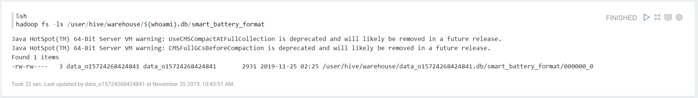

# Lab 2: Converting Time Series Data to Relational Data Table

The data of the battery archived to HDFS is time series data, which is featured by "1 row containing data of 1 measuring point". Before data analysis, we need to convert the time series data table into a relational data table, in which measuring point data is displayed in columns.

## Creating a relational data table

Take the following steps to create a relational data table for the extracted battery data:

1. In the Zeppelin note, type the following scripts:

   ```
   %hive
   use data_o15724268424841;
   DROP TABLE smart_battery_format;

   CREATE EXTERNAL TABLE IF NOT EXISTS `smart_battery_format`(
   `asset_id` string,
   `time` string,
   `temp` string,
   `current` string,
   `voltage` string,
   `cycle_number` string,
   `SOH` string)

   ROW FORMAT DELIMITED
   FIELDS TERMINATED BY '\t'
   LINES TERMINATED BY '\n';
   ```

   **Note**: In this example, `data_o15724268424841` is the user ID. You may need to replace it with the user ID of your organization.

2. Run the scripts and view the running results. See the following example:

   

3. In the note, type the following scripts for viewing the created relational data table:

   ```
   %hive
   select * from smart_battery_format limit 5;
   ```

4. Run the scripts and view the running results. See the following example:

   


## Optimizing Hive job parameters

Before performing the "column-to-row" operation, we will need to optimize Hive job parameters.

1. In the note, type the following scripts:

   ```
   %hive

   set mapreduce.job.queuename=root.haicheng;
   set hive.exec.dynamic.partition.mode=nonstrict;
   set hive.exec.dynamic.partition=true;
   set hive.exec.max.dynamic.partitions.pernode=10000;
   set hive.exec.max.dynamic.partitions=10000;
   ```

   **Note**: In this example, `root.haicheng` is the queue name of the data explorer instance. You may need to replace it with the queue name of your sandbox.

2. Run the scripts and view the running results. See the following example:

   


## Converting rows to columns

Take the following steps to perform the "column-to-row" operation on the created relational data table and insert the battery data into the table:

1. In the note, type the following scripts:

   ```
   %hive
   insert overwrite table smart_battery_format

   select * from (
   select  a.`assetId` as asset_id, a.`timestamp` as time,
   max(case when a.`measurepoints` = 'temp' then a.value end) as temp,
   max(case when a.`measurepoints` = 'current' then a.value end) as `current`,
   max(case when a.`measurepoints` = 'voltage' then a.value end) as voltage,
   max(case when a.`measurepoints` = 'cycle_number' then a.value end) as cycle_number,
   max(case when a.`measurepoints` = 'SOH' then a.value end) as SOH

   from (
   select `assetId`, `measurepoints`, `timestamp`, `value` from
   smart_battery) a
   group by a.`assetId`, a.`timestamp`

   ) b
   sort by b.`asset_id`, b.`time`;
   ```

2. Run the scripts and view the running results. It may take 3-5 minutes to complete the conversion. See the following example:

   

3. In the note, type the following scripts for viewing the converted battery data:

   ```
   %hive
   select * from smart_battery_format;
   ```

4. Run the scripts and view the running results. See the following example:

   

5. After conversion, the Hive table will be stored as a text file in HDFS. In the note, type the following scripts for viewing the stored file:

   ```
   %sh
   hadoop fs -ls /user/hive/warehouse/$(whoami).db/smart_battery_format
   ```

6. Run the scripts and view the running results. See the following example:

   

## Next Lab

[Predicting Battery Service Life](304-2 predicting_service_life.md)
