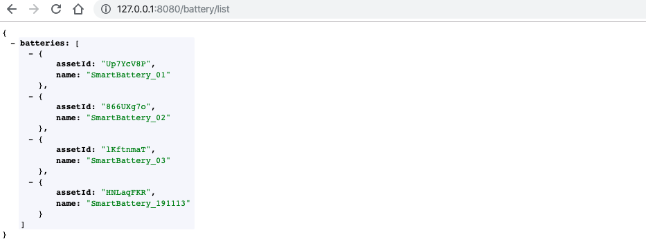

# Invoking EnOS APIs

In this unit, we can start to invoke EnOS APIs to get the asset information of batteries and the ingested history data of batteries stored in TSDB.

## Getting battery asset information

With the application properties configured and tested, we can now invoke EnOS APIs to get the battery asset information.

1. From the left navigation bar of the project space, open the `src/main/java/com.example.batteryweb` directory, and click **File > New > Package** from the menu to create 3 packages named `service`, `controller`, and `model` for storing functional classes.

   

2. Open the `service` package, create a class named `DataService`, and enter the following code for getting the list of assets of specified models and asset tree:

   ```
   package com.example.batteryweb.service;
   
   import com.envision.apim.poseidon.config.PConfig;
   import com.envision.apim.poseidon.core.Poseidon;
   import com.envision.apim.poseidon.exception.PoseidonException;
   import com.envision.apim.poseidon.request.IPoseidonRequest;
   import com.envisioniot.enos.asset_tree_service.v2_1.SearchRelatedAssetNodeRequest;
   import com.envisioniot.enos.asset_tree_service.v2_1.SearchRelatedAssetNodeResponse;
   import com.envisioniot.enos.asset_tree_service.vo.RelatedAssetSearchVo;
   import com.example.batteryweb.AppConfig;
   import lombok.extern.slf4j.Slf4j;
   import org.springframework.beans.factory.annotation.Autowired;
   import org.springframework.stereotype.Component;
   
   import java.util.ArrayList;
   import java.util.List;
   
   @Component
   @Slf4j
   public class DataService {
       @Autowired
       AppConfig config;
   
       public <T> T getResponse(IPoseidonRequest request, Class<T> cls) throws PoseidonException {
           return Poseidon.config(PConfig.init().appKey(config.accessKey).appSecret(config.accessSecret)).url(config.addr).getResponse(request, cls);
       }
   
       /**
        * Getting the list of assets of specified models and asset tree.
        * @return SearchRelatedAssetNodeResponse
        */
       public SearchRelatedAssetNodeResponse getAssetList() {
           SearchRelatedAssetNodeRequest request= new SearchRelatedAssetNodeRequest();
           request.setOrgId(config.orgId);
           request.setTreeId(config.assertTreeId);
   
           RelatedAssetSearchVo filter = new RelatedAssetSearchVo();
           List modelIds = new ArrayList<>();
           modelIds.add(config.modelId);
           filter.setModelIds(modelIds);
           request.setFilter(filter);
   
           return getResponse(request, SearchRelatedAssetNodeResponse.class);
       }
   }
   ```

3. Open the `controller` package, create a class named `DataController`, and enter the following code for displaying the queried list of assets as JSON data in browsers:

   ```
   package com.example.batteryweb.controller;
   
   import com.envisioniot.enos.asset_tree_service.v2_1.SearchRelatedAssetNodeResponse;
   import com.envisioniot.enos.asset_tree_service.vo.AssetVo;
   import com.example.batteryweb.service.DataService;
   import lombok.extern.slf4j.Slf4j;
   import org.springframework.beans.factory.annotation.Autowired;
   import org.springframework.web.bind.annotation.*;
   
   import java.util.*;
   
   @RestController
   @Slf4j
   public class DataController {
       @Autowired
       private DataService dataService;
   
       /**
        * Returning all the battery assets under the "Envision Smart Car Factory" asset tree.
        * @return
        */
       @RequestMapping("/battery/list")
       public Map<String, Object> list() {
   
           SearchRelatedAssetNodeResponse resp = dataService.getAssetList();
   
           List<Map<String, String>> batteries=new ArrayList();
           for (AssetVo asert: resp.getData()) {
               Map<String, String> item = new HashMap<>();
               item.put("assetId", asert.getAssetId());
               item.put("name", asert.getName().getDefaultValue());
               batteries.add(item);
           }
   
           // Ordering the display of batteries
           Collections.sort(batteries, new Comparator<Map<String,String>>() {
               @Override
               public int compare(Map<String, String> o1,
                                  Map<String, String> o2) {
                   return o1.get("name").compareTo(o2.get("name"));
               }
           });
   
           Map<String, Object> result = new HashMap<>();
           result.put("batteries", batteries);
           return result;
       }
   }
   ```


With the programming work completed, we can now test running the code.

1. Open the `src/main/java/com.example.batteryweb` directory, double click the `BatteryWebApplication` class to open it.

2. Click **Run 'BatteryWebApplication'** to start the application.

   

3. Open a browser and enter `http://127.0.0.1:8080/battery/list` in the address field. Check the queried list of battery assets in JSON format. See the following example:

   


## Getting more data of batteries

We can now invoke EnOS APIs to get more data of the smart batteries.

### Getting data of a specific battery

1. Open the `DataService` class and add the following code for getting the battery data with specific asset ID:

   ```
       public GetAssetResponse getAssetById(String id) {
           GetAssetRequest request= new GetAssetRequest();
           request.setAssetId(id);
           request.setOrgId(config.orgId);
   
           return getResponse(request, GetAssetResponse.class);
       }
   ```

2. Open the `DataController` class and add the following code for returning the queried battery asset data through HTTP:

   ```
       @RequestMapping("/battery/asset/{id}")
       public GetAssetResponse asset(@PathVariable("id") String id) {
           return dataService.getAssetById(id);
       }
   ```

3. Open a browser and enter `http://127.0.0.1:8080/battery/asset/{assetId}` in the address field. Check the queried battery asset data in JSON format.


### Getting the status of a specific battery

To get the status data of a battery, we need to create 2 classes named `Data` and `GetDataResponse` in the `model` package to receive data returned from EnOS Cloud for easier data parsing.

1. Open the `model` package, create a class named `Data`, and enter the following code:

   ```
   package com.example.batteryweb.model;
   
   import java.util.List;
   import java.util.Map;
   
   public class Data {
       private List<Map<String, Object>> items;
   
       public List<Map<String, Object>> getItems() {
           return items;
       }
   
       public void setItems(List<Map<String, Object>> items) {
           this.items = items;
       }
   }	
   ```

2. Open the `model` package, create a class named `GetDataResponse`, and enter the following code:

   ```
   package com.example.batteryweb.model;
   
   import com.envisioniot.enos.api.common.constant.response.EnosCommonRsp;
   
   public class GetDataResponse extends EnosCommonRsp<Data> {
       public GetDataResponse() {
       }
   }
   ```

3. Open the `DataService` class and add the following code for getting battery status data from EnOS Cloud:

   ```
       public GetDataResponse getData(String assertId, String measurepoints) {
           IPoseidonRequest request = new PoseidonRequest() {
               @Override
               public String baseUri() {
                   return "/tsdb-service/v2.0/latest";
               }
   
               @Override
               public String method() {
                   return "GET";
               }
   
               @Override
               public Map<String, Object> queryParams() {
                   Map<String, Object> params = new HashMap();
                   params.put("assetIds", config.assertId);
                   params.put("measurepoints", measurepoints);
                   params.put("orgId", config.orgId);
                   params.put("accessKey", config.accessKey);
                   return params;
               }
           };
   
           return getResponse(request, GetDataResponse.class);
       }
   ```

4. Open the `DataController` class and add the following code for returning the queried battery status data through HTTP:

   ```
   @RequestMapping("/battery/status/{id}")
   public Map<String, Object> status(@PathVariable("id") String id) {
       GetDataResponse data = dataService.getData(id, "health_level, remaining_power"); // discharge_energy
   
       // Simplifying returned data
       Map<String, Object> result = new HashMap<>();
       result.put("health_level", data.getData().getItems().get(0).get("health_level"));
       result.put("remaining_power", data.getData().getItems().get(0).get("remaining_power"));
   
       return result;
   }
   ```

5. Open a browser and enter `http://127.0.0.1:8080/battery/status/{assetId}` in the address field. Check the queried battery asset data in JSON format.


### Getting the history data of a specific battery

1. Open the `DataService` class and add the following code for getting battery history data from EnOS Cloud:

   ```
   public GetDataResponse getHistoryData(String assertId, String measurepoints) {
       IPoseidonRequest request = new PoseidonRequest() {
           @Override
           public String baseUri() {
               return "/tsdb-service/v2.0/ai";
           }
   
           @Override
           public String method() {
               return "GET";
           }
   
           @Override
           public Map<String, Object> queryParams() {
               Map<String, Object> params = new HashMap();
               params.put("assetIds", config.assertId);
               params.put("measurepoints", measurepoints);
   
               DateFormat fmt = new SimpleDateFormat("yyyy-MM-dd hh:mm:ss");
               fmt.setTimeZone(TimeZone.getTimeZone("UTC"));
               Date nowTime = new Date();
               Calendar calendar = Calendar.getInstance();
               calendar.setTime(nowTime);
               calendar.add(Calendar.DATE, -1);
               Date startTime=calendar.getTime();
   
               params.put("startTime", fmt.format(startTime));
               params.put("endTime", fmt.format(nowTime));
               params.put("orgId", config.orgId);
               return params;
           }
       };
   
       return getResponse(request, GetDataResponse.class);
   }
   ```

2. Open the `DataController` class and add the following code for returning the queried battery history data through HTTP:

   ```
   @RequestMapping("/battery/tsdb/{id}")
   public Map<String, Object> tsdb(@PathVariable("id") String id) {
       String measurepoints = "current,voltage,temp";
       GetDataResponse resp = dataService.getHistoryData(id, measurepoints);
   
       // Reformat returned data for front-end display 
       Map<String, Object> result = new HashMap<>();
       List<Double> voltage = new ArrayList<>();
       List<Double> current = new ArrayList<>();
       List<Double> temp = new ArrayList<>();
       result.put("voltage", voltage);
       result.put("current", current);
       result.put("temp", temp);
   
       Set<String> time = new HashSet<>();
       for(Map<String, Object> items: resp.getData().getItems()){
           for (String point: measurepoints.split(",")) {
               if (items.containsKey(point)) {
                   time.add(items.get("localtime").toString());
                   List<Double> pointList = (List<Double>) result.get(point);
                   pointList.add((Double) items.get(point));
                   break;
               }
           }
       }
       result.put("time", time);
   
       return result;
   }
   ```

3. Open a browser and enter `http://127.0.0.1:8080/battery/tsdb/{assetId}` in the address field. Check the queried battery history data in JSON format.


### Getting the alert data of a specific asset tree

1. Open the `DataService` class and add the following code for getting active alert data of an asset tree for the smart battery model: 

   ```
   public SearchActiveAlertResponse getAlerts() {
       SearchActiveAlertRequest request = new SearchActiveAlertRequest();
       request.setOrgId(config.orgId);
       Scope scope = new  Scope();
       scope.setTreeId(config.assertTreeId);
       request.setScope(scope);
       return getResponse(request, SearchActiveAlertResponse.class);
   }
   ```

2. Open the `DataController` class and add the following code for returning the queried active alert data through HTTP:

   ```
   @RequestMapping("/battery/alerts")
   public SearchActiveAlertResponse events() {
       return  dataService.getAlerts();
   }
   ```

3. Open a browser and enter `http://127.0.0.1:8080/battery/alerts` in the address field. Check the queried alert data.


## Setting data uploading frequency

We can set the data uploading frequency of batteries through the service feature that is defined for the **SmartBattery_Demo** model. 

1. Open the `DataService` class and add the following code for invoking the service of the smart battery model: 

   ```
   public InvokeServiceResponse invokeFrequencyService(String assertId, Integer frequency) {
     InvokeServiceRequest request = new InvokeServiceRequest();
     request.setOrgId(orgId);
     request.setServiceId("high_frequency_report_service");
   
     Map<String, Object> data = new HashMap<>();
     data.put("command_id", frequency);
     request.setInputData(data);
   
     return getResponse(request, InvokeServiceResponse.class);
   }
   ```

2. Open the `DataController` class and add the following code for setting the data uploading frequency through HTTP:

   ```
   @RequestMapping(value = "/battery/service/{id}", method = RequestMethod.POST)
   public Object setFrequency(@PathVariable("id") String id, @RequestBody Map<String, Object> body) {
     String set_frequency = (String) body.get("set_frequency");
     Integer frequency = (Integer) body.get("frequency");
     return dataService.invokeFrequencyService(id, frequency);
   }
   ```

3. Open a browser and enter `http://127.0.0.1:8080/battery/service/{assetId}` in the address field. Check the queried alert data.

Now we have completed the back-end development of the web application


## Reference

For more information of EnOS APIs, go to **EnOS Console > EnOS API**.


## Next Lab

[Developing the Front End](developing_front_end.md)