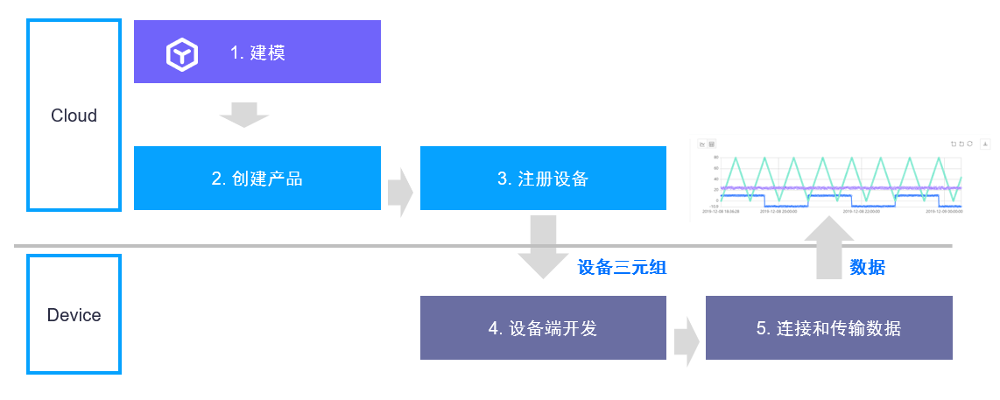
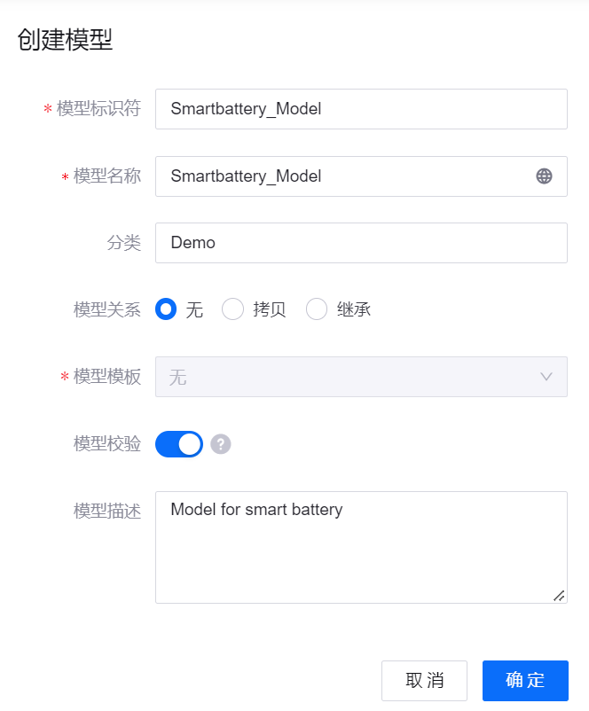
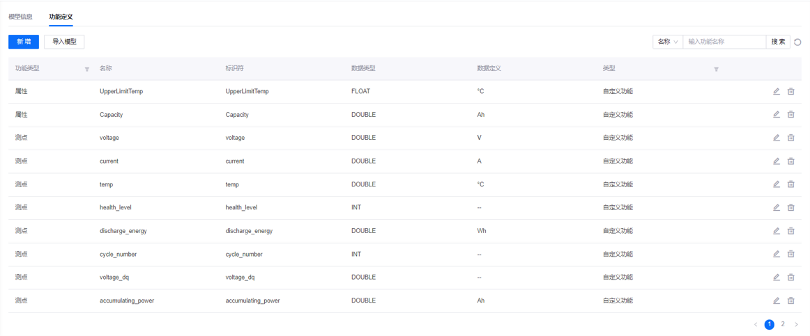
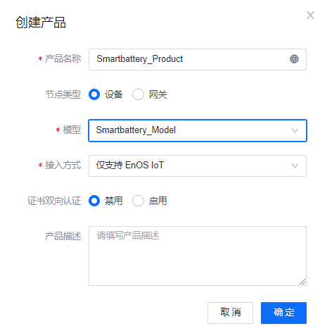
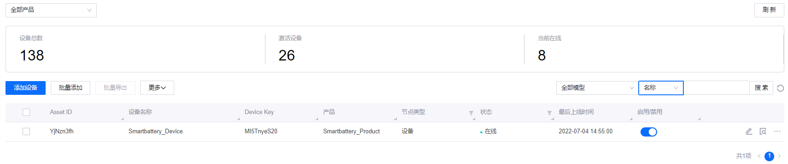
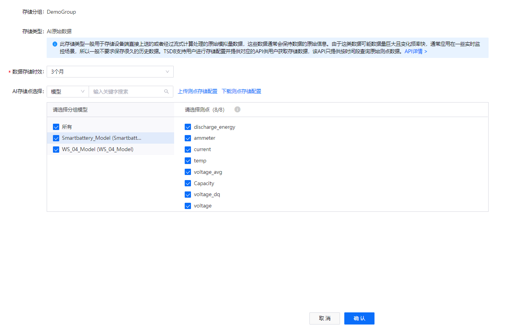
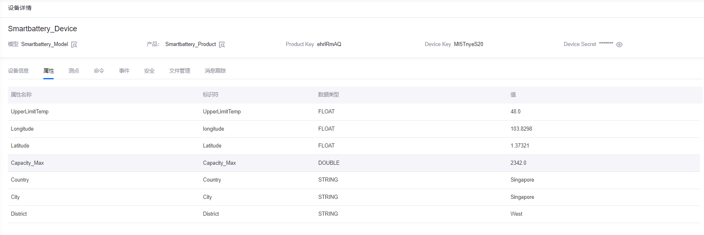
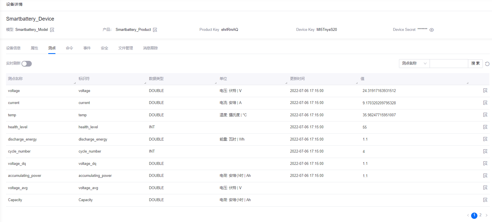

# 实验 1：将智能电池设备接入 EnOS™ （JAVA）

将设备接入 EnOS IoT Hub 之前，你需要在 EnOS 管理控制台上注册该设备。

本实验以智能电池设备为例，介绍如何在 EnOS Cloud 上注册智能设备。

> **注解**：你需要根据以下命名规则重新命名本实验中的缺省名称：`xxx_studenId`。

## 流程概述

本实验的大致流程如图所示：



## 步骤 1：定义模型

模型是对连接到 IoT Hub 的设备功能的抽象。设备模型定义设备的各项功能，包括属性、测点、服务以及事件。

1. 登录至 **EnOS 管理控制台**，点击左侧导航栏中的 **模型**。

2. 点击 **创建模型**，并在 **创建模型** 页面配置以下信息：

   - 模型标识符：Smartbattery_Model
   - 模型名称：Smartbattery_Model
   - 分类：无
   - 模型关系：无
   - 模型模板：无
   - 模型校验：启用
   - 模型描述：Model for smart battery

    

3. 点击 **确定** 创建模型。

4. 在模型列表中点击右侧 **编辑** 图标，进入创建模型的 **模型详情** 页面，并点击 **功能定义** 标签。

5. 你可以通过以下两种方法定义模型功能：

    - 手动添加：点击 **编辑 > 新增 > 新建自定义功能**，并依次创建以下自定义功能：

        |  功能类型       |  名称                |  标识符     |  测点类型     |  数据类型    |  数据定义  |
        |  ------------  |  ------------------  |  ---------- |  ----------  |  ---------  |  ---------------  |
        |  属性         |  Capacity               |  Capacity                       |      /       |  DOUBLE     |  Ah       |
        |  属性         |  UpperLimitTemp         |  UpperLimitTemp                 |        /     |  FLOAT      |  °C       |
        |  测点 |  current                        |  current                        |  AI          |  DOUBLE     |  A                 |
        |  测点 |  temp                           |  temp                           |  AI          |  DOUBLE     |  °C                |
        |  测点 |  voltage                        |  voltage                        |  AI          |  DOUBLE     |  V                 |
        |  测点 |  health_level                   |  health_level                   |  DI          |  /INT       |        /           |
        |  测点 |  discharge_energy               |  discharge_energy               |  AI          |  DOUBLE     |  Wh                |
        |  测点 |  cycle_number                   |  cycle_number                   |  Generic     |  /INT       |      /             |
        |  测点 |  voltage_dq                     |  voltage_dq                     |  AI          |  /DOUBLE    |      /             |
        |  测点 |  accumulating_power             |  accumulating_power             |  AI          |  DOUBLE     |  Ah                |
        |  测点 |  voltage_avg                    |  voltage_avg                    |  AI          |  DOUBLE     |  V                 |
        | 服务  |  high_frequency_report_service  |  high_frequency_report_service  |   /          |    /        |          /         |

       

    - 通过文件导入：点击 **编辑 > 导入模型** 并在弹窗中上传 Excel 或 JSON 文件。本实验中，你可以使用 [此文件](media/model_SmartBattery.json) 导入模型功能。

6. 点击 **发布** 保存并发布已创建的模型功能。

## 步骤 2：创建产品

智能电池产品是具有相同功能的设备的集合，在模型的基础上进一步定义了设备的通信规格。

在本实验中，假设 **Smartbattery_Model** 模型中的设备以 JSON 格式发送数据并且未使用 CA 证书对数据传输进行加密。通过以下步骤创建产品：

1. 在 EnOS 管理控制台中选择 **设备管理 > 产品管理**。

2. 点击  **创建产品**，并在 **创建产品** 页面配置以下信息：

    - 产品名称：Smartbattery_Product
    - 节点类型：设备
    - 模型：Smartbattery_Model
    - 接入方式：仅支持 EnOS IoT
    - 证书双向认证：禁用
    - 产品描述：Computer Battery

3. 点击 **确定** 创建产品。



有关产品创建及管理的详细信息，参见 [创建设备（设备集合）](https://support.envisioniot.com/docs/device-connection/zh_CN/2.3.0/howto/device/creating_product.html)。

## 步骤 3：注册设备

设备是产品的实例，继承模型的基本功能和产品的通信功能（如设备密钥和用于安全通信的设备证书）。

通过以下步骤创建一个名为 **Smartbattery_Device** 且从属于 **Smartbattery_Product** 的设备：

1. 在 EnOS 管理控制台中选择 **设备管理 > 设备资产**。

2. 点击 **添加设备** 并在 **添加设备** 页面配置以下信息：

    - 产品：Smartbattery_Product
    - 设备名称：Smartbattery_Device
    - Device Key：选填，可由系统自动生成
    - 时区/城市：UTC+08:00
    - 使用夏令时：禁用

3. 点击 **确定** 创建该设备。



## （可选）步骤 4：配置 TSDB 存储策略

EnOS 时序数据库（Time Series Database，简称 TSDB）提供多样的存储选项，以存储经常访问的重要业务数据。通过配置存储策略，时间序列数据可以根据数据类型和存储时间路由到不同的数据存储，从而降低数据存储成本并提高数据访问效率。

> **注解**：
> - 默认情况下，上传的数据将不会存储在 TSDB 中。因此，数据存储策略需要在上传数据之前提前配置，以确保数据成功上传至 EnOS 云端。
> - 每个模型只能关联一个存储策略组。

以 **AI 原始数据** 为例，通过以下步骤为在 **Smartbattery_Model** 模型中定义的测点配置存储策略：

1. 在 EnOS 管理控制台中的左侧菜单中选择 **时序数据管理 > 存储策略**。

2. 点击 **Formatted record** 标签，查看当前 OU 的存储策略。你可以点击 **+** 图标以创建新的存储策略或使用现有的存储策略。

    > **注解**: 每个 OU 最多同时存在 5 个存储策略分组。本实验使用 **Developer_Bootcamp** 存储策略储存设备数据。

3. 点击 **Developer_Bootcamp** 标签，查看存储组选项开列出的所有 TSDB 存储策略。

4. 将光标移到 **AI 原始数据** 板块上，点击 **编辑** 图标，打开 **编辑存储策略** 页面。

5. 在 **数据存储时效** 下拉菜单中选择 **3个月** 作为本实验数据的存储时长。

6. 选择 **Smartbattery_Model** 模型并勾选该模型的所有测点。

7. 点击 **确定** 保存数据存储配置。

有关配置智能电池设备存储策略的详细步骤，参见 [实验 1：配置电池数据的存储策略](../../3_Data_Management/303%20CN/303-1_configuring_storage_policy.md)。




## 步骤 5：配置 Java 开发环境

注册设备和配置存储策略之后，你可以通过 EnOS Java SDK for MQTT 将智能电池设备连接到 EnOS 并上传设备数据。

关于 EnOS Java SDK for MQTT 的详细信息，参见 [Using EnOS Device SDK for Java](https://github.com/EnvisionIot/enos-mqtt-sdk-java/README.md)。

EnOS Java SDK for MQTT 依赖 Java SE8 和 Maven 3。在配置 Java 开发环境前，你需要确保已安装以下内容：

- 开发环境，例如 IntelliJ IDEA，下载地址 https://www.jetbrains.com/idea/download/

- EnOS Java SDK for MQTT，下载地址：https://www.oracle.com/technetwork/java/javase/downloads/jdk8-downloads-2133151.html

- Maven 3，下载地址：http://maven.apache.org/download.cgi

上述内容下载并安装完成后，你需要通过以下步骤在开发环境（以 IntelliJ IDEA 为例）中创建 Java 项目：

1. 打开 Intellij IDEA，选择 **Do not Import Settings** 并点击 **Skip Remaining and Set Defaults > Create New Project**。

2. 选择 **Maven** 项目类型并点击 **Next**。

3. 输入项目的 **GroupId** 和 **ArtifctId** 并点击 **Next**。

4. 输入项目名称 **project name**，指定项目路径 **project location** 并点击 **Finish** 完成 Java 项目创建。

Java 项目创建完成后，你需要通过以下步骤在该项目中添加必要的依赖项：

1. 在项目页面中点击 **Enable Auto-Import** 导入 Maven 项目。

2. 在 Java 开发项目的 **pom.xml** 文件中添加以下 EnOS Java SDK for MQTT 依赖项：

    ```java
    <dependencies>
        <dependency>
            <groupId>com.envisioniot</groupId>
            <artifactId>enos-mqtt</artifactId>
            <version>2.2.13</version>
        </dependency>

        <dependency>
            <groupId>org.slf4j</groupId>
            <artifactId>slf4j-api</artifactId>
            <version>1.7.26</version>
        </dependency>

        <dependency>
            <groupId>org.apache.logging.log4j</groupId>
            <artifactId>log4j-core</artifactId>
            <version>2.7</version>
        </dependency>

        <dependency>
            <groupId>org.apache.logging.log4j</groupId>
            <artifactId>log4j-slf4j-impl</artifactId>
            <version>2.7</version>
        </dependency>
    </dependencies>
    ```

3. （可选）你也可以下载样例 Java 项目中的 [pom.xml](smartbattery_samplejavaproject/pom.xml) 文件并将其替换到已创建的 Java 项目中。

4. 保存 **pom.xml** 文件，完成 Java 开发环境配置。

## 步骤 6：将设备连接到 EnOS Cloud

开发环境构建完成后，你可以通过以下步骤将智能电池设备连接到 EnOS Cloud：

1. 安装依赖包：

   ```java
    package com.example;

    import com.envisioniot.enos.iot_mqtt_sdk.core.IConnectCallback;
    import com.envisioniot.enos.iot_mqtt_sdk.core.MqttClient;
    import com.envisioniot.enos.iot_mqtt_sdk.core.login.LoginInput;
    import com.envisioniot.enos.iot_mqtt_sdk.core.login.NormalDeviceLoginInput;
    import com.envisioniot.enos.iot_mqtt_sdk.core.msg.IMessageHandler;
    import com.envisioniot.enos.iot_mqtt_sdk.core.profile.DefaultProfile;
    import com.envisioniot.enos.iot_mqtt_sdk.message.downstream.tsl.*;
    import com.envisioniot.enos.iot_mqtt_sdk.message.upstream.tsl.*;
    import org.slf4j.Logger;
    import org.slf4j.LoggerFactory;
    import java.util.Random;

    import java.util.*;
    ```

2. 声明所需变量：

    ```java
    private final static String PLAIN_SERVER_URL = "yourMQTTaddress:yourport"; // Obtain the MQTT Broker address from EnOS Console > Help > Environment Information
    private final static String PRODUCT_KEY = "yourprodutkey";
    private final static String DEVICE_KEY = "yourdevicekey";
    private final static String DEVICE_SECRET = "yourdevicesecret";
    ```

    其中：
    - MQTT Broker 地址与接口可以通过 **EnOS 管理控制台 > 帮助 > 环境信息** 获取。
    - productKey、 deviceKey 和 deviceSecret 在注册智能电池设备时由系统生成。

3. 定义 `connect()` 函数以初始化设备连接：

    ```java
    public static void main(String[] args) {
        LoginInput input = new NormalDeviceLoginInput(PLAIN_SERVER_URL, PRODUCT_KEY, DEVICE_KEY, DEVICE_SECRET);
        final MqttClient client = new MqttClient(new DefaultProfile(input));

        client.connect();
    }
    ```

4. 通过 `connect()` 函数将智能电池设备连接到 EnOS Cloud：

    ```java
    public static void main(String[] args) {
        LoginInput input = new NormalDeviceLoginInput(PLAIN_SERVER_URL, PRODUCT_KEY, DEVICE_KEY, DEVICE_SECRET);
        final MqttClient client = new MqttClient(new DefaultProfile(input));

        client.connect(new IConnectCallback() {

            // On connect
            public void onConnectSuccess() {
                LOG.info("Connect Success.");

                // Set service handler to handle service command from cloud
                client.setArrivedMsgHandler(ServiceInvocationCommand.class, createServiceCommandHandler(client));

                // Set atrributes handler to handle atrributes set command from cloud
                client.setArrivedMsgHandler(MeasurepointSetCommand.class, createMeasurePointSetHandler(client));

                try {
                    // Just a simulator to post the measurepoints of devices
                    monitor(client);
                } catch (Exception e) {
                    e.printStackTrace();
                }
                LOG.info("Waiting commands from cloud.");
            }

            // On connection lost
            public void onConnectLost() {
                LOG.info("Connect Lost.");
                client.close();
            }

            // On connect falied
            public void onConnectFailed(int reason) {
                LOG.info("Connect Failed.");
                client.close();
            }
        });
    }
    ```

## 步骤 7：上传数据至 EnOS Cloud

将智能电池设备连接到 EnOS 后，通过以下步骤模拟智能电池设备的电压、温度以及电流数据并将相关数据上传至 EnOS Cloud。

1. 定义智能电池设备的电压、温度以及电流的阈值：
    
    ```java
    private static final double VOL_MAX = 26;
    private static final double VOL_MIN = 22;
    private static final double CUR_MAX = 11;
    private static final double CUR_MIN = 9;
    private static final double TEMP_MIN = 0;
    private static final double TEMP_MAX = 80;
    private static final double CUR_D_MAX = -9;
    private static final double CUR_D_MIN = -11;
    private static final int CUR_PERIOD = 60*60;
    private static final int TEMP_PERIOD = 20*60;
    ```

2. 通过 `simulate_measure_points()` 函数模拟智能电池设备的电压、温度以及电流：

    ```java
    // Simulate the measure points of devices
    public static Map<String, Object> simulateMeasurePoints() {
        Map<String, Object> data=new HashMap<String, Object>();
        Random random = new Random();
        data.put("temp", temp_count*(TEMP_MAX/TEMP_PERIOD));
        data.put("voltage", random.nextDouble()*(VOL_MAX - VOL_MIN) + VOL_MIN);
        data.put("current", random.nextDouble()*(CUR_MAX - CUR_MIN) + CUR_MIN);
        data.put("current_d", random.nextDouble()*(CUR_D_MAX - CUR_D_MIN) + CUR_MIN);

        return data;
    }
    ```

3. 通过 `post_measure_points()` 和 `monitor()` 函数将智能电池设备的测点数据上传至 EnOS Cloud：

    ```java
    // Monitoring the voltage, temperature and current of device
    public static void monitor(final MqttClient client) throws Exception {
        System.out.println("post measure points start ...");
        Thread t1 = new Thread() {
            public void run() {
                while (true) {
                    postVoltage(client);
                    try {
                        Thread.sleep(interval * 1000);
                    } catch (InterruptedException e) {
                        System.out.println("post voltage thread end.");
                    }

                }
            }
        };
        t1.start();

        Thread t2 = new Thread() {
            public void run() {
                while (true) {
                    postTemp(client);
                    try {
                        Thread.sleep(interval * 1000);
                    } catch (InterruptedException e) {
                        System.out.println("post temperature thread end.");
                    }

                }
            }
        };
        t2.start();

        Thread t3 = new Thread() {
            public void run() {
                while (true) {
                    postCurrent(client);
                    try {
                        Thread.sleep(interval * 1000);
                    } catch (InterruptedException e) {
                        System.out.println("post current thread end.");
                    }

                }
            }
        };
        t3.start();
    }

    ```

## 步骤 8：运行程序并查看设备状态

通过以下步骤在 Java 环境中运行完整的 Java 代码，并检查连接结果：

1. 运行以下代码以连接设备并上传数据：

    ```java
    package com.example;

    import com.envisioniot.enos.iot_mqtt_sdk.core.IConnectCallback;
    import com.envisioniot.enos.iot_mqtt_sdk.core.MqttClient;
    import com.envisioniot.enos.iot_mqtt_sdk.core.login.LoginInput;
    import com.envisioniot.enos.iot_mqtt_sdk.core.login.NormalDeviceLoginInput;
    import com.envisioniot.enos.iot_mqtt_sdk.core.msg.IMessageHandler;
    import com.envisioniot.enos.iot_mqtt_sdk.core.profile.DefaultProfile;
    import com.envisioniot.enos.iot_mqtt_sdk.message.downstream.tsl.*;
    import com.envisioniot.enos.iot_mqtt_sdk.message.upstream.tsl.*;
    import org.slf4j.Logger;
    import org.slf4j.LoggerFactory;
    import java.util.Random;

    import java.util.*;

    public class SmartbatterySamples {
        private final static Logger LOG = LoggerFactory.getLogger(SmartbatterySamples.class);

        private final static String PLAIN_SERVER_URL = "tcp://mqtt-ppe1.envisioniot.com:21883";

        private final static String PRODUCT_KEY = "yourproductkey";
        private final static String DEVICE_KEY = "yourdevicekey";
        private final static String DEVICE_SECRET = "yourdevicesecret";
        private static int interval = 5; //data uploading frequeny, 5 seconds
        private static final double VOL_MAX = 26;
        private static final double VOL_MIN = 22;
        private static final double CUR_MAX = 11;
        private static final double CUR_MIN = 9;
        private static final double TEMP_MIN = 0;
        private static final double TEMP_MAX = 80;
        private static final double CUR_D_MAX = -9;
        private static final double CUR_D_MIN = -11;
        private static final int CUR_PERIOD = 60*60;
        private static final int TEMP_PERIOD = 20*60;
        private static int cur_count = 0;
        private static double temp_count = 0;
        private static String change = "current";
        private static boolean flag = true;
        private static boolean temp_flag = true;

        public static void main(String[] args) {
            LoginInput input = new NormalDeviceLoginInput(PLAIN_SERVER_URL, PRODUCT_KEY, DEVICE_KEY, DEVICE_SECRET);
            final MqttClient client = new MqttClient(new DefaultProfile(input));

            client.connect(new IConnectCallback() {
                public void onConnectSuccess() {
                    LOG.info(" Connect Success.");

                    // Set service handler to handle service command from cloud
                    client.setArrivedMsgHandler(ServiceInvocationCommand.class, createServiceCommandHandler(client));
                    client.setArrivedMsgHandler(MeasurepointSetCommand.class, createMeasurePointSetHandler(client));
                    try {
                        monitor(client);
                    } catch (Exception e) {
                        e.printStackTrace();
                    }
                    LOG.info("Waiting commands from cloud");
                }

                public void onConnectLost() {
                    LOG.info("Connect Lost.");
                    client.close();
                }

                public void onConnectFailed(int reason) {
                    LOG.info("Connect Failed.");
                    client.close();
                }
            });
        }

        private static IMessageHandler<MeasurepointSetCommand, MeasurepointSetReply> createMeasurePointSetHandler(final MqttClient client) {
            return (MeasurepointSetCommand arrivedMessage, List<String> argList) -> {
                byte[] bytes = arrivedMessage.encode();
                LOG.info("arrivedMessage: {}", new String(bytes));
                LOG.info("len: {}", bytes.length);
                LOG.info("argList: {}", argList);

                // argList: productKey, deviceKey, serviceName
                // If the request is for sub-device, the productKey and deviceKey
                // are used to identify the target sub-device.
                String productKey = argList.get(0);
                String deviceKey = argList.get(1);
                //String serviceName = argList.get(2);
                LOG.info("productKey: {}, deviceKey: {}",
                        productKey, deviceKey);

                return MeasurepointSetReply.builder().build();
            };
        }

        private static IMessageHandler<ServiceInvocationCommand, ServiceInvocationReply> createServiceCommandHandler(final MqttClient client) {
            return (ServiceInvocationCommand request, List<String> argList) -> {
                LOG.info("receive command: {}", request);

                // argList: productKey, deviceKey, serviceName
                // If the request is for sub-device, the productKey and deviceKey
                // are used to identify the target sub-device.
                String productKey = argList.get(0);
                String deviceKey = argList.get(1);
                String serviceName = argList.get(2);
                LOG.info("productKey: {}, deviceKey: {}, serviceName: {}, params: {}",
                        productKey, deviceKey, serviceName, request.getParams());

                LOG.info("<<<<< [service command] rcvn async serevice invocation command: " + request + " topic: " + argList);

                if (serviceName.equals("high_frequency_report_service")) {
                    Map<String, Object> params = request.getParams();
                    int n = (Integer) params.get("interval");
                    LOG.info("arg interval: {}", n);
                    interval = n;

                    // Set the reply result
                    return ServiceInvocationReply.builder().build();
                } else if (serviceName.equals("disconnect")) {
                    Map<String, Object> params = request.getParams();
                    int delayMS = (Integer) params.get("delayMS");
                    LOG.info("arg delay: {}", delayMS);

                    final Timer timer = new Timer();
                    timer.schedule(new TimerTask() {
                        @Override
                        public void run() {
                            LOG.info("now close connection ...");
                            client.close();
                            timer.cancel();
                        }
                    }, delayMS);
                    return ServiceInvocationReply.builder().build();
                }

                return ServiceInvocationReply.builder().setMessage("unknown service: " + serviceName).setCode(220).build();
            };
        }

        // Simulate the measuring points of devices
        public static Map<String, Object> simulateMeasurePoints() {
            Map<String, Object> data=new HashMap<String, Object>();
            Random random = new Random();
            data.put("temp", temp_count*(TEMP_MAX/TEMP_PERIOD));
            data.put("voltage", random.nextDouble()*(VOL_MAX - VOL_MIN) + VOL_MIN);
            data.put("current", random.nextDouble()*(CUR_MAX - CUR_MIN) + CUR_MIN);
            data.put("current_d", random.nextDouble()*(CUR_D_MAX - CUR_D_MIN) + CUR_D_MIN);

            return data;
        }

        // Post measuring point of voltage
        private static void postVoltage(final MqttClient client) {
            Map<String, Object> measurePoints = simulateMeasurePoints();
            try {
                MeasurepointPostRequest request = MeasurepointPostRequest.builder()
                        .setQos(0)
                        .addMeasurePoint("voltage", measurePoints.get("voltage"))
                        .build();

                MeasurepointPostResponse response = client.publish(request);
                if (response.isSuccess()) {
                    LOG.info("measure points(voltage) are published successfully");
                } else {
                    LOG.error("failed to publish measure points, error: {}", response.getMessage());
                }
            } catch (Exception e) {
                LOG.error("failed to publish measure point(voltage)", e);
            }
        }

        // Post measuring point of current
        private static void postCurrent(final MqttClient client) {
            Map<String, Object> measurePoints = simulateMeasurePoints();
            try {

                // Simulate the measuring points according to battery
                cur_count += interval;
                if(cur_count >= CUR_PERIOD) {
                    flag = !flag;
                    cur_count = 0;
                    if (flag) change = "current";
                    else change = "current_d";
                }

                MeasurepointPostRequest request = MeasurepointPostRequest.builder()
                        .setQos(0)
                        .addMeasurePoint("current", measurePoints.get(change))
                        .build();

                MeasurepointPostResponse response = client.publish(request);
                if (response.isSuccess()) {
                    LOG.info("measure points(current) are published successfully");
                } else {
                    LOG.error("failed to publish measure points, error: {}", response.getMessage());
                }
            } catch (Exception e) {
                LOG.error("failed to publish measure point(voltage)", e);
            }
        }

        // Post measuring point of temperature
        private static void postTemp(final MqttClient client) {
            Map<String, Object> measurePoints = simulateMeasurePoints();
            try {
                // Simulating the measuring points according to battery
                if (temp_flag) {
                    if (temp_count >= 0 && temp_count < TEMP_PERIOD) {
                        temp_count += interval;
                    } else if (temp_count >= TEMP_PERIOD) {
                        temp_flag = !temp_flag;
                        temp_count = TEMP_PERIOD - interval;
                    }
                } else {
                    if(temp_count > 0) {
                        temp_count -= interval;
                    } else if (temp_count <= 0) {
                        temp_flag = !temp_flag;
                        temp_count = interval;
                    }
                }

                MeasurepointPostRequest request = MeasurepointPostRequest.builder()
                        .setQos(0)
                        .addMeasurePoint("temp", measurePoints.get("temp"))
                        .build();

                MeasurepointPostResponse response = client.publish(request);
                if (response.isSuccess()) {
                    LOG.info("measure points(Temp) are published successfully");
                } else {
                    LOG.error("failed to publish measure points, error: {}", response.getMessage());
                }
            } catch (Exception e) {
                LOG.error("failed to publish measure points", e);
            }
        }

        // Monitoring the voltage, temperature and current of device
        public static void monitor(final MqttClient client) throws Exception {
            System.out.println("post measure points start ...");
            Thread t1 = new Thread() {
                public void run() {
                    while (true) {
                        postVoltage(client);
                        try {
                            Thread.sleep(interval * 1000);
                        } catch (InterruptedException e) {
                            System.out.println("post thread end.");
                        }

                    }
                }
            };
            t1.start();

            Thread t2 = new Thread() {
                public void run() {
                    while (true) {
                        postTemp(client);
                        try {
                            Thread.sleep(interval * 1000);
                        } catch (InterruptedException e) {
                            System.out.println("post thread end.");
                        }

                    }
                }
            };
            t2.start();

            Thread t3 = new Thread() {
                public void run() {
                    while (true) {
                        postCurrent(client);
                        try {
                            Thread.sleep(interval * 1000);
                        } catch (InterruptedException e) {
                            System.out.println("post thread end.");
                        }

                    }
                }
            };
            t3.start();
        }

    }

    ```

2. 查看程序的运行结果：

    ```
    onConnectSuccess
    waiting commands from cloud
    ```

    ```java
    "C:\Program Files\Java\jdk1.8.0_191\bin\java.exe"

    2019-12-08 13:00:40 DEBUG DefaultProcessor:245 - connect complete , reconnect false , serverUri tcp://mqtt-ppe1.envisioniot.com:21883
    2019-12-08 13:00:40 INFO  SmartbatterySample:46 - Connect Success.
    post measure points start ...
    2019-12-08 13:00:40 INFO  SmartbatterySample:57 - Waiting commands from cloud
    ```

3. 查看上传测点数据的日志信息：
   
    ```$xslt
    connect success
    waiting commands from cloud
    measurepoint post response code: 200, {'cycle_number': 0, 'temp': 45.33639481400027, 'voltage': 4.476127173515886, 'current': 40.57236573795417, 'accumulating_power': 181.6070687734816}
    measurepoint post response code: 200, {'cycle_number': 0, 'temp': 50.12095953667547, 'voltage': 4.375110588038265, 'current': 41.808972720876994, 'accumulating_power': 364.5259479995935}
    measurepoint post response code: 200, {'cycle_number': 0, 'temp': 53.70875593556161, 'voltage': 4.3430578089373055, 'current': 40.01262380152207, 'accumulating_power': 538.3030862568646}
    measurepoint post response code: 200, {'cycle_number': 0, 'temp': 56.207075645498826, 'voltage': 4.24141682055193, 'current': 41.34971752375547, 'accumulating_power': 713.6844736871919}
    ```

4. 在 EnOS 管理控制台的 **设备管理 > 设备资产** 中查看智能电池设备的状态变化。若连接成功，该设备的状态将变为 **在线**。

    

5. 在 **设备详情** 页面中点击 **属性** 标签页，查看智能电池设备的属性信息。

    

6. 在 **设备详情** 页面中点击 **测点** 标签页，查看智能电池设备的测点信息。

    

## 步骤 9：查看设备时序洞察报表

通过以下步骤查看智能电池设备测点的时序洞察报表：

1. 在 EnOS 管理控制台中，点击 **时序数据管理 > 时序洞察**。

2. 在 **设备选择** 中选择 **Smartbattery_Device** 智能电池设备。

3. 在 **已选测点** 中选择智能电池设备的测点以生成数据图表或表格。


## 下一实验

[实验 2：模拟测点数据](302-2_simulating_measure_points.md)
