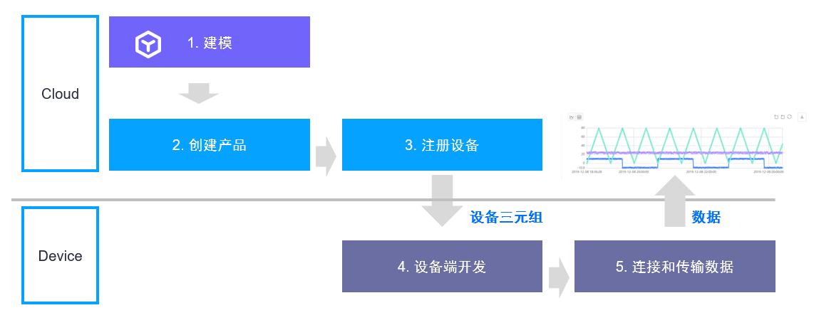
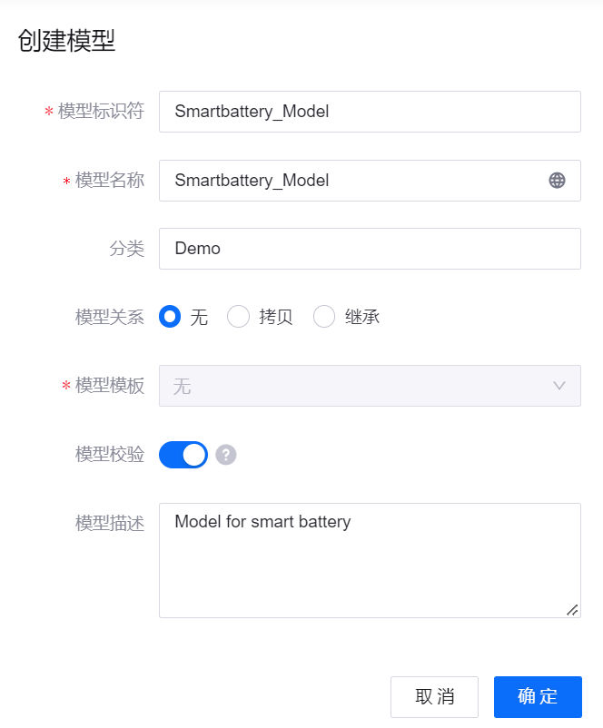
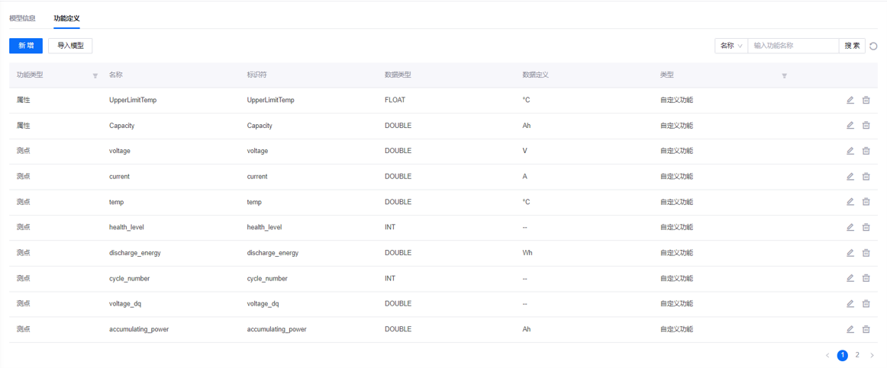
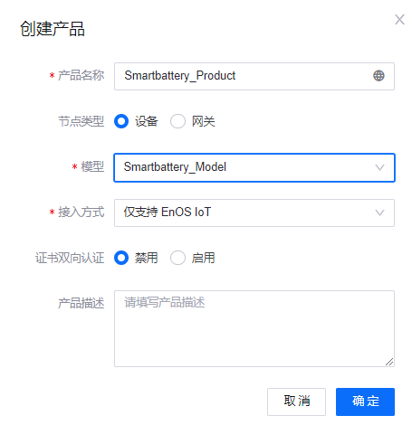
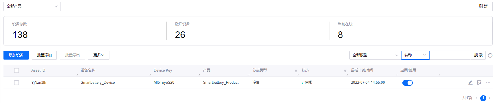
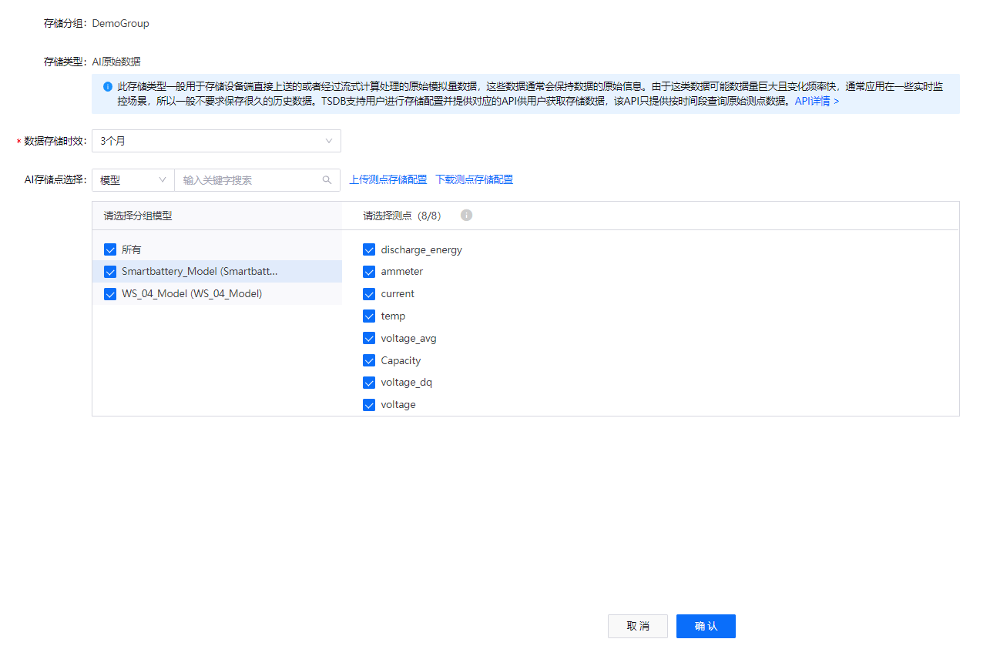
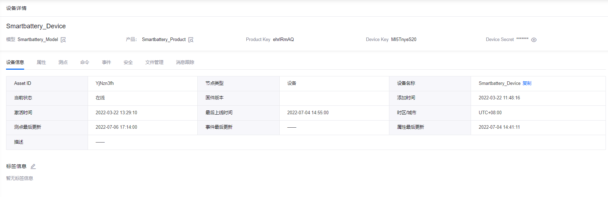
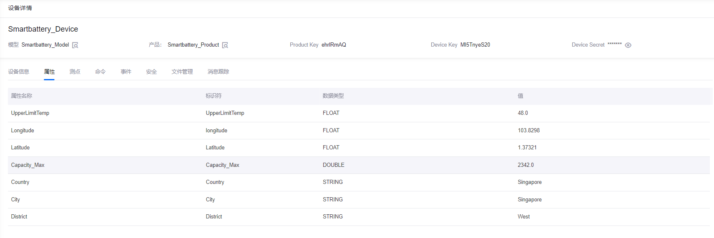
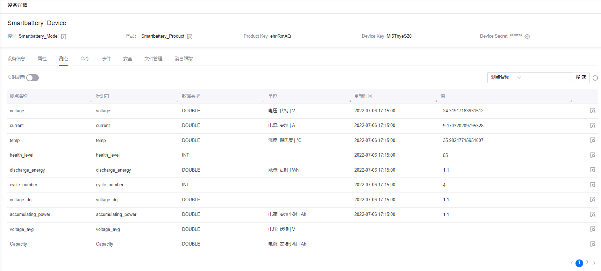
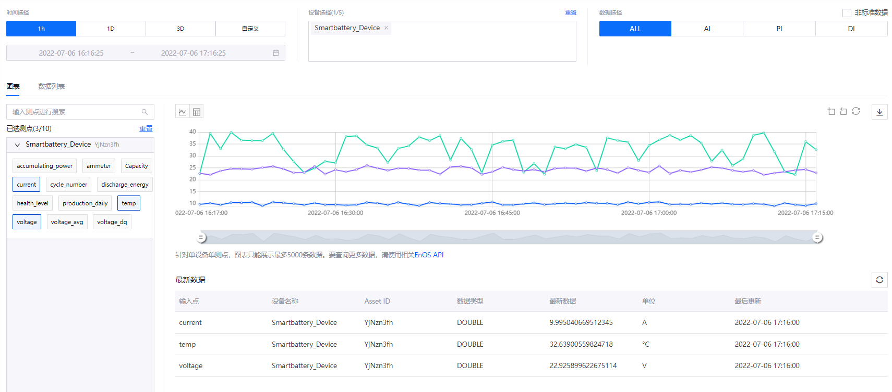

# 实验 1：将智能电池设备接入 EnOS™ （Python）

将设备接入 EnOS IoT Hub 之前，你需要在 EnOS 管理控制台上注册该设备。

本实验以智能电池设备为例，介绍如何在 EnOS Cloud 上注册智能设备。

> **注解**：你需要根据以下命名规则重新命名本实验中的缺省名称：`xxx_studenId`。

## 流程概述

本实验的大致流程如图所示：



## 步骤 1：定义模型

模型是对连接到 IoT Hub 的设备功能的抽象。设备模型定义设备的各项功能，包括属性、测点、服务以及事件。

1. 登录至 **EnOS 管理控制台**，点击左侧导航栏中的 **模型**。

2. 点击 **创建模型**，并在 **创建模型** 页面配置以下信息：

   - 模型标识符：Smartbattery_Model
   - 模型名称：Smartbattery_Model
   - 分类：无
   - 模型关系：无
   - 模型模板：无
   - 模型校验：启用
   - 模型描述：Model for smart battery

    

3. 点击 **确定** 创建模型。

4. 在模型列表中点击右侧 **编辑** 图标，进入创建模型的 **模型详情** 页面，并点击 **功能定义** 标签。

5. 你可以通过以下两种方法定义模型功能：

    - 手动添加：点击 **编辑 > 新增 > 新建自定义功能**，并依次创建以下自定义功能：

        |  功能类型       |  名称                |  标识符     |  测点类型     |  数据类型    |  数据定义  |
        |  ------------  |  ------------------  |  ---------- |  ----------  |  ---------  |  ---------------  |
        |  属性         |  Capacity               |  Capacity                       |      /       |  DOUBLE     |  Ah       |
        |  属性         |  UpperLimitTemp         |  UpperLimitTemp                 |        /     |  FLOAT      |  °C       |
        |  测点 |  current                        |  current                        |  AI          |  DOUBLE     |  A                 |
        |  测点 |  temp                           |  temp                           |  AI          |  DOUBLE     |  °C                |
        |  测点 |  voltage                        |  voltage                        |  AI          |  DOUBLE     |  V                 |
        |  测点 |  health_level                   |  health_level                   |  DI          |  /INT       |        /           |
        |  测点 |  discharge_energy               |  discharge_energy               |  AI          |  DOUBLE     |  Wh                |
        |  测点 |  cycle_number                   |  cycle_number                   |  Generic     |  /INT       |      /             |
        |  测点 |  voltage_dq                     |  voltage_dq                     |  AI          |  /DOUBLE    |      /             |
        |  测点 |  accumulating_power             |  accumulating_power             |  AI          |  DOUBLE     |  Ah                |
        |  测点 |  voltage_avg                    |  voltage_avg                    |  AI          |  DOUBLE     |  V                 |
        | 服务  |  high_frequency_report_service  |  high_frequency_report_service  |   /          |    /        |          /         |

       

    - 通过文件导入：点击 **编辑 > 导入模型** 并在弹窗中上传 Excel 或 JSON 文件。本实验中，你可以使用 [此文件](media/model_SmartBattery.json) 导入模型功能。

6. 点击 **发布** 保存并发布已创建的模型功能。

## 步骤 2：创建产品

智能电池产品是具有相同功能的设备的集合，在模型的基础上进一步定义了设备的通信规格。

在本实验中，假设 **Smartbattery_Model** 模型中的设备以 JSON 格式发送数据并且未使用 CA 证书对数据传输进行加密。通过以下步骤创建产品：

1. 在 EnOS 管理控制台中选择 **设备管理 > 产品管理**。

2. 点击  **创建产品**，并在 **创建产品** 页面配置以下信息：

    - 产品名称：Smartbattery_Product
    - 节点类型：设备
    - 模型：Smartbattery_Model
    - 接入方式：仅支持 EnOS IoT
    - 证书双向认证：禁用
    - 产品描述：Computer Battery

3. 点击 **确定** 创建产品。



有关产品创建及管理的详细信息，参见 [创建设备（设备集合）](https://support.envisioniot.com/docs/device-connection/zh_CN/2.3.0/howto/device/creating_product.html)。

## 步骤 3：注册设备

设备是产品的实例，继承模型的基本功能和产品的通信功能（如设备密钥和用于安全通信的设备证书）。

通过以下步骤创建一个名为 **Smartbattery_Device** 且从属于 **Smartbattery_Product** 的设备：

1. 在 EnOS 管理控制台中选择 **设备管理 > 设备资产**。

2. 点击 **添加设备** 并在 **添加设备** 页面配置以下信息：

    - 产品：Smartbattery_Product
    - 设备名称：Smartbattery_Device
    - Device Key：选填，可由系统自动生成
    - 时区/城市：UTC+08:00
    - 使用夏令时：禁用

3. 点击 **确定** 创建该设备。



## （可选）步骤 4：配置 TSDB 存储策略

EnOS 时序数据库（Time Series Database，简称 TSDB）提供多样的存储选项，以存储经常访问的重要业务数据。通过配置存储策略，时间序列数据可以根据数据类型和存储时间路由到不同的数据存储，从而降低数据存储成本并提高数据访问效率。

> **注解**：
> - 默认情况下，上传的数据将不会存储在 TSDB 中。因此，数据存储策略需要在上传数据之前提前配置，以确保数据成功上传至 EnOS 云端。
> - 每个模型只能关联一个存储策略组。

以 **AI 原始数据** 为例，通过以下步骤为在 **Smartbattery_Model** 模型中定义的测点配置存储策略：

1. 在 EnOS 管理控制台中的左侧菜单中选择 **时序数据管理 > 存储策略**。

2. 点击 **Formatted record** 标签，查看当前 OU 的存储策略。你可以点击 **+** 图标以创建新的存储策略或使用现有的存储策略。

    > **注解**: 每个 OU 最多同时存在 5 个存储策略分组。本实验使用 **Developer_Bootcamp** 存储策略储存设备数据。

3. 点击 **Developer_Bootcamp** 标签，查看存储组选项开列出的所有 TSDB 存储策略。

4. 将光标移到 **AI 原始数据** 板块上，点击 **编辑** 图标，打开 **编辑存储策略** 页面。

5. 在 **数据存储时效** 下拉菜单中选择 **3个月** 作为本实验数据的存储时长。

6. 选择 **Smartbattery_Model** 模型并勾选该模型的所有测点。

7. 点击 **确定** 保存数据存储配置。

有关配置智能电池设备存储策略的详细步骤，参见 [实验 1：配置电池数据的存储策略](../../3_Data_Management/303%20CN/303-1_configuring_storage_policy.md)。



## 步骤 5：配置 Python 开发环境

注册设备和配置存储策略之后，你可以通过 EnOS Device SDK for Python 将智能电池设备连接到 EnOS 并上传设备数据。

关于 EnOS Device SDK for Python 的详细信息，参见 [Using EnOS Device SDK for Python](https://github.com/EnvisionIot/enos-device-sdk-python/blob/master/README.md)。

EnOS Device SDK for Python 需要 Python 3.5.3 或更高版本以及 pip3。你需要确保已安装 Python 开发环境，例如 IntelliJ Pycharm，下载地址：https://www.jetbrains.com/pycharm/download/

述内容下载并安装完成后，你需要通过以下步骤在开发环境（以 IntelliJ Pycharm 为例）中创建 Python 项目并安装 EnOS Device SDK for Python：

1. 打开 Pycharm，选择 **File** 并点击 **New Project > Create New Project**。

2. 选择 **Pure Python** 项目类型。

3. 指定项目路径 **Location** 并点击 **Create**。

4. 在终端中安装 **enos-mqtt-sdk-python** SDK 模块。你可以在 Python 包索引（PyPi）中查找并下载 EnOS Device SDK for Python 的最新版本，并通过以下代码进行安装：

    ```python
    pip3 install enos-mqtt-sdk-python
    ```

## 步骤 6：将设备连接到 EnOS Cloud

开发环境构建完成后，你可以通过以下步骤将智能电池设备连接到 EnOS Cloud：

1. 安装依赖包：

    ```python
    import time
    import random

    from enos.core.MqttClient import MqttClient
    from enos.message.upstream.tsl.MeasurepointPostRequest import MeasurepointPostRequest
    from enos.message.downstream.tsl.ServiceInvocationCommand import ServiceInvocationCommand
    from enos.message.downstream.tsl.ServiceInvocationReply import ServiceInvocationReply    
    ```

2. 声明所需变量：

    ```python
    TCP_SERVER_URL = "yourMQTTaddress:yourport" # Obtain the MQTT Broker address from EnOS Console > Help > Environment Information
    PRODUCT_KEY = "yourprodutkey"
    DEVICE_KEY = "yourdevicekey"
    DEVICE_SECRET = "yourdevicesecret"
    ```

    其中：
    - MQTT Broker 地址与接口可以通过 **EnOS 管理控制台 > 帮助 > 环境信息** 获取。
    - productKey、 deviceKey 和 deviceSecret 在注册智能电池设备时由系统生成。

3. 定义 `connect()` 函数以初始化设备连接：

    ```python
    if __name__ == '__main__':
        client = MqttClient(TCP_SERVER_URL, PRODUCT_KEY, DEVICE_KEY, DEVICE_SECRET)
        client.get_profile().set_auto_reconnect(True)

        client.connect()  # connect in sync
    ```

4. 通过 `connect()` 函数将智能电池设备连接到 EnOS Cloud：

    ```python
    def on_connect():
        """ Called when the connection to the server is completed."""
        print('connect success')

        client.register_arrived_message_handler(ServiceInvocationCommand.get_class(), service_command_handler)
        print('waiting commands from cloud')


    def on_disconnect():
        """ Called when the client connection lost."""
        print('connect lost')


    def on_connect_failed():
        """ Called when the client connect failed"""
        print('connect failed...')

    if __name__ == '__main__':
        client = MqttClient(TCP_SERVER_URL, PRODUCT_KEY, DEVICE_KEY, DEVICE_SECRET)
        client.get_profile().set_auto_reconnect(True)

        # register connection callback
        client.on_connect = on_connect
        client.on_disconnect = on_disconnect
        client.on_connected_failed = on_connect_failed

        client.connect() # connect in sync
        monitor()
    ```

## 步骤 7：上传数据至 EnOS Cloud

将智能电池设备连接到 EnOS 后，通过以下步骤模拟智能电池设备的电压、温度以及电流数据并将相关数据上传至 EnOS Cloud。

1. 定义智能电池设备的电压、温度以及电流的阈值：
    
    ```python
    VOL_MAX = 4.5;
    VOL_MIN = 3.8;
    CUR_MAX = 42;
    CUR_MIN = 40;
    TEMP_MIN = 45;
    TEMP_MAX = 75;
    SIMULATE_PERIOD = 10
    ```

2. 通过 `simulate_measure_points()` 函数模拟智能电池设备的电压、温度以及电流：

    ```python
    # Simulate the measure points of devices
    def simulate_measure_points(number):
        global accumulating_power
        data = {}

        cycle_number = int(number / SIMULATE_PERIOD)
        data["cycle_number"] = cycle_number

        i = number % SIMULATE_PERIOD
        data["temp"] = TEMP_MIN + (TEMP_MAX - TEMP_MIN) * (i + random.random()) / SIMULATE_PERIOD
        data["voltage"] = VOL_MAX - (VOL_MAX - VOL_MIN) * (i + random.random()) / SIMULATE_PERIOD
        data["current"] = CUR_MIN + (CUR_MAX - CUR_MIN) * random.random()

        if (number % SIMULATE_PERIOD == 0):
            accumulating_power = 0
        accumulating_power = accumulating_power + data["voltage"] * data["current"]
        data["accumulating_power"] = accumulating_power

        return data
    ```

3. 通过 `post_measure_points()` 和 `monitor()` 函数将智能电池设备的测点数据上传至 EnOS Cloud：

    ```python
    def post_measure_points(data):
        request = MeasurepointPostRequest.builder() \
            .set_timestamp(int(time.time() * 1000))

        for point in data:
            request.add_measurepoint(point, data[point])

        response = client.publish(request.build())
        if response:
            print('measurepoint post response code: {}, {}'.format(response.get_code(), data))

    def monitor():
        i = 0
        while True:
            data = simulate_measure_points(i)
            i += 1

            post_measure_points(data)
            time.sleep(interval)
    ```

4. 通过以下代码将智能电池设备的连接状态返回到本地：

    ```python
    def service_command_handler(arrived_message, arg_list):
        print('receive service invocation command: {}, args: {}'.format(arrived_message, arg_list))
        product_key, device_key, service_name = arg_list
        params = arrived_message.get_params()

        if service_name == 'high_frequency_report_service':
            global interval
            interval = int(params.get('interval'))
            return ServiceInvocationReply.builder() \
                .add_output_data('result', 0) \
                .set_code(200) \
                .build()
        else:
            return ServiceInvocationReply.builder().set_message('unknown service:').set_code(220).build()

    def on_connect():
        """ Called when the connection to the server is completed."""
        print('connect success')

        client.register_arrived_message_handler(ServiceInvocationCommand.get_class(), service_command_handler)
        print('waiting commands from cloud')


    def on_disconnect():
        """ Called when the client connection lost."""
        print('connect lost')


    def on_connect_failed():
        """ Called when the client connect failed"""
        print('connect failed...')

    if __name__ == '__main__':
        client = MqttClient(TCP_SERVER_URL, PRODUCT_KEY, DEVICE_KEY, DEVICE_SECRET)
        client.get_profile().set_auto_reconnect(True)

        # register connection callback
        client.on_connect = on_connect
        client.on_disconnect = on_disconnect
        client.on_connected_failed = on_connect_failed

        client.connect() # connect in sync
        monitor()    
    ```

## 步骤 8：运行程序并查看设备状态

通过以下步骤在 Python 环境中运行完整的 Python 代码，并检查连接结果：

1. 运行以下代码以连接设备并上传数据：

    ```python
    import time
    import random

    from enos.core.MqttClient import MqttClient
    from enos.message.upstream.tsl.MeasurepointPostRequest import MeasurepointPostRequest
    from enos.message.downstream.tsl.ServiceInvocationCommand import ServiceInvocationCommand
    from enos.message.downstream.tsl.ServiceInvocationReply import ServiceInvocationReply

    TCP_SERVER_URL = "tcp://mqtt-ppe1.envisioniot.com:21883"
    PRODUCT_KEY = "yourprodutkey"
    DEVICE_KEY = "yourdevicekey"
    DEVICE_SECRET = "yourdevicesecret"

    #
    VOL_MAX = 4.5;
    VOL_MIN = 3.8;
    CUR_MAX = 42;
    CUR_MIN = 40;
    TEMP_MIN = 45;
    TEMP_MAX = 75;
    SIMULATE_PERIOD = 10

    #
    interval = 1
    accumulating_power = 0

    def simulate_measure_points(number):
        global accumulating_power
        data = {}

        cycle_number = int(number / SIMULATE_PERIOD)
        data["cycle_number"] = cycle_number

        i = number % SIMULATE_PERIOD
        data["temp"] = TEMP_MIN + (TEMP_MAX - TEMP_MIN) * (i + random.random()) / SIMULATE_PERIOD
        data["voltage"] = VOL_MAX - (VOL_MAX - VOL_MIN) * (i + random.random()) / SIMULATE_PERIOD
        data["current"] = CUR_MIN + (CUR_MAX - CUR_MIN) * random.random()

        if (number % SIMULATE_PERIOD == 0):
            accumulating_power = 0
        accumulating_power = accumulating_power + data["voltage"] * data["current"]
        data["accumulating_power"] = accumulating_power

        return data

    def post_measure_points(data):
        request = MeasurepointPostRequest.builder() \
            .set_timestamp(int(time.time() * 1000))

        for point in data:
            request.add_measurepoint(point, data[point])

        response = client.publish(request.build())
        if response:
            print('measurepoint post response code: {}, {}'.format(response.get_code(), data))

    def monitor():
        i = 0
        while True:
            data = simulate_measure_points(i)
            i += 1

            post_measure_points(data)
            time.sleep(interval)

    def service_command_handler(arrived_message, arg_list):
        print('receive service invocation command: {}, args: {}'.format(arrived_message, arg_list))
        product_key, device_key, service_name = arg_list
        params = arrived_message.get_params()

        if service_name == 'high_frequency_report_service':
            global interval
            interval = int(params.get('interval'))
            return ServiceInvocationReply.builder() \
                .add_output_data('result', 0) \
                .set_code(200) \
                .build()
        else:
            return ServiceInvocationReply.builder().set_message('unknown service:').set_code(220).build()

    def on_connect():
        """ Called when the connection to the server is completed."""
        print('connect success')

        client.register_arrived_message_handler(ServiceInvocationCommand.get_class(), service_command_handler)
        print('waiting commands from cloud')


    def on_disconnect():
        """ Called when the client connection lost."""
        print('connect lost')


    def on_connect_failed():
        """ Called when the client connect failed"""
        print('connect failed...')

    if __name__ == '__main__':
        client = MqttClient(TCP_SERVER_URL, PRODUCT_KEY, DEVICE_KEY, DEVICE_SECRET)
        client.get_profile().set_auto_reconnect(True)

        # register connection callback
        client.on_connect = on_connect
        client.on_disconnect = on_disconnect
        client.on_connected_failed = on_connect_failed

        client.connect() # connect in sync
        monitor()
    ```

2. 查看程序的运行结果：

    ```ssh
    onConnectSuccess
    waiting commands from cloud
    ```

3. 查看上传测点数据的日志信息：
   
   ```$xslt
    connect success
    waiting commands from cloud
    measurepoint post response code: 200, {'cycle_number': 0, 'temp': 45.33639481400027, 'voltage': 4.476127173515886, 'current': 40.57236573795417, 'accumulating_power': 181.6070687734816}
    measurepoint post response code: 200, {'cycle_number': 0, 'temp': 50.12095953667547, 'voltage': 4.375110588038265, 'current': 41.808972720876994, 'accumulating_power': 364.5259479995935}
    measurepoint post response code: 200, {'cycle_number': 0, 'temp': 53.70875593556161, 'voltage': 4.3430578089373055, 'current': 40.01262380152207, 'accumulating_power': 538.3030862568646}
    measurepoint post response code: 200, {'cycle_number': 0, 'temp': 56.207075645498826, 'voltage': 4.24141682055193, 'current': 41.34971752375547, 'accumulating_power': 713.6844736871919}
    ```

4. 在 EnOS 管理控制台的 **设备管理 > 设备资产** 中查看智能电池设备的状态变化。若连接成功，该设备的状态将变为 **在线**。

    

5. 在 **设备详情** 页面中点击 **属性** 标签页，查看智能电池设备的属性信息。

    

6. 在 **设备详情** 页面中点击 **测点** 标签页，查看智能电池设备的测点信息。

    

## 步骤 9：查看设备时序洞察报表

通过以下步骤查看智能电池设备测点的时序洞察报表：

1. 在 EnOS 管理控制台中，点击 **时序数据管理 > 时序洞察**。

2. 在 **设备选择** 中选择 **Smartbattery_Device** 智能电池设备。

3. 在 **已选测点** 中选择智能电池设备的测点以生成数据图表或表格。




## 下一实验

[实验 2：模拟测点数据](302-2_simulating_measure_points.md)
