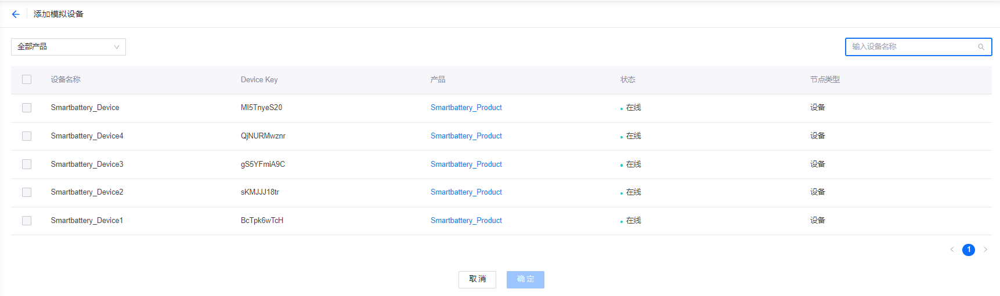
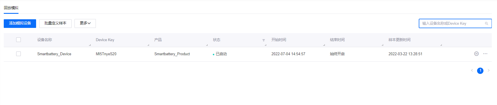
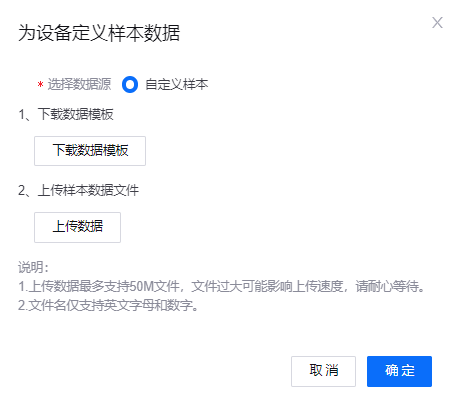
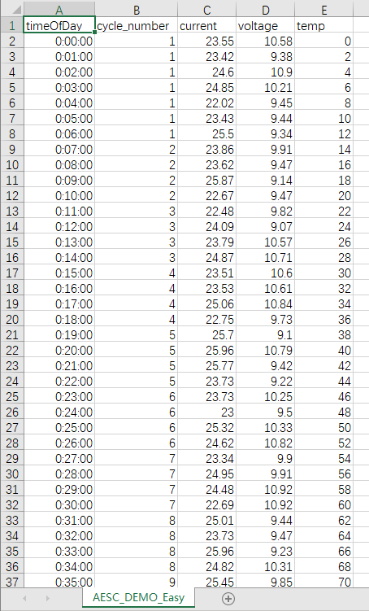
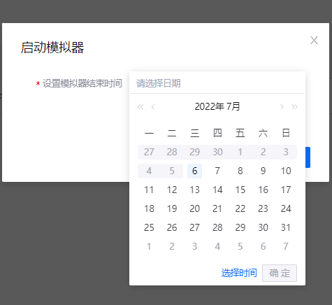

# 实验 2：模拟测点数据

你可以通过设备模拟器在不使用 EnOS 提供的 SDK 的情况下模拟已在 EnOS 注册的设备将发送数据至 EnOS的过程。设备模拟器可用于以下场景：

- EnOS 入门学习：你可以通过设备模拟器接收数据，以熟悉 EnOS 的各项功能。
- 异常调试：应用开发过程中，你可以通过设备模拟器发送特殊值数据以验证设备功能。

本实验中，你将为一个向 EnOS 发送数据的智能电池设备添加数据模拟器。同时，你将在模拟数据样本中插入异常值以触发告警，并在 **时序数据管理 > 时序洞察** 中查看数据报表。

## 前提条件

- 确保已将需要模拟的设备注册到 EnOS 并已配置相应 TSDB 存储策略。
- 确保拥有使用以下功能的权限：
    
    - 模型
    - 设备管理
    - 告警管理
    - 时序数据管理

> **注解**：如需开通上述功能，联系 OU 管理员。

## 步骤 1：添加设备模拟器

通过以下步骤为已创建的智能电池设备添加设备模拟器：

1. 在 EnOS 管理控制台的左侧导航栏中，点击 **设备管理 > 设备模拟器**。

2. 点击 **添加模拟设备**。在 **添加模拟设备** 页面，你可以查看当前 OU 下的设备列表。

3. 在设备列表中选择智能电池设备。

    > **注解**：你只能为处于 **未激活** 或  **离线** 状态下的设备添加设备模拟器。

4. 点击 **确定** 添加设备模拟器。

你可以在设备模拟器列表中查看刚刚添加的设备模拟器。

## 步骤 2：定义模拟数据样本

添加设备模拟器后，通过以下步骤定义模拟数据样本：

1. 在设备模拟器列表中选择刚刚创建的设备模拟器，并点击 **编辑样本**。

2. 在 **为设备定义样本数据** 弹窗中，点击 **下载** 以下载数据模板。

3. 在数据模板中输入模拟数据，其中：

    - 首列 **timeOfDay** 为相对时间戳。你可以以 `HH:MM:SS` 格式输入 24 小时内的相对时间。
    - 其余列为设备模型中定义的测点。你只需要输入需要模拟的测点数据即可。
    - 各项数值为测点的数据值。如果测点数据类型为数组，则需采用 `[value1, value2, value3, ...]` 格式。若某一时间点无测点数据，则留空。

4. 在 **为设备定义样本数据** 弹窗中，点击 **上传** 将定义完成的数据文件上传到 EnOS 中。

5. 点击 **确定** 定义模拟数据样本。

> **注解**：你需要在 **temp** 测点一列中添加一些异常数据（大于 `50`），以便稍后在 [实验 4：计算电池健康状况](../../3_Data_Management/303%20CN/303-4_calculating_health_level.md) 中观察到智能电池设备的不同健康状况。

带有模拟数据的模板：[AESC_DEMO_Easy.csv](media/AESC_DEMO_Easy.csv)。

## 步骤 3：启动设备模拟器

上传模拟数据样本后，通过以下步骤启动设备模拟器：

1. 在设备模拟器列表中选择要启动的设备模拟器，并点击 **开始模拟** 图标。

2. 在 **启动模拟器** 弹窗中选择模拟器结束时间。本实验中，你需要将模拟器结束时间设置到 24 小时以后。

    > **注解**：你可以自定义模拟器结束时间。延长结束时间可为 TSDB 预留更多时间接收充足数据以生成报告。

3. 点击 **确定** 启动设备模拟器。

## 步骤 4：查看设备时序洞察表

通过以下步骤查看智能电池设备测点的实时数据报告：

1. 在 EnOS 管理控制台中，点击 **时序数据管理 > 时序洞察**。

2. 在 **设备选择** 中选择 **Smartbattery_Device** 智能电池设备。

3. 在 **已选测点** 中选择智能电池设备的测点以生成数据图表或表格。

## 下一实验

[实验 3：监控智能电池告警](302-3_monitoring_alerts_of_device.md)