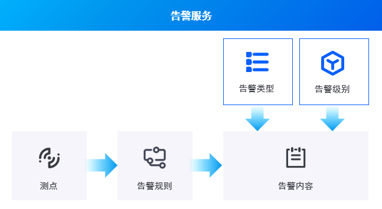
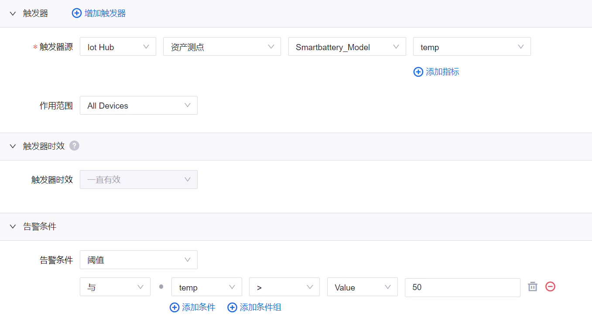
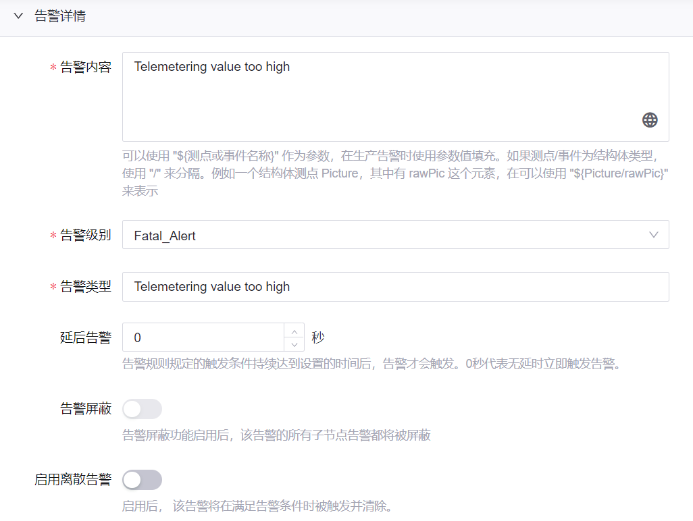
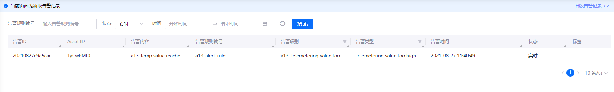
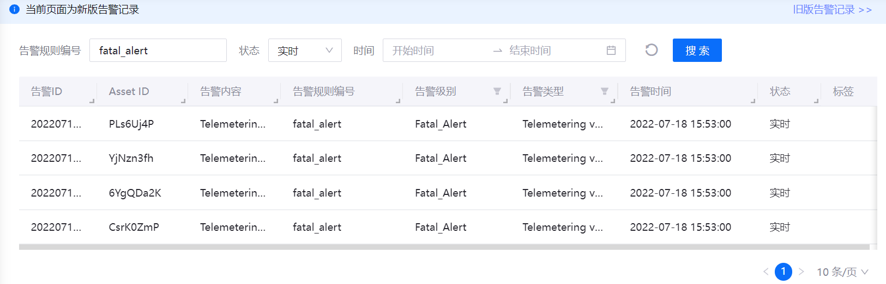

# 实验 3：监控智能电池设备告警

告警是满足用户设定的特定条件时由系统生成的记录。其中，**触发器** 用于在 **告警规则** 中定义告警的条件以触发告警，**告警内容** 为用户自定义的告警信息，**告警记录** 为告警触发时产生的告警内容等信息。EnOS 通常根据告警级别（如故障、警告或提示）和告警类型（如遥测越限）对告警进行分类从而更有效地区分与管理告警。

告警信息管理流程与关键概念如下所示：

你需要分别创建告警级别、告警类型和告警规则以监控智能电池设备的温度。本实验中，**Fatal Alert** 告警级别 和 **Telemetering value too high** 告警类型已预先配置完成。你只需定义 **告警规则** 即可监控智能电池设备状态。

## 步骤 1：定义告警规则

本实验中，你需要通过以下步骤定义告警规则以监控智能电池设备的温度：

1. 点击 **告警规则 > 新建规则**，打开 **添加告警规则** 页面 并配置以下信息以监控电池温度：

   - 在 **基本信息** 中输入告警规则的名称、编号和描述，并启用该规则。

   - 在 **触发器** 中对 **触发器源** 进行以下配置：

     - `Iot Hub` | `资产测点` | `Smartbattery_Model` | `temp`。

   - 在 **告警条件** 中点击 **添加条件组 > 添加条件** 并进行以下配置：

     - `temp`| `>` | `Value` | `50`

    

   - 在 **告警详情** 中配置以下信息：
     
     - **告警内容**：输入告警时显示的内容
     
     - **告警级别**：选择 **Fatal Alert**
    
     - **告警类型**：选择 **Telemetering value too high**

    

2. 点击 **确定** 创建告警规则。

    

## 步骤 2：查看告警记录

告警规则创建后，系统即开始监控智能电池设备的温度。你可以在 **告警管理 > 告警记录** 页面上查看该设备的实时和历史告警记录。

有关通过模拟数据的详细信息，参见 [实验 2：模拟测点数据](302-2_simulating_measure_points.md)。

## 步骤 3：获取告警数据

你可以使用告警服务 API 查询告警记录。例如，使用 **Search Active Alerts** API 通过组织 ID 或其他过滤条件查询当前告警信息。有关 EnOS API 的更多信息，参见 [EnOS™ API](https://support.envisioniot.com/docs/api/zh_CN/2.3.0/overview.html)。

我们将在应用开发部分对 EnOS API 进行详细介绍。

## 下一实验

[实验 4：关联资产到资产树](302-4_adding_assets_to_an_asset_tree.md)