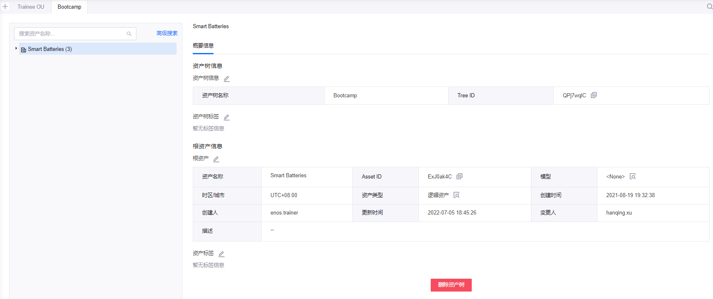
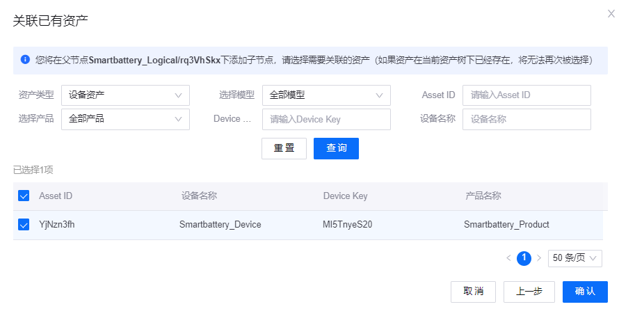

# 实验 4：关联资产到资产树

资产树是资产之间的层级关系。你可以基于资产树快速创建资产拓扑结构或管理云端资产。资产是可关联到资产树某一结点的最小单位，可分为设备资产和逻辑资产。同一资产可关联到多个资产树中以满足不同业务场景需要。

本实验中，你将关联一个逻辑资产和一个设备资产到同一资产树。

## 步骤 1：查看资产树信息

本实验中，你需要将资产关联到 **Bootcamp** 资产树。通过以下步骤选择 **Bootcamp** 资产树并查看其详细信息：

1. 在 EnOS 管理控制台左侧的导航栏中，点击 **资产树**。

2. 点击 **Bootcamp** 标签以查看该资产树的概要以及结构等信息。

## 步骤 2：新建并关联逻辑资产

逻辑资产代表某个存放实体设备的空间或实体设备的集合，例如地区、场站或楼层等。你可以根据模型创建逻辑资产并关联到资产树，也可以关联已有逻辑资产到资产树。例如，你可以通过以下步骤创建逻辑资产，并将其关联到资产树：

1. 在 **Bootcamp** 资产树标签页中，移动光标至 **Smart Batteries** 根节点，并点击 **+ 添加子节点** 图标。

2. 在 **添加子节点** 弹窗中选择 **新建资产并关联** 并点击 **下一步**。

3. 在 **添加子节点/新建资产并关联** 页面配置以下信息：

    - 资产名称：输入 **Smartbattery_Logical**
    - 选择模型：在下拉菜单中选择 **Smartbattery_Model**
    - 时区/城市：在下拉菜单中选择 **UTC +08:00**
    - 使用夏令时：不选择

4. 点击 **确认** 创建该逻辑资产并关联到 **Bootcamp** 资产树。

你可以通过点击 **概要信息**、**属性**、**测点** 或 **事件** 标签查看新建逻辑资产子节点的相关信息。

## 步骤 3：关联已有设备资产

设备资产代表一个物理设备，如光伏逆变器、风机等。本实验中，该设备指前几个实验中创建并配置的智能电池设备。 你可以通过以下步骤将该智能电池设备关联到 **Bootcamp** 资产树：

1. 在 **Bootcamp** 标签页中，移动光标至 **Smartbattery_Logical** 子节点，并点击 **+ 添加子节点** 图标。

2. 在 **添加子节点** 弹窗中选择 **关联已有资产** 并点击 **下一步**。

3. 在 **关联已有资产** 弹窗中通过设备 ID、Device Key 或设备名称等搜索智能电池设备，并点击 **查询**。

4. 在设备列表中勾选智能电池设备的复选框。

5. 点击 **确认** 关联智能电池设备到 **Bootcamp** 资产树。

你可以通过点击 **概要信息**、**属性**、**测点** 或 **事件** 标签查看该设备资产的相关信息。同时，对于物理设备子节点，你可以点击 **命令** 标签以向该智能电池设备下发命令。有关下发命令的详细信息，参见 [下发命令](https://support.envisioniot.com/docs/device-connection/zh_CN/2.3.0/howto/device/viewing_command_status.html)。