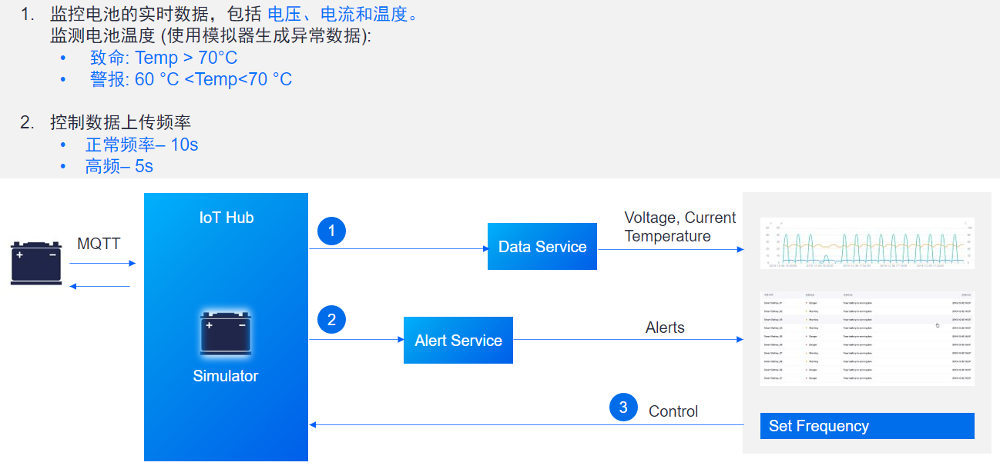

# 设备连接与管理

连接设备与数据是应用 IOT 平台的首要任务。本教程即为有关设备连接与管理的基础学习模块。

## 应用场景

在能源行业，监测充电期间的电池状态是常见的业务场景，而温度是判断电池状态的重要安全指标。通过将智能电池设备连接到 EnOS 你可以摄取实时温度数据、配置设备告警以监控电池运行情况从而掌握电池运行状态。

本教程所述应用场景如下图所示：

本教程将介绍智能电池设备管理的基本操作步骤：

- 注册并连接智能电池设备至 EnOS。
- 使用通过 Java/Python SDK 开发的 Java/Python 程序模拟并发布电池的测点数据。
- 监控智能电池告警。

## 前提条件

- 你已经在 EnOS 注册了个人或企业账户，并可访问 EnOS 管理控制台。
- 你的账户能够访问 IoT Hub 和企业数据平台的所有服务（本次培训中，你使用的账户已开通相关权限）。

## 教程实验

本教程包含以下实验：

[实验 1：将智能电池设备接入 EnOS™（Java）](302-1_connecting_device_to_EnOS_cloud_java.md)

[实验 1：将智能电池设备接入 EnOS™（Python）](302-1_connecting_device_to_EnOS_cloud_python.md)

40 分钟

[实验 2：模拟测点数据](302-2_simulating_measure_points.md)

30 分钟

[实验 3：监控智能电池设备告警](302-3_monitoring_alerts_of_device.md)

30 分钟

[实验 4：关联资产到资产树](302-4_adding_assets_to_an_asset_tree.md)

30 分钟

## 相关文档

[EnOS™ IoT Hub - 连接与资产管理服务](https://support.envisioniot.com/docs/device-connection/zh_CN/2.3.0/device_management_overview.html)
