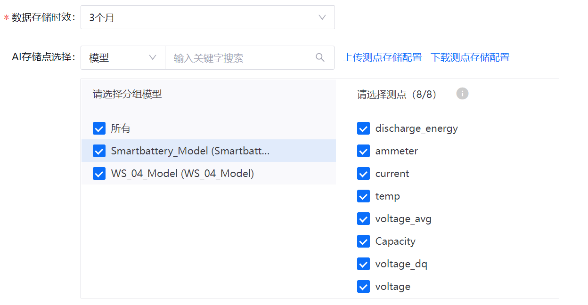
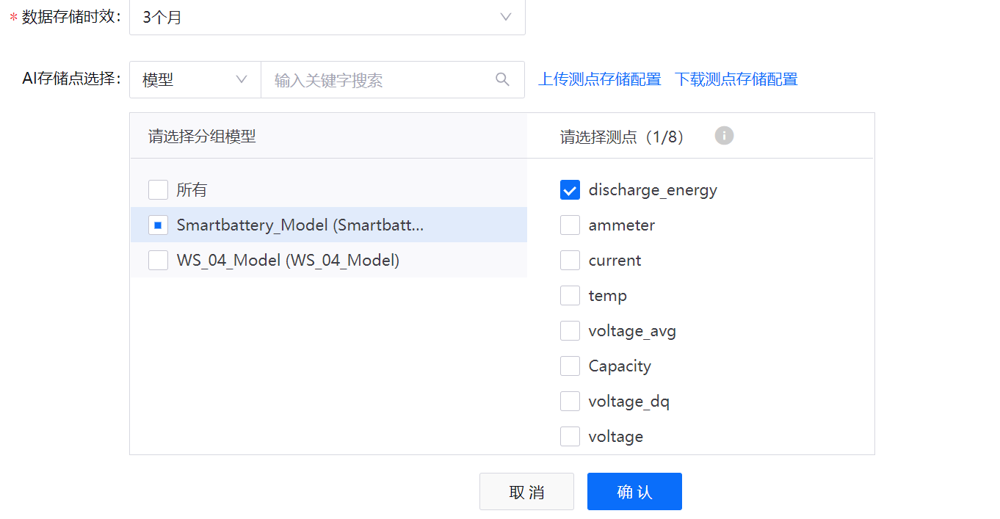
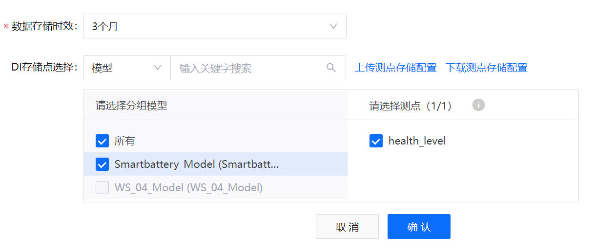
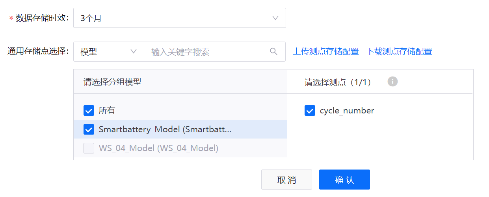

# 实验 1：配置电池数据的存储策略

EnOS 时序数据库（Time Series Database，简称 TSDB）提供多样的存储选项，存储经常访问的重要业务数据。通过配置存储策略，你可以根据数据类型和存储时间将时间序列数据路由到不同的数据存储从而降低数据存储成本并提高数据访问效率。

>**注解**：
> - 默认情况下，上传至 EnOS 的数据将不会存储在 TSDB 中。因此，你需要在上传数据之前配置数据存储策略，从而确保数据成功上传至 EnOS 云端。
> - 每个模型只能关联一个存储策略组。

本单元中，你需要为 **Smartbattery_Model** 模型中的以下测点配置相应存储策略：

|  测点名称                       |  存储类型                         |  描述                           |
|  -----------------------------  |  -----------------------------   |  ----------                    |
|  current                        |  AI 原始数据                     |  电池的实时放电电流               |
|  voltage                        |  AI 原始数据                     |  电池的实时电压                   |
|  temp                           |  AI 原始数据                     |  电池的实时温度                   |
|  voltage_avg                    |  AI 原始数据                     |  平均电压流处理作业结果的输出点    |
|  health_level                   |  DI 数据                         |  健康状况流处理作业结果的输出点    |
|  cycle_number                   |  通用数据                        |  电池的充电-放电周期次数           |

有关存储策略类型的详细信息，参见 [配置 TSDB 存储](https://support.envisioniot.com/docs/time-series-data/zh_CN/2.3.0/cloudpolicy/configuring_tsdb_storage.html)。

## (可选) 步骤 1：创建存储策略分组

你可以通过存储策略分组分别储存来自不同项目的时间序列数据。在配置测点的存储策略之前，你需要首先创建一个新的存储策略分组或选择一个现有的存储策略分组。

> **注解**：每个 OU 最多同时存在 5 个存储策略分组。本实验中，你需要在 **Developer_Bootcamp** 分组中配置存储策略。

通过以下步骤创建一个新的存储策略分组：

1. 在 EnOS 管理控制台的左侧菜单中选择 **时序数据管理 > 存储策略**。

2. 点击页面右上的 **+ > 手动添加** 以创建新存储策略分组并配置以下信息：

   - **分组名**：输入该存储策略分组的名称。
   - **分组模型**：选择 **Smartbattery_Model**，将其关联到该存储策略分组。

3. 点击 **确认** 创建新存储策略分组。

## 步骤 2：配置存储策略

你可以在 **存储策略** 页面查看当前存储策略分组下的所有存储策略类型。你需要在 **Developer_Bootcamp** 分组中分别为上述模型测点配置存储策略。

以 **AI 原始数据** 为例：

1. 找到 **AI 原始数据** 并点击 **编辑** 图标  以打开 **编辑存储策略** 页面。

2. 在 **编辑存储策略** 页面中配置 AI 原始数据的 **数据存储时效**。在本实验中，你需要将数据存储时效设置为 **3 个月**。

3. 在 **请选择分组模型** 中选择 **Smartbattery_Model**，并在 **请选择测点** 中选择以下测点：

   - discharge_energy
   - ammeter
   - current
   - temp
   - voltage_avg
   - capacity
   - voltage_dq
   - voltage

4. 点击 **确认** 保存存储策略配置。

   

5. 根据上述步骤配置其他存储策略：

- **AI 分钟级归一化数据**：

   

- **DI 数据**：

   

- **通用数据**：

   

## 下一实验

[实验 2：归档电池数据](303-2_archiving_data.md)
