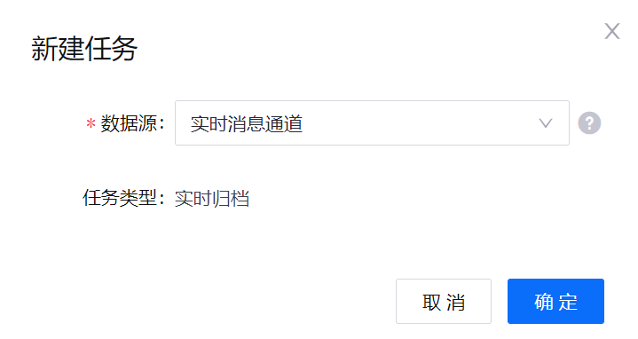

# 实验 2：归档电池数据

EnOS 数据归档服务通过归档数据并将其同步到目标数据库实现数据备份。本单元中，你将配置数据归档任务储存智能电池设备上传至 EnOS 的数据，并将其用于后续数据处理与分析任务。

## 步骤 1：创建数据归档任务

通过以下步骤创建数据归档任务以储存并归档数据：

1. 在 EnOS 管理控制台左侧菜单中点击 **数据归档**。

2. 在 **数据归档** 页面中点击 **新建任务**，并在弹窗中选择 **实时消息通道** 为数据源。

   

3. 点击 **确定** 创建数据归档任务并打开 **新建任务** 配置页面。

## 步骤 2：配置数据归档任务

通过以下步骤在 **新建任务** 配置页面中配置数据归档任务：

1. 在 **基础信息** 中配置以下信息：

   - 名称：输入该数据归档任务的名称，例如 **Smart_Battery**。
   - 描述：输入该数据归档任务的描述。

   
2. 在 **存储配置** 中配置以下信息：

   - 资源类型：在下拉列表中选择 **HDFS**。
   - 存储资源：在下拉列表中选择本 OU 在 **资源管理** 中已请求的存储资源。
   - 存储路径：输入归档数据在存储系统中的存储路径，指定目录的时间分区格式并选择 **按事件时间生成目录**。其中，路径目录必须以 “/” 开头和结尾。有关存储路径配置的详细信息，参见 [存储路径分区参数](https://support-cn5.envisioniot.com/docs/data-archiving/zh_CN/2.3.0/archive_storage.html#storage-path-partition-parameters)。
   - 文件名称：输入归档文件的文件名。系统将自动在文件名后添加 `_UTC` 时间戳后缀。
   - 其余配置项保留默认配置。

   

3. 在 **归档配置** 中将归档周期设置为 **1 小时**。 处在同一归档周期内的数据将被写入同一个文件，并按文件大小上限进行切分。

4. 在 **内容配置** 中选择 **Smartbattery_Model** 模型。

5. 点击 **确认** 保存数据归档配置。

存档任务配置完成后，系统将自动开始在指定的消息通道上读取和存储数据。

有关生成归档文件的详细信息，参见 [归档文件生成规则](https://support.envisioniot.com/docs/data-archiving/zh_CN/2.3.0/archive_storage#generation-of-archived-files)。

## 下一实验

[实验 3：计算电池的平均工作电压](303-3_calculating_average_voltage.md)
