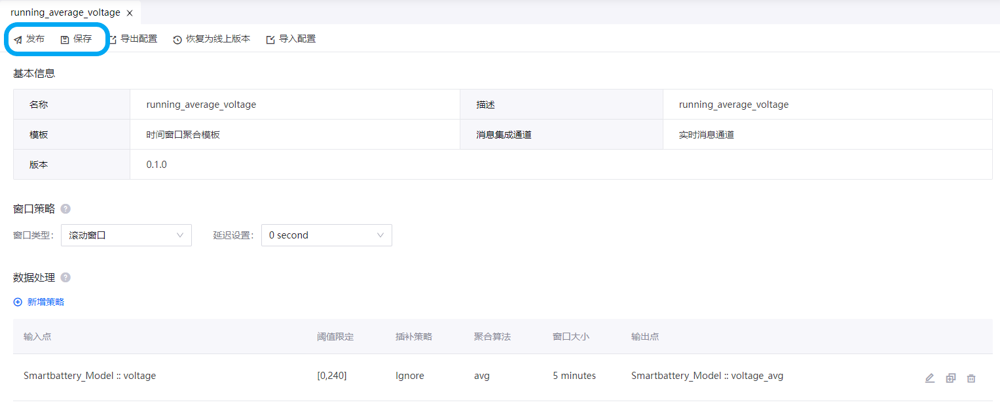

# 实验 3：计算电池的平均工作电压

EnOS 流数据处理服务提供基于模板的可视化任务流配置，从而实现流分析任务的快速部署，处理实时获取或从离线通道获取的时间序列数据。在为电池数据配置相应存储策略后，你可以创建流数据处理任务流，并通过 **时间窗口聚合模板** 计算电池的平均工作电压。

本实验中，你将用到以下项目：

| 项目        | 描述                                                  |
| ----------- | ------------------------------------------------------------ |
| 输入数据  | **voltage**：电池工作电压 |
| 输出数据  | **voltage_avg**：电池工作电压的平均值   |
| 模板      | **时间窗口聚合模板**：创建用于聚合单个测点数据的流处理任务流，并将处理后的数据分配到同一设备的另一测点|

## (可选) 步骤 1：安装时间窗口聚合模板

若所在 OU 未安装 **时间窗口聚合模板**，你首先需要通过以下步骤安装该模板：

> **注解**：本实验所需的 **时间窗口聚合模板** 已预先安装至当前 OU。

1. 在 EnOS 管理控制台的左侧菜单中点击 **流数据处理 > 包管理**。

2. 点击 **算法模板** 标签以查看可安装的算法模板。EnOS 目前支持安装以下算法模板：

   - **时间窗口聚合模板**：基于事件时间，对一定时间窗口内的数据进行聚合运算
   - **电量计算模板（按表读数）**：基于两点间的电表读数差值计算电量
   - **电量计算模板（按瞬时功率）**：基于瞬时功率*时间计算电量
   - **电量计算模板（按平均功率）**：基于两点间的平均功率*时间计算电量

3. 选择 **时间窗口聚合模板** 并点击 **安装**，系统会自动开始安装算法模板。

## 步骤 2：创建流数据处理任务

安装 **时间窗口聚合模板** 后，你可以通过以下步骤创建流数据处理任务并计算智能电池设备的平均工作电压：

1. 在 EnOS 管理控制台的左侧菜单中点击 **流数据处理 > 流开发**。

2. 在任务流开发页面点击任务流列表上方的 **+** 以添加新任务。

3. 在 **添加流** 弹窗中配置以下信息：

   - 流类型：选择 **常规**。
   - 方式：选择 **新建**。
   - 名称：输入该任务的名称，例如 **running_average_voltage**。
   - 描述：输入该任务的描述。
   - 模板：在下拉列表中选择 **时间窗口聚合模板**。
   - 版本：在下拉列表中选择 **0.1.0**。
   - 数据通道：选择 **实时通道** 以处理智能电池设备的实时数据。

4. 点击 **确认** 创建该流数据处理任务。

## 步骤 3：配置流数据处理任务

在任务流列表中双击 **running_average_voltage** 打开任务详情页面并通过以下步骤配置该流数据处理任务：

1. 在 **窗口策略** 中配置以下信息：

   - 窗口类型：从下拉列表中选择 **滚动窗口**。
   - 延迟设置：从下拉列表中选择 **0 second**。

2. 在 **数据处理** 中点击 **新增策略** 并配置以下信息：

   - 输入点：点击文本框，打开 **选择模型点** 标签页并选择 **Smartbattery_Model** 模型以及 **voltage** 测点。
   - 阈值限定：设置阈值为 **[0,240]**。
   - 插补策略：从下拉列表中选择 **Ignore**。
   - 聚合算法：从下拉列表中选择 **avg**。
   - 窗口大小：将窗口大小设置为 **5 minutes**。
   - 输出点：点击文本框，打开 **选择模型点** 标签页并选择 **Smartbattery_Model** 模型以及 **voltage_avg** 测点。

3. **数据处理** 部分点击 **保存** 图标  以保存上述配置。

配置完成的模板如下所示：

有关 **时间窗口聚合模板** 的详细信息，参见 [配置时间窗口数据聚合任务](https://support.envisioniot.com/docs/stream-processing/zh_CN/2.3.0/configuring_ai_template.html).

## 步骤 4：发布流数据处理任务

任务流配置完成后，你可以在任务流详情页面通过以下步骤发布任务流：

1. 点击 **保存** 保存当前任务流配置。

2. 点击 **发布** 将任务流发布上线。

   

## 步骤 5：启动流数据处理任务

为保证流数据处理任务能够正常运行，你需要首先启动相关的系统流任务。本实验中，你需要启动下列系统流任务：

- Data Reader RealTime
- Data Writer RealTime

通过以下步骤启动系统流任务以及 **running_average_voltage** 流数据处理任务：

1. 在 **流数据处理 > 流运维** 页面中点击 **系统流任务列表** 标签。

2. 在 **系统流任务列表** 标签页中点击以下系统流任务的 **启动** 图标 ：
   
   - Data Reader RealTime
   - Data Writer RealTime

   

3. 上述系统流任务启动后，点击 **用户流任务列表** 标签以查看当前 OU 的用户流任务列表。

4. 在列表中找到 **running_average_voltage** 任务流，点击 **更多** 图标  并在下拉列表中点击 **运行配置**。

5. 在 **运行配置 (running_average_voltage)** 弹窗中，设置运行资源为 **0.5** CU 并点击 **确定** 以保存配置。

   

6. 点击 **启动** 图标  启动该流数据处理任务，该过程大约需要 5 分钟。

## 步骤 6：查看运行结果

在 **流运维 > 用户流任务列表** 页面点击 **running_average_voltage** 查看该流数据处理任务的运行结果：

- **Summary**：查看流数据处理任务运行的情况总结, 例如数据吞吐量等信息。

- **Error**：查看流数据处理任务运行的错误报告，例如错误报告直方图等信息。

- **Info**：查看流数据处理任务的基本信息，例如最后修改日期等信息。

- **History**：查看流数据处理任务的历史日志，例如任务流修改的时间表等信息。

流数据处理任务运行一段时间后，你可以通过以下步骤查看智能电池设备的平均工作电压：

1. 在 EnOS 管理控制台中点击 **时序数据管理 > 时序洞察**

2. 在 **设备选择** 中选择 **Smartbattery_Device**。

3. 在 **已选测点** 中选择 **voltage_avg** 生成智能电池设备平均工作电压的折线图。

## 下一实验

[实验 4：计算电池的健康状况](303-4_calculating_health_level.md)
