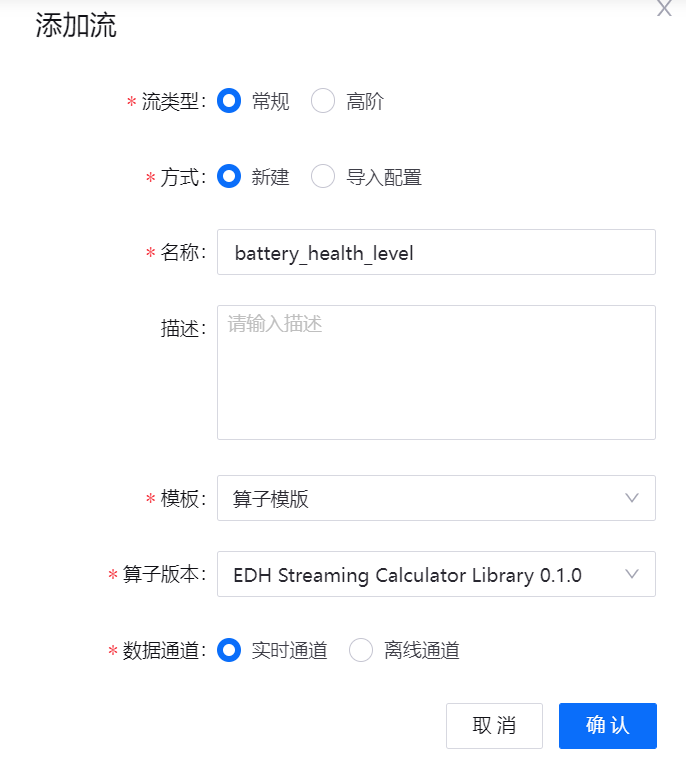

# 实验 4：计算电池的健康状况

EnOS流数据处理提供拖拽式的可视化流数据任务设计界面，你可以通过编排算子组合流数据处理任务，无需编写代码即可实现数据采集、数据过滤、数据处理和数据存储等任务。

本实验中，你将基于智能电池设备的实时温度数据，通过配置流数据处理任务计算该设备的健康状况。本实验的具体场景如下所示：

- 提取并存储智能电池设备的实时温度数据。

- 为了避免电池温度波动对分析结果的影响，每 2 分钟计算一次电池的平均温度。

- 比较电池平均温度与电池工作时可承受的最高温度（即 **Smartbattery_Model** 的 `UpperLimitTemp` 属性）。

- 根据比较结果定义以下健康状况：
  
  - **Level code 90**：健康，即电池平均温度低于 `UpperLimitTemp`。
  
  - **Level code 60**：不健康，即电池平均温度高于 `UpperLimitTemp` 但幅度不大于 3%。
  
  - **Level code 30**：极不健康，即电池平均温度高于 `UpperLimitTemp` 且幅度大于 3%。

为满足上述场景要求，你需要配置以下 StreamSet 算子：

| 算子                     | 描述                                                |
| ------------------------------ | ------------------------------------------------------------ |
| EDH Kafka Consumer             | 从 Kafka 获取完整数据                |
| Point Selector                 | 指定 `SmartBattery_Demo::temp` 测点数据为输入数据 |
| Fixed Time Window Aggregator   | 每 2 分钟获取一次温度数据，并计算平均温度 |
| TSL Asset Lookup               | 获取 **Smartbattery_Model** 模型的 `UpperLimitTemp` 属性 |
| Python Evaluator               | 通过自定义 Python 脚本计算电池的健康状况 |
| EDH Kafka Producer             | 向 Kafka 发送输出数据                       |

完整流程如下所示：


## (可选) 步骤 1：安装系统算子包

在配置流数据任务前，你需要通过以下步骤安装相应的系统算子包：

> **注解**: 本实验所需的系统算子包 （Streaming Calculator Library 0.1.0）已预先安装至当前 OU。

1. 在 EnOS 管理控制台左侧的菜单栏中点击 **流数据处理 > 包管理**。

2. 点击 **系统流任务列表** 标签以查看所有可安装的系统算子包。

3. 选中需要安装的系统算子包并点击 **安装**。


## 步骤 2：创建流数据处理任务

Streaming Calculator Library 0.1.0 安装完成后，你可以通过以下步骤创建流数据处理任务计算电池的健康状况：

1. 在 EnOS 管理控制台的左侧菜单中点击 **流数据处理 > 流开发**。

2. 在任务流开发页面点击任务流列表上方的 **+** 以添加新任务。

3. 在 **添加流** 弹窗中配置以下信息：
   
   - 流类型：选择 **常规**。
   - 方式：选择 **新建**。
   - 名称：输入该任务的名称，例如 **battery_health_level**。
   - 描述：输入该任务的描述。
   - 模板：在下拉列表中选择 **算子模板**。
   - 算子版本：在下拉列表中选择 **EDH Streaming Calculator Library 0.1.0**。
   - 数据通道：选择 **实时通道** 以处理智能电池设备的实时数据。

4. 点击 **确认** 创建该流数据处理任务。

   

## 步骤 3：添加流数据处理算子

在任务流列表中双击 **battery_health_level** 以打开任务详情页面并通过以下步骤在流数据处理任务中添加算子：

1. 点击 **EDH Kafka Consumer User 1** 算子和 **EDH Kafka Producer User 1** 算子之间的连线，并在工具栏中点击 **删除** 图标删除该连线。

   

2. 点击 **Stage Library**  图标，打开算子列表。

3. 在算子列表中点击 **Point Selector**，将其添加到流数据处理任务画布上。

4. 连接 **EDH Kafka Consumer User 1** 算子的输出锚点与 **Point Selector 1** 算子的输入锚点。

5. 重复上述步骤以接入以下算子：

   - **Fixed Time Window Aggregator**，自 **Point Selector 1** 算子的输出锚点接入
   - **TSL Asset Lookup**，自 **Fixed Time Window Aggregator 1** 算子的输出锚点接入
   - **Python Evaluator**，自 **TSL Asset Lookup 1** 算子的输出锚点接入，并连接到 **EDH Kafka Producer User 1** 算子的输入锚点上

6. 点击 **Auto Arrange**  图标，画布中的算子将自动排列对齐。

配置完成的流数据处理任务如下图所示：

   

## 步骤 4：配置算子参数

创建并连接算子后，你需要为画布中的算子配置参数。

### Point Selector

**Point Selector** 算子用于从当前 OU 对应的 Kafka 中选取流数据处理需要处理的测点。在流数据处理任务画布中点击 **Point Selector 1** 算子，并在 **Input/Output** 标签页中配置以下信息：

| 字段       | 值                   | 描述                                           |
| ----------- | ----------------------- | ----------------------------------------------------- |
| Input Point | Smartbattery_Model::temp | 从 Kafka 输入 `temp` 测点数据 |

### Fixed Time Window Aggregator

**Fixed Time Window Aggregator** 算子用于按特定时间聚合各测点的数据。 在流数据处理任务画布中点击 **Fixed Time Window Aggregator 1** 算子，并在 **Input/Output** 标签页中配置以下信息：

| 字段               | 值                       | 描述                                           |
| ------------------- | --------------------------- | ----------------------------------------------------- |
| Input Point         | Smartbattery_Model::temp     | 输入 `temp` 测点数据        |
| Fixed Window Size   | 2                           | 指定滚动窗口的时长            |
| Fixed Window Unit   | minute                      | 指定滚动窗口的时间单位                               |
| Aggregator Policy   | avg                         | 计算平均温度                |
| Output Point        | Smartbattery_Model::temp_avg | 指定 `temp_avg` 作为接收输出数据的测点 |

在 **TriggerConfig** 标签页中配置以下信息：

| 字段               | 值                       | 描述                                           |
| ------------------- | --------------------------- | ----------------------------------------------------- |
|Latency (Minute)         | 0    | 指定系统允许的最大数据延迟       |
| Early Trigger   | Enable                          | 选择是否支持在当前窗口结束前提前输出中间结果            |
| Early Trigger Type  | By Input Point                      | 选择提前输出中间结果的方式                 |


### TSL Asset Lookup

**TSL Asset Lookup** 算子用于查找指定设备的资产数据信息。你需要为该算子配置以下信息：

1. 在流数据处理任务画布中点击 **TSL Asset Lookup 1** 算子，并在 **Input/Output** 标签页中配置以下信息：

   | 字段        | 值                          | 描述                                     |
   | ------------ | ------------------------------- | ----------------------------------------------- |
   | Input Point  | Smartbattery_Model::temp_avg     | 获取 `temp_avg` 测点数据 |
   | Output Point | Smartbattery_Model::temp_avg_out | 指定 `temp_avg` 作为接收输出数据的测点  |

   

2. 在 **Criteria** 标签页中配置以下信息：

   | 字段     | 值 | 描述                                                  |
   | --------- | ----- | ------------------------------------------------------------ |
   | Attribute | All   | 获取 **Smartbattery_Model** 模型中的 `UpperLimitTemp` 属性信息，并将其纳入输出结果 |

   

### Python Evaluator

**Python Evaluator** 算子用于运行 Python 脚本从而实现自定义业务逻辑。你需要为该算子配置以下信息：

1. 在流数据处理任务画布中点击 **Python Evaluator 1** 算子，并在 **Input/Output** 标签页中配置以下信息：

   | 字段        | 值                          | 描述                                                  |
   | ------------ | ------------------------------- | ------------------------------------------------------------ |
   | Input Point  | Smartbattery_Model::temp_avg_out | 获取 `temp_avg_out` 测点数据            |
   | Output Point | Smartbattery_Model::health_level | 指定 `health_level` 作为接收输出数据的测点 |

   

2. 在 **Script** 标签页中 **Python Script** 部分输入以下代码：

   ```python
   # Comparing the average temperature with the specified temperature limit
   def get_health_level(temp_avg, temp_limit):
      if temp_avg > temp_limit * 1.03:
         return 30
      elif temp_avg > temp_limit:
         return 60
      else:
         return 90

   # Getting the temperature data from the input data records       
   for record in records:
   try:
      attrs = record.value['attr']['tslAssetLookup']['attributes']
      temp_limit = float(attrs['UpperLimitTemp'])
      temp_avg = record.value['value']
      health_level = get_health_level(temp_avg, temp_limit)

   # Sending results to the specified output point    
      record.value['pointId'] = 'health_level'
      record.value['value'] = health_level
      output.write(record)

   except Exception as e:
      # Send record to error
      error.write(record, str(e))
   ```

上述算子配置完成后，点击 **保存** 保存配置信息。

## 步骤 5：验证并发布流数据处理任务

你可以通过以下步骤验证任务配置，并将该任务发布上线：

1. 点击工具栏上的 **Validate** 图标  验证上述算子的配置信息。

   

2. (可选) 若验证失败，根据验证结果更新配置并再次验证。

3. 点击 **发布** 将该流数据处理任务发布上线。

   

## 步骤 6：启动流数据处理任务

为保证流数据处理任务能够正常运行，你需要首先启动相关的系统流任务。本实验中，你需要启动下列系统流任务：

- Data Reader RealTime
- Data Writer RealTime

通过以下步骤启动系统流任务以及 **battery_health_level** 流数据处理任务：

1. 在 **流数据处理 > 流运维** 页面中点击 **系统流任务列表** 标签。

2. 在 **系统流任务列表** 标签页中点击以下系统流任务的 **启动** 图标  ：
   
   - Data Reader RealTime
   - Data Writer RealTime

   

3. 上述系统流任务启动后，点击 **用户流任务列表** 标签查看当前 OU 的用户流任务列表。

4. 在列表中找到 **battery_health_level** 任务流，点击 **更多** 图标 ，并在下拉列表中点击 **运行配置**。

5. 在 **运行配置 (battery_health_level)** 弹窗中，设置运行资源为 **0.5** CU 并点击 **确定** 保存配置。

6. 点击 **启动** 图标  启动该流数据处理任务，该过程大约需要 5 分钟。

   

## 步骤 7：查看运行结果

在 **流运维 > 用户流任务列表** 页面点击 **battery_health_level** 查看该流数据处理任务的运行结果：

- **Summary**：查看流数据处理任务运行的情况总结, 例如数据吞吐量等信息。

- **Error**：查看流数据处理任务运行的错误报告，例如错误报告直方图等信息。

- **Info**：查看流数据处理任务的基本信息，例如最后修改日期等信息。

- **History**：查看流数据处理任务的历史日志，例如任务流修改的时间表等信息。


流数据处理任务运行一段时间后，你可以通过以下步骤查看电池的健康状况：

1. 在 EnOS 管理控制台中点击 **时序数据管理 > 时序洞察**

2. 在 **设备选择** 中选择 **Smartbattery_Device**。

3. 在 **已选测点** 中选择 **health_level** 生成电池电压运行平均值的折线图。


## 下一实验

[实验 5：监控健康状况告警](303-5_monitoring_alerts.md)
