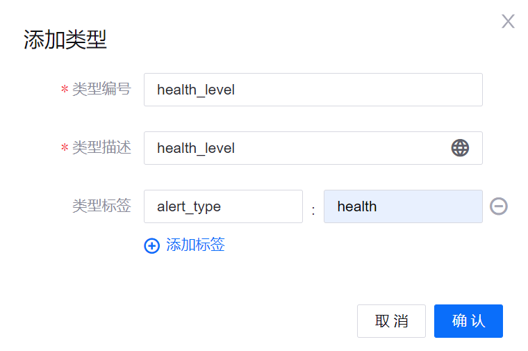

# 实验 5：监控健康状况告警

EnOS 告警管理服务提供告警规则定义、告警信息接收、告警信息处理等功能以管理组织内的资产。本实验中，你将启用告警服务以实时监控智能电池设备的健康状况。首先，你需要在 EnOS 管理控制台中定义告警级别、告警类型告警规则。

## 步骤 1：创建告警级别

在 [实验 4：计算电池健康状况](303-4_calculating_health_level.md) 中，你已经定义了 3 个电池健康状况级别。本实验中，你需要通过以下步骤根据上述 3 个健康状况级别创建相应的告警级别：

1. 登录至 EnOS 管理控制台，并在左侧菜单栏中点击 **告警管理 > 告警级别**。

2. 点击 **新增级别** 并在 **添加级别** 弹窗中配置以下信息：

   - 级别编号：输入该告警级别的编号，例如 **Warning_Alert**。
   - 级别描述：输入对该告警级别的描述。
   - 级别标签：点击 **添加标签** 并输入 **alert_severity** 为 Key，输入 **warning** 为 Value。

   

3. 点击 **确认** 创建 **Warning_Alert** 告警级别。

4. 通过相似步骤创建 **Fatal_Alert** 和 **Normal Alert** 告警级别，并配置以下信息：

| 健康状况代码       | 告警级别编号    | 告警级别标签                        |
| ----------------- | -------------- | ---------------------------------- |
| 90                | Normal_Alert   | `alert_severity` : `normal`        |
| 60                | Warning_Alert  | `alert_severity` : `warning`       |
| 30                | Fatal_Alert    | `alert_severity` : `fatal`         |

创建完成的 3 个告警级别如下所示：

## 步骤 2：创建告警类型

告警类型用于区分资产状态或查明告警原因。你可以通过以下步骤创建告警类型：

1. 在 EnOS 管理控制台的左侧导航栏中点击 **告警管理 > 告警类型**。

2. 在 **告警类型** 页面中点击 **新建类型**，并在 **添加类型** 弹窗中配置以下信息：

   - 类型编号：输入该告警类型的编号，例如 **health_level**。
   - 类型描述：输入对该告警级别的描述。
   - 类型标签：点击 **添加标签**，并输入 **alert_type** 为 Key，**health** 为 Value。

3. 点击 **确认** 创建 **health_level** 告警类型。

   

## 步骤 3：创建告警规则

告警规则用于定义触发告警的条件。本实验中，你需要分别为 **Warning_Alert** 和 **Fatal_Alert** 告警级别创建两个告警规则。

通过以下步骤为 **Warning_Alert** 告警级别创建相应告警规则：

1. 在 EnOS 管理控制台的左侧导航栏中点击 **告警管理 > 告警规则**。

2. 点击 **新建规则**，并在 **基本信息** 栏中配置以下信息：

   - **规则名称**：输入该告警规则的名称，例如 **health_level_warning**。
   - **规则名称**：输入该告警规则的编号，例如 `SMH-60`。
   - **规则描述**：输入对该告警级别的描述。
   - **是否启用**：启用。

3. 在 **触发器** 栏中配置以下信息：

   - **触发器源**：选择 `Iot Hub` | `资产测点` | `Smartbattery_Model` | `health_level`。
   - **作用范围**：选择 **All Devices** 以将该告警规则作用于所选模型下的所有设备。

4. 在 **告警条件** 栏中配置以下信息：

   - **告警条件**：选择 **阈值** 并点击 **添加条件组 > 添加条件** 以添加以下告警条件：
     - `health_level` | `>` | `Value` | `30`
     - `health_level` | `<=` | `Value` | `60`
   - **时序**：禁用。

5. 在 **告警详情** 栏中配置以下信息：

   - **告警内容**：输入 **Health level code:${health_level}** 以在告警内容中包含智能电池设备的实时健康状况信息。
   - **告警级别**：在下拉列表中选择 **Warning_Alert**。
   - **告警类型**：在 **选择告警类型** 弹窗中选择 **health_level**。
   - **延后告警**：输入 **0** 从而在满足条件时立即触发告警。

6. 点击 **确认** 为 **Warning_Alert** 告警级别创建相应告警规则。

通过以下步骤为 **Fatal_Alert** 告警级别创建相应告警规则：

1. 在 EnOS 管理控制台的左侧导航栏中点击 **告警管理 > 告警规则**。

2. 点击 **新建规则**，并在 **基本信息** 栏中配置以下信息：

   - **规则名称**：输入该告警规则的名称，例如 **health_level_fatal**。
   - **规则名称**：输入该告警规则的编号，例如 `SMH-30`。
   - **规则描述**：输入对该告警级别的描述。
   - **是否启用**：启用。

3. 在 **触发器** 栏中配置以下信息：

   - **触发器源**：选择 `Iot Hub` | `资产测点` | `Smartbattery_Model` | `health_level`。
   - **作用范围**：选择 **All Devices** 以将该告警规则作用于所选模型下的所有设备。

4. 在 **告警条件** 栏中配置以下信息：

   - **告警条件**：选择 **阈值** 并点击 **添加条件组 > 添加条件** 以添加以下告警条件：
     - `health_level` | `>` | `Value` | `60`
   - **时序**：禁用。

5. 在 **告警详情** 栏中配置以下信息：

   - **告警内容**：输入 **Health level code:${health_level}** 以在告警内容中包含智能电池设备的实时健康状况信息。
   - **告警级别**：在下拉列表中选择 **Fatal_Alert**。
   - **告警类型**：在 **选择告警类型** 弹窗中选择 **health_level**。
   - **延后告警**：输入 **0** 从而在满足条件时立即触发告警。

创建完成的 2 个告警规则如下所示：

## 步骤 4： 查看告警记录

告警规则创建完成后，系统即开始监控智能电池设备的健康状况。你可以在 **告警记录** 页面查看实时或历史告警触发记录。

你需要确保告警可以被触发，从而将其用于后续应用开发部分。
