# 实验 1：可视化智能电池数据

你可以通过 EnOS™ 数据可视化服务（Digital Twin Visualization，DTV） 将智能电池设备的相关数据可视化。借助 DTV，你可以通过低代码或无代码开发以及组件拖拽等方式快速构建包含可视化部件的设备指标页面。

## 前提条件

- 你已在 EnOS 注册了个人账户或企业账户并可访问 EnOS 管理控制台。

- 你的帐户拥有模型服务、设备连接和管理服务以及资产树服务的完全访问权限。

- 你已拥有 DTV 应用的访问权限。本实验中，你的账号已拥有相关权限。

## 探索 DTV 指标页面

本实验中，你将使用 **项目编辑器**、**页面编辑器** 以及 **图表编辑器** 构建显示智能电池设备数据的可视化指标页面。

### 项目编辑器

DTV 项目编辑器页面以缩略图形式显示当前 OU 所有项目的页面。

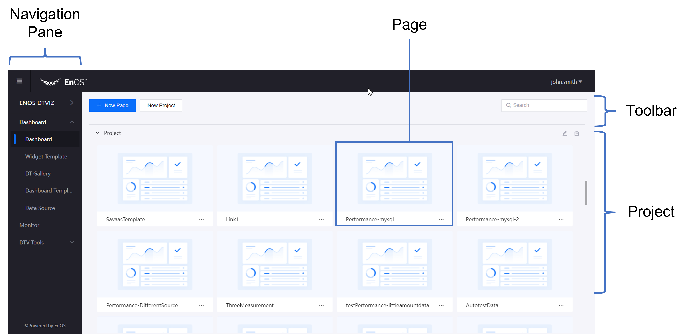

DTV 项目编辑器包含以下组件：

| 组件       | 描述 |
| ---------       | ----------- |
| 导航窗格 | 访问 DTV 的其他功能，例如 **组件模板** 和 **数据源** |
| 页面            | - 显示项目页面的缩略图   - 移动光标到页面卡片可显示页面编辑菜单 |
| 工具栏         | 可用于添加项目或页面，以及搜索项目 |
| 项目         | 显示项目及项目内的页面 |

### 页面编辑器

DTV 页面编辑器可用于管理指标页面。

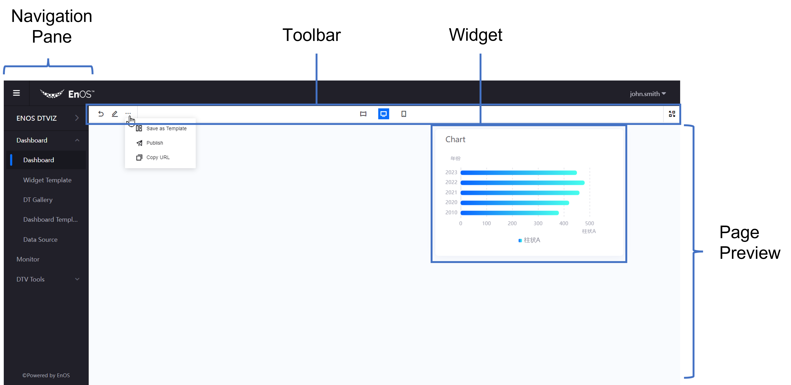

DTV 页面编辑器包含以下组件：

| 组件       | 描述 |
| ---------       | ----------- |
| 导航窗格 | 访问 DTV 的其他功能，例如 **组件模板** 和 **数据源** |
| 组件          | - 显示当前页面组件的缩略图   - 移动光标到组件卡片可显示组件编辑菜单 |
| 工具栏         | 可用于编辑当前页面 |
| 页面预览    | 预览当前页面 |

### 图表编辑器

DTV 图表编辑器可用于配置组件属性。

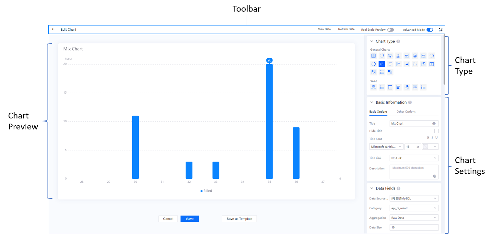

DTV 图表编辑器包含以下组件：

| 组件      | 描述 |
| ---------      | ----------- |
| 图表类型     | 更改当前图表的类型 |
| 图表设置 | 配置当前图表         |
| 工具栏        | 启用高级模式或展示图表实际尺寸 |
| 图表预览  | 预览当前图表 |

## 步骤 1：标记模型

你需要通过以下步骤对模型进行标记从而将模型数据同步到 DTV 应用并在 DTV 应用中使用模型数据构建指标页面：

1. 在 EnOS 管理控制台的导航菜单中点击 **模型**。

2. 在设备模型列表中找到目标模型并点击 **编辑**，打开 **模型详情** 页面。

3. 在 **模型详情** 页面中，点击 **标签信息** 部分的 **编辑** 图标 。

4. 在 **编辑** 弹窗中点击 **添加标签** 并输入 `auth_unit` | `true`。

5. 点击 **确定** 标记模型。

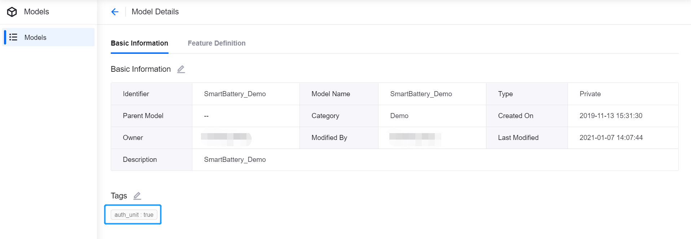

## 步骤 2：创建项目与页面

你需要通过以下步骤创建一个项目并在项目中创建用于存放可视化组件的页面：

1. 在 EnOS 管理控制台的导航菜单中点击 **指标页面**。

2. 点击 **新建项目** 并在弹窗中输入项目名称，例如：**Smart Battery**。

3. 点击 **新建页面** 并在弹窗中配置以下信息：

   - 名称：输入新建页面的名称，例如：`Smart Battery`

   - 项目：从下拉菜单中选择你刚刚创建的项目

4. 点击 **确定**，完成页面创建并打开 **页面编辑器**。

   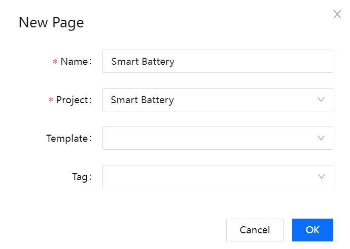

## 步骤 3：添加组件

DTV 提供丰富的可视化组件以满足复杂的业务场景需求。本实验中，你将添加以下可视化组件：

- **多度量卡**：直观显示数据
- **环形仪表盘**：测量并显示进度信息
- **条形图**：比较数据
- **地图**：显示地理位置信息
- **混合图**：比较数据或显示数据变化趋势
- **饼图**：显示数据系列内各个数据的比例关系
- **表格**：以表格形式显示复杂数据
- **热力图**：对比大量数据并识别异常值

有关 DTV 可视化组件的详细信息，参见 [组件](https://support.envisioniot.com/docs/dtv/en/2.3.0/reference/widgets/index.html)。

### 添加多度量卡

通过以下步骤添加显示智能电池设备主要测点数据的多度量卡：

1. 在页面编辑器的工具栏中，点击 **添加 > 组件**。

2. 在 **新建组件** 弹窗中选择 **多度量卡** 并点击 **确定**。

3. 将光标移动到组件卡片的 **更多** 图标  并在下拉菜单中点击 **编辑** 打开 **图表编辑器**。

4. 点击工具栏右侧的 **高级模式**，启用更多图表配置项。

5. 在 **基本信息** 中配置以下信息：

   - 标题：输入该组件的标题，如 `Battery Status`
   - 隐藏标题：禁用
   - 标题跳转链接：选择 **无跳转**

6. 在 **选择数据源** 中配置以下信息：

   - 数据源：选择 **TSDB > LatestData** 
   - 类别：选择 **Smartbattery_Model**，即你创建的模型
   - 度量：点击 **添加数据项** ，在弹窗中选择 **health_level**、 **cycle_number**、 **current**、 **temp**、 **Capacity** 以及 **voltage** 并点击 **确定**

7. 度量数据项添加完成后，点击以下数据项标签为其配置别名：

   |度量|别名|
   |--- |---|
   |current|电流|
   |temp|温度|
   |cycle_number|循环次数|
   |voltage|电压|
   |health_level|健康状况|
   |Capacity|电池容量|

8. 在 **选择图表样式 > 度量样式** 中配置以下信息：

   | 度量 | 名称字体 | 单位名称 | 数值字体 | 小数位数 | 对齐方式 | 名称-数值框间距 |
   | ----------- | --------- | --------- | ---------- | -------------- | --------- | ----------------------- |
   | health_level | 14 pt | % | 加粗，20pt | 0 | 居中 | 0 |
   | cycle_number | 14 pt | / | 加粗，20pt | 0 | 居中 | 0 |
   | current | 14 pt | A | 加粗，20pt | 0 | 居中 | 0 |
   | temp | 14 pt | °C | 加粗，20pt | 0 | 居中 | 0 |
   | Capacity | 14 pt | KW | 加粗，20pt | 0 | 居中 | 0 |
   | voltage | 14 pt | V | 加粗，20pt | 0 | 居中 | 0 |

9. 在 **多度量卡样式**中配置以下信息：

   - 布局：配置组件行数为 **2** ，列数为 **3**
   - 左右间距：输入 **64** pt
   - 显示 "展开"：禁用

10. 自定义组件的其他配置。

11. 点击 **保存**，将配置完成的组件添加到页面中。

   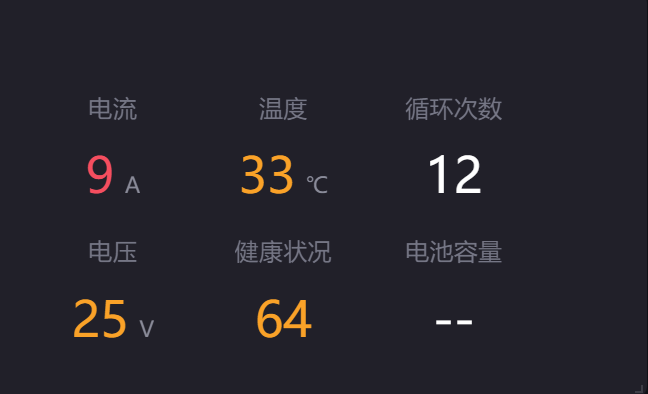

### 添加环形仪表盘

通过以下步骤添加显示电池健康状态的环形仪表盘：

1. 在页面编辑器的工具栏中，点击 **添加 > 组件**。

2. 在 **新建组件** 弹窗中选择 **环形仪表盘** 并点击 **确定**。

3. 将光标移动到组件卡片的 **更多** 图标  并在下拉菜单中点击 **编辑** 打开 **图表编辑器**。

4. 在 **基本信息** 中配置以下信息：

   - 标题：输入该组件的标题，如 `Battery Health Level`
   - 隐藏标题：禁用
   - 标题跳转链接：选择 **无跳转**

5. 在 **选择数据源** 中配置以下信息：

   - 数据源：选择 **TSDB > LatestData** 
   - 类别：选择 **Smartbattery_Model**，即你创建的模型
   - 对比：点击 **添加数据项** ，在弹窗中选择 **AssetName** 并点击 **确定**
   - 度量：**添加数据项** ，在弹窗中选择 **health_level** 并点击 **确定**

6. 在 **选择图表样式 > 对比样式** 中配置以下信息：

   - 布局：配置组件行数为 **2** ，列数为 **3**
   - 显示 "展开"：禁用

7. 在 **选择图表样式 > 度量样式** 中配置以下信息：

   - 轴线范围：将 Min 设置为 `0`，Max 设置为 `100` 
   - 以百分比显示：禁用
   - 格式规则：点击 **新增** 添加以下规则：

     |数值范围|颜色|
     |----|----|
     |0 - 40|红色| 
     |40 - 70|黄色| 
     |70 - 100|绿色| 

8. 自定义组件的其他配置。

9. 点击 **保存**，将配置完成的组件添加到页面中。

   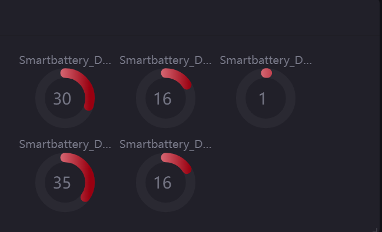

### 添加条形图

通过以下步骤添加显示智能电池设备电压信息的条形图：

1. 在页面编辑器的工具栏中，点击 **添加 > 组件**。

2. 在 **新建组件** 弹窗中选择 **条形图** 并点击 **确定**。

3. 将光标移动到组件卡片的 **更多** 图标  并在下拉菜单中点击 **编辑** 打开 **图表编辑器**。

4. 在 **基本信息** 中配置以下信息：

   - 标题：输入该组件的标题，如 `Battery Voltage`
   - 隐藏标题：禁用
   - 标题跳转链接：选择 **无跳转**

5. 在 **选择数据源** 中配置以下信息：

   - 数据源：选择 **TSDB > LatestData** 
   - 类别：选择 **Smartbattery_Model**，即你创建的模型
   - 对比：点击 **添加数据项** ，在弹窗中选择 **AssetName** 并点击 **确定**
   - 度量：点击 **添加数据项** ，在弹窗中选择 **voltage** 并点击 **确定**

6. 自定义组件的其他配置。

7. 点击 **保存**，将配置完成的组件添加到页面中。

   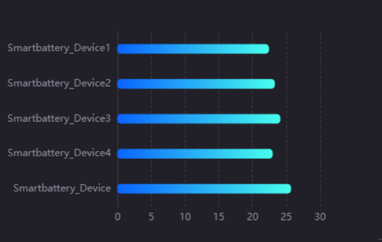

### 添加混合图

通过以下步骤添加显示智能电池设备多测点变化趋势的混合图：

1. 在页面编辑器的工具栏中，点击 **添加 > 组件**。

2. 在 **新建组件** 弹窗中选择 **混合图** 并点击 **确定**。

3. 将光标移动到组件卡片的 **更多** 图标  并在下拉菜单中点击 **编辑** 打开 **图表编辑器**。

4. 在 **基本信息** 中配置以下信息：

   - 标题：输入该组件的标题，如 `Battery Data Insights`
   - 隐藏标题：禁用
   - 标题跳转链接：选择 **无跳转**

5. 在 **选择数据源** 中配置以下信息：

   - 数据源：选择 **TSDB > AIRaw** 
   - 类别：选择 **Smartbattery_Model**，即你创建的模型
   - 开始时间：选择开始获取数据的时间
   - 结束时间：选择停止获取数据的时间
   - 维度：点击 **添加数据项**， 在弹窗中选择 **timestamp** 并点击 **确定**
   - 度量：点击 **添加数据项**， 在弹窗中选择 **current**、**temp** 和 **voltage** 并点击 **确定**

6. 在 **内部过滤器** 中点击 **添加** ，在弹窗中配置以下信息：

   - 位置：选择 **标题右**
   - 类型：选择 **时间范围** 
   - 默认时间范围：选择 **最近一天**
   - 联动组件字段：选择 **Starttime** 为开始，**Endtime** 为结束

7. 点击 **确定** 添加组件内过滤器。

8. 在 **选择图表样式** 中配置以下信息：

   - 双 Y 轴：在 **temp** 标签页中启用双 Y 轴
   - 标签设置：选择 **time** 并设置
   - 显示标尺：在 **X 轴** 标签页中启用标尺

9. 自定义组件的其他配置。

10. 点击 **保存**，将配置完成的组件添加到页面中。

   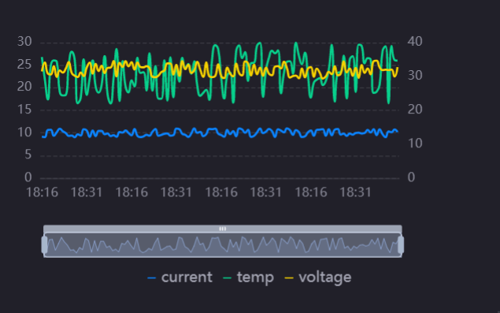

### 添加饼图

通过以下步骤添加显示智能电池设备循环次数的饼图：

1. 在页面编辑器的工具栏中，点击 **添加 > 组件**。

2. 在 **新建组件** 弹窗中选择 **饼图** 并点击 **确定**。

3. 将光标移动到组件卡片的 **更多** 图标  并在下拉菜单中点击 **编辑** 打开 **图表编辑器**。

4. 在 **基本信息** 中配置以下信息：

   - 标题：输入该组件的标题，如 `Cycle Number`
   - 隐藏标题：禁用
   - 标题跳转链接：选择 **无跳转**

5. 在 **选择数据源** 中配置以下信息：

   - 数据源：选择 **TSDB > LatestData** 
   - 类别：选择 **Smartbattery_Model**，即你创建的模型
   - 维度：点击 **添加数据项**， 在弹窗中选择 **AssetName** 并点击 **确定**
   - 度量：点击 **添加数据项**， 在弹窗中选择 **cycle_number** 并点击 **确定**

6. 在 **选择图表样式 > 饼设置** 中配置以下信息：

   - 使用渐变色：启用
   - 小数位数：选择 **0**

7. 在 **选择图表样式 > 图例** 中配置以下信息：

   - 位置：选择 right-middle
   - Show Legend Value：启用
   - 数值边距：输入 **60** 

9. 自定义组件的其他配置。

10. 点击 **保存**，将配置完成的组件添加到页面中。

   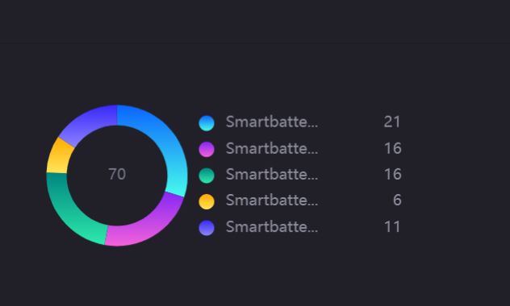

### 添加表格

通过以下步骤添加显示智能电池设备多项数据的表格：

1. 在页面编辑器的工具栏中，点击 **添加 > 组件**。

2. 在 **新建组件** 弹窗中选择 **表格** 并点击 **确定**。

3. 将光标移动到组件卡片的 **更多** 图标  并在下拉菜单中点击 **编辑** 打开 **图表编辑器**。

4. 在 **基本信息** 中配置以下信息：

   - 标题：输入该组件的标题，如 `Battery Data Table`
   - 隐藏标题：禁用
   - 标题跳转链接：选择 **无跳转**

5. 在 **选择数据源** 中配置以下信息：

   - 数据源：选择 **TSDB > LatestData** 
   - 类别：选择 **Smartbattery_Model**，即你创建的模型
   - 维度：点击 **添加数据项**， 在弹窗中选择 **AssetName** 并点击 **确定**
   - 度量：点击 **添加数据项**， 在弹窗中选择 **current**、**temp**、**voltage**、**Longitude** 和 **Latitude** 并点击 **确定**

6. 度量数据项添加完成后，点击以下数据项标签为其配置别名：

   |度量|别名|
   |--- |---|
   |current|电流|
   |temp|温度|
   |voltage|电压|
   |Longitude|经度|
   |Latitude|纬度|

7. 在 **表格样式** 中配置以下信息：

   - 可排序：启用
   - 偶数行颜色：为偶数行设置不同于奇数行的颜色

8. 自定义组件的其他配置。

9. 点击 **保存**，将配置完成的组件添加到页面中。

   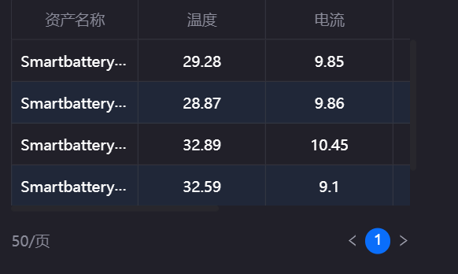

### 添加热力图

通过以下步骤添加显示智能电池设备特定时间段内电压或电流数据的热力图：

1. 在页面编辑器的工具栏中，点击 **添加 > 组件**。

2. 在 **新建组件** 弹窗中选择 **热力图** 并点击 **确定**。

3. 将光标移动到组件卡片的 **更多** 图标  并在下拉菜单中点击 **编辑** 打开 **图表编辑器**。

4. 在 **基本信息** 中配置以下信息：

   - 标题：输入该组件的标题，如 `Last Day Electricity`
   - 隐藏标题：禁用
   - 标题跳转链接：选择 **无跳转**

5. 在 **选择数据源** 中配置以下信息：

   - 数据源：选择 **TSDB > AI Raw** 
   - 类别：选择 **Smartbattery_Model**，即你创建的模型
   - 开始时间：选择开始获取数据的时间
   - 结束时间：选择停止获取数据的时间
   - 维度：点击 **添加数据项**， 在弹窗中选择 **timestamp** 并点击 **确定**
   - 对比：点击 **添加数据项**， 在弹窗中选择 **AssetName** 并点击 **确定**
   - 度量：点击 **添加数据项**， 在弹窗中选择 **current** 并点击 **确定**

6. 在 **内部过滤器** 中点击 **添加** ，在弹窗中配置以下信息：

   - 位置：选择 **标题右**
   - 类型：选择 **时间范围** 
   - 默认时间范围：选择 **最近一天**
   - 联动组件字段：选择 **Starttime** 为开始，**Endtime** 为结束

7. 点击 **确定** 添加组件内过滤器。

8. 在 **选择图表样式 > 轴样式** 中配置 **标签设置** 为 `time` | `HH:MM` | `45°`。

9. 在 **选择图表样式 > 热力图样式** 中配置以下信息：

   - 色块：为最大值和最小值设置不同的颜色
   - 标记最小值：启用，在热力图中标注出最小值所在色块
   - 标记最大值：启用，在热力图中标注出最大值所在色块

10. 在 **选择图表样式 > 其他设置 > 图例** 中配置以下信息：

    - 图例：选择**bottom-middle**
    - 大小：设置宽度为 `250`, 高度为 `8` 

11. 自定义组件的其他配置。

12. 点击 **保存**，将配置完成的组件添加到页面中。

   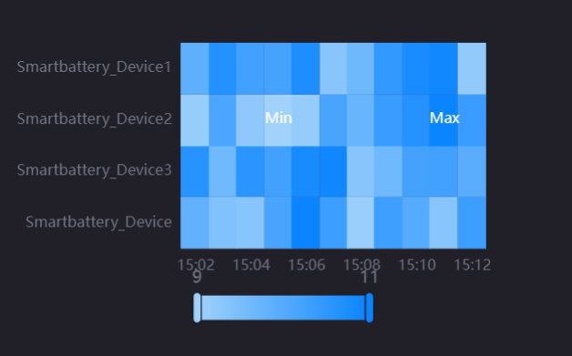

### 添加地图

通过以下步骤添加显示智能电池设备地理位置信息的地图：

1. 在页面编辑器的工具栏中，点击 **添加 > 组件**。

2. 在 **新建组件** 弹窗中选择 **表格** 并点击 **确定**。

3. 将光标移动到组件卡片的 **更多** 图标  并在下拉菜单中点击 **编辑** 打开 **图表编辑器**。

4. 在 **基本信息** 中配置以下信息：

   - 标题：输入该组件的标题，如 `Asset Location`
   - 隐藏标题：禁用
   - 标题跳转链接：选择 **无跳转**

5. 在 **选择数据源** 中配置以下信息：

   - 数据源：选择 **TSDB > LatestData**
   - 类别：选择 **Smartbattery_Model**，即你创建的模型
   - 维度：点击 **添加数据项**， 在弹窗中选择 **Longitude** 和 **Latitude** 并点击 **确定**
   - 度量：点击 **添加数据项**， 在弹窗中选择 **AssetName** 并点击 **确定**

6. 在 **选择图表样式 > 地图设置** 中配置以下信息：

   - 中心点：禁用 **根据数据自动计算**。配置经度为 **103.8**，纬度为 **1.345**
   - 缩放级别：选择 **12**
   - 地图源：选择 **Google**
   - 地图类型：选择 **Satellite**

7. 在 **选择图表样式 > 交互层设置** 中，点击 **新增数据层** 在弹窗中配置以下信息并点击 **确定**：

   - 图层名：输入新建数据图层的名称，例如：`Asset Position`
   - 图层类型：选择 **poi**

8. 在 **选择图表样式 > 交互层设置**中，为新建的数据图层配置以下信息：

   - 经度：选择 **Longitude**
   - 维度：选择 **Latitude**
   - 资产名称：选择 **AssetName**
   - 开启联动：启用

9. 自定义组件的其他配置。

10. 点击 **保存**，将配置完成的组件添加到页面中。

11. 将光标移动到组件卡片的 **更多** 图标  并在下拉菜单中点击 **联动** 打开 **组件联动** 弹窗

12. 在 **联动组件** 中，分别为 **驱动维度中** 的 **Latitude** 和 **Longitude** 选择  **Battery Data Insights**、**Last Day Electricity** 和 **Battery Status** 组件的 **AssetName** 数据项并点击 **确定**。

   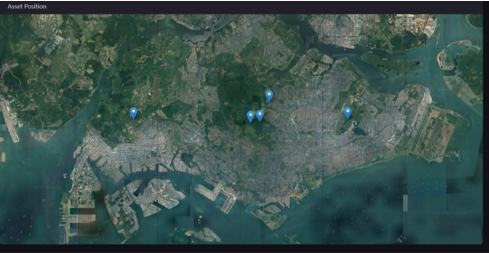

## 步骤 4：添加全局过滤器

你可以在页面中创建全局过滤器从而实现组件间的数据联动。例如，在过滤器中选择某个智能电池设备，则所有组件均会自动显示该设备的相关数据。

本实验中，你将添加以下全局过滤器：

- 资产过滤器：以资产为条件过滤数据
- 区域过滤器：以地理位置为条件过滤数据

### 添加资产全局过滤器

通过以下步骤添加资产全局过滤器：

1. 在 **页面编辑器** 的工具栏中点击 **过滤器 > 全局过滤器**。
2. 在 **全局过滤器** 页面中点击 **添加过滤器** 并配置以下信息：

   - 标题：输入过滤器的标题，例如：**Asset Filter**
   - 键值：输入过滤器键值，例如：**asset**
   - 属性：启用 **页面可见** 以及 **接收外部参数**
   - 过滤器类型：选择 **多选下拉**
   - 联动数据源：点击 **添加**并在弹窗中配置以下信息：
      |数据源|数据集|数据项|条件|
      |-----------|-------|----------|---------|
      |LatestData |Smartbattery_Model|AssetName|=|
   - 名称/值：点击 **添加** 并输入 `AssetName` 为名称和值

3. 点击 **保存** 添加资产全局过滤器。

### 添加区域全局过滤器

通过以下步骤添加区域全局过滤器：

1. 在 **页面编辑器** 的工具栏中点击 **过滤器 > 全局过滤器**。
2. 在 **全局过滤器** 页面中点击 **添加过滤器** 并配置以下信息：

   - 标题：输入过滤器的标题，例如：**Asset Filter**
   - 键值：输入过滤器键值，例如：**asset**
   - 属性：启用 **页面可见** 以及 **接收外部参数**
   - 过滤器类型：选择 **单选下拉**
   - 联动数据源：点击 **添加**并在弹窗中配置以下信息：
      |数据源|数据集|数据项|条件|
      |-----------|-------|----------|---------|
      |LatestData |Smartbattery_Model|District|=|
   - 名称/值：点击 **添加** 并输入 `District` 为名称和值

3. 点击 **保存** 添加资产全局过滤器。

   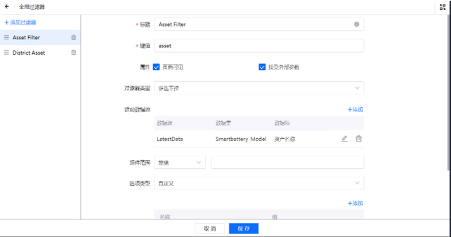

## 步骤 5：发布页面

DTV 页面配置完成后，你可以点击 **页面编辑器** 上的 **发布** 生成 DTV页面的 URL 地址。

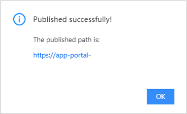