# 实验 2：创建 Web 项目

本实验中，你将创建一个用于应用程序开发的 Java Springboot Web 项目，并为 EnOS Java Core SDK 添加 Maven 依赖包。

## 步骤 1：创建项目

为简化项目创建过程，你可以通过以下步骤导入项目配置包创建 Java Springboot Web 项目。

1. 打开 [Spring Initializr](https://start.spring.io/#!type=maven-project&language=java&platformVersion=2.2.9.RELEASE&packaging=jar&jvmVersion=1.8&groupId=com.example&artifactId=battery-web&name=battery-web&description=demo%20project%20for%20spring%20boot&packageName=com.example.battery-web&dependencies=devtools,lombok,web,freemarker) 。该站点已配置了 `battery-web` 项目信息。

2. 点击 **Generate** 按钮，下载 `battery-web.zip` 项目配置包。

   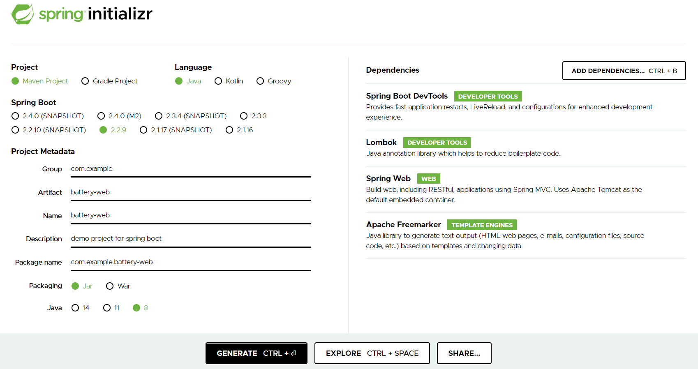

3. 解压缩 `battery-web.zip` 项目配置包。

4. 打开 IntelliJ IDEA Community Edition 并在菜单中点击 **File > Open**

5. 在 **Open File or Project** 窗口，选择已解压缩的项目配置包并点击 **OK**。

   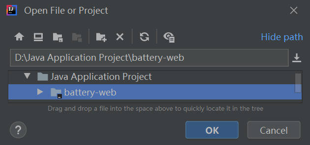

6. 在新窗口中打开项目包文件。

   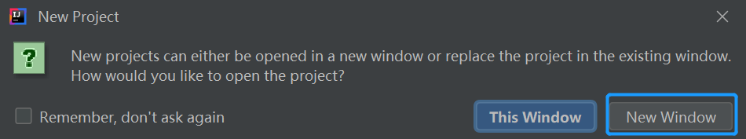

7. 下载项目所需的依赖项。

   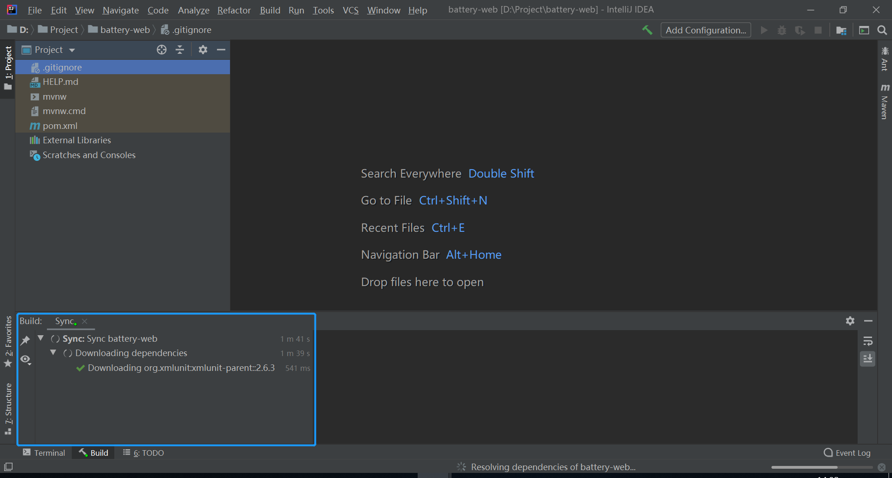

8. 依赖项下载完毕后 Java Springboot Web 项目即创建完成。

   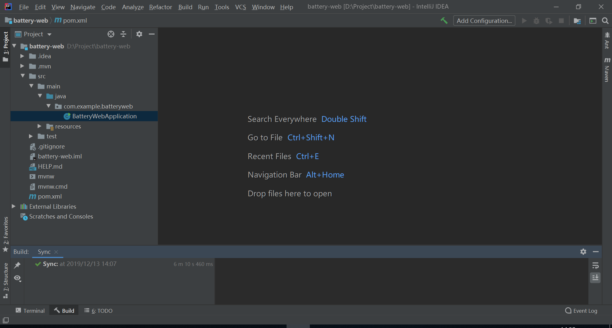


## 步骤2：添加 EnOS SDK Maven 依赖项

项目创建完成后，你需要通过以下步骤为 EnOS Java Core SDK 添加调用 EnOS API 所必需的 Maven 依赖项：

1. 在 IntelliJ IDEA Community Edition 左侧项目文件导航栏中双击并打开 `pom.xml` 文件。

   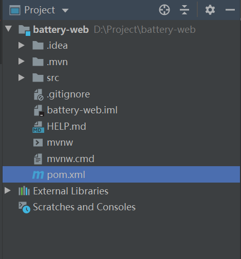

2. 在 `pom.xml` 文件中找到 `</dependencies> ` 命令行，并在其前面插入以下依赖项：

   ```
           <dependency>
               <groupId>org.springframework.boot</groupId>
               <artifactId>spring-boot-starter-websocket</artifactId>
           </dependency>
           <dependency>
               <groupId>com.envisioniot</groupId>
               <artifactId>enos-dm-api-pojo</artifactId>
               <version>0.2.5</version>
           </dependency>
           <dependency>
               <groupId>com.envisioniot</groupId>
               <artifactId>enos-subscribe</artifactId>
               <version>2.3.0</version>
           </dependency>
           <dependency>
               <groupId>log4j</groupId>
               <artifactId>log4j</artifactId>
               <version>1.2.16</version>
           </dependency>
           <dependency>
               <groupId>junit</groupId>
               <artifactId>junit</artifactId>
           </dependency>
   ```
   
3. 此时，右下角将提示 “Maven projects need to be imported”。 单击 **Import Changes**，导入 Maven 依赖项。

   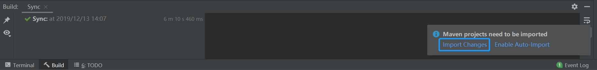

4. Maven 依赖项下载并同步完成后即添加到 EnOS Java Core SDK 中。


## 步骤 3：配置应用属性

通过以下步骤配置应用程序属性文件：

1. 在 IntelliJ IDEA Community Edition 左侧项目文件导航栏中双击并打开 `src/main/resources/application.properties` 文件。

2. 在 `application.properties` 文件中输入以下代码：

   ```
   spring.freemarker.suffix=.html
   spring.freemarker.encoding=utf-8
   spring.freemarker.cache=false
   
   enos.ou.id=o15724268424841
   enos.apim.addr=https://apim-ppe1.envisioniot.com
   enos.app.key=e4b623dd-8c88-4864-aed6-b6abbf5fd292
   enos.app.secret=4840b294-4649-4b2f-8dd0-845284225a67
   enos.battery.assetTreeId=50XiYXpx
   enos.battery.parentAssetId=6Pvbj63S
   enos.sub.server=subscribe-ppe1.envisioniot.com:9001
   enos.sub.id=sub-1574736106350
   ```

   上述代码中各项属性的描述如下所示：

   | 属性                 | 描述                                                  |
   | -------------------------- | ------------------------------------------------------------ |
   | enos.ou.id                 | EnOS 管理控制台的 OU ID。将样例中的值替换为 **EnOS_Training** 的 OU ID。 |
   | enos.apim.addr             | EnOS API 的网关地址。将样例中的值替换为 **EnOS_Training** 的 API 网关。 |
   | enos.app.key               | 应用服务账号的 Access Key。将样例中的值替换为 **SmartBattery_Demo** 应用的 Access Key。 |
   | enos.app.secret            | 应用服务账号的 Secret Key。将样例中的值替换为 **SmartBattery_Demo** 应用的 Secret Key。  |
   | enos.battery.assetTreeId   | 智能电池设备所在的资产树 ID。 将样例中的值替换为智能电池设备所在资产树的 ID。 |
   | enos.battery.parentAssetId | 资产树上智能电池设备所属父节点的资产 ID, 用于查询特定资产树节点下的智能电池设备列表。将样例中的值替换为你创建的逻辑资产的 ID。  |
   | enos.sub.server            | 数据订阅服务器的地址。将样例中的值替换为 **EnOS_Training** 的数据订阅服务器。 |
   | enos.sub.id                | 数据订阅任务的 ID。将样例中的值替换为 **EnOS_Training** 的数据订阅服务 ID。 |

   配置完成的 `application.properties` 文件如图所示：

   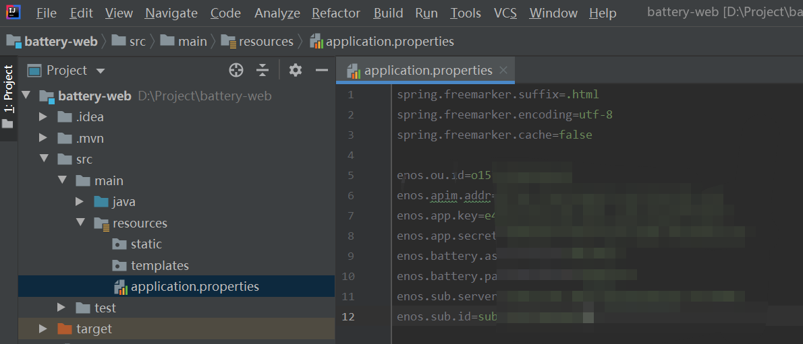

   你可以在 EnOS 管理控制台中点击 **帮助 > 环境信息** 获取当前 OU 环境的上述属性。
   
   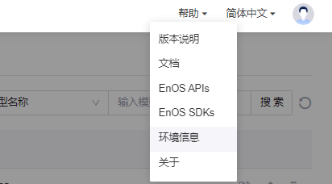

   

3. 打开 `src/main/java/com.example.batteryweb` 并在菜单中点击 **File > New > Java Class** 创建一个名为 `AppConfig` 的 Java Class 用于读写应用程序属性文件。

   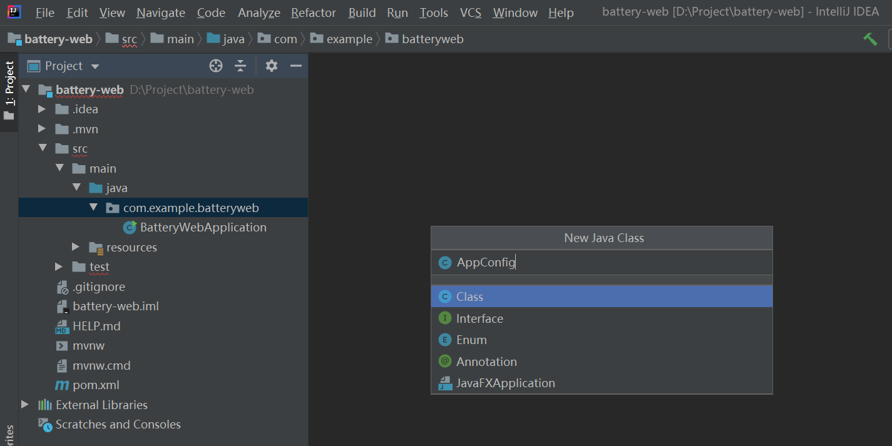

4. 在 `AppConfig` Java Class 中输入以下代码：

   ```java
   package com.example.batteryweb;
   
   import org.springframework.beans.factory.annotation.Value;
   import org.springframework.stereotype.Component;
   
   @Component
   public class AppConfig {
       @Value("${enos.apim.addr}")
       public String addr;
   
       @Value("${enos.app.key}")
       public String accessKey;
   
       @Value("${enos.app.secret}")
       public String accessSecret;
   
       @Value("${enos.ou.id}")
       public String orgId;
   
       @Value("${enos.battery.assetTreeId}")
       public String assetTreeId;
   
       @Value("${enos.battery.parentAssetId}")
       public String parentAssetId;
   
       @Value("${enos.sub.server}")
       public String subServer;
   
       @Value("${enos.sub.id}")
       public String subId;
   }
   ```

配置完成的应用程序参数配置如下所示：

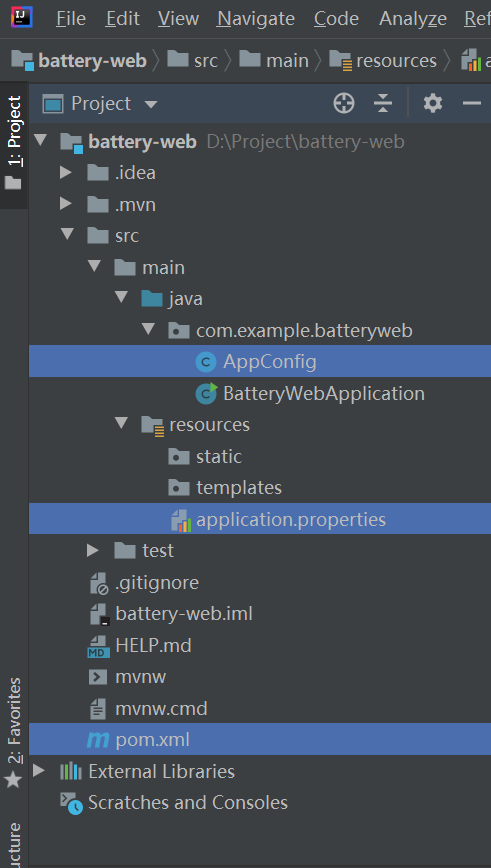


## 步骤 4：测试配置参数

1. 打开 `src/test/java/com.example.batteryweb` 并创建一个名为 `AppConfigTests` 的 Java Class。

2. 在 `AppConfigTests` Java Class 中输入以下代码：

   ```java
   package com.example.batteryweb;
   
   import org.junit.jupiter.api.Test;
   import org.springframework.beans.factory.annotation.Autowired;
   import org.springframework.boot.test.context.SpringBootTest;
   
   @SpringBootTest
   public class AppConfigTests {
       @Autowired
       private AppConfig config;
   
       @Test
       void testAppConfig() {
           System.out.println("enos.apim.addr = "+ config.addr);
           System.out.println("enos.app.accessKeyr = "+ config.accessKey);
           System.out.println("enos.app.secretr = "+ config.accessSecret);
       }
   }
   ```

3. 点击 `testAppConfig` 所在行的 **Run Test** 图标并选择 **Run 'testAppConfig()'** 进行单元测试。

   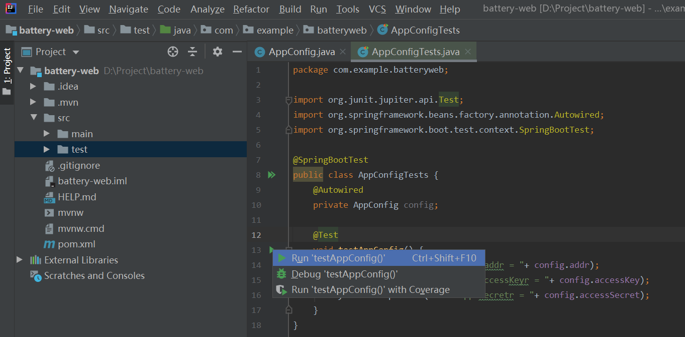

4. 检查测试结果。

   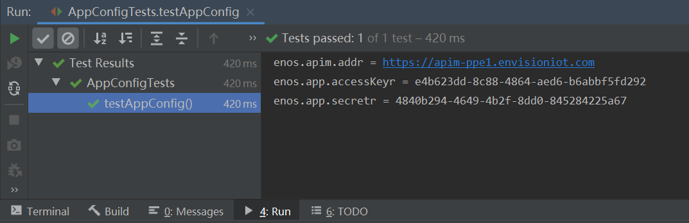

5. （可选） 你可以在 `testAppConfig()` 中添加更多命令行并重复上述步骤测试其他配置参数的数据读取功能。


## 步骤 5：添加前端

完成 Web 应用程序的配置后你可以添加用于显示电池数据查询结果的应用程序前端。通过以下步骤将本实验提供的前端包添加到 Java Web 项目中：

1. 从 https://github.com/EnvisionIot/developer_bootcamp/tree/master/App_Front_End 下载 `Front_End.zip` 前端包。

2. 将前端包解压到 Java 项目的 `resources` 目录中。确保 `static`、 `templates` 和 `application.properties` 在同一根目录下，例如：

   ```shell
   ├── src
   │   ├── main
   │   │   ├── java/
   │   │   └── resources/
   │   │       ├── application.properties
   │   │       ├── static/
   │   │       └── templates/
   ```

3. 打开 `controller` 包，其中创建名为 `BatteryController` 的 Java Class，并输入以下代码用于创建前端页面：

   ```java
   package com.example.batteryweb.controller;
   
   import lombok.extern.slf4j.Slf4j;
   import org.springframework.stereotype.Controller;
   import org.springframework.web.bind.annotation.RequestMapping;
   
   import javax.servlet.http.HttpServletRequest;
   import java.util.Map;
   
   @Controller
   @Slf4j
   public class BatteryController {
       @RequestMapping("/")
       public String chat(HttpServletRequest request, Map<String, String> data) {
           return "battery";
       }
   }
   ```

4. 运行 `BatteryWebApplication` 启动应用程序。

5. 打开浏览器并在地址栏输入 `http://127.0.0.1:8080`，你将看到如下应用页面：

   

此时，应用中并无智能电池设备的相关数据。

下一步你将尝试调用 EnOS API 获取以下信息：

- 电池资产列表
- 电池基本信息
- 电池状态信息，即电池健康状况与剩余电量
- 资产树告警信息
- 数据上传频率
- 电池动态数据，如实时电压、电流和温度数据

## 下一实验

[实验 3：调用 EnOS API](invoking_api_java.md)
