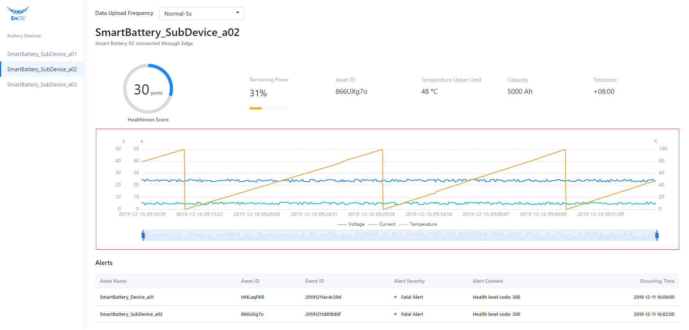
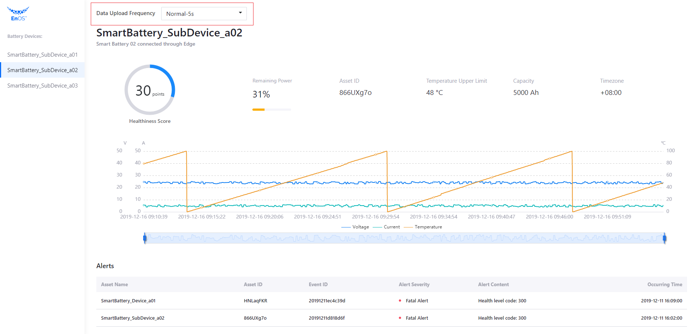

# 实验 4：完成应用程序开发

本实验中，你将通过以下步骤完成应用程序开发过程中最为重要的部分——获取智能电池设备的历史数据并在应用前端进行显示。

## 步骤 1：获取电池设备的历史数据

通过以下步骤调用 **Get Asset AI Raw Data** API 并配置 `DataService` 和 `DataController` 获取智能电池设备的历史数据：

> **Get Asset AI Raw Data** 的请求格式为；`https://{apigw-address}/tsdb-service/v2.0/ai?orgId={}&modelId={}&assetIds={}&measurepoints={}&startTime={}&endTime={}&pageSize={}&accessKey={}&localTimeAccuracy={}`。

1. 打开 `DataService` Java Class 并添加以下代码从 EnOS Cloud 获取指定智能电池设备的历史数据：

   ```java
   public GetDataResponse getHistoryData(String assetId, String startTime, String endTime) {
       IPoseidonRequest request = new PoseidonRequest() {
           @Override
           public String baseUri() {
               return "/tsdb-service/v2.0/ai";
           }
           @Override
           public String method() {
               return "GET";
           }
           @Override
           public Map<String, Object> queryParams() {
               Map<String, Object> params = new HashMap();
               // To be done
               return params;
           }
       };
       return getResponse(request, GetDataResponse.class);
   }
   ```
   
2. 打开 `DataController` Java Class 并添加以下代码通过 HTTP 返回查询到的电池历史数据：

   ```java
   @RequestMapping("/battery/tsdb/{id}")
   public Map<String, Object> tsdb(@PathVariable("id") String id) {
       DateFormat fmt = new SimpleDateFormat("yyyy-MM-dd HH:mm:ss");
       fmt.setTimeZone(TimeZone.getTimeZone("Asia/Shanghai"));
       Date nowTime = new Date();
       Calendar calendar = Calendar.getInstance();
       calendar.setTime(nowTime);
       calendar.add(Calendar.HOUR, -1);
       Date oneHourBefore=calendar.getTime();
       String startTime = fmt.format(oneHourBefore);
       String endTime = fmt.format(nowTime);
       GetDataResponse resp = dataService.getHistoryData(id, startTime, endTime);
       // Reformat returned data for front-end display
       Map<String, Object> result = new HashMap<>();
       List<Double> voltage = new ArrayList<>();
       List<Double> current = new ArrayList<>();
       List<Double> temp = new ArrayList<>();
       result.put("voltage", voltage);
       result.put("current", current);
       result.put("temp", temp);
       Set<String> time = new HashSet<>();
       String measurepoints = "voltage,current,temp";
       for(Map<String, Object> items: resp.getData().getItems()){
           for (String point: measurepoints.split(",")) {
               if (items.containsKey(point)) {
                   if (point.equals("current") ) {
                       time.add(items.get("localtime").toString());
                   }
                   List<Double> pointList = (List<Double>) result.get(point);
                   pointList.add((Double) items.get(point));
                   break;
               }
           }
       }
       result.put("time", time);
       return result;
   }
   ```

3. 打开 `BatteryWebApplication` Java Class 并点击 **Run 'BatteryWebApplication'** 启动应用程序。

4. 打开浏览器并在地址栏输入 `http://127.0.0.1:8080` 查看智能电池设备的电压、电流和温度数据图表。



## 步骤 2：更改数据上传频率

现在，你可以通过以下步骤更改应用程序的数据上传频率：

1. 在应用程序前端页面，点击 **Data Upload Frequency** 选择框打开下拉菜单。

2. 在下拉菜单中选择 **High-2s**，数据上传频率将从 5 秒更改为 2 秒。

 

