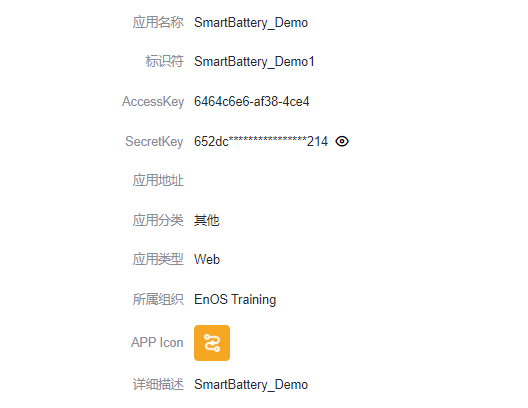

# 实验 1：获取应用程序服务账号

服务帐号（Service Account，SA）是一种特殊的 EnOS 帐号，是应用程序通过 API 访问 EnOS 上的资源时需要使用的帐号。当应用程序在 EnOS 管理控制台上注册时，该应用程序的 SA 会自动生成。你需要在 EnOS 管理控制台上获取应用程序的 SA 从而基于 EnOS API 开发应用程序。

在本实验中，应用程序已预先在 EnOS 管理控制台注册。

## 获取服务账号

SA 由 `AccessKey` 与 `SecretKey` 组成。你可以通过以下步骤获取应用程序的 SA：

1. 登录至 EnOS 管理控制台并在左侧菜单栏中选择 **应用注册**。 

2. 在 **组织应用** 标签页中点击 **SmartBattery_Demo** 应用卡片，打开 **应用详情** 页面。

3. 在 **应用详情** 页面中找到并记录该应用程序的 `AccessKey` 和 `SecretKey`。

   

关于注册和管理应用程序的详细信息，参见 [注册和管理应用](https://support.envisioniot.com/docs/app-development/zh_CN/2.3.0/app_management/managing_apps.html).

## 参考：授权服务账号

首次在 EnOS 上注册应用程序时，应用程序 SA 必须获得 EnOS 的资源访问权限 （例如，获取资产信息和数据的权限）。本实验中，**SmartBattery_Demo** 的 SA 已经获取了相关权限。

关于授权服务账号的详细信息，参见 [管理服务帐号](https://support.envisioniot.com/docs/enos/zh_CN/2.3.0/iam/service_account/managing_service_account.html).

## 下一实验

[实验 2：创建 Web 项目](creating_web_project.md)