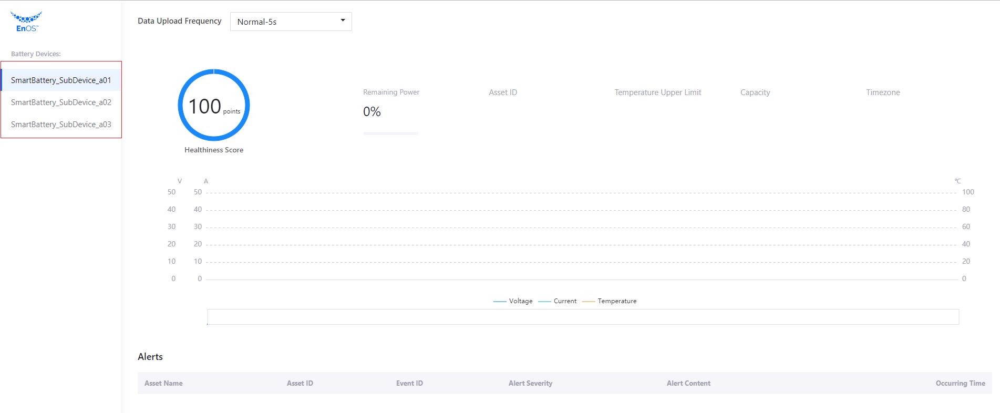
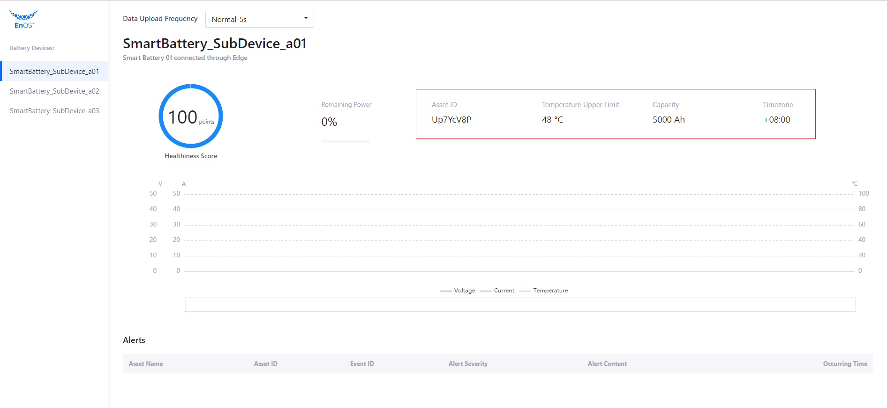

# 实验 3：调用 EnOS API

本实验中，你将通过调用 EnOS API 获取以下信息：

- 电池资产列表
- 电池基本信息
- 电池状态信息，即电池健康状况与剩余电量
- 资产树告警信息
- 数据上传频率
- 电池动态数据，如实时电压、电流和温度数据

## 步骤 1：获取电池资产列表

通过以下步骤调用 **Search Related Asset Node** API 并创建 `DataService` 和 `DataController` Java Class 获取电池资产列表:

> **Search Related Asset Node** 的请求格式为 `https://{apigw-address}/asset-tree-service/v2.1/asset-nodes?action=searchRelatedAsset`。

1. 在 IntelliJ IDEA Community Edition 左侧项目文件导航栏中打开 `src/main/java/com.example.batteryweb` 目录。
2. 点击菜单中的 **File > New > Package** 并创建 `service`、`controller` 和 `model` 包。

   

3. 打开 `service` 包，创建名为 `DataService` 的 Java Class 并输入以下代码获取指定模型的资产列表和资产树：

   ```java
   package com.example.batteryweb.service;
   
   import com.envision.apim.poseidon.config.PConfig;
   import com.envision.apim.poseidon.core.Poseidon;
   import com.envision.apim.poseidon.exception.PoseidonException;
   import com.envision.apim.poseidon.request.IPoseidonRequest;
   import com.envisioniot.enos.asset_tree_service.v2_1.SearchRelatedAssetNodeRequest;
   import com.envisioniot.enos.asset_tree_service.v2_1.SearchRelatedAssetNodeResponse;
   import com.envisioniot.enos.asset_tree_service.vo.RelatedAssetSearchVo;
   import com.example.batteryweb.AppConfig;
   import lombok.extern.slf4j.Slf4j;
   import org.springframework.beans.factory.annotation.Autowired;
   import org.springframework.stereotype.Component;
   
   import java.util.ArrayList;
   import java.util.List;
   
   @Component
   @Slf4j
   public class DataService {
       @Autowired
       AppConfig config;
   
       public <T> T getResponse(IPoseidonRequest request, Class<T> cls) throws PoseidonException {
           return Poseidon.config(PConfig.init().appKey(config.accessKey).appSecret(config.accessSecret)).url(config.addr).getResponse(request, cls);
       }
   
       /**
        * Getting the list of assets of specified models and asset tree.
        * @return SearchRelatedAssetNodeResponse
        */
       public SearchRelatedAssetNodeResponse getAssetList() {
           SearchRelatedAssetNodeRequest request= new SearchRelatedAssetNodeRequest();
           request.setOrgId(config.orgId);
           request.setTreeId(config.assetTreeId);
   
           RelatedAssetSearchVo filter = new RelatedAssetSearchVo();
           filter.setIsChildOfAssetId(config.parentAssetId);
           request.setFilter(filter);
   
           return getResponse(request, SearchRelatedAssetNodeResponse.class);
       }
   }
   ```
   
4. 打开 `controller` 包，创建名为 `DataController` 的 Java Class 并输入以下代码将查询到的资产列表以 JSON 数据形式显示在浏览器页面中：

   ```java
   package com.example.batteryweb.controller;
   
   import com.envisioniot.enos.asset_tree_service.v2_1.SearchRelatedAssetNodeResponse;
   import com.envisioniot.enos.asset_tree_service.vo.AssetVo;
   import com.example.batteryweb.service.DataService;
   import lombok.extern.slf4j.Slf4j;
   import org.springframework.beans.factory.annotation.Autowired;
   import org.springframework.web.bind.annotation.*;
   
   import java.util.*;
   
   @RestController
   @Slf4j
   public class DataController {
       @Autowired
       private DataService dataService;
   
       /**
        * Returning all the battery assets under the "Envision Smart Car Factory" asset tree.
        * @return
        */
       @RequestMapping("/battery/list")
       public Map<String, Object> list() {
   
           SearchRelatedAssetNodeResponse resp = dataService.getAssetList();
   
           List<Map<String, String>> batteries=new ArrayList();
           for (AssetVo asert: resp.getData()) {
               Map<String, String> item = new HashMap<>();
               item.put("assetId", asert.getAssetId());
               item.put("name", asert.getName().getDefaultValue());
               batteries.add(item);
           }
   
           // Ordering the display of batteries
           Collections.sort(batteries, new Comparator<Map<String,String>>() {
               @Override
               public int compare(Map<String, String> o1,
                                  Map<String, String> o2) {
                   return o1.get("name").compareTo(o2.get("name"));
               }
           });
   
           Map<String, Object> result = new HashMap<>();
           result.put("batteries", batteries);
           return result;
       }
   }
   ```

上述编程工作完成后，你可以通过以下步骤测试代码：

1. 在 `src/main/java/com.example.batteryweb` 目录中，双击 `BatteryWebApplication` Java Class。

2. 点击 **Run 'BatteryWebApplication'** 启动应用程序。

   

3. 打开浏览器并在地址栏输入 `http://127.0.0.1:8080`，查看是否能看到智能电池设备的资产列表。 

   

## 步骤 2：获取电池基本信息

通过以下步骤调用 **Get Asset** API 并配置 `DataService` 和 `DataController` Java Class 获取电池设备的基本信息：

> **Get Asset** 的请求格式为：`https://{apigw-address}/asset-service/v2.1/assets?action=get`。

1. 打开 `DataService` Java Class 并添加以下代码获取智能电池设备的基本信息：

   ```java
       public GetAssetResponse getAssetById(String id) {
           GetAssetRequest request= new GetAssetRequest();
           request.setAssetId(id);
           request.setOrgId(config.orgId);
   
           return getResponse(request, GetAssetResponse.class);
       }
   ```

2. 打开 `DataController` Java Class 并添加以下代码通过 HTTP 返回查询到的设备基本信息：

   ```java
       @RequestMapping("/battery/asset/{id}")
       public GetAssetResponse asset(@PathVariable("id") String id) {
           return dataService.getAssetById(id);
       }
   ```

3. 打开 `BatteryWebApplication` Java Class 并点击 **Run 'BatteryWebApplication'** 运行应用程序。

4. 打开浏览器并在地址栏输入 `http://127.0.0.1:8080` 查看是否获取到智能电池设备的基本信息。

   

## 步骤 3：获取电池状态

通过以下步骤调用 **Get Asset Latest Data** API 并在 `model` 包中创建 `Data` 和 `GetDataResponse` Java Class 接收并解析从 EnOS Cloud 返回的电池状态信息，如电池健康状况和剩余电量：

> **Get Asset Latest Data** 的调用格式为：`https://{apigw-address}/tsdb-service/v2.0/latest?orgId={}&assetIds={}&measurepoints={}&timeWindow={}&accessKey={}`。

1. 打开 `model` 包，创建名为 `Data` 的 Java Class 并添加以下代码：

   ```java
   package com.example.batteryweb.model;
   
   import java.util.List;
   import java.util.Map;
   
   public class Data {
       private List<Map<String, Object>> items;
   
       public List<Map<String, Object>> getItems() {
           return items;
       }
   
       public void setItems(List<Map<String, Object>> items) {
           this.items = items;
       }
   }	
   ```

2. 打开 `model` 包，创建名为 `GetDataResponse` 的 Java Class 并添加以下代码：

   ```java
   package com.example.batteryweb.model;
   
   import com.envisioniot.enos.api.common.constant.response.EnosCommonRsp;
   
   public class GetDataResponse extends EnosCommonRsp<Data> {
       public GetDataResponse() {
       }
   }
   ```

3. 打开 `DataService` Java Class 并输入以下代码从 EnOS Cloud 获取电池状态信息：

   ```java
       public GetDataResponse getData(String assetId, String measurepoints) {
           IPoseidonRequest request = new PoseidonRequest() {
               @Override
               public String baseUri() {
                   return "/tsdb-service/v2.0/latest";
               }
   
               @Override
               public String method() {
                   return "GET";
               }
   
               @Override
               public Map<String, Object> queryParams() {
                   Map<String, Object> params = new HashMap();
                   params.put("assetIds", assetId);
                   params.put("measurepoints", measurepoints);
                   params.put("orgId", config.orgId);
                   params.put("accessKey", config.accessKey);
                   return params;
               }
           };
   
           return getResponse(request, GetDataResponse.class);
       }
   ```

4. 打开 `DataController` Java Class 并添加以下代码通过 HTTP 返回查询到的电池状态信息：

   ```java
   @RequestMapping("/battery/status/{id}")
   public Map<String, Object> status(@PathVariable("id") String id) {
       GetAssetResponse asset = dataService.getAssetById(id);
       GetDataResponse data = dataService.getData(id, "health_level,accumulating_power");
       int health_level=0;
       double remaining_power = 0;
       for (Map<String, Object> item: data.getData().getItems()) {
           if (item.containsKey("health_level")) {
               health_level = (int)item.get("health_level");
           }
           double capacity = (double)asset.getData().getAttributes().get("Capacity");
           if (item.containsKey("accumulating_power")) {
               double power = (double)item.get("accumulating_power");
               remaining_power = Double.parseDouble(String.format("%.0f%%", (100*power/capacity)));
           }
       }
       // Simplifying returned data
       Map<String, Object> result = new HashMap<>();
       result.put("health_level", health_level);
       result.put("remaining_power", remaining_power);
       return result;
   }
   ```
   
5. 打开 `BatteryWebApplication` Java Class 并点击 **Run 'BatteryWebApplication'** 启动应用程序。

6. 打开浏览器并在地址栏输入 `http://127.0.0.1:8080` 查看是否获取到智能电池设备的健康状况和剩余电量信息。

   

## 步骤 4：获取资产树告警信息

通过以下步骤调用 **Search Active Alerts** API 并在 `model` 包中创建 `Alert` 和 `GetAlertResponse` Java Class 接收并解析从 EnOS Cloud 返回的资产树告警信息：

> **Search Active Alerts** 的请求格式为：`https://{apigw-address}/event-service/v2.1/active-alerts?action=search`。

1. 打开 `model` 包，创建名为 `Alert` 的 Java Class 并添加以下代码：

   ```java
   package com.example.batteryweb.model;
   
   import com.envisioniot.enos.event_service.vo.ActiveAlert;
   
   public class Alert extends ActiveAlert {
       private String assetName;
   
       public String getAssetName() {
           return assetName;
       }
   
       public void setAssetName(String assetName) {
           this.assetName = assetName;
       }
   }
   ```

2. 打开 `model` 包，创建名为 `GetAlertResponse` 的 Java Class 并添加以下代码：

   ```java
   package com.example.batteryweb.model;
   
   import com.envisioniot.enos.api.common.constant.response.v2.EnosPageRspV2;
   
   public class GetAlertResponse extends EnosPageRspV2<Alert> {
       public GetAlertResponse() {
       }
   }
   ```

3. 打开 `DataService` Java Class 并添加以下代码用于获取智能电池设备所在资产树的告警信息：

   ```java
   public GetAlertResponse getAlerts() {
     SearchActiveAlertRequest request = new SearchActiveAlertRequest();
     request.setOrgId(config.orgId);
     Scope scope = new  Scope();
     scope.setTreeId(config.assetTreeId);
     scope.setFromAssetId(config.parentAssetId);
     request.setScope(scope);
     return getResponse(request, GetAlertResponse.class);
   }
   ```

4. 打开 `DataController` Java Class 并添加以下代码通过 HTTP 返回查询到的告警信息：

   ```java
   @RequestMapping("/battery/alerts")
   public GetAlertResponse alerts() {
     GetAlertResponse alerts = dataService.getAlerts();
     for (Alert alert: alerts.getData()) {
       GetAssetResponse asset = dataService.getAssetById(alert.getAssetId());
       String assetName = asset.getData().getName().getDefaultValue();
       alert.setAssetName(assetName);
     }
     return alerts;
   }
   ```

5. 打开 `BatteryWebApplication` Java Class 并点击 **Run 'BatteryWebApplication'** 启动应用程序。

6. 打开浏览器并在地址栏输入 `http://127.0.0.1:8080` 查看是否获取到指定资产树的告警信息。

   

## 步骤 5：设置数据上传频率

通过以下步骤调用 **Invoke Service** API 并配置 `DataService` 与 `DataController` Java Class 以设置应用程序的数据上传频率。

> **Invoke Service** 的请求格式为：`https://{apigw-address}/connect-service/v2.1/commands?action=invokeService`。

1. 打开 `DataService` Java Class 并添加以下代码调用智能电池模型服务：

   ```java
   public InvokeServiceResponse invokeFrequencyService(String assetId, Integer interval) {
     InvokeServiceRequest request = new InvokeServiceRequest();
     request.setOrgId(config.orgId);
     request.setAssetId(assetId);
     request.setServiceId("high_frequency_report_service");
   
     Map<String, Object> inputData = new HashMap<>();
     inputData.put("interval",interval);
     request.setInputData(inputData);
     request.setPendingTtl(1000L);
   
     return getResponse(request, InvokeServiceResponse.class);
   }
   ```

2. 打开 `DataController` Java Class 并添加以下代码设置通过 HTTP 上传数据的频率：

   ```java
   @RequestMapping(value = "/battery/service/{id}", method = RequestMethod.POST)
   public Object setFrequency(@PathVariable("id") String id,
                              @RequestParam("command") String command,
                              @RequestParam("parameter") Integer parameter) {
     return dataService.invokeFrequencyService(id, parameter);
   }
   ```

3. 打开 `BatteryWebApplication` Java Class 并点击 **Run 'BatteryWebApplication'** 启动应用程序。

此时，你仍无法直接看到更改数据上传频率的结果。因为你尚未检索智能电池设备电压、电流和温度的动态数据。在下一实验中，你将完成这一步骤以及整个应用的开发。

关于 EnOS API 的详细信息，参见 [EnOS™ API](https://support.envisioniot.com/docs/api/zh_CN/2.3.0/overview.html)。


## 下一实验

[实验 4：完成应用程序开发](developing_by_yourself_java.md)