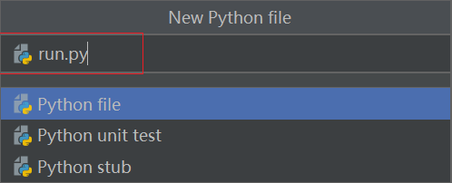

# 实验 2：创建 Web 项目

本实验中，你将创建一个用于应用开发的 Python Flask Web 项目。

## 步骤 1：安装 Python 依赖包

通过以下步骤安装 `flask` 和 `EnOS Python Core SDK`:

1. 打开 JetBrains PyCharm Community Edition 并在终端中输入以下代码安装 `flask` 框架：

   ```
   pip install flask
   ```

2. 在 Pycharm 终端中输入以下代码安装用于调用 EnOS API 的 EnOS Python Core SDK：
   
   ```
   pip install aphrodite
   ```

## 步骤 2：创建项目

通过以下步骤在 Pycharm 中创建 Python Flask Web 项目：

1. 在 Pycharm 的菜单中点击 **File > New Project**。

2. 在 **Create Project** 弹窗中配置以下信息：

   - Location：浏览并选择 Python 项目所在的文件夹
   - Existing Interpreter：启用，并在 **Interpreter** 下拉菜单中选择 **Python 3.7**

3. 点击 **Create** 创建 Python 项目。

    

4. 在菜单栏中点击 **File > New > Python File** 并创建一个名为 `run.py` 的 Python 文件。

   

5. 打开 `run.py` 文件并添加以下代码：

   ```python
   from flask import Flask, request, render_template  # Lightweight web framework
   from datetime import timedelta, datetime
   from services import *
   
   # *****application logic*****
   
   # Initialize hte web framework
   app = Flask(__name__, template_folder='./templates/', static_folder='./static/')
   
   
   # The following @app.route decorator is used to register the web request handler
   
   @app.route('/', endpoint='index')
   def index():
       return render_template('battery.html')
   
   
   @app.route('/battery/list/', endpoint='battery.list')
   def list():
       parent_assetId = '6Pvbj63S'  # Change this to your battery's parent assentId
       results = get_child_asset_list(parent_assetId)
   
       resp = {}
       battery_list = {}
   
       if results is not None:
           for item in results['data']:
               battery_list[item['name']['defaultValue']] = item['assetId']
   
       # Sort the asset list in ascending order by the aseet name
       sorted_list = [{'name': k, 'assetId': battery_list[k]} for k in sorted(battery_list.keys())]
       resp['batteries'] = sorted_list
   
       return resp
   
   
   @app.route('/battery/asset/<assetId>', endpoint='battery.asset')
   def asset(assetId):
       req = get_asset_info(assetId)
       return req
   
   
   @app.route('/battery/status/<assetId>', endpoint='battery.status')
   def status(assetId):
       req = get_asset_info(assetId)
       capacity = 10
       if req is not None:
           capacity = req['data']['attributes']['Capacity']
   
       health_level = 100
       accumulating_power = 0
   
       req = get_asset_latest_data(assetId, 'health_level,accumulating_power')
       if req is not None:
           for item in req['data']['items']:
               if 'health_level' in item.keys():
                   health_level = int(item['health_level'])
               elif 'accumulating_power' in item.keys():
                   accumulating_power = float(item['accumulating_power'])
   
       # Calculate the remaining power percentage of batteries
       remaining_power = "%.0f%%" % (100 * accumulating_power / capacity)
   
       resp = {'health_level': health_level, 'remaining_power': remaining_power}
   
       return resp
   
   
   @app.route('/battery/tsdb/<assetId>', endpoint='battery.tsdb')
   def tsdb(assetId):
       endTime = datetime.now()
       startTime = endTime + timedelta(hours=-1)
       startTime = startTime.strftime(format='%Y-%m-%d %H:%M:%S')
       endTime = endTime.strftime(format='%Y-%m-%d %H:%M:%S')
       req = get_asset_ai_raw_data(assetId, startTime, endTime)
   
       # Arrange the returned data in array format
       time = []
       current = []
       voltage = []
       temp = []
   
       if req is not None:
           for item in req['data']['items']:
               if 'current' in item.keys():
                   time.append(item['localtime'])
                   current.append(item['current'])
               elif 'voltage' in item.keys():
                   voltage.append(item['voltage'])
               elif 'temp' in item.keys():
                   temp.append(item['temp'])
               else:
                   pass
   
       # Assemble the response structure
       resp = {'time': time, 'voltage': voltage, 'current': current, 'temp': temp}
   
       return resp
   
   
   @app.route('/battery/alerts/', endpoint='battery.alerts')
   def alerts():
       req = get_active_alerts()
   
       # Add asset name for each alert record
       if req is not None:
           for item in req['data']:
               result = get_asset_info(item['assetId'])
               if result['data'] is not None:
                    item['assetName'] = result['data']['name']['defaultValue']
   
       return req
   
   
   @app.route('/battery/service/<assetId>', endpoint='battery.service', methods=['POST'])
   def service(assetId):
       req = {}
       if request.method == 'POST':
           if request.form['command'] == 'set_frequency':
               freq = int(request.form['parameter'])
               req = set_battery_frequency(assetId, freq)
   
       res = {
           "status": "success",
           "result": req
       }
       return res
   
   
   # Main entrance
   if __name__ == '__main__':
       app.debug = True
       app.run()
   ```
    Tips:
    - If you encountered static content (images, stylesheet) 404, you can add **static_url_path=""** at this line.
    ```
        app = Flask(__name__, template_folder='./templates/', static_url_path="", static_folder='./static/')
    ```
6. 在菜单栏中点击 **File > New > Python File** 并创建一个名为 `services.py` 的 Python 文件。

   

7. 打开 `services.py` 文件并添加以下代码：

   ```python
   from poseidon import poseidon  # This is the python SDK for EnOS API.
   import urllib.parse as parser  # The library to convert a dictionary into query string.
   
   # 将以下两行的值分别替换为SmartBattery_Demo应用的Access Key和Secret Key
   app_access_key = '0787eefe-d96c-4db6-a97c-c5ee16ce9a93'
   app_secret_key = '7b12307f-4993-4ef3-8554-93c6cc0e3cb6'
   
   # 将其替换为EnOS_Training OU的API网关
   api_gateway = 'https://apim-ppe1.envisioniot.com'
   
   # 将其替换为EnOS_Training OU的ID
   training_orgId = 'o15724268424841'
   # 将其替换为智能电池设备所在资产树的ID
   battery_provider_treeId = '50XiYXpx'
   
   
   # The following function is used to query assets under the specified parent node,
   # by specifying orgId and treeId of the asset tree.
   # Refer to `Search Related Asset Node` API doc in our doc center.
   # Args:
   #   parentId: The parent asset Id under which the child assets is located
   def get_child_asset_list(parentId):
       pass
   
   
   # The following function is used to query the specified asset information by specifying asset Id.
   # Refer to `Get Asset` API doc in our doc center.
   # Args:
   #   assetId: The asset Id you want to query
   def get_asset_info(assetId):
       pass
   
   
   # The following function is used to get the latest reading of all measurement points of a specified device.
   # Refer to `Get Asset Latest Data` API doc in our doc center.
   # Args:
   #   assetIds: The asset Id to query, multiple assets can be sperated by comma.
   #   measurepoints: The measure poin Ids to query, multiple measure points can be sperated by comma.
   def get_asset_latest_data(assetIds, measurepoints):
       pass
   
   
   # The following function is used to get the AI raw data of current, voltage and temperature
   # for the specified battery device within a certain period.
   # Refer to `Get Asset AI Raw Data` API doc in our doc center.
   # Args:
   #   assetId: The asset Id you want to query
   #   startTime: Time of start sampling data, UTC time format or local time format
   #   endTime: Time of end sampling data, UTC time format or local time format
   def get_asset_ai_raw_data(assetId, startTime, endTime):
       pass
   
   
   # The following function is used to get the current active alerts from all the batteries
   # on the battery asset tree.
   # Refer to `Search Active Alerts` API doc in our doc center.
   def get_active_alerts():
       pass
   
   
   # The following function is used to get the current active alerts from all the batteries
   # on the battery asset tree.
   # Refer to `Search Active Alerts` API doc in our doc center.
   def set_battery_frequency(assetId, frequency):
       pass
   ```

配置完成的 Python 项目结构如下所示：


## 步骤 3：添加前端

完成 Web 应用程序的配置后，你可以添加用于显示电池数据查询结果的应用程序前端。通过以下步骤将本实验提供的前端包添加到 Python Web 项目中。

1. 从 https://github.com/EnvisionIot/developer_bootcamp/tree/master/App_Front_End 下载 `Front_End.zip` 前端包。

2. 将前端包解压到 Python 项目的 `root` 目录中。确保 `static` 、`templates`、 `run.py` 和 `services.py` 在同一根目录下，例如：

   ```shell
   ├── root
   │   ├── static/
   │   ├── templates/
   │   ├── run.py
   │   ├── services.py
   ```

3. 在程序根目录下，运行以下命令启动应用程序：

   ```
   python run.py
   ```

   

4. 打开浏览器并在地址栏输入 `http://127.0.0.1:5080`，你将看到如下应用页面：

   

此时，应用中并无智能电池设备的相关数据。

下一步你将尝试调用 EnOS API 获取以下信息：

- 电池资产列表
- 电池基本信息
- 电池状态信息，即电池健康状况与剩余电量
- 资产树告警信息
- 数据上传频率
- 电池动态数据，如实时电压、电流和温度数据

## 下一实验

[实验 3：调用 EnOS API](invoking_api_python.md)