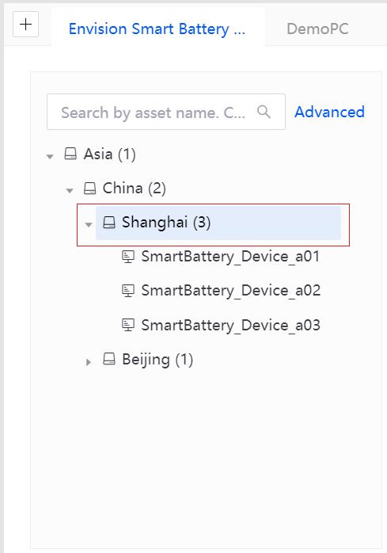
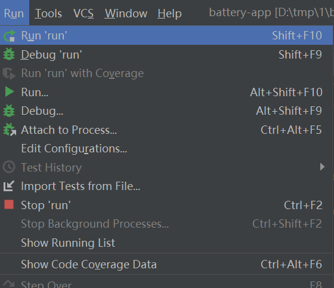
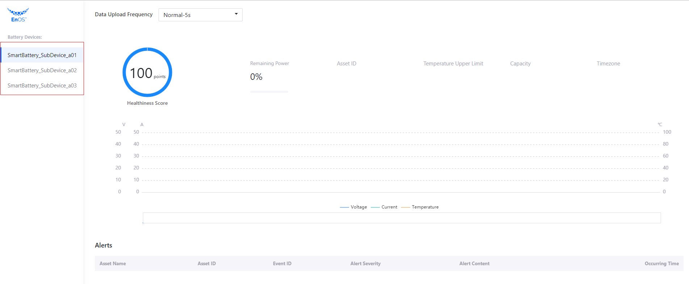
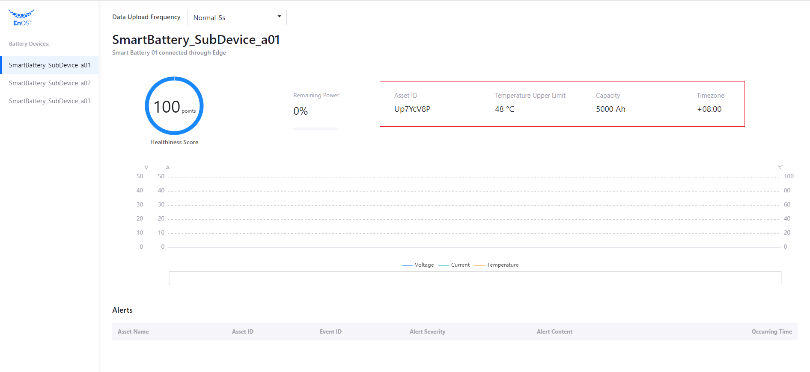
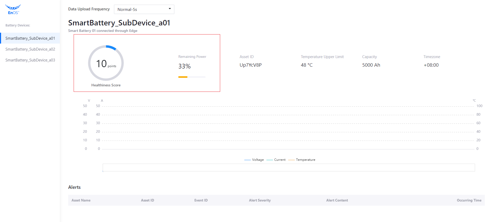
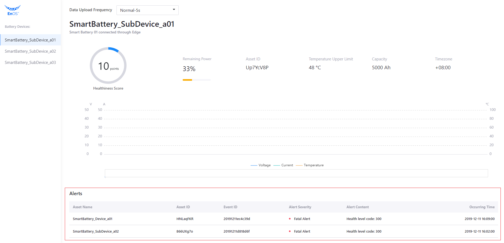

# 实验 3：调用 EnOS API

本实验中，你将通过调用 EnOS API 获取以下信息：

- 电池资产列表
- 电池基本信息
- 电池状态信息，即电池健康状况与剩余电量
- 资产树告警信息
- 数据上传频率
- 电池动态数据，如实时电压、电流和温度数据

## 步骤 1：获取电池资产列表

通过以下步骤调用 **Search Related Asset Node** API 并配置 `get_child_asset_list` 函数获取电池资产列表：

> **Search Related Asset Node** 的请求格式为：`https://{apigw-address}/asset-tree-service/v2.1/asset-nodes?action=searchRelatedAsset`。

1. 在 `services.py` 文件中找到 `get_child_asset_list` 存根函数并输入以下代码以获取指定模型的资产列表和资产树：

   

   ```java
   def get_child_asset_list(parentId):
       url = api_gateway + '/asset-tree-service/v2.1/asset-nodes?'
   
       query_data = {
           'action': 'searchRelatedAsset',
           'treeId': battery_provider_treeId,
           'orgId': training_orgId}
   
       query_string = parser.urlencode(query_data)
       url += query_string
   
       data = {
           "filter": {
               "isChildOfAssetId": parentId  # Specify the parent node Id for this query
           },
           "projection": ["assetId", "name.defaultValue"]
       }
   
       # poseidon.urlopen is the function defined in our SDK to send an API request.
       req = poseidon.urlopen(app_access_key, app_secret_key, url, data)
       return req
   ```

2. 上述配置完成后，你可以点击 **Run > Run** 运行应用程序。

   

3. 打开浏览器并在地址栏输入 `http://127.0.0.1:5000` 查看是否能看到智能电池设备的资产列表。




## 步骤 2：获取电池基本信息

通过以下步骤调用 **Get Asset** API 并配置 `get_asset_info` 函数以获取智能电池设备的基本信息：

> **Get Asset** 的请求格式为：`https://{apigw-address}/asset-service/v2.1/assets?action=get`。

1. 在 `services.py` 文件中找到 `get_asset_info` 函数并输入以下代码获取智能电池设备的基本信息：

   ```python
   def get_asset_info(assetId):
       url = api_gateway + '/asset-service/v2.1/assets?'
   
       query_data = {
           'action': 'get',
           'orgId': training_orgId,
           'assetId': assetId}
   
       query_string = parser.urlencode(query_data)
       url += query_string
   
       req = poseidon.urlopen(app_access_key, app_secret_key, url)
   
       return req
   ```

2. 点击 **Run > Run** 运行应用程序。

3. 打开浏览器并在地址栏输入 `http://127.0.0.1:5000` 查看是否获取到智能电池设备的基本信息。



## 步骤 3：获取电池状态

通过以下步骤调用 **Get Asset Latest Data** API 并配置 `get_asset_latest_data` 函数以获取智能电池设备的状态信息，如健康状况与剩余电量：

> **Get Asset Latest Data** 的调用格式为：`https://{apigw-address}/tsdb-service/v2.0/latest?orgId={}&assetIds={}&measurepoints={}&timeWindow={}&accessKey={}`。

1. 在 `services.py` 文件中找 到`get_asset_latest_data` 函数并添加以下代码获取电池的健康状况与剩余电量：

   ```python
   def get_asset_latest_data(assetIds, measurepoints):
       url = api_gateway + '/tsdb-service/v2.0/latest?'
   
       query_data = {
           'orgId': training_orgId,
           'assetIds': assetIds,
           'measurepoints': measurepoints,
           'timeWindow': '',
           'accessKey': app_access_key}
   
       query_string = parser.urlencode(query_data)
       url += query_string
   
       req = poseidon.urlopen(app_access_key, app_secret_key, url)
       return req
   ```

2. 点击 **Run > Run** 运行应用程序。

3. 打开浏览器并在地址栏输入 `http://127.0.0.1:5000` 查看是否获取到智能电池设备的健康状况与剩余电量信息。



## 步骤 4：获取资产树告警信息

通过以下步骤调用 **Search Active Alerts** API 并配置`get_active_alerts` 函数以接收从 EnOS Cloud 返回的资产树告警信息：

> **Search Active Alerts** 的请求格式为：`https://{apigw-address}/event-service/v2.1/active-alerts?action=search`。

1. 在 `services.py` 文件中找到 `get_active_alerts` 函数并添加以下代码获取资产树告警信息：

   ```python
   def get_active_alerts():
       url = api_gateway + '/event-service/v2.1/active-alerts?'
   
       query_data = {
           'action': 'search',
           'orgId': training_orgId}
   
       query_string = parser.urlencode(query_data)
       url += query_string
   
       data = {
           "scope": {
               "treeId": battery_provider_treeId  # Specify the asset tree from which to search active alerts
           },
           "pagination": {
               "pageNo": 1,
               "pageSize": 10
           }
       }
   
       req = poseidon.urlopen(app_access_key, app_secret_key, url, data)
       return req
   ```

2. 点击 **Run > Run** 运行应用程序。

3. 打开浏览器并在地址栏输入 `http://127.0.0.1:5000` 查看是否获取到智能电池设备所在资产树的告警信息。



## 步骤 5：设置数据上传频率

通过以下步骤调用 **Invoke Service** API 并配置 `set_battery_frequency` 函数以设置应用程序的数据上传频率。

> **Invoke Service** 的请求格式为：`https://{apigw-address}/connect-service/v2.1/commands?action=invokeService`。

1. 在 `services.py` 文件中找到 `set_battery_frequency` 函数并添加以下代码用于设置数据的上传频率：

   ```python
   def set_battery_frequency(assetId, frequency):
       url = api_gateway + '/connect-service/v2.1/commands?'
   
       query_data = {
           'action': 'invokeService',
           'orgId': training_orgId,
           'assetId': assetId,
           'serviceId': 'high_frequency_report_service',
           'pendingTtl': 1000}
   
       query_string = parser.urlencode(query_data)
       url += query_string
   
       print(url)
   
       data = {
           "inputData": {
               "interval": frequency
           }
       }
   
       req = poseidon.urlopen(app_access_key, app_secret_key, url, data)
       return req
   ```

2. 点击 **Run > Run** 启动应用程序。
   
此时，你仍无法直接看到更改数据上传频率的结果。因为你尚未检索智能电池设备电压、电流和温度的动态数据。在下一实验中，你将完成这一步骤以及整个应用的开发。

关于 EnOS API 的详细信息，参见 [EnOS™ API](https://support.envisioniot.com/docs/api/zh_CN/2.3.0/overview.html)。

## 下一实验

[实验 4：完成应用开发](developing_by_yourself_python.md)