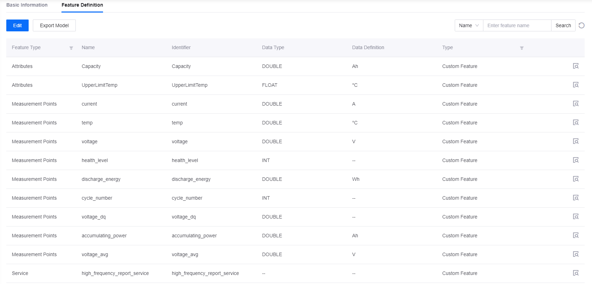
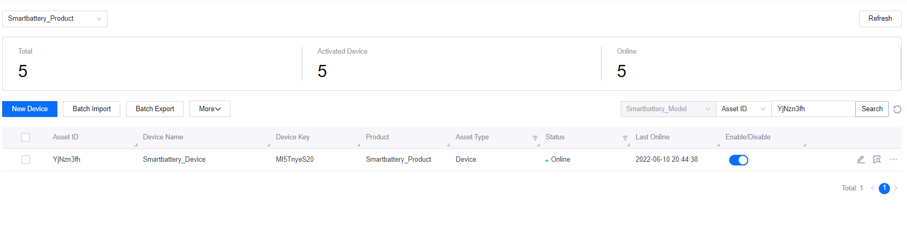
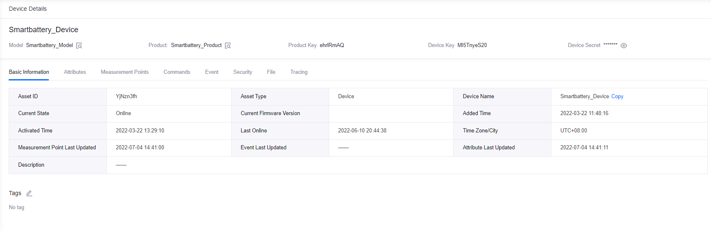
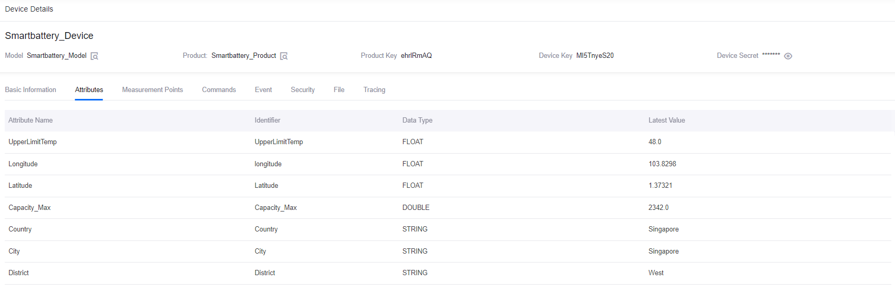

# Lab 1. Connect a Smart Battery to EnOS™ (Java)


Before connecting devices to EnOS IoT Hub, you need to register the devices on the EnOS Management Console, which includes defining a device model, creating a product, registering devices, and creating an asset tree for the devices.

This lab uses a smart battery device as an example to show how to register a smart device that connects directly to the EnOS Cloud.

> **Note**: You need to replace the default name by following the naming pattern: `xxx_studentId`.

## Procedure Overview

The procedure of this lab is as follow:


## Step 1: Define a Model

A model is the abstraction of the features of an object connected to the IoT Hub. The device model defines the features of a device, including the attributes, measurement points, services, and events.

1. In the EnOS Management Console, click **Models** from the left navigation menu.

2. Click **New Model** and configure the following fields in the **New Model** window:

   - Identifier: enter **Smartbattery_Model**
   - Model Name: enter **Smartbattery_Model**
   - Category: enter **Demo**
   - Created From: click **No**
   - Source Model: select **Null**
   - Validate Model: enable
   - Description: enter your description for the model

    

3. Click **OK** to save the basic information of the model.

4. From the model list, click the **Edit** icon of the battery model you created, and click the **Feature Definition** tab on the **Model Details** page.

5. There are two ways to create custom features: 
    
    - Manually adding features: click **Edit > Add > Create Custom Feature**, and create the following custom features in the **Add Feature** window.
        
        |  Feature Type       |  Name                           |  Identifier                     |  Point Type  |  Data Type  |  Data Definition  |
        |  -----------------  |  -----------------------------  |  -----------------------------  |  ----------  |  ---------  |  ---------------  |
        |  Attributes         |  Capacity                       |  Capacity                       |      /       |  DOUBLE     |  Ah               |
        |  Attributes         |  UpperLimitTemp                 |  UpperLimitTemp                 |       /      |  FLOAT      |  °C               |
        |  Measurement Points |  current                        |  current                        |  AI          |  DOUBLE     |  A                |
        |  Measurement Points |  temp                           |  temp                           |  AI          |  DOUBLE     |  °C               | 
        |  Measurement Points |  voltage                        |  voltage                        |  AI          |  DOUBLE     |  V                |
        |  Measurement Points |  health_level                   |  health_level                   |  DI          |  INT        |     /             |
        |  Measurement Points |  discharge_energy               |  discharge_energy               |  AI          |  DOUBLE     |  Wh               |
        |  Measurement Points |  cycle_number                   |  cycle_number                   |  Generic     |  INT        |     /             |
        |  Measurement Points |  voltage_dq                     |  voltage_dq                     |  AI          |  DOUBLE     |     /             |
        |  Measurement Points |  accumulating_power             |  accumulating_power             |  AI          |  DOUBLE     |  Ah               |
        |  Measurement Points |  voltage_avg                    |  voltage_avg                    |  AI          |  DOUBLE     |  V                |
        |  Service            |  high_frequency_report_service  |  high_frequency_report_service  |       /      |     /       |     /             |

       

    - Importing from a file: Click **Edit > Import Model** and upload an Excel or JSON file. You can use [this file](media/model_SmartBattery.json) in this lab.

6. Click **Publish** to save and publish the features you have added above.

## Step 2: Create a Product

A smart battery product is a collection of battery devices with the same features. Based on models, products further define the communication specifications of devices.

In this lab, the devices in the **Smartbattery_Model** is assumed to send data in JSON format without encrypted by CA certificate (only secret-based authentication is enforced). Create a product by the following steps:

1. In the EnOS Management Console, select **Device Management > Products**.

2. Click **New Product**, configure the following fields in the **New Product** window:
    - Product Name: enter **Smartbattery_Product**
    - Asset Type: click **Device**
    - Model: select **Smartbattery_Model** from the dropdown list
    - Onboarding Method: select **Only EnOS IoT** from the dropdown list
    - Certificate-Based Authentication: click **Disabled**
    - Description: enter the description for the product

3. Click **OK** to save the configuration.


For more information on the configuration of a product, see [Creating a Device Collection (Product)](https://support.envisioniot.com/docs/device-connection/en/2.3.0/howto/device/creating_product.html).

## Step 3: Register a Device

A device is the instance of a model and belongs to a certain product. The device inherits not only basic but also communicative features of the product (for example, the device key-secret pair, and if enabled, device certificate used for secure communication).

Create a device named **Smartbattery_Device** that belongs to the **Smartbattery_Product** by the following steps:

1. In the EnOS Management Console, select **Device Management > Device Assets**.

2. Click **New Device**, and configure the following fields in the **New Device** window:

    - Product: Select **Smartbattery_Product** from the dropdown list
    - Device Name: enter **Smartbattery_Device**
    - Device Key: optional, can be generated automatically by the system
    - Timezone/City: select **UTC+08:00** from the dropdown list
    - Use DST: disable

3. Click **OK** to save the configuration.



## (Optional) Step 4: Configure TSDB Storage Policy

EnOS Time Series Database (TSDB) provides a variety of storage options to store important and frequently-accessed business data. By configuring storage policies, you can route time-series data to different datastores based on data types and storage time to reduce data storage costs and enhance data access efficiency.

> **Note**:
> - By default, the uploaded data will not stored in TSDB. You must configure data storage policy before the data is uploaded to EnOS Cloud.
> - Each model can be associated to only one storage policy group.

Taking the **AI Raw Data** storage type as an example, configure storage policies for the measurement points that are defined in the **Smartbattery_Model** by the following steps:

1. Select **Time Series Data Management > Storage Policies** from the left navigation menu.

2. Click the **Formatted record** tab to view the current storage policies for formatted records. You can click the **+** icon to create a storage policy group or use an existing storage policy group. 
   > **Note**: For each OU, you can create up to 5 storage policy groups. In this lab, use the **Developer_Bootcamp** storage policy group to store device data.

3. Click the **Developer_Bootcamp** tab to view all the TSDB storage policy options listed under the tab.

4. Locate the **AI Raw Data** storage type and click the **Edit** icon to open the **Edit Storage Policy** page.

5. From the **Storage Time** dropdown list, select the storage time for the data. In this tutorial, save the data in TSDB for 3 months.

6. Select **Smartbattery_Model** in the **Group Model** section, and all measurement points in the **Select Measuring Point**.

7. Click **OK** to save the storage policy.

For detailed steps to configure the storage policy for the smart battery device, see [Lab 1: Configure Storage Policy for Battery Data](3_data_management/../../../3_Data_Management/lab_tutorial/303-1_configuring_storage_policy.md).


## Step 5: Set up Java Environment

After registering a device and configured storage policies, you can use the EnOS Java SDK for MQTT to connect the smart battery device to EnOS and transmit data.

For detailed information on the EnOS Java SDK for MQTT, see the Readme file on [GitHub](https://github.com/EnvisionIot/enos-mqtt-sdk-java).

EnOS Java SDK for MQTT requires Java SE 8 and Maven 3. Before setting up Java Environment, be sure to install the following items:

- A development environment, such as IntelliJ IDEA, which can be downloaded at https://www.jetbrains.com/idea/download/.

- EnOS Java JDK for MQTT, which can be downloaded at https://www.oracle.com/technetwork/java/javase/downloads/jdk8-downloads-2133151.html.

- Maven 3, which can be downloaded at http://maven.apache.org/download.cgi.

With the items above installed, create a Java project in Intellij IDEA by the following steps:

1. Open Intellij IDEA, select **Do not Import Settings** and click **Skip Remaining and Set Defaults > Create New Project**.


2. Select **Maven** as the project type and click **Next**.

3. Enter the **GroupId** and **ArtifctId** for the project and click **Next**.

4. Enter the **Project name**, browse and specify the **Project location**, then click **Finish** to create a Java project.

After creating a Java project, you need to add dependencies to the project by the following steps:

1. On the new project page, click **Enable Auto-Import** for importing Maven projects.

2. Update the pom.xml file by adding the following maven dependencies of EnOS Java SDK and other plug-ins that are required for development:

    ```java
    <dependencies>
        <dependency>
            <groupId>com.envisioniot</groupId>
            <artifactId>enos-mqtt</artifactId>
            <version>2.2.16</version>
        </dependency>
        <dependency>
            <groupId>org.slf4j</groupId>
            <artifactId>slf4j-simple</artifactId>
            <version>1.7.25</version>
            <scope>all</scope>
        </dependency>
    </dependencies>
    ```

3. (Optional) Or, You can download the [pom.xml](smartbattery_samplejavaproject/pom.xml) file in the sample Java project and replace the original file in your project.

4. Save the **pom.xml** file to finish the setup of your Java environment.

## Step 6. Connect a Device to EnOS Cloud 

After setting up the development environment, connect the smart battery device to EnOS Cloud by the following steps:

1. Import the required packages:
   
   ```java
    package com.example;

    import com.envisioniot.enos.iot_mqtt_sdk.core.MqttClient;
    import com.envisioniot.enos.iot_mqtt_sdk.core.login.LoginInput;
    import com.envisioniot.enos.iot_mqtt_sdk.core.login.NormalDeviceLoginInput;
    import com.envisioniot.enos.iot_mqtt_sdk.core.msg.IMessageHandler;
    import com.envisioniot.enos.iot_mqtt_sdk.core.profile.DefaultProfile;
    import com.envisioniot.enos.iot_mqtt_sdk.message.downstream.tsl.*;
    import com.envisioniot.enos.iot_mqtt_sdk.message.upstream.tsl.*;
    import org.slf4j.Logger;
    import org.slf4j.LoggerFactory;
    import java.util.Random;

    import java.util.*;
    ```

2. Declare the variables that will be used in the program:

    ```java
    private final static String PLAIN_SERVER_URL = "yourMQTTaddress:yourport"; // Obtain the MQTT Broker address from EnOS Console > Help > Environment Information
    private final static String PRODUCT_KEY = "yourprodutkey";
    private final static String DEVICE_KEY = "yourdevicekey";
    private final static String DEVICE_SECRET = "yourdevicesecret";

    ```

    In which:
    - The MQTT Broker address and port can be obtained from **EnOS Management Console > Help > Environment Information**.
    - The productKey, deviceKey, and deviceSecret are the device properties generated when you register the smart battery device.

 
 

3. Declare the main function **connect()** for initializing device connection:
    ```java
    public static void main(String[] args) {
        LoginInput input = new NormalDeviceLoginInput(PLAIN_SERVER_URL, PRODUCT_KEY, DEVICE_KEY, DEVICE_SECRET);
        final MqttClient client = new MqttClient(new DefaultProfile(input));

        client.connect(new ConnCallback() {
            @Override
            public void connectComplete(boolean reconnect) {
                System.out.println("------------ connect success: " + reconnect);
            }

            @Override
            public void connectLost(Throwable cause) {
                System.out.println("------------ connect lost" + cause);
            }

            @Override
            public void connectFailed(Throwable cause) {
                System.out.println("------------ connect failed: " + cause);
            }
        });
    }
    ```
4. Use the **connect()** function to connect the smart battery device to EnOS Cloud:

    ```java
    public static void main(String[] args) {
        LoginInput input = new NormalDeviceLoginInput(PLAIN_SERVER_URL, PRODUCT_KEY, DEVICE_KEY, DEVICE_SECRET);
        final MqttClient client = new MqttClient(new DefaultProfile(input));

        client.connect(new IConnectCallback() {

            // On connect
            public void onConnectSuccess() {
                LOG.info("Connect Success.");

                // Set service handler to handle service command from cloud
                client.setArrivedMsgHandler(ServiceInvocationCommand.class, createServiceCommandHandler(client));

                // Set atrributes handler to handle atrributes set command from cloud
                client.setArrivedMsgHandler(MeasurepointSetCommand.class, createMeasurePointSetHandler(client));

                try {
                    // Just a simulator to post the measurepoints of devices
                    monitor(client);
                } catch (Exception e) {
                    e.printStackTrace();
                }
                LOG.info("Waiting commands from cloud.");
            }

            // On connection lost
            public void onConnectLost() {
                LOG.info("Connect Lost.");
                client.close();
            }

            // On connect falied
            public void onConnectFailed(int reason) {
                LOG.info("Connect Failed.");
                client.close();
            }
        });
    }
    ```
## Step 7. Upload Data to EnOS Cloud

After connecting the smart battery device to EnOS, simulate the voltage, temperature and currents of the smart battery device and upload the data to EnOS Cloud by the following steps:

1. Use the **simulateMeasurePoints()** function to simulate the voltage, temperature, and current of the smart battery device. Define all the thresholds at the beginning:
    ```java
    private static final double VOL_MAX = 26;
    private static final double VOL_MIN = 22;
    private static final double CUR_MAX = 11;
    private static final double CUR_MIN = 9;
    private static final double TEMP_MIN = 0;
    private static final double TEMP_MAX = 80;
    private static final double CUR_D_MAX = -9;
    private static final double CUR_D_MIN = -11;
    private static final int CUR_PERIOD = 60*60;
    private static final int TEMP_PERIOD = 20*60;
    ```
2. Simulate the measure points of devices:

    ```java
    // Simulate the measure points of devices
    public static Map<String, Object> simulateMeasurePoints() {
        Map<String, Object> data=new HashMap<String, Object>();
        Random random = new Random();
        data.put("temp", temp_count*(TEMP_MAX/TEMP_PERIOD));
        data.put("voltage", random.nextDouble()*(VOL_MAX - VOL_MIN) + VOL_MIN);
        data.put("current", random.nextDouble()*(CUR_MAX - CUR_MIN) + CUR_MIN);
        data.put("current_d", random.nextDouble()*(CUR_D_MAX - CUR_D_MIN) + CUR_MIN);

        return data;
    }
    ```
3. Use the **monitor()** function to upload the measurement points of the smart battery device to EnOS Cloud:

    ```java
    // Monitoring the voltage, temperature and current of device
    public static void monitor(final MqttClient client) throws Exception {
        System.out.println("post measure points start ...");
        Thread t1 = new Thread() {
            public void run() {
                while (true) {
                    postVoltage(client);
                    try {
                        Thread.sleep(interval * 1000);
                    } catch (InterruptedException e) {
                        System.out.println("post voltage thread end.");
                    }

                }
            }
        };
        t1.start();

        Thread t2 = new Thread() {
            public void run() {
                while (true) {
                    postTemp(client);
                    try {
                        Thread.sleep(interval * 1000);
                    } catch (InterruptedException e) {
                        System.out.println("post temperature thread end.");
                    }

                }
            }
        };
        t2.start();

        Thread t3 = new Thread() {
            public void run() {
                while (true) {
                    postCurrent(client);
                    try {
                        Thread.sleep(interval * 1000);
                    } catch (InterruptedException e) {
                        System.out.println("post current thread end.");
                    }

                }
            }
        };
        t3.start();
    }

    ```
## Step 8. Run the Program and Check the Device Status

Run the complete Java codes in your Java environment, and check the connection results by the following steps:

1. Run the following codes to connect the device and upload the device data:

    ```java
    package com.example;

    import com.envisioniot.enos.iot_mqtt_sdk.core.IConnectCallback;
    import com.envisioniot.enos.iot_mqtt_sdk.core.MqttClient;
    import com.envisioniot.enos.iot_mqtt_sdk.core.login.LoginInput;
    import com.envisioniot.enos.iot_mqtt_sdk.core.login.NormalDeviceLoginInput;
    import com.envisioniot.enos.iot_mqtt_sdk.core.msg.IMessageHandler;
    import com.envisioniot.enos.iot_mqtt_sdk.core.profile.DefaultProfile;
    import com.envisioniot.enos.iot_mqtt_sdk.message.downstream.tsl.*;
    import com.envisioniot.enos.iot_mqtt_sdk.message.upstream.tsl.*;
    import org.slf4j.Logger;
    import org.slf4j.LoggerFactory;
    import java.util.Random;

    import java.util.*;

    public class SmartbatterySamples {
        private final static Logger LOG = LoggerFactory.getLogger(SmartbatterySamples.class);

        private final static String PLAIN_SERVER_URL = "tcp://mqtt-ppe1.envisioniot.com:21883";

        private final static String PRODUCT_KEY = "yourproductkey";
        private final static String DEVICE_KEY = "yourdevicekey";
        private final static String DEVICE_SECRET = "yourdevicesecret";
        private static int interval = 5; //data uploading frequeny, 5 seconds
        private static final double VOL_MAX = 26;
        private static final double VOL_MIN = 22;
        private static final double CUR_MAX = 11;
        private static final double CUR_MIN = 9;
        private static final double TEMP_MIN = 0;
        private static final double TEMP_MAX = 80;
        private static final double CUR_D_MAX = -9;
        private static final double CUR_D_MIN = -11;
        private static final int CUR_PERIOD = 60*60;
        private static final int TEMP_PERIOD = 20*60;
        private static int cur_count = 0;
        private static double temp_count = 0;
        private static String change = "current";
        private static boolean flag = true;
        private static boolean temp_flag = true;

        public static void main(String[] args) {
            LoginInput input = new NormalDeviceLoginInput(PLAIN_SERVER_URL, PRODUCT_KEY, DEVICE_KEY, DEVICE_SECRET);
            final MqttClient client = new MqttClient(new DefaultProfile(input));

            client.connect(new IConnectCallback() {
                public void onConnectSuccess() {
                    LOG.info(" Connect Success.");

                    // Set service handler to handle service command from cloud
                    client.setArrivedMsgHandler(ServiceInvocationCommand.class, createServiceCommandHandler(client));
                    client.setArrivedMsgHandler(MeasurepointSetCommand.class, createMeasurePointSetHandler(client));
                    try {
                        monitor(client);
                    } catch (Exception e) {
                        e.printStackTrace();
                    }
                    LOG.info("Waiting commands from cloud");
                }

                public void onConnectLost() {
                    LOG.info("Connect Lost.");
                    client.close();
                }

                public void onConnectFailed(int reason) {
                    LOG.info("Connect Failed.");
                    client.close();
                }
            });
        }

        private static IMessageHandler<MeasurepointSetCommand, MeasurepointSetReply> createMeasurePointSetHandler(final MqttClient client) {
            return (MeasurepointSetCommand arrivedMessage, List<String> argList) -> {
                byte[] bytes = arrivedMessage.encode();
                LOG.info("arrivedMessage: {}", new String(bytes));
                LOG.info("len: {}", bytes.length);
                LOG.info("argList: {}", argList);

                // argList: productKey, deviceKey, serviceName
                // If the request is for sub-device, the productKey and deviceKey
                // are used to identify the target sub-device.
                String productKey = argList.get(0);
                String deviceKey = argList.get(1);
                //String serviceName = argList.get(2);
                LOG.info("productKey: {}, deviceKey: {}",
                        productKey, deviceKey);

                return MeasurepointSetReply.builder().build();
            };
        }

        private static IMessageHandler<ServiceInvocationCommand, ServiceInvocationReply> createServiceCommandHandler(final MqttClient client) {
            return (ServiceInvocationCommand request, List<String> argList) -> {
                LOG.info("receive command: {}", request);

                // argList: productKey, deviceKey, serviceName
                // If the request is for sub-device, the productKey and deviceKey
                // are used to identify the target sub-device.
                String productKey = argList.get(0);
                String deviceKey = argList.get(1);
                String serviceName = argList.get(2);
                LOG.info("productKey: {}, deviceKey: {}, serviceName: {}, params: {}",
                        productKey, deviceKey, serviceName, request.getParams());

                LOG.info("<<<<< [service command] rcvn async serevice invocation command: " + request + " topic: " + argList);

                if (serviceName.equals("high_frequency_report_service")) {
                    Map<String, Object> params = request.getParams();
                    int n = (Integer) params.get("interval");
                    LOG.info("arg interval: {}", n);
                    interval = n;

                    // Set the reply result
                    return ServiceInvocationReply.builder().build();
                } else if (serviceName.equals("disconnect")) {
                    Map<String, Object> params = request.getParams();
                    int delayMS = (Integer) params.get("delayMS");
                    LOG.info("arg delay: {}", delayMS);

                    final Timer timer = new Timer();
                    timer.schedule(new TimerTask() {
                        @Override
                        public void run() {
                            LOG.info("now close connection ...");
                            client.close();
                            timer.cancel();
                        }
                    }, delayMS);
                    return ServiceInvocationReply.builder().build();
                }

                return ServiceInvocationReply.builder().setMessage("unknown service: " + serviceName).setCode(220).build();
            };
        }

        // Simulate the measuring points of devices
        public static Map<String, Object> simulateMeasurePoints() {
            Map<String, Object> data=new HashMap<String, Object>();
            Random random = new Random();
            data.put("temp", temp_count*(TEMP_MAX/TEMP_PERIOD));
            data.put("voltage", random.nextDouble()*(VOL_MAX - VOL_MIN) + VOL_MIN);
            data.put("current", random.nextDouble()*(CUR_MAX - CUR_MIN) + CUR_MIN);
            data.put("current_d", random.nextDouble()*(CUR_D_MAX - CUR_D_MIN) + CUR_D_MIN);

            return data;
        }

        // Post measuring point of voltage
        private static void postVoltage(final MqttClient client) {
            Map<String, Object> measurePoints = simulateMeasurePoints();
            try {
                MeasurepointPostRequest request = MeasurepointPostRequest.builder()
                        .setQos(0)
                        .addMeasurePoint("voltage", measurePoints.get("voltage"))
                        .build();

                MeasurepointPostResponse response = client.publish(request);
                if (response.isSuccess()) {
                    LOG.info("measure points(voltage) are published successfully");
                } else {
                    LOG.error("failed to publish measure points, error: {}", response.getMessage());
                }
            } catch (Exception e) {
                LOG.error("failed to publish measure point(voltage)", e);
            }
        }

        // Post measuring point of current
        private static void postCurrent(final MqttClient client) {
            Map<String, Object> measurePoints = simulateMeasurePoints();
            try {

                // Simulate the measuring points according to battery
                cur_count += interval;
                if(cur_count >= CUR_PERIOD) {
                    flag = !flag;
                    cur_count = 0;
                    if (flag) change = "current";
                    else change = "current_d";
                }

                MeasurepointPostRequest request = MeasurepointPostRequest.builder()
                        .setQos(0)
                        .addMeasurePoint("current", measurePoints.get(change))
                        .build();

                MeasurepointPostResponse response = client.publish(request);
                if (response.isSuccess()) {
                    LOG.info("measure points(current) are published successfully");
                } else {
                    LOG.error("failed to publish measure points, error: {}", response.getMessage());
                }
            } catch (Exception e) {
                LOG.error("failed to publish measure point(voltage)", e);
            }
        }

        // Post measuring point of temperature
        private static void postTemp(final MqttClient client) {
            Map<String, Object> measurePoints = simulateMeasurePoints();
            try {
                // Simulating the measuring points according to battery
                if (temp_flag) {
                    if (temp_count >= 0 && temp_count < TEMP_PERIOD) {
                        temp_count += interval;
                    } else if (temp_count >= TEMP_PERIOD) {
                        temp_flag = !temp_flag;
                        temp_count = TEMP_PERIOD - interval;
                    }
                } else {
                    if(temp_count > 0) {
                        temp_count -= interval;
                    } else if (temp_count <= 0) {
                        temp_flag = !temp_flag;
                        temp_count = interval;
                    }
                }

                MeasurepointPostRequest request = MeasurepointPostRequest.builder()
                        .setQos(0)
                        .addMeasurePoint("temp", measurePoints.get("temp"))
                        .build();

                MeasurepointPostResponse response = client.publish(request);
                if (response.isSuccess()) {
                    LOG.info("measure points(Temp) are published successfully");
                } else {
                    LOG.error("failed to publish measure points, error: {}", response.getMessage());
                }
            } catch (Exception e) {
                LOG.error("failed to publish measure points", e);
            }
        }

        // Monitoring the voltage, temperature and current of device
        public static void monitor(final MqttClient client) throws Exception {
            System.out.println("post measure points start ...");
            Thread t1 = new Thread() {
                public void run() {
                    while (true) {
                        postVoltage(client);
                        try {
                            Thread.sleep(interval * 1000);
                        } catch (InterruptedException e) {
                            System.out.println("post thread end.");
                        }

                    }
                }
            };
            t1.start();

            Thread t2 = new Thread() {
                public void run() {
                    while (true) {
                        postTemp(client);
                        try {
                            Thread.sleep(interval * 1000);
                        } catch (InterruptedException e) {
                            System.out.println("post thread end.");
                        }

                    }
                }
            };
            t2.start();

            Thread t3 = new Thread() {
                public void run() {
                    while (true) {
                        postCurrent(client);
                        try {
                            Thread.sleep(interval * 1000);
                        } catch (InterruptedException e) {
                            System.out.println("post thread end.");
                        }

                    }
                }
            };
            t3.start();
        }

    }

    ```
2. Check the running results of the program. The program will return the following sample results.

    ```
    onConnectSuccess
    waiting commands from cloud
    ```

    ```java
    "C:\Program Files\Java\jdk1.8.0_191\bin\java.exe"

    2019-12-08 13:00:40 DEBUG DefaultProcessor:245 - connect complete , reconnect false , serverUri tcp://mqtt-ppe1.envisioniot.com:21883
    2019-12-08 13:00:40 INFO  SmartbatterySample:46 - Connect Success.
    post measure points start ...
    2019-12-08 13:00:40 INFO  SmartbatterySample:57 - Waiting commands from cloud
    ```

3. Check the logs of the measurement point data uploaded to EnOS Cloud:
    
    ```$xslt
    connect success
    waiting commands from cloud
    measurepoint post response code: 200, {'cycle_number': 0, 'temp': 45.33639481400027, 'voltage': 4.476127173515886, 'current': 40.57236573795417, 'accumulating_power': 181.6070687734816}
    measurepoint post response code: 200, {'cycle_number': 0, 'temp': 50.12095953667547, 'voltage': 4.375110588038265, 'current': 41.808972720876994, 'accumulating_power': 364.5259479995935}
    measurepoint post response code: 200, {'cycle_number': 0, 'temp': 53.70875593556161, 'voltage': 4.3430578089373055, 'current': 40.01262380152207, 'accumulating_power': 538.3030862568646}
    measurepoint post response code: 200, {'cycle_number': 0, 'temp': 56.207075645498826, 'voltage': 4.24141682055193, 'current': 41.34971752375547, 'accumulating_power': 713.6844736871919}
    ```

4. In the EnOS Management Console, click **Device Management > Device Assets** to check the status of the smart battery device. If you connect the device to EnOS successfully, the device status will be **Online**.

    

5. In the **Device Details** page, click the **Attributes** tab to view the updated attributes of the smart battery device.

    

6. In the **Device Details** page, click the **Measurement Points** tab to view the updated measurement points of the smart battery device.

    

## Step 9: View the Data Insight of the Device

You can view the real-time data report on the measurement points of the smart battery device by the following steps:

1. In the EnOS Management Console, click **Time Series Data Management > Data Insights**.

2. In the **Select Devices** section, select the **Smartbattery_Device** device.

3. In the **Selected Measuring Points** section, select the measurement points to generate the real-time data chart or table.


[Lab 2. Simulate Measurement Points](302-2_simulating_measure_points.md)
