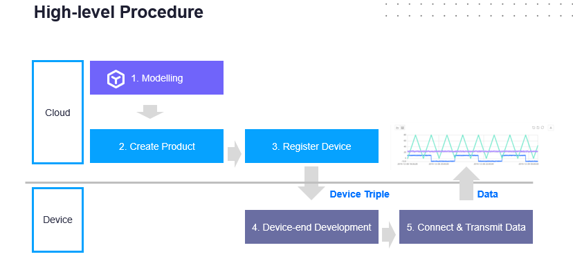
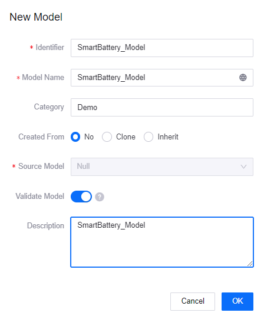
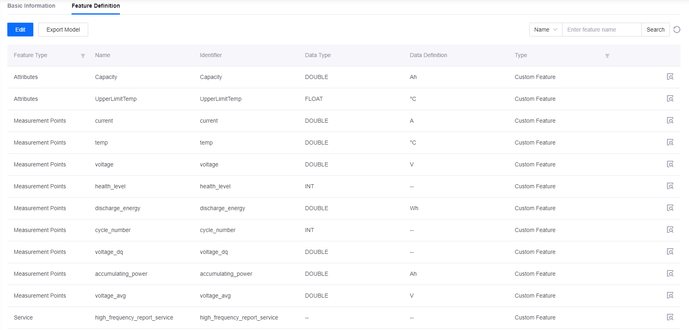
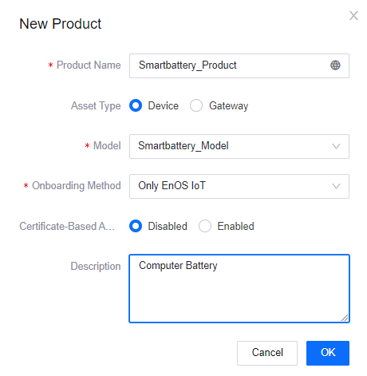
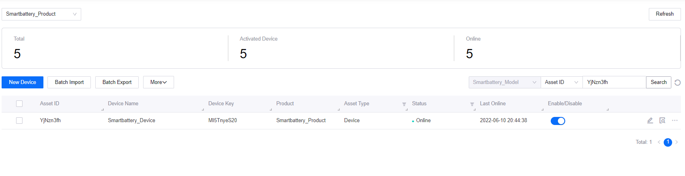
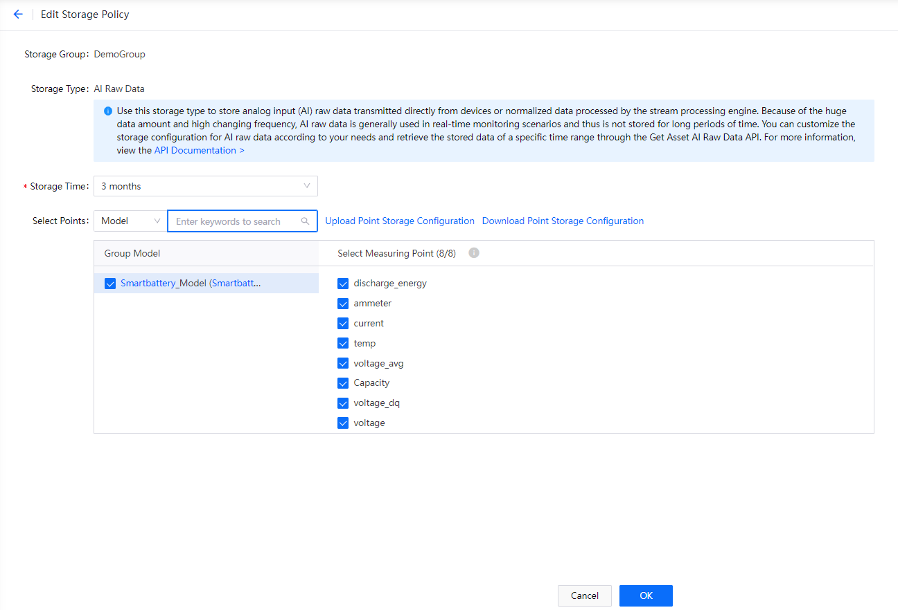
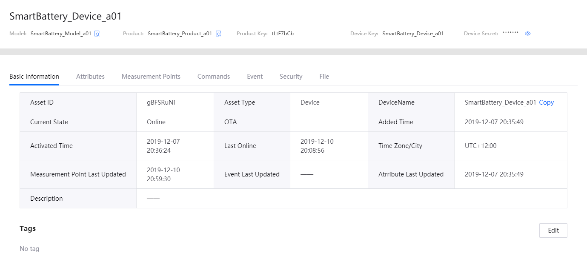
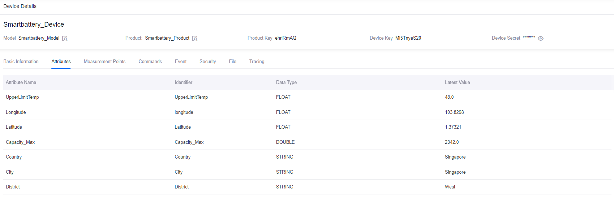
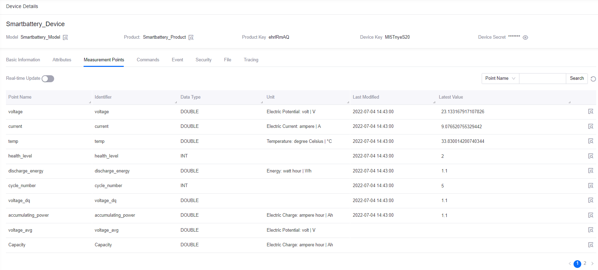
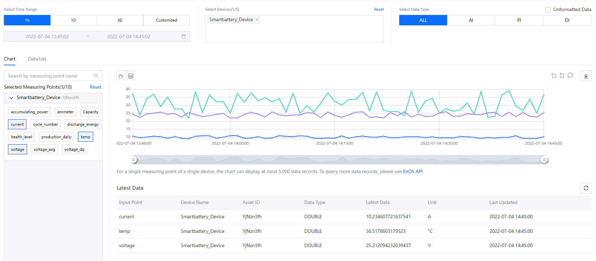

# Lab 1. Connect a Smart Battery to EnOS™ (Python)

Before connecting devices to EnOS IoT Hub, you need to register the devices on the EnOS Management Console, which includes defining a device model, creating a product, registering devices, and creating an asset tree for the devices.

This lab uses a smart battery device as an example to show how to register a smart device that connects directly to the EnOS Cloud.

> **Note**: You need to replace the default name by following the naming pattern: `xxx_studentId`.

## Procedure Overview

The procedure of this lab is as follow:



## Step 1: Define a Model

A model is the abstraction of the features of an object connected to the IoT Hub. The device model defines the features of a device, including the attributes, measurement points, services, and events.

1. In the EnOS Management Console, click **Models** from the left navigation menu.

2. Click **New Model** and configure the following fields in the **New Model** window:

   - Identifier: enter **Smartbattery_Model**
   - Model Name: enter **Smartbattery_Model**
   - Category: enter **Demo**
   - Created From: click **No**
   - Source Model: select **Null**
   - Validate Model: enable
   - Description: enter your description for the model

    

3. Click **OK** to save the basic information of the model.

4. From the model list, click the **Edit** icon of the battery model you created, and click the **Feature Definition** tab on the **Model Details** page.

5. There are two ways to create custom features: 
    
    - Manually adding features: click **Edit > Add > Create Custom Feature**, and create the following custom features in the **Add Feature** window.
        
        |  Feature Type       |  Name                           |  Identifier                     |  Point Type  |  Data Type  |  Data Definition  |
        |  -----------------  |  -----------------------------  |  -----------------------------  |  ----------  |  ---------  |  ---------------  |
        |  Attributes         |  Capacity                       |  Capacity                       |      /       |  DOUBLE     |  Ah               |
        |  Attributes         |  UpperLimitTemp                 |  UpperLimitTemp                 |       /      |  FLOAT      |  °C               |
        |  Measurement Points |  current                        |  current                        |  AI          |  DOUBLE     |  A                |
        |  Measurement Points |  temp                           |  temp                           |  AI          |  DOUBLE     |  °C               | 
        |  Measurement Points |  voltage                        |  voltage                        |  AI          |  DOUBLE     |  V                |
        |  Measurement Points |  health_level                   |  health_level                   |  DI          |  INT        |     /             |
        |  Measurement Points |  discharge_energy               |  discharge_energy               |  AI          |  DOUBLE     |  Wh               |
        |  Measurement Points |  cycle_number                   |  cycle_number                   |  Generic     |  INT        |     /             |
        |  Measurement Points |  voltage_dq                     |  voltage_dq                     |  AI          |  DOUBLE     |     /             |
        |  Measurement Points |  accumulating_power             |  accumulating_power             |  AI          |  DOUBLE     |  Ah               |
        |  Measurement Points |  voltage_avg                    |  voltage_avg                    |  AI          |  DOUBLE     |  V                |
        |  Service            |  high_frequency_report_service  |  high_frequency_report_service  |       /      |     /       |     /             |

       

    - Importing from a file: Click **Edit > Import Model** and upload an Excel or JSON file. You can use [this file](media/model_SmartBattery.json) in this lab.

6. Click **Publish** to save and publish the features you have added above.

## Step 2: Create a Product

A smart battery product is a collection of battery devices with the same features. Based on models, products further define the communication specifications of devices.

In this lab, the devices in the **Smartbattery_Model** is assumed to send data in JSON format without encrypted by CA certificate (only secret-based authentication is enforced). Create a product by the following steps:

1. In the EnOS Management Console, select **Device Management > Products**.

2. Click **New Product**, configure the following fields in the **New Product** window:
    - Product Name: enter **Smartbattery_Product**
    - Asset Type: click **Device**
    - Model: select **Smartbattery_Model** from the dropdown list
    - Onboarding Method: select **Only EnOS IoT** from the dropdown list
    - Certificate-Based Authentication: click **Disabled**
    - Description: enter the description for the product

3. Click **OK** to save the configuration.



For more information on the configuration of a product, see [Creating a Device Collection (Product)](https://support.envisioniot.com/docs/device-connection/en/2.3.0/howto/device/creating_product.html).

## Step 3: Register a Device

A device is the instance of a model and belongs to a certain product. The device inherits not only basic but also communicative features of the product (for example, the device key-secret pair, and if enabled, device certificate used for secure communication).

Create a device named **Smartbattery_Device** that belongs to the **Smartbattery_Product** by the following steps:

1. In the EnOS Management Console, select **Device Management > Device Assets**.

2. Click **New Device**, and configure the following fields in the **New Device** window:

    - Product: Select **Smartbattery_Product** from the dropdown list
    - Device Name: enter **Smartbattery_Device**
    - Device Key: optional, can be generated automatically by the system
    - Timezone/City: select **UTC+08:00** from the dropdown list
    - Use DST: disable

3. Click **OK** to save the configuration.



## (Optional) Step 4: Configure TSDB Storage Policy

EnOS Time Series Database (TSDB) provides a variety of storage options to store important and frequently-accessed business data. By configuring storage policies, you can route time-series data to different datastores based on data types and storage time to reduce data storage costs and enhance data access efficiency.

> **Note**:
> - By default, the uploaded data will not stored in TSDB. You must configure data storage policy before the data is uploaded to EnOS Cloud.
> - Each model can be associated to only one storage policy group.

Taking the **AI Raw Data** storage type as an example, configure storage policies for the measurement points that are defined in the **Smartbattery_Model** by the following steps:

1. Select **Time Series Data Management > Storage Policies** from the left navigation menu.

2. Click the **Formatted record** tab to view the current storage policies for formatted records. You can click the **+** icon to create a storage policy group or use an existing storage policy group. 
   > **Note**: For each OU, you can create up to 5 storage policy groups. In this lab, use the **Developer_Bootcamp** storage policy group to store device data.

3. Click the **Developer_Bootcamp** tab to view all the TSDB storage policy options listed under the tab.

4. Locate the **AI Raw Data** storage type and click the **Edit** icon to open the **Edit Storage Policy** page.

5. From the **Storage Time** dropdown list, select the storage time for the data. In this tutorial, save the data in TSDB for 3 months.

6. Select **Smartbattery_Model** in the **Group Model** section, and all measurement points in the **Select Measuring Point**.

7. Click **OK** to save the storage policy.

For detailed steps to configure the storage policy for the smart battery device, see [Lab 1: Configure Storage Policy for Battery Data](3_data_management/../../../3_Data_Management/lab_tutorial/303-1_configuring_storage_policy.md).



## Step 5: Set up Python Environment

After registering a device and configured storage policies, you can use the EnOS Device SDK for Python to connect the smart battery device to EnOS and transmit data.

For more information on the EnOS Device SDK for Python, see [Using EnOS Device SDK for Python](https://github.com/EnvisionIot/enos-device-sdk-python/blob/master/README.md).

EnOS Device SDK for Python requires Python 3.5.3 or later and pip 3. Before setting up your Python environment, be sure to install a development environment, such as IntelliJ Pycharm, which can be downloaded at https://www.jetbrains.com/pycharm/download/.

With IntelliJ Pycharm installed, create a python project in the environment (for example IntelliJ Pycharm) by the following steps:

1. Open PyCharm, select **File** and click **New Project > Create New Project**.

2. Select **Pure Python** as the project type.

3. Browse and specify the **Location** of the Python project. 

4. Install Python SDK, which can be downloaded at https://www.python.org/downloads.

5. Install the **enos-mqtt-sdk-python** sdk module. The latest version of EnOS Device SDK for Python is available in the Python Package Index (PyPi) and can be installed via the following command:

    ```python
    pip3 install enos-mqtt-sdk-python
    ```

## Step 6：Connect a Device to EnOS Cloud

After you set up the development environment, you can connect the smart battery device to EnOS Cloud by the following steps:

1. Import the required packages:

    ```python
    import time
    import random

    from enos.core.MqttClient import MqttClient
    from enos.message.upstream.tsl.MeasurepointPostRequest import MeasurepointPostRequest
    from enos.message.downstream.tsl.ServiceInvocationCommand import ServiceInvocationCommand
    from enos.message.downstream.tsl.ServiceInvocationReply import ServiceInvocationReply    
    ```

2. Declare the variables that are used in the program:

    ```python
    TCP_SERVER_URL = "yourMQTTaddress:yourport" # Obtain the MQTT Broker address from EnOS Console > Help > Environment Information
    PRODUCT_KEY = "yourprodutkey"
    DEVICE_KEY = "yourdevicekey"
    DEVICE_SECRET = "yourdevicesecret"
    ```

    In which:
    - The MQTT Broker address and port can be obtained from **EnOS Management Console > Help > Environment Information**.
    - The productKey, deviceKey, and deviceSecret are the device properties generated when you register the smart battery device.


3. Declare the main function `connect()` to initialize device connection:

    ```python
    if __name__ == '__main__':
        client = MqttClient(TCP_SERVER_URL, PRODUCT_KEY, DEVICE_KEY, DEVICE_SECRET)
        client.get_profile().set_auto_reconnect(True)

        client.connect()  # connect in sync
    ```

4. Use the `connect()` function to connect the smart battery device to EnOS Cloud:

    ```python
    def on_connect():
        """ Called when the connection to the server is completed."""
        print('connect success')

        client.register_arrived_message_handler(ServiceInvocationCommand.get_class(), service_command_handler)
        print('waiting commands from cloud')


    def on_disconnect():
        """ Called when the client connection lost."""
        print('connect lost')


    def on_connect_failed():
        """ Called when the client connect failed"""
        print('connect failed...')

    if __name__ == '__main__':
        client = MqttClient(TCP_SERVER_URL, PRODUCT_KEY, DEVICE_KEY, DEVICE_SECRET)
        client.get_profile().set_auto_reconnect(True)

        # register connection callback
        client.on_connect = on_connect
        client.on_disconnect = on_disconnect
        client.on_connected_failed = on_connect_failed

        client.connect() # connect in sync
        monitor()
    ```

## Step 7: Upload Data to EnOS Cloud

After connecting the smart battery device to EnOS, simulate the voltage, temperature and currents of the smart battery device and upload the data to EnOS Cloud by the following steps:

1. Define the thresholds of voltage, temperature and current:
    
    ```python
    VOL_MAX = 4.5;
    VOL_MIN = 3.8;
    CUR_MAX = 42;
    CUR_MIN = 40;
    TEMP_MIN = 45;
    TEMP_MAX = 75;
    SIMULATE_PERIOD = 10
    ```

2. Use the `simulate_measure_points()` function to simulate the voltage, temperature, and current of the smart battery device:

    ```python
    # Simulate the measure points of devices
    def simulate_measure_points(number):
        global accumulating_power
        data = {}

        cycle_number = int(number / SIMULATE_PERIOD)
        data["cycle_number"] = cycle_number

        i = number % SIMULATE_PERIOD
        data["temp"] = TEMP_MIN + (TEMP_MAX - TEMP_MIN) * (i + random.random()) / SIMULATE_PERIOD
        data["voltage"] = VOL_MAX - (VOL_MAX - VOL_MIN) * (i + random.random()) / SIMULATE_PERIOD
        data["current"] = CUR_MIN + (CUR_MAX - CUR_MIN) * random.random()

        if (number % SIMULATE_PERIOD == 0):
            accumulating_power = 0
        accumulating_power = accumulating_power + data["voltage"] * data["current"]
        data["accumulating_power"] = accumulating_power

        return data
    ```

3. Use the `post_measure_points()` and `monitor()` functions to upload the measurement points of the smart battery device to EnOS Cloud:

    ```python
    def post_measure_points(data):
        request = MeasurepointPostRequest.builder() \
            .set_timestamp(int(time.time() * 1000))

        for point in data:
            request.add_measurepoint(point, data[point])

        response = client.publish(request.build())
        if response:
            print('measurepoint post response code: {}, {}'.format(response.get_code(), data))

    def monitor():
        i = 0
        while True:
            data = simulate_measure_points(i)
            i += 1

            post_measure_points(data)
            time.sleep(interval)
    ```

4. Use the following codes to receive the connection status of the smart battery device:
   
   ```python
    def service_command_handler(arrived_message, arg_list):
        print('receive service invocation command: {}, args: {}'.format(arrived_message, arg_list))
        product_key, device_key, service_name = arg_list
        params = arrived_message.get_params()

        if service_name == 'high_frequency_report_service':
            global interval
            interval = int(params.get('interval'))
            return ServiceInvocationReply.builder() \
                .add_output_data('result', 0) \
                .set_code(200) \
                .build()
        else:
            return ServiceInvocationReply.builder().set_message('unknown service:').set_code(220).build()

    def on_connect():
        """ Called when the connection to the server is completed."""
        print('connect success')

        client.register_arrived_message_handler(ServiceInvocationCommand.get_class(), service_command_handler)
        print('waiting commands from cloud')


    def on_disconnect():
        """ Called when the client connection lost."""
        print('connect lost')


    def on_connect_failed():
        """ Called when the client connect failed"""
        print('connect failed...')

    if __name__ == '__main__':
        client = MqttClient(TCP_SERVER_URL, PRODUCT_KEY, DEVICE_KEY, DEVICE_SECRET)
        client.get_profile().set_auto_reconnect(True)

        # register connection callback
        client.on_connect = on_connect
        client.on_disconnect = on_disconnect
        client.on_connected_failed = on_connect_failed

        client.connect() # connect in sync
        monitor()   
   ```

## Step 8: Run the Program and Check the Device Status

Run the complete Python codes in your Python environment, and check the connection results by the following steps:

1. Run the following codes to connect the device and upload the device data:

    ```python
    import time
    import random

    from enos.core.MqttClient import MqttClient
    from enos.message.upstream.tsl.MeasurepointPostRequest import MeasurepointPostRequest
    from enos.message.downstream.tsl.ServiceInvocationCommand import ServiceInvocationCommand
    from enos.message.downstream.tsl.ServiceInvocationReply import ServiceInvocationReply

    TCP_SERVER_URL = "tcp://mqtt-ppe1.envisioniot.com:21883"
    PRODUCT_KEY = "yourprodutkey"
    DEVICE_KEY = "yourdevicekey"
    DEVICE_SECRET = "yourdevicesecret"

    #
    VOL_MAX = 4.5;
    VOL_MIN = 3.8;
    CUR_MAX = 42;
    CUR_MIN = 40;
    TEMP_MIN = 45;
    TEMP_MAX = 75;
    SIMULATE_PERIOD = 10

    #
    interval = 1
    accumulating_power = 0

    def simulate_measure_points(number):
        global accumulating_power
        data = {}

        cycle_number = int(number / SIMULATE_PERIOD)
        data["cycle_number"] = cycle_number

        i = number % SIMULATE_PERIOD
        data["temp"] = TEMP_MIN + (TEMP_MAX - TEMP_MIN) * (i + random.random()) / SIMULATE_PERIOD
        data["voltage"] = VOL_MAX - (VOL_MAX - VOL_MIN) * (i + random.random()) / SIMULATE_PERIOD
        data["current"] = CUR_MIN + (CUR_MAX - CUR_MIN) * random.random()

        if (number % SIMULATE_PERIOD == 0):
            accumulating_power = 0
        accumulating_power = accumulating_power + data["voltage"] * data["current"]
        data["accumulating_power"] = accumulating_power

        return data

    def post_measure_points(data):
        request = MeasurepointPostRequest.builder() \
            .set_timestamp(int(time.time() * 1000))

        for point in data:
            request.add_measurepoint(point, data[point])

        response = client.publish(request.build())
        if response:
            print('measurepoint post response code: {}, {}'.format(response.get_code(), data))

    def monitor():
        i = 0
        while True:
            data = simulate_measure_points(i)
            i += 1

            post_measure_points(data)
            time.sleep(interval)

    def service_command_handler(arrived_message, arg_list):
        print('receive service invocation command: {}, args: {}'.format(arrived_message, arg_list))
        product_key, device_key, service_name = arg_list
        params = arrived_message.get_params()

        if service_name == 'high_frequency_report_service':
            global interval
            interval = int(params.get('interval'))
            return ServiceInvocationReply.builder() \
                .add_output_data('result', 0) \
                .set_code(200) \
                .build()
        else:
            return ServiceInvocationReply.builder().set_message('unknown service:').set_code(220).build()

    def on_connect():
        """ Called when the connection to the server is completed."""
        print('connect success')

        client.register_arrived_message_handler(ServiceInvocationCommand.get_class(), service_command_handler)
        print('waiting commands from cloud')


    def on_disconnect():
        """ Called when the client connection lost."""
        print('connect lost')


    def on_connect_failed():
        """ Called when the client connect failed"""
        print('connect failed...')

    if __name__ == '__main__':
        client = MqttClient(TCP_SERVER_URL, PRODUCT_KEY, DEVICE_KEY, DEVICE_SECRET)
        client.get_profile().set_auto_reconnect(True)

        # register connection callback
        client.on_connect = on_connect
        client.on_disconnect = on_disconnect
        client.on_connected_failed = on_connect_failed

        client.connect() # connect in sync
        monitor()
    ```

2. Check the running results of the program：

    ```ssh
    onConnectSuccess
    waiting commands from cloud
    ```

3. Check the logs of the measurement point data uploaded to EnOS Cloud:
    
    ```$xslt
    connect success
    waiting commands from cloud
    measurepoint post response code: 200, {'cycle_number': 0, 'temp': 45.33639481400027, 'voltage': 4.476127173515886, 'current': 40.57236573795417, 'accumulating_power': 181.6070687734816}
    measurepoint post response code: 200, {'cycle_number': 0, 'temp': 50.12095953667547, 'voltage': 4.375110588038265, 'current': 41.808972720876994, 'accumulating_power': 364.5259479995935}
    measurepoint post response code: 200, {'cycle_number': 0, 'temp': 53.70875593556161, 'voltage': 4.3430578089373055, 'current': 40.01262380152207, 'accumulating_power': 538.3030862568646}
    measurepoint post response code: 200, {'cycle_number': 0, 'temp': 56.207075645498826, 'voltage': 4.24141682055193, 'current': 41.34971752375547, 'accumulating_power': 713.6844736871919}
    ```

4. In the EnOS Management Console, click **Device Management > Device Assets** to check the status of the smart battery device. If you connect the device to EnOS successfully, the device status will be **Online**.

    

5. In the **Device Details** page, click the **Attributes** tab to view the updated attributes of the smart battery device.

    

6. In the **Device Details** page, click the **Measurement Points** tab to view the updated measurement points of the smart battery device.

    

## Step 9: View the Data Insight of the Device

You can view the real-time data report on the measurement points of the smart battery device by the following steps:

1. In the EnOS Management Console, click **Time Series Data Management > Data Insights**.

2. In the **Select Devices** section, select the **Smartbattery_Device** device.

3. In the **Selected Measuring Points** section, select the measurement points to generate the real-time data chart or table.




## Next Lab

[Lab 2. Simulate Measurement Points](302-2_simulating_measure_points.md)
