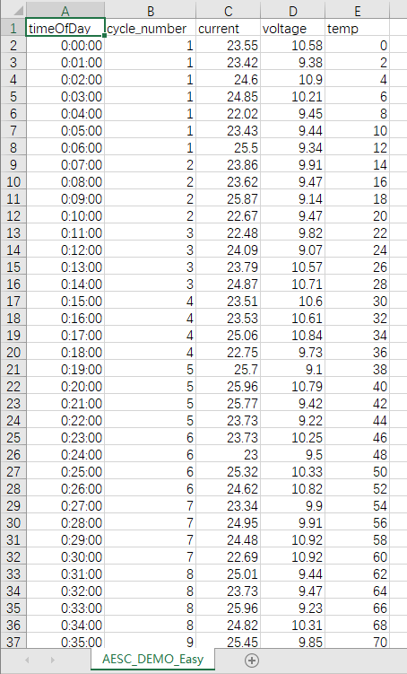
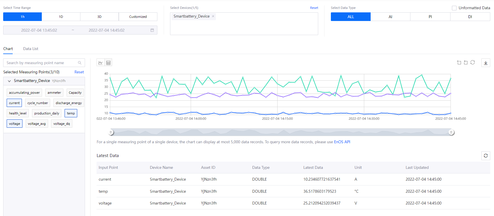

# Lab 2. Simulate Measurement Points

Device simulators enable you to simulate devices that connect and send data to EnOS without using the EnOS Java SDK. You can use device simulators for the following purposes:

- Getting started with EnOS: you can use device simulators to transmit simulated data to understand how to use EnOS.
- Testing and debugging: in application development, you might sometimes need to simulate devices to send specific values for function verification.

In this lab, you will simulate a smart battery device that sends data to EnOS. You will insert some abnormal data into the data sample to trigger alerts, and view the device data in **Time Series Data Management > Data Insights**.

## Before You Start

- Ensure that you have registered the device to simulate and configured the related TSDB storage policy.
- Ensure that you have access to the following device services:

    - Models
    - Device Management
    - Alert Management
    - Times Series Data Management

> **Note**: If you don't have permissions for services above, contact your OU administrator.

## Step 1: Add a Device Simulator

Add a device simulator to the smart battery device you created by the following steps:

1. In the EnOS Management Console, click **Device Management > Simulators** from the left navigation menu.

2. Click **New Simulator**, and you can view the list of all devices in the **Add Simulator** page.

    

3. Select the smart battery device in the device list.

    > **Note**: You can only simulate a device with **inactive** or **offline** status.

4. Click **OK** to add a simulator for the selected device.

In the simulator list, you can see the simulator you just added.

## Step 2. Define the Simulation Data Sample

After adding the simulator, you need to define the simulation data sample by the following steps:

1. In the list of simulators, locate the simulator you just added and click **Edit Sample**.

2. On the **Define Sample** pop-up window, click **Download** to download the sample data template.

3. Enter data in the template, in which:

    - The first column **timeOfDay** refers to relative time stamps. You can enter the relative timestamp within one day (24 hours) in the format `HH:MM:SS`.
    - The rest of the column headers are the measurement points that are defined in the device model. You only need to enter the identifier of the measurement points to be simulated rather than entering all of them.
    - The cell values are the values of simulated measurement points. If the data type is array, the format should be `[value1, value2, value3, ...]`. Leave the cell empty if there is no value at the current time point.

4. On the **Define Sample** pop-up window, click **Upload** to upload the defined simulation data file.

5. Click **OK** to define the data sample for the simulator.

> **Note**: You need to add some abnormal high values, which are more than `50`, for the **temp** measurement point to have different health level results later in [Lab 4: Calculate the Health Level of the Battery](../../3_Data_Management/lab_tutorial/303-4_calculating_health_level.md). 

A ready-to-use template with simulated data: [AESC_DEMO_Easy.csv](media/AESC_DEMO_Easy.csv).

## Step 3: Start the Device Simulator

After uploading the simulation data sample, you need to start the device simulator by the following steps:

1. In the list of simulators, locate the smart battery simulator and click the **Start** icon.
 
2. On the **Start Simulation** pop-up window, select an end date for the simulation. In this lab, set the end time for 24 hours later.

    > **Note**: You can actually set a preferred end time, but a later end time leaves enough time for TSDB to ingest enough data to generate a report.

3. Click **OK** to start the simulator.

## Step 4: Check the Device Data

You can view the real-time data report on the measurement points of the smart battery device by the following steps:

1. In the EnOS Management Console, click **Time Series Data Management > Data Insights**.

2. In the **Select Devices** section, select **Smartbattery_Device**.

3. In the **Selected Measuring Points** section, select the measurement points to view the real-time data chart or table.

## Next Lab

[Lab 3. Monitor Alerts of Smart Battery](302-3_monitoring_alerts_of_device.md)