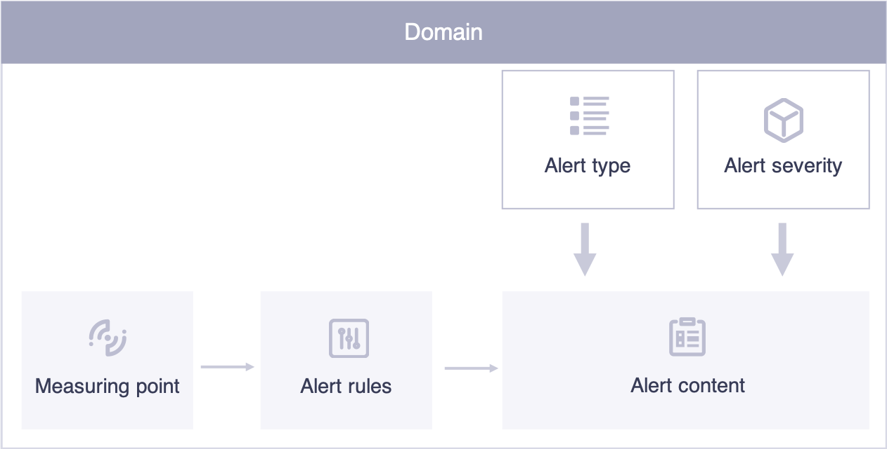
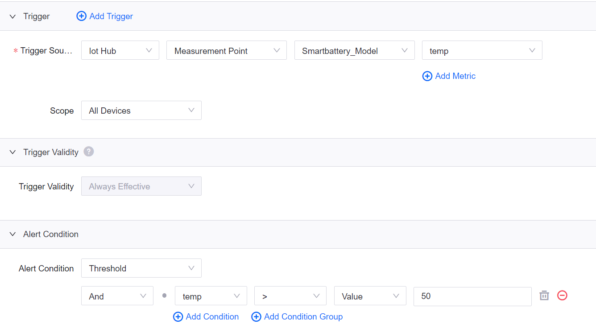
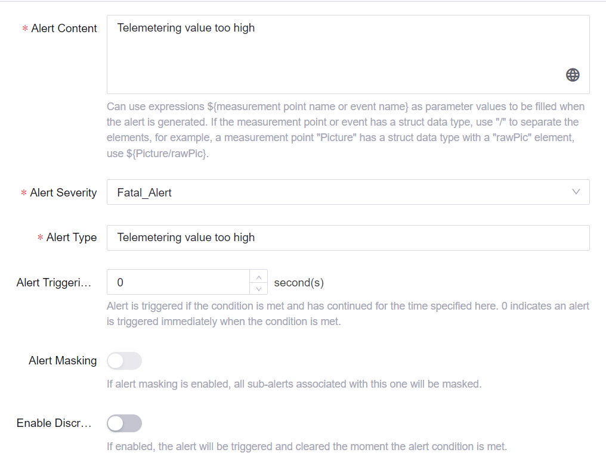
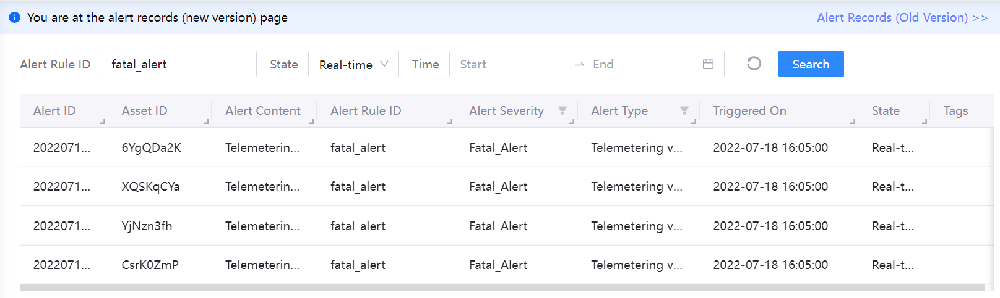

# Lab 3. Monitor the Alerts of a Smart Battery

An alert is a record generated when certain conditions specified by users are met. **Triggers** are used to define conditions in **Alert Rules** to trigger an alert. **Alert Contents** are the details of the alert defined by users, and are included in **Alert Records** when alerts are triggered. To distinguish and manage alerts more effectively, EnOS typically classifies alerts based on severity (such as danger, critical, error, warning, and information) and type (such as over-limit).

The alert management flow and the key concepts are illustrated in the following figure：

To monitor the temperature of the smart battery device, you need to create an alert severity, an alert type, and an alert rule. In this lab, the corresponding **Fatal Alert** severity and **Telemetering value too high** type have already been created. Thus, you just need to define **Alert Rules** to monitor the smart battery device.

## Step 1: Define an Alert Rule

1. Click **Alert Rules > New Rule** to open the **Add Alert Rule** page and configure the following fields to monitor battery temperature:

   - In the **Basic Information** section, enter the alert rule ID, description, and enable the rule.

   - In the **Trigger** section, configure **Trigger Source** as `Iot Hub` | `Measurement Point` | `Smartbattery_Model` | `temp`.

   - In the **Alert Condition** section, click **Add Condition Group > Add Condition** to add the following conditions:

     - `temp`| `>` | `Value` | `50`

    

   - In the **Alert Details** section, configure the following fields:
     
     - **Alert Content**: enter your alert content
     
     - **Alert Severity**: select **Fatal Alert**
    
     - **Alert Type**: select **Telemetering value too high**

    

2. Click **Confirm** to define the Alert Rule.

## Step 2: View Alert Records

After defining the alert rule, the system starts to monitor the temperature of the battery device. You can view real-time and historical alerts triggered by abnormal data on the **Alert Records** page.

For more information on simulating data, see [Lab 2. Simulating Measurement Points](302-2_simulating_measure_points.md).

## Step 3: Obtain Alert Data for Application Development

You can also use the alert service APIs to query alert records. For example, you can use the **Search Active Alerts** API to query active alerts by organization ID or other filtering conditions. For more information on EnOS APIs, see [EnOS™ API](https://support.envisioniot.com/docs/api/en/2.3.0/overview.html).

We will walk you through the usage of EnOS APIs in the application development workshop.

## Next Lab

[Lab 4. Add Assets to an Asset Tree](302-4_adding_assets_to_an_asset_tree.md)