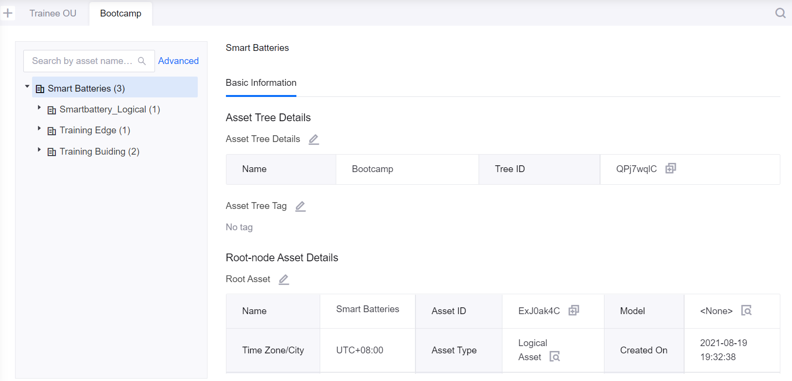
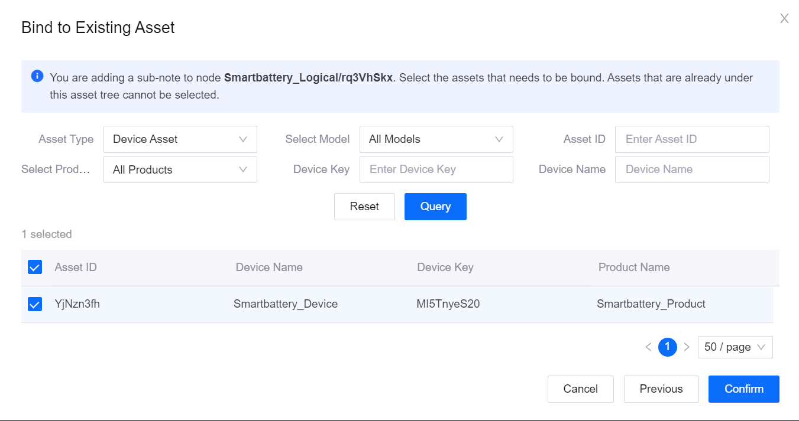

# Lab 4. Bind Assets to an Asset Tree

An asset tree is the hierarchical organization of assets. You can use an asset tree to quickly create the asset topology to manage assets in the cloud. An asset is the minimum element that can be bound to a node on an asset tree. Assets can be divided into device assets and logical assets. An asset can be added to multiple asset trees for different business scenarios.

In this lab, you will bind both a logical asset and a physical asset to an asset tree.

## Step 1: View the Details of an Asset Tree

You need to create an asset tree, or select an existing asset tree to hold assets. Each OU can have up to 10 asset trees. Thus, in this lab, you need to bind assets to the **Bootcamp** asset tree as an example. Select the **Bootcamp** asset tree by the following steps:

1. In the EnOS Management Console, click **Asset Trees** from the left navigation menu.

2. Click the **Bootcamp** tab to view the basic information and the structure of the asset tree.

## Step 2: Bind a Logical Asset as a Sub-Node

A logical asset can be a place to contain devices or a collection of devices, such as an area, a site, or a floor. You can create a new logical asset in the asset tree or bind an existing asset to the asset tree. For example, create and bind a new logical asset by the following steps:

1. On the **Bootcamp** asset tree tab, hover over the **Smart Batteries** root node, and click the **+ Add Sub-node** icon.

2. On the **New Sub-node** pop-up window, select **Create an Asset and Bind** and click **Next**.

3. On the **Create Asset and Bind to Node** pop-up window, configure the following fields:

    - Name: enter **Smartbattery_Logical**
    - Select Model: select **Smartbattery_Model** from the dropdown menu
    - Time Zone/City: select **UTC +8:00** from the dropdown menu
    - Use DST: disable

4. Click **Confirm** to create the asset and bind to the **Bootcamp** asset tree.

You can click **Basic Information**, **Attributes**, **Measurement Points**, and **Event** tabs to view the relevant information of the logical asset sub-node.

You can go to **Device Management > Logical Assets** to view all logical assets in the current OU. For more information on logical assets, see [Managing Logical Assets](https://support.envisioniot.com/docs/device-connection/en/2.3.0/howto/device/viewing_logic_asset.html).

## Step 3: Bind an Existing Physical Device Asset as a Sub-Node

A device asset is a physical device, for example, a photovoltaic inverter, or a wind turbine. In this Lab, the device asset refers to the smart battery device created and configured in previous Labs. You can bind an existing physical device to the **Bootcamp** Asset Tree by the following steps:

1. On the **Bootcamp** asset tree tab, hover over the **Smartbattery_Logical** node, and click the **+ Add Sub-node** icon.

2. On the **New Sub-node** pop-up window, select **Bind to Existing Asset** and click **Next**.

3. On the **Bind to Existing Asset** pop-up window, search the smart battery device in the filter by asset ID, device key, or device name, then click **Query**.

4. On the device list, select the checkbox of the smart battery device.

5. Click **Confirm** to add the smart battery device to the **Bootcamp** asset tree.

You can click **Basic Information**, **Attributes**, **Measurement Points**, and **Event** tabs to view the relevant information of the device asset sub-node.

For physical asset sub-nodes, you can click the **commands** tab to issue commands to the smart battery asset. For more information on asset commands, see [Issuing Commands](https://support.envisioniot.com/docs/device-connection/en/2.3.0/howto/device/viewing_command_status.html).