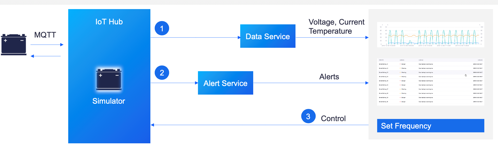

# Device Connectivity & Management Workshop

The first thing you need to do on an IoT platform is to connect your devices and data. This workshop is the basic learning module you need to complete first.

## Scenario

In the energy industry, monitoring the status of batteries during charging is a common business scenario, where temperature is an important battery status and safety indicator. By connecting the smart battery devices to EnOS, you can ingest the real-time temperature data, configure alert settings to monitor the battery status, and control the state of the battery device.

The scenario is depicted in the following chart:

This workshop walks you through the following typical path for smart battery management:

- Register and connect a Smart Battery to EnOS.
- Simulate and publish the measurement point data of battery devices with a Java/Python program developed through Java/Python SDK.
- Monitor the alerts of the Smart Battery.

## Before You Start

- Ensure that you have signed up for an individual account or an enterprise account to access the EnOS Management Console.
- Ensure that your accounts have the full access to the IoT Hub and Enterprise Data Platform services, which is already done by the trainer.

## Labs

This workshop includes the following labs:

[Lab 1. Connect a Smart Battery to EnOS™ (Java)](302-1_connecting_device_to_EnOS_cloud.md)

[Lab 1. Connect a Smart Battery to EnOS™ (Python)](302-1_connecting_device_to_EnOS_cloud_python.md)

40 minutes

[Lab 2. Simulate Measurement Points](302-2_simulating_measure_points.md)

30 minutes

[Lab 3. Monitor the Alerts of a Smart Battery](302-3_monitoring_alerts_of_device.md)

30 minutes

[Lab 4. Add Assets to an Asset Tree](302-4_adding_assets_to_an_asset_tree.md)

30 minutes

## Related Documentation

[EnOS™ IoT Hub - Device Connectivity & Management Service](https://support.envisioniot.com/docs/device-connection/en/2.3.0/device_management_overview.html)
