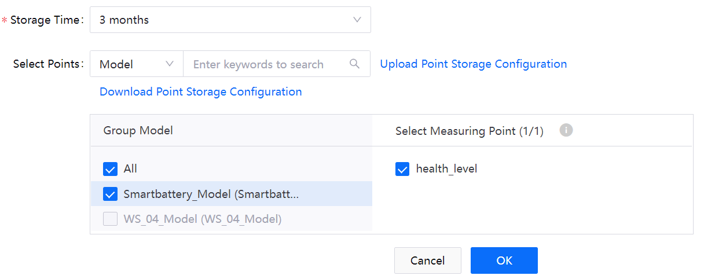

# Lab 1. Configure Storage Policies

The EnOS Time Series Database (TSDB) provides a variety of storage options to store important and frequently-accessed business data. Through configuring storage policies, you can route time-series data to different datastores based on data types and storage time to reduce data storage costs and enhance data access efficiency.

>**Note**: 
> - By default, the uploaded data are not stored in TSDB. You need to configure data storage policies before uploading data to EnOS Cloud.
> - Each model can be associated to only one storage policy group.

In this lab, you will configure storage policies for the following measurement points that are defined in the **Smartbattery_Model**.

|  Measurement Points             |  Storage Type                     |  Description                                                                   |
|  -----------------------------  |  -----------------------------    |  -------------------------------------------------------------------------     |
|  current                        |  AI Raw Data                      |  Real-time discharge current of the battery                                    |
|  voltage                        |  AI Raw Data                      |  Real-time voltage of the battery                                              |
|  temp                           |  AI Raw Data                      |  Real-time temperature of the battery                                          |
|  voltage_avg                    |  AI Raw Data                      |  The output of the streaming processing job to calculate the average voltage   |
|  health_level                   |  DI Data                          |  The output of the streaming processing job to calculate the health level      |
|  cycle_number                   |  Generic Data                     |  The number of the battery charge-discharge cycle                              |

For detailed description of the supported storage types, see [Configuring TSDB Storage](https://support.envisioniot.com/docs/time-series-data/en/2.3.0/cloudpolicy/configuring_tsdb_storage.html).

## (Optional) Step 1: Create a Storage Policy Group

You can store the time-series data for different projects separately by storage policy groups. Before configuring storage policies for measurement points, you need to create a storage policy group or select an existing storage policy group. 

> **Note**: Each OU can have up to 5 storage policy groups. In this lab, you need to configure the storage policies in the **Developer_Bootcamp** storage policy group.

You can create a storage policy group by the following steps:

1. Log in to the EnOS Management Console and select **Time Series Data Management > Storage Policies** from the left navigation menu.

2. Click **+ > Create Group** in the upper right corner of the page to create a storage policy group and configure the following fields:

   - **Group Name**: enter a name for the storage policy group.
   - **Group Model**: select **Smartbattery_Model** to link with the storage policy group.

3. Click **OK** to save the storage policy group configuration.

## Step 2: Configure Storage Policies

On the **Storage Policies** page, you can see all the TSDB storage policy types listed under a storage policy group tab. Configure storage policies separately for the listed measurement points above in the **Developer_Bootcamp** storage policy group.

Take the **AI Raw Data** storage type as example:

1. Locate **AI Raw Data** and click the **Edit** icon  to open the **Edit Storage Policy** page.

2. In the **Edit Storage Policy** page, select the storage time for the data from the **Storage Time** dropdown list. In this lab, save the data in TSDB for 3 months.

3. Select the **Smartbattery_Model** model in the **Group Model** section and the following measurement points in the **Select Measuring Point** section:

   - discharge_energy
   - ammeter
   - current
   - temp
   - voltage_avg
   - capacity
   - voltage_dq
   - voltage

4. Click **OK** to save the storage policy.

   

5. Configure other storage policies accordingly with similar steps as follows:

- **AI Normalized Data** storage policy:

   

- **DI Data** storage policy:

   

- **Generic Data** storage policy:

   

## Next Lab

[Lab 2. Archive Uploaded Battery Data](303-2_archiving_data.md)
