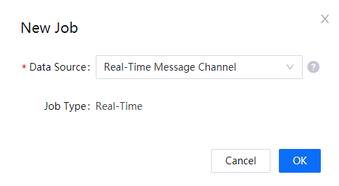
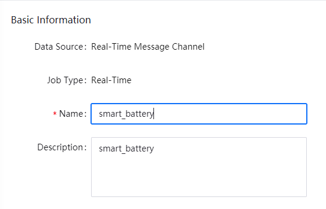
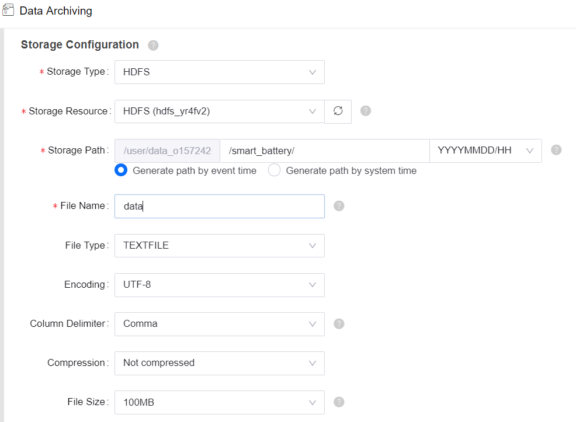

# Lab 2. Archive Uploaded Battery Data

The EnOS Data Archiving service achieves data backup by archiving data and synchronizing the archived data to the specified databases.

In this lab, you will configure a data archiving job to store all the uploaded data of the smart battery device for further processing and analyzing in the upcoming labs.

## Step 1: Create a Data Archiving Job

To archive data, you need to create data archiving jobs by the following steps:

1. In the EnOS Management Console, click **Data Archiving** from the left navigation menu.

2. On the **Data Archiving** page, click **New Job**, and select **Real-Time Message Channel** as Data Source in the **New Job** pop-up window.

1. Click **OK** to create the data archiving job and open the **New Job** configuration page.

## Step 2: Configure the Data Archiving Job

Further configure the data archiving job on the **New Job** configuration page by the following steps:

1. In the **Basic Information** section, configure the following fields:

   - Name: enter the name of the data archiving job, for example, **smart_battery**.
   - Description: enter the description of the data archiving job.

   

1. In the **Storage Configuration** section, configure the following fields:

   - Storage Type: select **HDFS** from the dropdown list.
   - Storage Resource: select the corresponding HDFS storage resource that has been requested through **Resource Management** for the OU.
   - Storage Path: enter the storage path, specify the time partition format, and select **Generate path by event time**. The path must start and end with "/", and for more information on the time partition format, see [Storage Path Partition Parameters](https://support-cn5.envisioniot.com/docs/data-archiving/en/2.3.0/archive_storage.html#storage-path-partition-parameters).
   - File Name: enter the name for the data archiving file. The system appends a time stamp suffix `_UTC` after the file name.
   - Use the default values for the rest fields.

   

2. In the **Archive Configuration** section, select **1 Hour** as Archive Cycle. When falling in the same archiving cycle, the archived data will be saved into the same file and sliced by a specified file size.

3. In the **Data Configuration** section, select **Smartbattery_Model** as Model.

4. Click **OK** to save the configuration.

The system automatically starts reading and archiving data from the specified message channel after you submit the archiving job configuration.

For more information on generating archived files, see [Generation of Archived Files](https://support.envisioniot.com/docs/data-archiving/en/2.3.0/archive_storage#generation-of-archived-files).

## Next Lab

[Lab 3. Calculate the Running-Average of the Battery Voltage](303-3_calculating_average_voltage.md)
