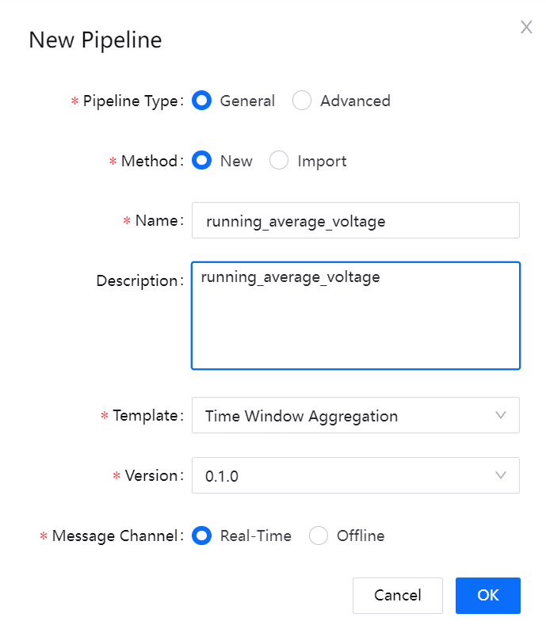
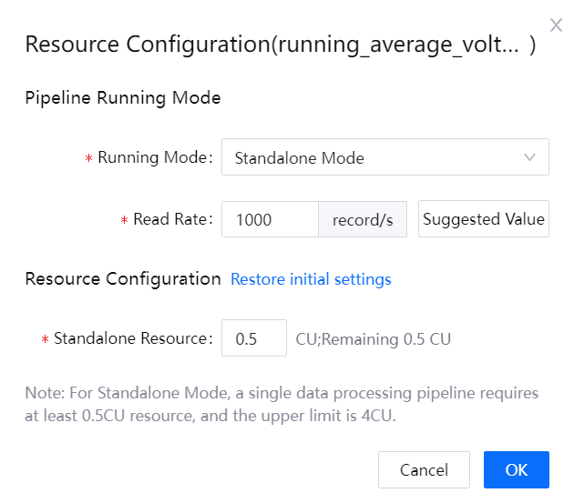

# Lab 3. Calculate the Average Voltage of the Battery

The EnOS Stream Processing service provides visualized template-based configuration to help you quickly develop stream analytics jobs to process time series data ingested from real-time or offline channels.

After configuring the storage policies for the data uploaded from batteries, you can develop a stream processing pipeline to calculate the average voltage of the battery with the **Time Window Aggregation** template.

In this lab, you will use the following items as the input data, output data, and the template:

| Item        | Description                                                  |
| ----------- | ------------------------------------------------------------ |
| Input data  | **voltage**: battery discharge voltage |
| Output data | **voltage_avg**: the average of the battery discharge voltage |
| Template    | **Time Window Aggregation**: to create a stream processing pipeline for aggregating the numeric data of a single measurement point and assign the processed data to another measurement point of the same device |

## (Optional) Step 1: Install the Time Window Aggregation Template

If the Time Window Aggregation template has not been installed to your OU, you need to install the template first by the following steps:

> **Note**: In this lab, the **Time Window Aggregation** template has been installed by the trainer.

1. Log in to the EnOS Management Console and click **Stream Processing > Pipeline Library**.

2. Click the **Template** tab to view the data calculation templates that can be installed. Currently, EnOS has the following templates:

   - **Time Window Aggregation**: Aggregates numeric data for a single measurement point of a single device
   - **Electric Energy Cal by Meter Reading**: Calculates the daily electric energy by meter reading data
   - **Electric Energy Cal by Instant Power**: Calculates the daily electric energy by instant power data
   - **Electric Energy Cal by Average Power**: Calculates the daily electric energy by average power data

3. Find the **Time Window Aggregation** template and click **Install**. 

## Step 2: Create a Stream Processing Pipeline

With the Time Window Aggregation template installed, you can create a pipeline to calculator the average voltage of the smart battery device by the following steps:

1. In the EnOS Management Console, click **Stream Processing > Pipeline Designer**.
   
2. On the pipeline designer page, click the **+** icon above the list of stream processing pipelines.

3. On the **New Pipeline** pop-up window, configure the following fields:

   - Pipeline Type: select **General**.
   - Method: select **New**.
   - Name: enter the name of the pipeline, for example, **running_average_voltage**.
   - Description: enter the description of the pipeline.
   - Template: select **Time Window Aggregation** from the dropdown list.
   - Operator Version: select **0.1.0** from the dropdown list.
   - Message Channel: select **Real-Time** to process real-time data.

4. Click **OK** to create the stream processing pipeline.

## Step 3: Configure the Pipeline

Double-click the **running_average_voltage** pipeline on the pipeline list to open the pipeline detail page, where you need to configure the pipeline by the following steps:

1. In the **Window Policy** section, configure the following fields:

   - Window Type: select **Tumbling Window** from the dropdown list.
   - Latency Setting: select **0 second** from the dropdown list.

2. In the **Data Processing** section, click **New Policy** and add the following fields:

   - Input Point: click the text box to open the **Select Model and Point** pop-up tab. Select **Smartbattery_Model** as the model and **voltage** as the measurement point on the pop-up window.
   - Threshold: configure **[0,240]** as Threshold.
   - Interpolation: select **Ignore** from the dropdown list.
   - Aggregation: select **avg** from the dropdown list.
   - Window Size: select **5 minutes** as the duration of the time window.
   - Output Point: click the text box open the **Select Model and Point** pop-up tab. On the tab, select **Smartbattery_Model** as the model and **voltage_avg** as the measurement point.

3. Click the **Save** icon  in the **Data Processing** section to save the configuration above.

The configured template should look like this:

For more information on **Time Window Aggregation**, see [Configuring a Time Window Data Aggregation Pipeline](https://support.envisioniot.com/docs/stream-processing/en/2.3.0/configuring_ai_template.html).

## Step 4: Publish the Pipeline

After configuring the stream processing pipeline, you can publish it online by the following steps:

1. Click **Save** to save the configuration of the stream processing pipeline.

2. Click **Publish** to publish the pipeline online.

   

## Step 5: Start the Pipeline

Before starting the stream processing pipeline, make sure that the corresponding system pipelines have been running. In this lab, you need to start the following 2 system pipelines:

- Data Reader RealTime
- Data Writer RealTime

Run the required system pipelines and the **running_average_voltage** pipeline by the following steps:

1. On the **Pipeline Operation** page, click the **System Pipeline** tab.

2. On the **Stream Operation** page, click the **Start**  icons to start the following two pipelines:
   
   - Data Reader RealTime
   - Data Writer RealTime

   

3. With the system pipeline running, click **User Pipeline** to view the list of user-created pipelines.

4. Locate the **running_average_voltage** pipeline in the list of user pipelines, click the **More**  icon, and click **Confiure Resource** from the dropdown list.

5. On the **Resource Configuration(running_average_voltage)** window, enter **0.5** as the Standalone Resource and click **OK**.

   

6. Click **Start**  to run the pipeline. It may take about 5 minutes for the pipeline to start up.

## Step 6: View Pipeline Running Results

On the **Pipeline Operation > User Pipeline** page, click the **running_average_voltage** pipeline to view running results. You can view the following categories of the pipeline running results:

- **Summary**: view the summary of the running stream, such as the count of processed data records and the record throughput.

- **Error**: view the error records of the pipeline, such as the error record histogram.

- **Info**: view the basic information of the pipeline, such as the last modified date.

- **History**: view the historical pipeline logs, such as the timestamps of pipeline changes.

After the stream processing pipeline has been running for a while, you can view the calculated average voltage of the battery by the following steps:

1. In the EnOS Management Console, click **Time Series Data Management > Data Insights**.

2. In the **Select Devices** section, select **Smartbattery_Device**.

3. In the **Selected Measuring Points** section, select **health_level** to generate the chart of the calculated average voltage of the battery.

## Next Lab

[Lab 4. Calculate the Health Level of the Battery](303-4_calculating_health_level.md)
