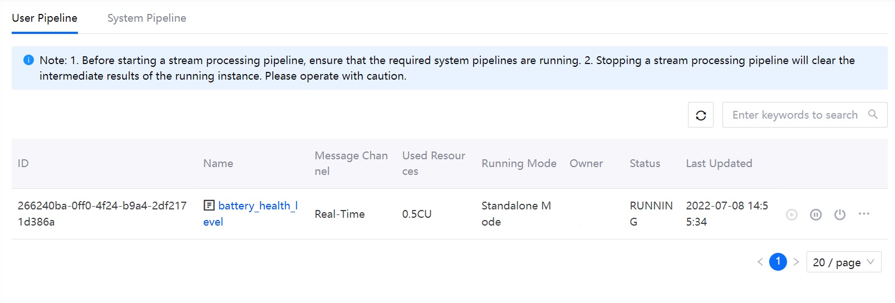

# Lab 4. Calculate the Health Level of the Battery

The EnOS Stream Processing service also provides a user-friendly drag-and-drop UI to design stream processing pipelines. You can quickly configure a pipeline by adding operators/stages to the pipeline to complete the ingestion, filtering, processing, and storage of data without programming.

In this lab, you will develop a stream processing pipeline with StreamSets operators to calculate the health level of the smart battery device based on real-time temperature data. The detailed scenario of this lab is as per the below:

- Ingest and store the real-time temperature data of the battery.

- To avoid mistaken analysis results due to the hopping of temperature value, calculate the average temperature of the battery every 2 minutes.

- Compare the average temperature with the maximum temperature that the battery can work with (defined by the `UpperLimitTemp` attribute in the **Smartbattery_Model** model).  

- Define the following health levels of the battery:
  
  - **Level code 90**: healthy (the average temperature is lower than the `UpperLimitTemp`)
  
  - **Level code 60**: unhealthy (the average temperature is higher than the `UpperLimitTemp`, but not higher than 3%)
  
  - **Level code 30**: extremely unhealthy (the average temperature is 3% higher or more than the `UpperLimitTemp`)

To meet the scenario above you need to use the following StreamSets operators:

| Operator                       | Description                                                  |
| ------------------------------ | ------------------------------------------------------------ |
| EDH Kafka Consumer             | Gets complete data records from Kafka                     |
| Point Selector                 | Specifies data records of the `SmartBattery_Demo::temp` measurement point as the input data |
| Fixed Time Window Aggregator   | Aggregates the temperature data every 2 minutes to calculate the average temperature |
| TSL Asset Lookup               | Gets the `UpperLimitTemp` attribute information of the battery model |
| Python Evaluator               | Calculates the health level of the battery by customized Python script |
| EDH Kafka Producer             | Sends the output results to Kafka                          |

The precedure of the scenario can be depicted like this:


## (Optional) Step 1: Install a System Operator Library

Before developing a stream processing pipeline, you need to install the corresponding system calculator library by the following steps:

> **Note**: In this lab, the required system operator library (Streaming Calculator Library 0.1.0) has been installed by the trainer.

1. In the EnOS Management Console, click **Stream Processing > Pipeline Library**.

2. On the **Calculator Library** tab, view all available system operator libraries.

3. Locate **Streaming Calculator Library 0.1.0** and click **Install**. The system will start the installation immediately.


## Step 2: Create a Stream Processing Pipeline

After installing the required library, you can create a pipeline to calculator the health level of the smart battery device by the following steps:

1. In the EnOS Management Console, click **Stream Processing > Pipeline Designer**.

2. On the pipeline designer page, click the **+** icon above the list of stream processing pipelines.

3. On the **New Pipeline** pop-up window, configure the following fields:
   
   - Pipeline Type: select **General**.
   - Method: select **New**.
   - Name: enter the pipeline name, for example, **battery_health_level**.
   - Description: enter your description for the pipeline.
   - Template: select **Calculator Pipeline** from the dropdown list.
   - Operator Version: select **EDH Streaming Calculator Library 0.1.0** from the dropdown list.
   - Message Channel: select **Real-Time** to process real-time data.

4. Click **OK** to create the stream processing pipeline. 


## Step 3: Add Operators to the Pipeline

Double-click the **battery_health_level** pipeline on the pipeline list to open the pipeline canvas, where you can add operators to the pipeline by the following steps:

1. Click the arrow between the **EDH Kafka Consumer User 1** and **EDH Kafka Producer User 1** operators, and click the **Delete** icon on the toolbar to remove the connecting line.

   

2. Click the **Stage Library**  icon to open the operator list.

3. In the operator list, click **Point Selector** to add the operator to the pipeline canvas.

4. Connect the output port of the **EDH Kafka Consumer User 1** operator to the input port of the **Point Selector 1** operator.

5. Repeat steps 3 and 4 to add and connect the following operators:

   - **Fixed Time Window Aggregator**, connected from **Point Selector 1**
   - **TSL Asset Lookup**, connected from **Fixed Time Window Aggregator 1**
   - **Python Evaluator**, connected from **TSL Asset Lookup 1** and connecting to **EDH Kafka Producer User 1**

6. Click the **Auto Arrange**  icon to align the display of operators in the pipeline.

The configured pipeline should look like this:

   

## Step 4: Configure Operator Parameters

After creating and connecting operators, you need to configure the parameters for each operator.

### Point Selector

**Point Selector** selects the points that are required for stream data processing from the Kafka topics of the OU. Click the **Point Selector 1** operator, and configure the following fields on the **Input/Output** tab:

| Field       | Value                   | Description                                           |
| ----------- | ----------------------- | ----------------------------------------------------- |
| Input Point | Smartbattery_Model::temp | Gets `temp` data as input |

### Fixed Time Window Aggregator

**Fixed Time Window Aggregator** aggregates data by a fixed time window. You need to configure the operator by the following steps:

1. Click the **Fixed Time Window Aggregator 1** operator, and configure the following fields on the **Input/Output** tab:

   | Field               | Value                       | Description                                           |
   | ------------------- | --------------------------- | ----------------------------------------------------- |
   | Input Point         | Smartbattery_Model::temp     | Gets `temp` data as input          |
   | Fixed Window Size   | 2                           | Specifies the duration of the time window            |
   | Fixed Window Unit   | minute                      | Specifies the unit of the time window                               |
   | Aggregator Policy   | avg                         | Calculates the average temperature value                 |
   | Output Point        | Smartbattery_Model::temp_avg | Specifies the `temp_avg` point to receive the output results |

2. Configure the following fields on the **TriggerConfig** tab:

   | Field               | Value                       | Description                                           |
   | ------------------- | --------------------------- | ----------------------------------------------------- |
   |Latency (Minute)         | 0    | Specifies the allowed latency for the data arriving late         |
   | Early Trigger   | Enable                          | Specifies whether to enable early output of intermediate results            |
   | Early Trigger Type  | By Input Point                      | Specifies the type of early trigger                 |


### TSL Asset Lookup

**TSL Asset Lookup** queries the asset metadata of specified devices. You need to configure the operator by the following steps:

1. Click the **TSL Asset Lookup 1** operator, and configure the following fields on the **Input/Output** tab:

   | Field        | Value                           | Description                                     |
   | ------------ | ------------------------------- | ----------------------------------------------- |
   | Input Point  | Smartbattery_Model::temp_avg     | Gets `temp_avg` data as input   |
   | Output Point | Smartbattery_Model::temp_avg_out | Specifies the `temp_avg_out` point to receive the output results  |

   

2. Configure the following fields on the **Criteria** tab:

   | Field     | Value | Description                                                  |
   | --------- | ----- | ------------------------------------------------------------ |
   | Attribute | All   | Gets the `UpperLimitTemp` attribute information of the **Smartbattery_Model** model and includes it in the output results |

   

### Python Evaluator

**Python Evaluator** runs Python scripts to meet the requirements of custom business logic. You need to configure the operator by the following steps:

1. Click the **Python Evaluator 1** operator, and configure the following fields on the **Input/Output** tab:

   | Field        | Value                           | Description                                                  |
   | ------------ | ------------------------------- | ------------------------------------------------------------ |
   | Input Point  | Smartbattery_Model::temp_avg_out | Gets `temp_avg_out` data as input             |
   | Output Point | Smartbattery_Model::health_level | Specifies the `health_level` point to receive the output results |

   

2. Enter the following script in the **Python Script** box on the **Script** tab:

   ```python
   # Comparing the average temperature with the specified temperature limit
   def get_health_level(temp_avg, temp_limit):
      if temp_avg > temp_limit * 1.03:
         return 30
      elif temp_avg > temp_limit:
         return 60
      else:
         return 90

   # Getting the temperature data from the input data records       
   for record in records:
   try:
      attrs = record.value['attr']['tslAssetLookup']['attributes']
      temp_limit = float(attrs['UpperLimitTemp'])
      temp_avg = record.value['value']
      health_level = get_health_level(temp_avg, temp_limit)

   # Sending results to the specified output point    
      record.value['pointId'] = 'health_level'
      record.value['value'] = health_level
      output.write(record)

   except Exception as e:
      # Send record to error
      error.write(record, str(e))
   ```

After configuring all the operators above, click **Save** on the tool bar to save the configuration changes.

## Step 5: Validate and Publish the Pipeline

You can validate operator configurations, and publish the valid pipeline online by the following steps:

1. Click the **Validate** icon  on the tool bar to verify the configuration of the operators above.

   

2. (Optional) If the validation fails, update the configuration of the operators accordingly, and validate the pipeline again.

3. Click **Publish** on the tool bar to publish the valid pipeline online.

   

## Step 6: Start the Pipeline

Before starting the stream processing pipeline, make sure that the corresponding system pipelines are running. In this lab, you need to run the following 2 system pipelines:

- Data Reader RealTime
- Data Writer RealTime

Run the required system pipelines and the **battery_health_level** pipeline by the following steps:

1. On the **Pipeline Operation** page, click the **System Pipeline** tab.

2. On the **Stream Operation** page, click the **Start**  icons to start the following two pipelines:
   
   - Data Reader RealTime
   - Data Writer RealTime

   

3. With the system pipeline being started, click **User Pipeline** to view the list of user-created pipelines.

4. Locate the **battery_health_level** pipeline, click the **more**  icon and click **Confiure Resource** on the dropdown list.

5. In the **Resource Configuration(battery_health_level)** window, enter **0.5** as the Standalone Resource and click **OK**.

6. Click **Start**  to start the pipeline. It may take about 5 minutes for the pipeline to start up.

   

## Step 7: View Pipeline Running Results

On the **Pipeline Operation > User Pipeline** page, click **battery_health_level** to view pipeline running results. You can view the following categories of the pipeline results:

- **Summary**: view the summary of the running pipeline, such as the record count of processed data and the record throughput.

- **Error**: view the error records of the pipeline, such as the error record histogram.

- **Info**: view the basic information of the pipeline, such as the last modified date.

- **History**: view the historical pipeline logs, such as the timestamps of pipeline changes.


After the stream processing pipeline has been running for a while you can view the calculated health level results of the smart battery device by the following steps:

1. In the EnOS Management Console, click **Time Series Data Management > Data Insights**.

2. In the **Select Devices** section, select **Smartbattery_Device**.

3. In the **Selected Measuring Points** section, select **health_level** to generate the chart of the calculated health level results.


## Next Lab

[Lab 5. Monitor Health Level Alerts](303-5_monitoring_alerts.md)

