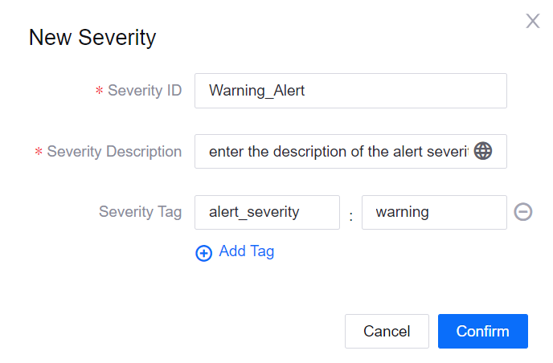
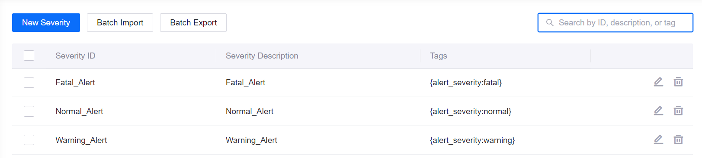
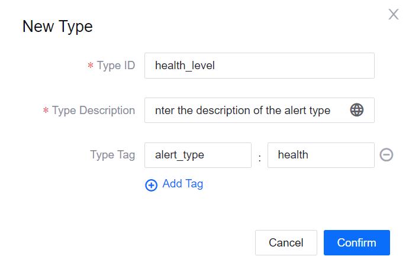
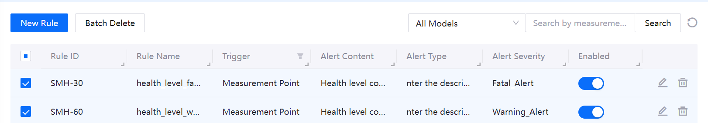
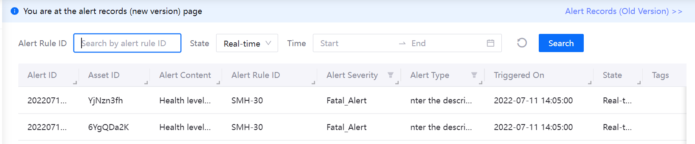

# Lab 5. Monitor Health Level Alerts

The EnOS Alert Management service enables you to define, receive, and process alerts of the assets in your organization.

In this lab, you will enable the alert service to monitor the real-time health level of the battery. To get started, you need to define the alert severity, alert type,and alert rule in the EnOS Management Console.

## Step 1: Create Alert Severities

In [Lab 4: Calculate the Health Level of the Battery](303-4_calculating_health_level.md), you have defined 3 battery health levels. In this lab, create the corresponding alert severity levels for the 3 health levels by the following steps:

1. Log in to the EnOS Management Console and select **Alert Management > Alert Severities** from the left navigation menu.

2. Click **New Severity** on the **Alert Severities** page, and configure the following fields in the **New Severity** pop-up window.
   
   - Severity ID: enter **Warning_Alert**.
   - Severity Description: enter the description of the alert severity.
   - Severity Tag: click **Add Tag**, and enter **alert_severity** for Key and **warning** for Value.

   

1. Click **Confirm** to create the **Warning_Alert** alert severity.

2. Create **Fatal_Alert** and **Normal Alert** accordingly with the following fields:

| Health Level Code | Severity ID    | Severity Tag                       |
| ----------------- | -------------- | ---------------------------------- |
| 90                | Normal_Alert   | `alert_severity` : `normal`        |
| 60                | Warning_Alert  | `alert_severity` : `warning`       |
| 30                | Fatal_Alert    | `alert_severity` : `fatal`         |

The 3 alert severities you just created should look like this:

## Step 2: Create an Alert Type

Alert types are defined to distinguish the status of assets and the possible causes of alerts. Create an alert type by the following steps:

1. In the EnOS Management Console, click **Alert Management > Alert Types** from the left navigation menu.

2. Click **New Type** on the **Alert Type** page, and configure the following fields in the **New Type** pop-up window:
   
   - Type ID: enter the ID of the type, for example, **health_level**.
   - Type Description: enter the description of the alert type.
   - Type Tag: click **Add Tag**, and enter **alert_type** for Key and **health** for Value.

3. Click **Confirm** to save the alert type.

## Step 3: Configure Alert Rules

Alert rules define the triggering conditions of alerts. In this lab, you need to create alert rules for the **Warning_Alert** and **Fatal_Alert** severity levels separately.

Create the alert rule for the **Warning_Alert** severity level by the following steps:

1. In to the EnOS Management Console, click **Alert Management > Alert Rules** from the left navigation menu.

2. Click **New Rule** on the **Alert Rules** page, and configure the following fields in the **Basic Information** section:

   - Rule Name: enter the rule name, for example, **health_level_warning**.
   - Rule ID: enter an ID for the alert rule, for example, `SMH-60`.
   - Description: enter the description for the alert rule.
   - Enable Alert Rule: enable.
   
3. Configure the following fields in the **Trigger** section:
   
   - Trigger Source: select `Iot Hub` | `Measurement Point` | `Smartbattery_Model` | `health_level` to specify the model and measurement point for the alert rule.
   - Scope: select **All Devices** to apply the alert rule to all devices of the model.

4. Configure the following fields in the **Alert Condition** section:

   - Alert Condition: select **Threshold** from the dropdown list, and click **Add Condition Group > Add Condition** to add the following alert conditions:
     - `health_level` | `>` | `Value` | `30`
     - `health_level` | `<=` | `Value` | `60`
   - Timing: disable. 

5. Configure the following fields in the **Alert Details** section:

   - Alert Content: enter **Health level code:${health_level}** to include the real-time health level of the battery in the alert content.
   - Alert Severity: select **Warning Alert** from the dropdown list.
   - Alert Type: select **health_level** in the **Select Alert Type** pop-up window.
   - Alert Triggering Delay: enter **0** to trigger the alert immediately when conditions are met.

6. Click **Confirm** to create the alert rule for the **Warning_Alert** severity level.

Create the alert rule for the **Fatal_Alert** severity level by the following steps:

1. In to the EnOS Management Console, click **Alert Management > Alert Rules** from the left navigation menu.

2. Click **New Rule** on the **Alert Rules** page, and configure the following fields in the **Basic Information** section:

   - Rule Name: enter the rule name, for example, **health_level_fatal**.
   - Rule ID: enter an ID for the alert rule, for example, `SMH-30`.
   - Description: enter the description for the alert rule.
   - Enable Alert Rule: enable.
   
3. Configure the following fields in the **Trigger** section:
   
   - Trigger Source: select `Iot Hub` | `Measurement Point` | `Smartbattery_Model` | `health_level` to specify the model and measurement point for the alert rule.
   - Scope: select **All Devices** to apply the alert rule to all devices of the model.

4. Configure the following fields in the **Alert Condition** section:

   - Alert Condition: select **Threshold** from the dropdown list, and click **Add Condition Group > Add Condition** to add the following alert conditions:
     - `health_level` | `>` | `Value` | `60`

   - Timing: disable. 

5. Configure the following fields in the **Alert Details** section:

   - Alert Content: enter **Health level code:${health_level}** to include the real-time health level of the battery in the alert content.
   - Alert Severity: select **Fatal Alert** from the dropdown list.
   - Alert Type: select **health_level** in the **Select Alert Type** pop-up window.
   - Alert Triggering Delay: enter **0** to trigger the alert immediately when conditions are met.

6. Click **Confirm** to create the alert rule for the **Fatal_Alert** severity level.

The 2 alert rules you just created should look like this in the alert rule list:

## Step 4: View the Alert Records

With alert rules created, the alert starts to monitor the health level of the battery device. You can view real-time and historical alerts triggered by abnormal data on the **Alert Records** page.

Be sure that the alerts are triggered, so that you can use it later in the Application Deployment workshop.
