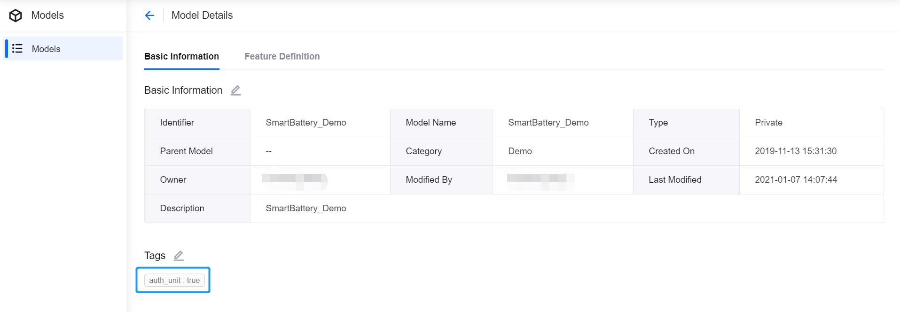
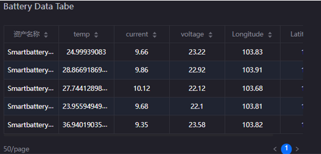

# Lab 1: Visualize Smart Battery Data 

You can use EnOS™ Digital Twin Visualization (DTV) service to visualize the data of the smart battery device. DTV enables you to build data dashboards with visualization widgets in a low-code/no-code drag-and-drop experience.

## Before You Start

- Ensure that you have signed up for an individual account or an enterprise account to access the EnOS Management Console.

- Ensure that your account have been assigned full access to model service, device connectivity & management service, and asset tree service.

- Ensure that your account has authorized access to the DTV application, which is already done by the trainer.

## Explore the DTV Dashboard Editor

### Project Editor

DTV Project Editor displays the thumbnails of all projects in the current OU.

The components of DTV Project Editor are as follows:

| Component       | Description |
| ---------       | ----------- |
| Navigation Pane | Access other features of EnOS DTV, such as **Widget Template** and **Data Source** |
| Page            | - Display the thumbnails of project pages   - Hover over pages to reveal the page editing menu |
| Toolbar         | Enable you to add new pages or projects, and search projects |
| Project         | Display projects and pages in projects |

### Page Editor

DTV Page Editor enables you to manage pages.

The components of DTV Page Editor are as follows:

| Component       | Description |
| ---------       | ----------- |
| Navigation Pane | Access other features of EnOS DTV, such as **Widget Template** and **Data Source** |
| Widget          | - Display the thumbnails of widgets in the current page   - Hover over widgets to reveal the widget editing menu |
| Toolbar         | Enable you to edit the current page |
| Page Preview    | Display the preview of the current page |

### Chart Editor

DTV Chart Editor enables you to configure the properties of a chart.

The components of DTV Chart Editor are as follows:

| Component      | Description |
| ---------      | ----------- |
| Chart Type     | Change the type of the current chart |
| Chart Settings | Configure the current chart          |
| Toolbar        | Enable advanced mode or real scale preview for chart editing |
| Chart Preview  | Display the preview of the current chart |

## Step 1. Tag the Model

To use the device data of a model in DTV, you need to tag the model first to synchronize data to DTV by the following steps:

1. In the EnOS Management Console, click **Models** from the left navigation menu.

2. Locate the model that you want to configure in the model list, and click **Edit**.

3. In the **Model Details** page, click the **Edit** Icon  in the **Tags** section.

4. In the **Edit** window, click **New Tag** and configure `auth_unit` | `true`.

5. Click **OK** to add the new tag to the model.

## Step 2. Create a Project and a Page

You need to create a project and a page to as the container of DTV widgets by the following steps:

1. Log in to the EnOS Application Portal, and click **Dashboard** on the left navigation menu.

2. Click **New Project**, and enter the project name in the **New Project** window, for example, `Smart Battery`.

3. Click **New Page**, and configure the following fields in the **New Page** window:

   - Name: enter the name of the new page, for example, `Smart Battery`

   - Project: select the project you just created from the dropdown list

4. Click **OK** to create the page and open the **Page Editor**.

   

## Step 3. Create DTV Widgets

DTV provides various widgets for you to meet different business scenarios. In this lab, you will add the following widgets:

- **Metric Card**: display organized data
- **Donut Gauge**: measure and display progress
- **Horizontal Bar Chart**: compare data
- **Map**: display geographical information
- **Mix Chart**: visualize and compare trends
- **Pie Chart**: compare and display the ratio of each data to the total
- **Table**: display complex data in an organized tabulated form
- **Heat Map**: compare massive data and identify anomalies by displaying data as color blocks

For more information on other widgets on DTV, see [Widgets](https://support.envisioniot.com/docs/dtv/en/2.3.0/reference/widgets/index.html).

### Add a Metric Card

You can add a metric card to display major measurement point data of smart battery devices by the following steps:

1. In the **Page Editor**, click **Add > Widget** from the tool bar.

2. In the **Create Widget** window, select **Metric Card** and click **OK**.

3. Hover over the **More** icon  of the widget, and click **Edit** on the dropdown list to open the **Chart Editor**.

4. To configure more widget fields, enable the **Advanced Mode** on the tool bar.

5. In the **Basic Information** section, configure the following fields:

   - Title: enter the title of the metric card, for example, `Battery Status`
   - Hide Title: disable
   - Title Link: select **No Link**

6. In the **Data Fields** section, configure the following fields:

   - Data Source: select **TSDB > LatestData** from the dropdown list
   - Category: select **Smartbattery_Model**, the model you created
   - Measurement: click **Add DataField**, select **health_level**, **cycle_number**, **current**, **temp**, **Capacity** and **voltage** in the pop-up window then click **OK**

7. After configuring widget measurements, click the tab of the following data fields and configure their aliases:

   |Measurement|Alias|
   |--- |---|
   |current|Current|
   |temp|Temperature|
   |cycle_number|Cycle Number|
   |voltage|Voltage|
   |health_level|Health Level|
   |Capacity|Capacity| 

8. In the **Chart Style > Measurement Style** section, configure the following fields of all measurements:

   | Measurement | Name Font | Unit Name | Value Font | Decimal Places | Alignment | Name-Value Card Spacing |
   | ----------- | --------- | --------- | ---------- | -------------- | --------- | ----------------------- |
   | health_level | 14 pt | % | Bold, 20pt | 0 | left | 0 |
   | cycle_number | 14 pt | / | Bold, 20pt | 0 | left | 0 |
   | current | 14 pt | A | Bold, 20pt | 0 | left | 0 |
   | temp | 14 pt | °C | Bold, 20pt | 0 | left | 0 |
   | Capacity | 14 pt | KW | Bold, 20pt | 0 | left | 0 |
   | voltage | 14 pt | V | Bold, 20pt | 0 | left | 0 |

9. In the **Metric Card Style** section, configure the following fields:

   - Layout: enter **2** for Row and **3** for Column
   - Horizontal Spacing: enter **64** pt
   - Show "Expand": disable

10. Customize the widget by configuring other fields.

11. Click **Save** to add the configured metric card widget to the current page.

   

### Add a Donut Gauge

You can add a donut gauge to visualize the health level of smart battery devices by the following steps:

1. In the **Page Editor**, click **Add > Widget** from the tool bar.

2. In the **Create Widget** window, select **Donut Gauge** and click **OK**.

3. Hover over the **More** icon  of the widget, and click **Edit** on the dropdown list to open the **Chart Editor**.

4. In the **Basic Information** section, configure the following fields:

   - Title: enter the title of the donut gauge, for example, `Battery Health Level`.
   - Hide Title: disable.
   - Title Link: select **No Link**.

5. In the **Data Fields** section, configure the following fields:

   - Data Source: select **TSDB > LatestData** from the dropdown list
   - Category: select **Smartbattery_Model**, the model you created
   - Comparison: click **Add Data Field**, select **AssetName** in the pop-up window then click **OK**
   - Measurement: click **Add Data Field**, select **health_level** in the pop-up window then click **OK**

6. In the **Chart Style > Comparison Style** section, configure the following fields:

   - Layout: enter **2** for Row and **3** for Column
   - Show "Expand": disable

7. In the **Chart Style > Measurement Style** section, configure the following fields:

   - Axis Range: enter `0` for Min and `100` for Max
   - Show as Percentage: disable
   - Formatting Rules: click **Add** to add the following rules:
     
     - `0` | `40` | `red` |
     - `40` | `70` | `yellow` |
     - `70` | `100` | `green` |

8. Customize the widget by configuring other fields.

9. Click **Save** to add the configured donut gauge widget to the current page.

   

### Add a Horizontal Bar Chart

You can add a horizontal bar chart to display the voltage of smart battery devices by the following steps:

1. In the **Page Editor**, click **Add > Widget** from the tool bar.

2. In the **Create Widget** window, select **Horizontal Bar Chart** and click **OK**.

3. Hover over the **More** icon  of the widget, and click **Edit** on the dropdown list to open the **Chart Editor**.

4. In the **Basic Information** section, configure the following fields:

   - Title: enter the title of the bar chart, for example, `Battery Voltage`
   - Hide Title: disable
   - Title Link: select **No Link**

5. In the **Data Fields** section, configure the following fields:

   - Data Source: select **TSDB > LatestData** from the dropdown list
   - Category: select **Smartbattery_Model**, the model you created
   - Comparison: click **Add Data Field**, select **AssetName** in the pop-up window then click **OK**
   - Measurement: click **Add Data Field**, select **Voltage** in the pop-up window then click **OK**

6. Customize the widget by configuring other fields.

7. Click **Save** to add the configured horizontal bar chart widget to the current page.

   

### Add a Mix Chart

You can add a mix chart to monitor the status changes of smart battery devices by the following steps:

1. In the **Page Editor**, click **Add > Widget** from the tool bar.

2. In the **Create Widget** window, select **Map** and click **OK**.

3. Hover over the **More** icon  of the widget, and click **Edit** on the dropdown list to open the **Chart Editor**.

4. In the **Basic Information** section, configure the following fields:

   - Title: enter the title of the mix chart, for example, `Battery Data Insights`
   - Hide Title: disable
   - Title Link: select **No Link**

5. In the **Data Fields** section, configure the following fields:

   - Data Source: select **TSDB > AIRaw** from the dropdown list
   - Category: select **Smartbattery_Model**, the model you created
   - StartTime: select the start time of data acquisition
   - EndTime: select the end time of data acquisition
   - Dimension: click **Add Data Field**, select **time** in the pop-up window then click **OK**
   - Measurement: click **Add Data Field**, select **current**, **temp**, **voltage** in the pop-up window then click **OK**

6. In the **Internal Filter** section, click **Add** and configure the following fields in the pop-up window:

   - Position: select **Right of Title** from the dropdown list
   - Filter Type: select **Time Range** from the dropdown list
   - Default Range: select **Past Day** as the default time range
   - Link Data Fields: select **Starttime** as Start, and **Endtime** as End

7. Click **OK** to add an internal filter to the widget.

8. In the **Chart Type** section, configure the following fields:

   - Dual Y-Axis: enable in the **temp** panel
   - Label Settings: select **time** with the **HH:MM** format
   - Show Scalar Bar: enable

9. Customize the widget by configuring other fields.

10. Click **Save** to add the configured mix chart to the current page.

   

### Add a Pie Chart

You can add a pie chart to display the total cycle number of smart battery devices by the following steps:

1. In the **Page Editor**, click **Add > Widget** from the tool bar.

2. In the **Create Widget** window, select **Pie Chart** and click **OK**.

3. Hover over the **More** icon  of the widget, and click **Edit** on the dropdown list to open the **Chart Editor**.

4. In the **Basic Information** section, configure the following fields:

   - Title: enter the title of the pie chart, for example, `Cycle Number`
   - Hide Title: disable
   - Title Link: select **No Link**

5. In the **Data Fields** section, configure the following fields:

   - Data Source: select **TSDB > LatestData** from the dropdown list
   - Category: select **Smartbattery_Model**, the model you created
   - Dimension: click **Add Data Field**, select **AssetName** in the pop-up window then click **OK**
   - Measurement: click **Add Data Field**, select **cycle_number** in the pop-up window then click **OK**

6. In the **Chart Style > Pie Settings** section, configure the following fields:

   - Use Gradient: enable
   - Decimal places: select **0** to show integers only in the pie chart

7. In the **Chart > Legend** section, configure the following fields:

   - Position: select **right-middle** from the dropdown list
   - Show Legend Value: enable
   - Value Margin: enter **60** in the textbox

8. Customize the widget by configuring other fields.

9.  Click **Save** to add the configured pie chart to the current page.

   

### Add a Table

You can add a table to monitor the massive data of smart battery devices by the following steps:

1. In the **Page Editor**, click **Add > Widget** from the tool bar.

2. In the **Create Widget** window, select **Table** and click **OK**.

3. Hover over the **More** icon  of the widget, and click **Edit** on the dropdown list to open the **Chart Editor**.

4. In the **Basic Information** section, configure the following fields:

   - Title: enter the title of the table widget, for example, `Battery Data Table`
   - Hide Title: disable
   - Title Link: select **No Link**

5. In the **Data Fields** section, configure the following fields:

   - Data Source: select **TSDB > LatestData** from the dropdown list
   - Category: select **Smartbattery_Model**, the model you created
   - Dimension: click **Add Data Field**, select **AssetName** in the pop-up window then click **OK**
   - Measurement: click **Add Data Field**, select **current**, **temp**, **voltage**, **Latitude** in the pop-up window then click **OK**

6. In the **Table Style** section, configure the following fields:

   - Enable Sorting: enable to sort data in each column.
   - Even Row Color: select a color different from the **Odd Row Color**.

7. Customize the widget by configuring other fields.

8. Click **Save** to add the configured table to the current page.

   

### Add a Heat Map

You can add a heat map to monitor the historical data of battery voltage or current in a specified time period by the following steps:

1. In the **Page Editor**, click **Add > Widget** from the tool bar.

2. In the **Create Widget** window, select **Heat Map** and click **OK**.

3. Hover over the **More** icon  of the widget, and click **Edit** on the dropdown list to open the **Chart Editor**.

4. In the **Basic Information** section, configure the following fields:

   - Title: enter the title of the heat map, for example, `Last Day Electricity`
   - Hide Title: disable
   - Title Link: select **No Link**

5. In the **Data Fields** section, configure the following fields:

   - Data Source: select **TSDB > AI Aggregation** from the dropdown list
   - Category: select **Smartbattery_Model**, the model you created
   - StartTime: select the start time of data acquisition
   - EndTime: select the end time of data acquisition
   - Dimension: click **Add Data Field**, select **time** in the pop-up window then click **OK**
   - Comparison: click **Add Data Field**, select **AssetName** in the pop-up window then click **OK**
   - Measurement: click **Add Data Field**, select **current** in the pop-up window then click **OK**

6. In the **Internal Filter** section, click **Add** and configure the following fields in the pop-up window:

   - Position: select **Right of Title** from the dropdown list
   - Filter Type: select **Time Range** from the dropdown list
   - Default Range: select **Past Day** as the default time range
   - Link Data Fields: select **Starttime** as Start, and **Endtime** as End

7. Click **OK** to add an internal filter to the widget.

8. In the **Chart Style > Axis Style** section, configure **Label Settings** as `time` | `HH:MM` | `45°`.

9. In the **Chart Style > Heat Map Style** section, configure the following fields:

   - Cell: select the cell color of the maximum and minimum values separately
   - Mark Min Value: enable to show the minimum value in the heat map
   - Mark Max Value: enable to show the maximum value in the heat map

10. In the **Other Settings > Legend** section, configure the following fields:

    - Position: select **bottom-middle** from the dropdown list.
    - Size: enter `250` for Width and `8` for Height.

11. Customize the widget by configuring other fields.

12. Click **Save** to add the configured heat map to the current page.

   

### Add a Map

You can add a map to display the geographical information of smart battery devices by the following steps:

1. In the **Page Editor**, click **Add > Widget** from the tool bar.

2. In the **Create Widget** window, select **Map** and click **OK**.

3. Hover over the **More** icon  of the widget, and click **Edit** on the dropdown list to open the **Chart Editor**.

4. In the **Basic Information** section, configure the following fields:

   - Title: enter the title of the map widget, for example, `Battery Map`
   - Hide Title: disable
   - Title Link: select **No Link**

5. In the **Data Fields** section, configure the following fields:

   - Data Source: select **TSDB > LatestData** from the dropdown list
   - Category: select **Smartbattery_Model**, the model you created
   - Dimension: click **Add Data Field**, select **longitude** and **latitude** in the pop-up window then click **OK**
   - Measurement: click **Add Data Field**, select **AssetName** in the pop-up window then click **OK**

6. In the **Chart Style** section, configure the following fields:

   - Center: disable **Auto Calculate**, and enter **103.8** for Lng and **1.345** for Lat.
   - Zoom Level: select **12** from the dropdown list
   - Map Source: select **Google** from the dropdown list
   - Map Type: select **Satellite** from the dropdown list

7. In the **Chart Style > Interactive Layer Configuration** section, click **New Layer** and configure the following fields in the pop-up window:

   - Layer Name: enter the name for the new layer, for example, `Asset Position`
   - Layer Type: select **poi** from the dropdown list

8. In the **Chart Style > Interactive Layer Configuration**, configure the following fields for the layer you just added:

   - Longitude: select **Longitude** from the dropdown list
   - Latitude: select **Latitude** from the dropdown list
   - Asset Name: select **AssetName** from the dropdown list
   - Enable Data Linking: enable

9. Customize the widget by configuring other fields.

10. Click **Save** to add the configured map widget to the current page.

11. In the **Page Editor**, hover over the **More** icon  of the widget, and click **Link** on the dropdown list.

12. In the **Driver Dimension** section, select the **AssetName** of **Battery Data Insights**, **Last Day Electricity**, and **Battery Status** widget in the **Driven Wigdet** section for each dimension in the **Driver Dimension** section.

   

## Step 4. Add Global Filters

You can add global filters to the page you created to enable data linkage among widgets. For example, select a single smart battery device in a filter, and all widgets automatically displays the corresponding data of the device. 

In this lab, you need to add the following two global filters:

- Asset Filter: to filter out data by assets.
- District Filter: to filter out data by geographical information.

### Add a Global Asset Filter

You can add a global filter for assets by the following steps:

1. Click **Filters > Global Filters** on the tool bar.

2. On the **Global Filter** page, click **Add Filter** and configure the following fields:

   - Title: enter the title of the filter, for example, **Asset Filter**
   - Key: enter **Asset** as the filter key
   - Attributes: enable both **Visible on Page** and **Accepting External Parameters**
   - Filter Type: select **Multi-Select Dropdown**
   - Linked Data Source: click **Add** and configure the following fields in the pop-up window:
      |Data Source|Dataset|Data Field|Condition|
      |-----------|-------|----------|---------|
      |LatestData |Smartbattery_Model|AssetName|=|
   - Name/Value: click **Add** and enter `AssetName` for both Name and Value.

3. Click **Save** to save the changes and add the asset filter

### Add a Global District Filter

You can add a global filter for geographical information by the following steps:

1. Click **Filters > Global Filters** on the tool bar.

2. On the **Global Filter** page, click **Add Filter** and configure the following fields:

   - Title: enter the title of the filter, for example, **District Filter**
   - Key: enter **District** as the filter key
   - Attributes: enable both **Visible on Page** and **Accepting External Parameters**.
   - Filter Type: select **Single-Select Dropdown**
   - Linked Data Source: click **Add** and configure the following fields in the pop-up window:
      |Data Source|Dataset|Data Field|Condition|
      |-----------|-------|----------|---------|
      |LatestData |Smartbattery_Model|District|=|
   - Name/Value: click **Add** and enter `District` for both Name and Value

3. Click **Save** to save the changes and add the district filter.

   

## Step 5. Publish the Page

After configuring the DTV page, click **Publish** on the toolbar in the **Page Editor** to publish it online and generate a URL address.

