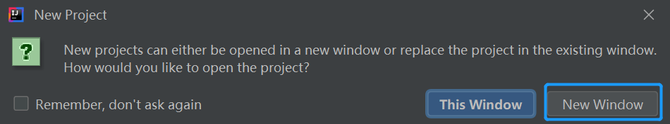
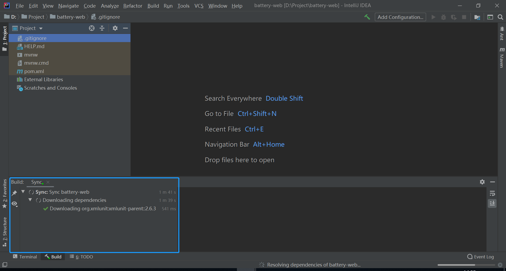
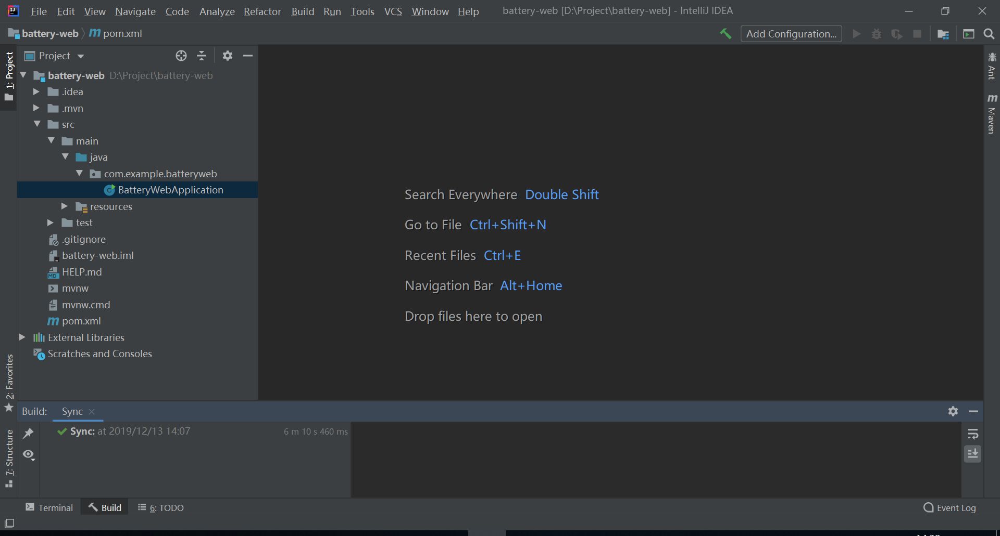
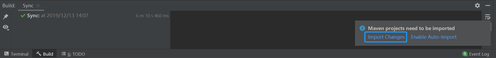
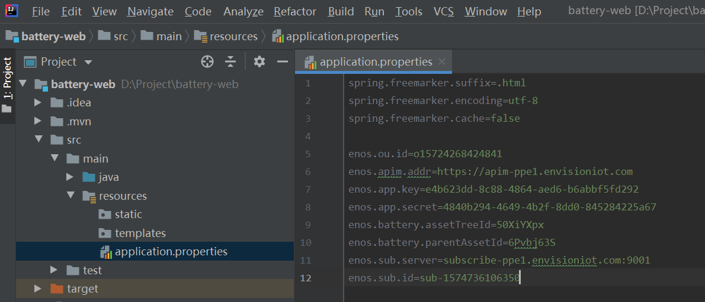
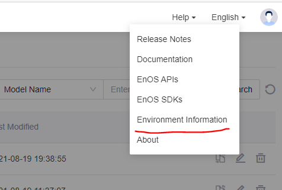
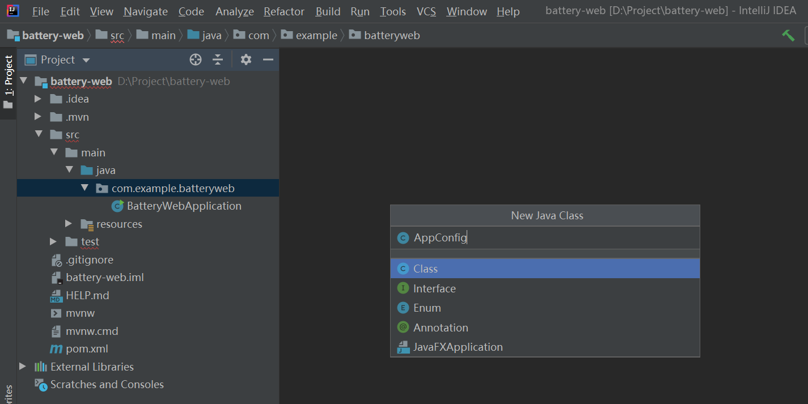
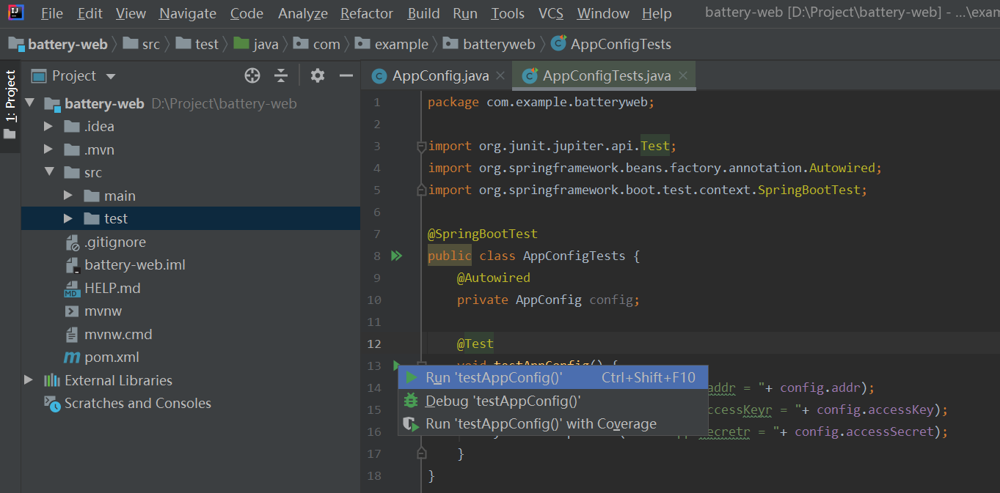
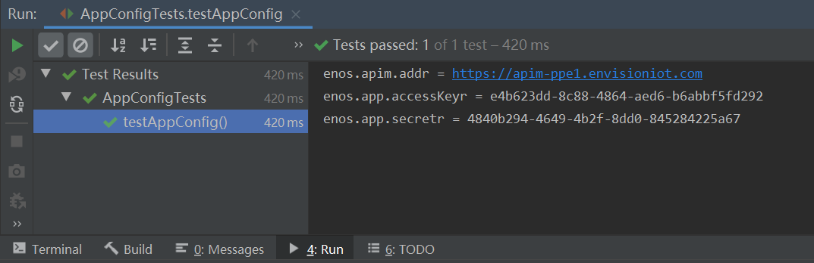
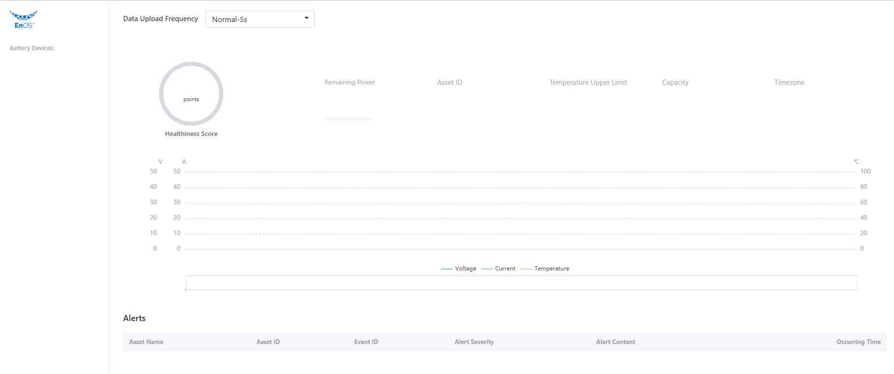

# Lab 2. Create a Web Project

In this lab, you will create a Java Springboot web project to develop an application and add maven dependencies for the EnOS Java Core SDK.

## Step 1: Create a Project

To save the effort of creating a project from scratch, you can create a Springboot web project by importing the project configuration package by the following steps:

1. Open the [Spring Initializr](https://start.spring.io/#!type=maven-project&language=java&platformVersion=2.2.9.RELEASE&packaging=jar&jvmVersion=1.8&groupId=com.example&artifactId=battery-web&name=battery-web&description=demo%20project%20for%20spring%20boot&packageName=com.example.battery-web&dependencies=devtools,lombok,web,freemarker) site with the configured `battery-web` project information.

2. Click **Generate** to download the `battery-web.zip` project configuration package.

   

3. Extract the `battery-web.zip` file to the current directory.

4. Open the IntelliJ IDEA Community Edition and select **File > Open** from the menu.

5. On the **Open File or Project** window, browse and select the extracted project folder, and click **OK**.

   

6. Open the project in a new window.

   

7. Wait for the dependencies to be downloaded. 

   

8. A Java Springboot web application project will be created after all dependencies are downloaded.

   


## Step 2: Add EnOS SDK Maven Dependency

After the project is created, we need to add Maven dependency for EnOS Java Core SDK, which is required for invoking EnOS APIs.

1. From the left navigation bar of the project space double click the `pom.xml` file to open it.

   

2. In the `pom.xml` file, find the `</dependencies> ` line and insert the the following dependencies before it:

   ```
           <dependency>
               <groupId>org.springframework.boot</groupId>
               <artifactId>spring-boot-starter-websocket</artifactId>
           </dependency>
           <dependency>
               <groupId>com.envisioniot</groupId>
               <artifactId>enos-dm-api-pojo</artifactId>
               <version>0.2.5</version>
           </dependency>
           <dependency>
               <groupId>com.envisioniot</groupId>
               <artifactId>enos-subscribe</artifactId>
               <version>2.3.0</version>
           </dependency>
           <dependency>
               <groupId>log4j</groupId>
               <artifactId>log4j</artifactId>
               <version>1.2.16</version>
           </dependency>
           <dependency>
               <groupId>junit</groupId>
               <artifactId>junit</artifactId>
           </dependency>
   ```
   
3. In the lower-right corner, you can see the hint "Maven projects need to be imported". Click **Import Changes** to import the maven dependencies.

   

4. When the synchronization is completed, the Maven dependency for EnOS SDK is added to the EnOS Java Core SDK.


## Step 3: Configure the Application Properties

Configure the application properties file by the following steps:

1. Open the `src/main/resources/application.properties` file and enter the following values:

   ```
   spring.freemarker.suffix=.html
   spring.freemarker.encoding=utf-8
   spring.freemarker.cache=false
   
   enos.ou.id=o15724268424841
   enos.apim.addr=https://apim-ppe1.envisioniot.com
   enos.app.key=e4b623dd-8c88-4864-aed6-b6abbf5fd292
   enos.app.secret=4840b294-4649-4b2f-8dd0-845284225a67
   enos.battery.assetTreeId=50XiYXpx
   enos.battery.parentAssetId=6Pvbj63S
   enos.sub.server=subscribe-ppe1.envisioniot.com:9001
   enos.sub.id=sub-1574736106350
   ```

   Description to the properties is as follows.

   | Properties                 | Description                                                  |
   | -------------------------- | ------------------------------------------------------------ |
   | enos.ou.id                 | ID of the organization on EnOS Console. Replace the value with the ID of the **EnOS_Training** OU. |
   | enos.apim.addr             | EnOS API gateway address. Replace the value with the gateway address of the **EnOS_Training** OU. |
   | enos.app.key               | Access Key of the application SA. Replace the value with the Access Key of the **SmartBattery_Demo** application. |
   | enos.app.secret            | Secret Key of the application SA. Replace the value with the Secret Key of the **SmartBattery_Demo** application.    |
   | enos.battery.assetTreeId   | ID of the asset tree for the battery devices. Replace the value with the ID of the asset tree of your smart battery devices. |
   | enos.battery.parentAssetId | Asset ID of the parent node of batteries on the asset tree, which is used for querying the list of batteries under a specific asset tree node. Replace the value with the asset ID of the node on the created asset tree. |
   | enos.sub.server            | Data subscription server address. Replace the value with the server address of the **EnOS_Training** OU. |
   | enos.sub.id                | ID of the data subscription job. Replace the value with the ID of your data subscription job. |

   The configured `application.properties` file should look like this:

   

   In EnOS Management Console, you can find the above values of the current OU in **Help > Environment Information**。
   
   
   

   

2. Open the `src/main/java/com.example.batteryweb` directory, and click **File > New > Java Class** from the menu to create a class named `AppConfig` for reading and writing in the properties file.

   

3. In the created `AppConfig` class, enter the following codes:

   ```java
   package com.example.batteryweb;
   
   import org.springframework.beans.factory.annotation.Value;
   import org.springframework.stereotype.Component;
   
   @Component
   public class AppConfig {
       @Value("${enos.apim.addr}")
       public String addr;
   
       @Value("${enos.app.key}")
       public String accessKey;
   
       @Value("${enos.app.secret}")
       public String accessSecret;
   
       @Value("${enos.ou.id}")
       public String orgId;
   
       @Value("${enos.battery.assetTreeId}")
       public String assetTreeId;
   
       @Value("${enos.battery.parentAssetId}")
       public String parentAssetId;
   
       @Value("${enos.sub.server}")
       public String subServer;
   
       @Value("${enos.sub.id}")
       public String subId;
   }
   ```

The parameter configuration for the application development is now completed, and should look like this:


## Step 4: Test the Configured Parameters

1. Open the `src/test/java/com.example.batteryweb` directory and create a class named `AppConfigTests`.

2. In the created `AppConfigTests` class, enter the following codes:

   ```java
   package com.example.batteryweb;
   
   import org.junit.jupiter.api.Test;
   import org.springframework.beans.factory.annotation.Autowired;
   import org.springframework.boot.test.context.SpringBootTest;
   
   @SpringBootTest
   public class AppConfigTests {
       @Autowired
       private AppConfig config;
   
       @Test
       void testAppConfig() {
           System.out.println("enos.apim.addr = "+ config.addr);
           System.out.println("enos.app.accessKeyr = "+ config.accessKey);
           System.out.println("enos.app.secretr = "+ config.accessSecret);
       }
   }
   ```

3. Click the **Run Test** icon next to `testAppConfig()` and select **Run 'testAppConfig()'** to run the unit test.

   

4. Check the results of the unit test.

   

5. (Optional) Add more lines in `testAppConfig()` to test read data of other configured parameters.


## Step 5: Add the Front End

After configuring the web application, you need to add the front end of the application to display the queried battery data. Extract the provided front-end package into the Java web project by the following steps:

1. Download the front-end package `Front_End.zip` from https://github.com/EnvisionIot/developer_bootcamp/tree/master/App_Front_End.

2. Extract the front-end package to the `resources` directory of the Java web project. Ensure that `static`, `templates`, and `application.properties` are under the same directory. The directory structure should look like this:

   ```shell
   ├── src
   │   ├── main
   │   │   ├── java/
   │   │   └── resources/
   │   │       ├── application.properties
   │   │       ├── static/
   │   │       └── templates/
   ```

3. Open the `controller` package, create a class named `BatteryController`, and enter the following codes for developing a front-end page:

   ```
   package com.example.batteryweb.controller;
   
   import lombok.extern.slf4j.Slf4j;
   import org.springframework.stereotype.Controller;
   import org.springframework.web.bind.annotation.RequestMapping;
   
   import javax.servlet.http.HttpServletRequest;
   import java.util.Map;
   
   @Controller
   @Slf4j
   public class BatteryController {
       @RequestMapping("/")
       public String chat(HttpServletRequest request, Map<String, String> data) {
           return "battery";
       }
   }
   ```

4. Run the `BatteryWebApplication` class to start the application.

5. Open a browser and enter `http://127.0.0.1:8080` in the address field to view the following application page:

   

Currently, No data is displayed in the application page.

In the next step, you will try to call EnOS APIs to perform the following tasks:

- Get the battery asset list
- Get battery asset information
- Get the battery status (health level and remaining power)
- Get the asset alert records
- Set battery data uploading frequency
- Get the dynamic data of batteries: real-time voltage, current, and temperature

## Next Lab

[Lab 3. Invoke EnOS APIs](invoking_api_java.md)
