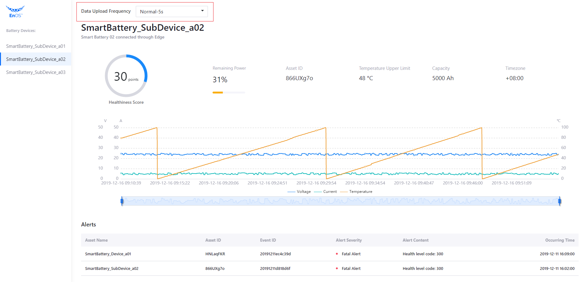

# Lab 4. Develop by Yourself

In this lab, you need to complete the most important part of the application development: 

Get the battery history data and display it in the front end.


## Step 1: Get the History Data of a Specific Battery

Invoke **Get Asset AI Raw Data** API and configure `DataService` and `DataController` classes by the following steps to get the historical data of a specific smart battery device:

> The request format of **Get Asset AI Raw Data** is `https://{apigw-address}/tsdb-service/v2.0/ai?orgId={}&modelId={}&assetIds={}&measurepoints={}&startTime={}&endTime={}&pageSize={}&accessKey={}&localTimeAccuracy={}`

1. Open the `DataService` class and add the following codes to get battery history data from EnOS Cloud.

   ```
   public GetDataResponse getHistoryData(String assetId, String startTime, String endTime) {
       IPoseidonRequest request = new PoseidonRequest() {
           @Override
           public String baseUri() {
               return "/tsdb-service/v2.0/ai";
           }
           @Override
           public String method() {
               return "GET";
           }
           @Override
           public Map<String, Object> queryParams() {
               Map<String, Object> params = new HashMap();
               // To be done
               return params;
           }
       };
       return getResponse(request, GetDataResponse.class);
   }
   ```
   
2. Open the `DataController` class and add the following codes to return the queried battery history data through HTTP.

   ```java
   @RequestMapping("/battery/tsdb/{id}")
   public Map<String, Object> tsdb(@PathVariable("id") String id) {
       DateFormat fmt = new SimpleDateFormat("yyyy-MM-dd HH:mm:ss");
       fmt.setTimeZone(TimeZone.getTimeZone("Asia/Shanghai"));
       Date nowTime = new Date();
       Calendar calendar = Calendar.getInstance();
       calendar.setTime(nowTime);
       calendar.add(Calendar.HOUR, -1);
       Date oneHourBefore=calendar.getTime();
       String startTime = fmt.format(oneHourBefore);
       String endTime = fmt.format(nowTime);
       GetDataResponse resp = dataService.getHistoryData(id, startTime, endTime);
       // Reformat returned data for front-end display
       Map<String, Object> result = new HashMap<>();
       List<Double> voltage = new ArrayList<>();
       List<Double> current = new ArrayList<>();
       List<Double> temp = new ArrayList<>();
       result.put("voltage", voltage);
       result.put("current", current);
       result.put("temp", temp);
       Set<String> time = new HashSet<>();
       String measurepoints = "voltage,current,temp";
       for(Map<String, Object> items: resp.getData().getItems()){
           for (String point: measurepoints.split(",")) {
               if (items.containsKey(point)) {
                   if (point.equals("current") ) {
                       time.add(items.get("localtime").toString());
                   }
                   List<Double> pointList = (List<Double>) result.get(point);
                   pointList.add((Double) items.get(point));
                   break;
               }
           }
       }
       result.put("time", time);
       return result;
   }
   ```

3. After you have completed the code development, open the `BatteryWebApplication` class and click **Run 'BatteryWebApplication'** to start the application.

4. Open a browser and enter `http://127.0.0.1:8080` in the address field. Check the data charts for the battery voltage, current, and temperature. 


## Step 2: Change Data Upload Frequency

Now, you can change the data uploading frequency of the application by the following steps:

1. In the frontend page, click **Data Upload Frequency** box to open a dropdown list.
2. Select **High-2s** from the dropdown list to change the data upload frequency from 5 seconds to 2 seconds.

 

