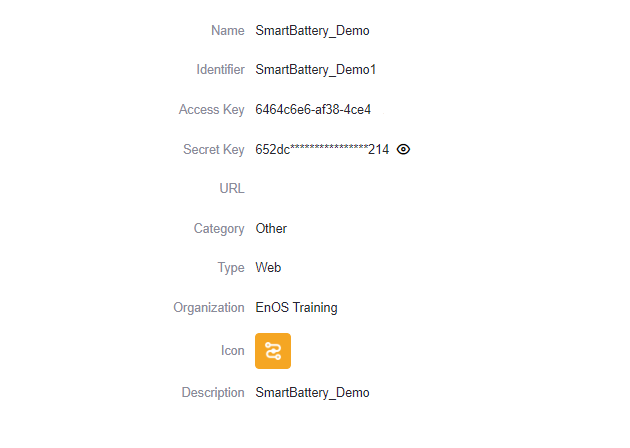

# Lab 1. Get Application Service Account

The Service Account(SA) is a special EnOS account, which is required when an application accesses the resources on EnOS through APIs. SA is automatically generated when an application is registered on the EnOS Management Console. To develop an application based on EnOS APIs, you need to get application SA on the EnOS Management Console.

In this lab, the application is already registered.

## Step 1: Get SA

SA consists of the `AccessKey` and `SecretKey` of an application. You can get an application SA by the following steps:

1. Log in to the EnOS Management Console and select **Application Registration** on the left navigation menu.

2. On the **Apps of This OU** tab, click the **SmartBattery_Demo** application card to open **App Detail** page.

3. In the **App Detail** page, find and save the `AccessKey` and `SecretKey` of the application.

   

For more information on registering and managing applications, see [Registering and Managing Applications](https://support.envisioniot.com/docs/app-development/en/2.3.0/app_management/managing_apps.html).

## Reference

If an application is newly registered on EnOS, the application SA must be authorized with permission to access the resources (for example, asset information and ingested data) on EnOS.

In this lab, the SA of the **SmartBattery_Demo** application has already been authorized.

For detailed steps on how to authorize a service account, see [Managing Service Accounts](https://support.envisioniot.com/docs/enos/en/2.3.0/iam/service_account/managing_service_account.html).

## Next Lab

[Lab 2. Create a Web Project](creating_web_project.md)